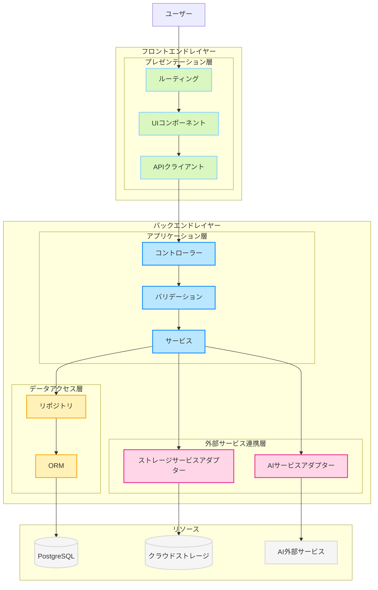
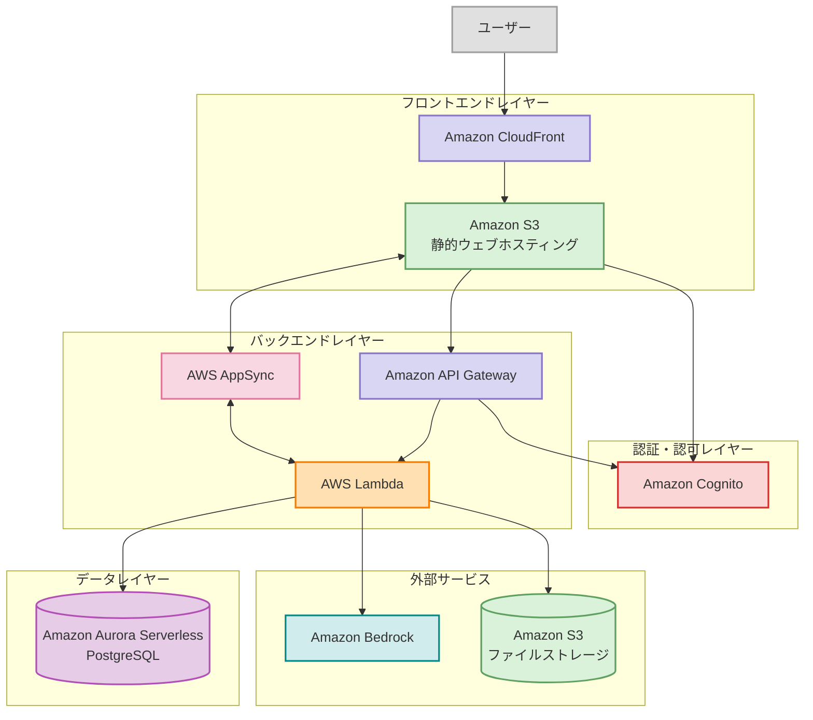

# 1. はじめに

## 1.1. プロジェクトの概要

「zircon」

無限に子タスクを生成できるTODOアプリ。子タスク分解はAIアシストも利用可能。

## 1.2. プロジェクト目的・背景

現在の市場には多くのタスク管理ツールが存在しますが、多くは階層構造に制限があり、AIによるタスク分解機能を持っていません。また、ユーザーは全体計画、日々のタスク管理、詳細な作業分解などのために複数のツールを併用せざるを得ない状況です。

「zircon」は以下の課題を解決することを目的としています。
- 既存のタスク管理ツールにおける階層制限の克服
- 機能の分断による複数ツール乱立の解消
- AIによる知的支援を取り入れた業務効率化の実現
- 大規模組織や複雑なプロジェクトでのタスク管理の簡素化
- チーム内の透明性向上とコラボレーション促進

近年のAI技術、特に自然言語処理の進化により、タスク分解のような知的作業の一部を自動化できるようになったことも、本プロジェクト実現の重要な技術的背景です。

## 1.3. プロジェクト名の由来

「zircon」は地球上で最も古い鉱物の一つとされる宝石であり、多様な色彩、高い硬度、美しい結晶構造を持つことで知られています。本プロジェクトがこの名前を選んだ理由は、以下の5つの象徴的な意味に基づいています。

1. **無限の可能性**：zirconの石言葉である「無限」は、本アプリケーションが持つ無制限に子タスクを生成・分解できる機能を象徴しています。ユーザーが自由に、制限なくタスクを整理・管理できることを表現しています。
2. **生命力と成長**：石言葉の「生命力」は、本アプリケーションのタスクがユーザーの思考に従って自然に成長・展開していく様子を表現しています。AIアシストによるタスクの分解は、ユーザーのアイデアや計画がまるで生命を持って自発的に成長するかのように支援します。
3. **多様性と耐久性**：zirconの多彩な色と高い耐久性は、本アプリケーションが提供する多様な表示形式（表形式、カンバン形式、ツリー形式、ガントチャート形式）や複雑で長期にわたるプロジェクトにも柔軟かつ堅牢に対応する能力を象徴しています。
4. **成功への行動力**：石言葉である「成功」と「行動力」は、本アプリケーションがユーザーの生産性を高め、実際の成果に結びつく行動を促進することを意味しています。タスク管理を通じて明確な目標達成と成功に向かう道筋を提供します。
5. **安らぎと明確さ**：zirconの石言葉「安らぎ」は、本アプリケーションがユーザーに提供する安心感と明確な視覚化による混乱の解消を表現しています。ツリー表示やガントチャートなどでタスク構造や進捗状況を明確化し、ユーザーの心の負担を軽減し、タスク管理の安心感を与えます。

私たちはこのzirconプロジェクトを通じて、複雑なタスク管理をシンプルで美しく、そしてユーザーにとって意味のあるものにし、業務や生活における成功と充実感に貢献することを目指しています。

## 1.4. 本書の目的

本要件定義書の目的は以下の通りです。

- zirconの全体像と各機能の詳細を明確にし、開発・運用・保守の各フェーズで一貫した理解を提供すること
- ユーザー体験とビジネス要件を満たすための機能仕様を定義すること
- システムの技術的品質（拡張性、保守性、データ整合性、スケーラビリティ、パフォーマンスなど）を確保するための設計指針を提供すること
- システムの非機能要件（可用性、信頼性、回復性など）を定義すること
- コンプライアンスとリスク管理（セキュリティ、個人情報保護など）の基盤を提供すること
- AIと人間の協働モデルを含むAIアシスト機能の範囲、制限、評価基準を明確にすること
- 開発の優先順位付けと技術選定の指針を提供すること
- システムの制約条件と前提条件を明確にすること

## 1.5. 対象読者

本要件定義書の対象読者は以下の通りです。

| 対象者             | 役割                                                         |
| ------------------ | ------------------------------------------------------------ |
| 開発チーム         | アーキテクト フロントエンドエンジニア バックエンドエンジニア データベースエンジニア インフラエンジニア セキュリティエンジニア AIエンジニア UIデザイナー テスト担当者 |
| プロジェクト管理者 | プロジェクトマネージャー ステークホルダー                 |
| 運用・保守チーム   | システム管理者 SRE セキュリティ監査担当者 データアナリスト |
| 外部関係者         | API利用開発者 コンプライアンス担当者                      |

# 2. システム概要

## 2.1. システムの目的

「zircon」は、無限階層のタスク管理とAIアシスト機能を提供することで、複雑なプロジェクトを効率的に管理し、組織の生産性を向上させることを目的としています。具体的には以下の目的を持ちます。
- 複雑なタスクを階層的に分解し、管理可能な単位に分割することによる業務効率の向上
- AIアシストによるタスク分解支援で、計画の質と網羅性の向上
- プロジェクト内のコミュニケーション促進と情報共有の円滑化
- 多様な視点（表形式、カンバン形式、ツリー形式、ガントチャート形式）でのタスク管理による作業の透明性向上
- プロジェクトの進捗状況の可視化による意思決定の迅速化

## 2.2. システムの範囲

本システムは、以下の機能範囲を含みます。
- タスク管理システム：無制限の階層構造を持つタスク作成・編集・管理機能
- AIアシスタント機能：タスク分解の自動提案機能
- ユーザー・権限管理：システム管理者、プロジェクト管理者、メンバーの階層的権限構造
- プロジェクト・グループ管理：複数プロジェクトの管理とプロジェクト内グループ機能
- 通知システム：メンション機能、ステータス変更通知機能
- データ可視化・レポーティング機能：進捗状況のグラフ表示、集計情報の提供
- 複数ビュー対応：表形式、カンバン形式、ツリー形式、ガントチャート形式の表示切替
- 検索機能：全文検索、ステータス検索、タグ検索

本システムは主に中小〜大規模組織でのプロジェクト管理を対象としており、複数のプロジェクトを同時進行で管理する必要がある組織（IT企業、コンサルティング会社、マーケティング会社など）での利用を想定しています。

将来的な拡張可能性として、外部システム（カレンダー、メール、チャットツールなど）との連携やAIアシスト機能の拡充を視野に入れていますが、現時点では以下の機能は範囲外とします。
- 請求管理・予算管理機能
- 詳細な時間追跡機能
- 外部システムとの連携機能

## 2.3 システム論理設計

「zircon」は、クライアント-サーバー型の拡張3層構造を採用します。

各要素は以下の役割を持ちます。

| 層                   | 要素                                           | 説明                                                         |
| -------------------- | ---------------------------------------------- | ------------------------------------------------------------ |
| プレゼンテーション層 | ルーティング（Routing）                        | ユーザーからのリクエストを受け取り、適切なUIコンポーネントにリクエストを振り分けます。 |
| プレゼンテーション層 | UIコンポーネント（UI）                         | ユーザーがシステムとやり取りするためのインターフェースを提供します。 |
| プレゼンテーション層 | APIクライアント（APIClient）                   | バックエンドのアプリケーション層へHTTPリクエストを送信し、レスポンスを受け取ります。 |
| アプリケーション層   | コントローラー（Controller）                   | APIクライアントからのリクエストを受け付け、適切な処理ロジックに振り分けます。 |
| アプリケーション層   | バリデーション（Validation）                   | 受信したデータの整合性や妥当性を検証します。                 |
| アプリケーション層   | サービス（Service）                            | ビジネスロジックを実行し、データアクセス層や外部サービス連携層とのやり取りを担います。 |
| データアクセス層     | リポジトリ（Repository）                       | 永続化データのアクセス方法を抽象化し、アプリケーション層にデータ操作手段を提供します。 |
| データアクセス層     | ORM（オブジェクト関係マッパー）                | オブジェクト指向言語のデータモデルとデータベースの間のマッピングを行います。 |
| 外部サービス連携層   | AIサービスアダプター（AIAdapter）              | AI外部サービスとの通信を抽象化し、サービス層へインターフェースを提供します。 |
| 外部サービス連携層   | ストレージサービスアダプター（StorageAdapter） | クラウドストレージとの通信を抽象化し、サービス層へインターフェースを提供します。 |
| リソース             | PostgreSQL（DB）                               | 永続化データを保存するリレーショナルデータベース。           |
| リソース             | クラウドストレージ（CloudStorage）             | 画像やファイルなどの非構造化データを保存するストレージ。     |
| リソース             | AI外部サービス（AIService）                    | システム外部で提供されるAI機能を利用するためのサービス。     |

## 2.4. 全体アーキテクチャ

「zircon」は、コストパフォーマンスを優先し、サーバレスサービスを前提とした以下のアーキテクチャを採用します。

クラウドは、AWSを利用します。

各コンポーネントは以下の役割を持ちます。

| コンポーネント | サービス | 説明 |
|--------------|---------|------|
| フロントエンド配信 | Amazon CloudFront+ Amazon S3 | React + TypeScriptで構築されたSPAをS3にホスティングし、CloudFrontを通じて配信します。 |
| 認証・認可 | Amazon Cognito | ユーザー認証と権限管理を行います。JWTを発行し、APIへのアクセス制御に使用します。 |
| API管理 | Amazon API Gateway | RESTful APIのエンドポイントを提供し、Lambdaへリクエストをルーティングします。 |
| バックエンド処理 | AWS Lambda | Node.js + TypeScript + Honoで実装されたサーバーレス関数群。タスク管理、ユーザー管理、プロジェクト管理などの機能を提供します。 |
| リアルタイム通知 | AWS AppSync | WebSocketベースのリアルタイム通知機能を提供します。タスクのステータス変更やメンションによる通知を実現します。 |
| データベース | Amazon Aurora Serverless PostgreSQL | タスク、ユーザー、プロジェクトなどの構造化データを保存します。Prisma ORMを使用してアクセスします。 |
| ファイルストレージ | Amazon S3 | タスクの添付ファイルなどを保存します。 |
| AI連携 | Amazon Bedrock | タスクの子タスク自動生成機能を提供します。Lambda経由で連携します。 |

# 3. 機能要件

## 3.1. ドメインモデル概要

「zircon」における主要なドメインは以下です。

| ドメイン     | 概要                                                         |
| ------------ | ------------------------------------------------------------ |
| プロジェクト | タスク管理の単位。メンバー、グループ、ステータス設定などを含む。 |
| ユーザー     | システムにアクセスする人。複数のプロジェクトに異なる役割で参加可能。 |
| タスク       | 階層構造を持つ作業項目。様々な属性と子タスクを持つ。         |
| グループ     | プロジェクト内でのユーザーのグループ化。タスク割り当ての単位としても機能。 |
| ステータス   | タスクの状態を表し、プロジェクトごとにカスタマイズ可能。     |
| 通知         | ユーザーへの情報伝達、メンションやステータス変更などをトリガーに生成。 |
| 権限         | 各種操作の実行可否を制御する。特にステータス遷移の権限管理が重要。 |
| 表示形式     | タスクの表示方法をユーザーごとに定義する。ユーザー設定として保存。 |
| 検索・集計   | タスクの検索と集計レポート機能。                             |
| AI支援       | タスク分解のサポート機能。                                   |
| タグ         | タスクを分類するためのラベル。ユーザー定義とシステム定義がある。 |
| カスタム項目 | プロジェクトごとに定義可能なタスクの追加属性。               |
| コメント     | タスクに対するユーザーからのフィードバックや議論。           |

ドメイン間の関係は以下です。

| No   | 関係性                      | 多重度   | 説明                                                         |
| ---- | --------------------------- | -------- | ------------------------------------------------------------ |
| 1    | プロジェクト ↔ ユーザー     | 多対多   | ユーザーは複数のプロジェクトに所属可能 プロジェクトには複数のユーザーが異なるロール（メンバー、プロジェクト管理者）で所属 |
| 2    | プロジェクト ↔ タスク       | 一対多   | プロジェクトには複数のタスクが含まれる タスクは必ず1つのプロジェクトに所属プロジェクトには複数のタスクが含まれる タスクは必ず1つのプロジェクトに所属 |
| 3    | タスク ↔ タスク（自己参照） | 親子関係 | タスクは親タスクを持つことができる（最上位タスクを除く） タスクは複数の子タスクを持つことができる（無制限）タスクは親タスクを持つことができる（最上位タスクを除く） タスクは複数の子タスクを持つことが可能（無制限） |
| 4    | タスク ↔ ユーザー/グループ  | 多対多   | タスクには担当者としてユーザーまたはグループが割り当てられる ユーザー/グループは複数のタスクを担当できるタスクには担当者としてユーザーまたはグループが割り当てられる |
| 5    | プロジェクト ↔ グループ     | 一対多   | プロジェクトには複数のグループを作成可能 グループは1つのプロジェクトに所属プロジェクトに複数のグループを作成可能グループは1つのプロジェクトに所属 |
| 6    | グループ ↔ ユーザー         | 多対多   | グループには複数のユーザーが所属可能 ユーザーは複数のグループに所属可能グループには複数ユーザーが所属可能ユーザーは複数グループに所属可能 |
| 7    | プロジェクト ↔ ステータス   | 一対多   | プロジェクトごとに複数のステータスを定義可能 ステータスは1つのプロジェクトに所属プロジェクトごとに複数のステータスを定義可能ステータスは1つのプロジェクトに所属 |
| 8    | タスク ↔ ステータス         | 多対一   | タスクは常に1つのステータスを持つ 1つのステータスに複数のタスクが存在可能タスクは常に1つのステータスを持つ1つのステータスに複数のタスクが存在可能 |
| 9    | ステータス ↔ 権限           | 一対多   | ステータスの遷移には特定のユーザー/グループに対する権限設定が可能 権限設定はステータスごとに複数存在可能ステータス遷移には特定のユーザー/グループに対する権限設定が可能権限設定はステータスごとに複数可能 |
| 10   | タスク ↔ 通知               | 一対多   | タスクに関するイベント（コメント、ステータス変更等）が通知を生成 1つのタスクから複数の通知が発生可能タスクに関するイベントが通知を生成1つのタスクから複数の通知が発生可能 |
| 11   | 通知 ↔ ユーザー             | 多対多   | 通知は複数のユーザーに送信される可能性がある（グループメンション等） ユーザーは複数の通知を受け取る通知は複数ユーザーに送信可能ユーザーは複数の通知を受け取る |
| 12   | タスク ↔ タグ               | 多対多   | タスクには複数のタグを付与可能 タグは複数のタスクに付与可能タスクには複数タグ付与可能タグは複数タスクに付与可能 |
| 13   | プロジェクト ↔ タグ         | 一対多   | タグはプロジェクトごとに定義される プロジェクトには複数のタグが存在可能タグはプロジェクトごとに定義されるプロジェクトには複数タグが存在可能 |
| 14   | プロジェクト ↔ カスタム項目 | 一対多   | プロジェクトごとに複数のカスタム項目を定義可能 カスタム項目は1つのプロジェクトに所属プロジェクトごとに複数のカスタム項目を定義可能カスタム項目は1つのプロジェクトに所属 |
| 15   | タスク ↔ カスタム項目値     | 多対多   | タスクには複数のカスタム項目に対する値が設定可能 カスタム項目には複数のタスクから値が設定されるタスクには複数のカスタム項目値を設定可能カスタム項目には複数タスクから値が設定される |
| 16   | ユーザー ↔ 表示形式         | 一対多   | ユーザーはタスク表示形式の設定を複数保存可能 表示形式は特定のユーザーに紐づくユーザーは複数のタスク表示形式を保存可能表示形式は特定のユーザーに紐づく |
| 17   | タスク ↔ AI支援             | 一対多   | タスクに対してAI支援による子タスク生成を複数回リクエスト可能 AI支援は特定のタスクに対して行われるタスクに対してAI支援を複数回リクエスト可能AI支援は特定のタスクに対して行われる |
| 18   | タスク ↔ コメント           | 一対多   | タスクには複数のコメントが付けられる コメントは1つのタスクに紐づくタスクには複数のコメントが可能コメントは1つのタスクに紐づく |
| 19   | ユーザー ↔ コメント         | 一対多   | コメントは1人のユーザーによって作成される ユーザーは複数のコメントを作成可能コメントは1人のユーザーが作成ユーザーは複数のコメントを作成可能 |

## 3.2. ユビキタス言語の定義

本章では、本システムにおける主要な用語を整理し、ビジネス側と技術側が共通して理解できる体系を示します。ここで定義する言葉は、要件定義や実装設計を進めるうえでの土台となります。

### 3.2.1. ユーザーと役割

本システムにおける「ユーザー」は、システム全体にアクセス可能な人物を指します。そのうち、特定のプロジェクトに参加したユーザーを「メンバー」と呼び、さらにプロジェクト全体やシステム全体を管理する役割を持つ場合は、以下のように定義されます。

| 用語                      | 説明                                                                                                                                               |
|---------------------------|----------------------------------------------------------------------------------------------------------------------------------------------------|
| ユーザー             | システムにアクセス可能な人物の総称です。ユーザーアカウントを持ち、ログインできる状態を指します。                                                                                  |
| メンバー             | あるプロジェクトに参加しているユーザーです。プロジェクト内のタスク作成・編集・閲覧・ステータス変更などが可能になります。                                                                    |
| プロジェクト管理者      | プロジェクトの各種設定やステータス管理を行えるメンバーです。タスクやステータスのライフサイクルを制御したり、プロジェクト内のグループを作成・編集する権限を持ちます。                                   |
| システム管理者         | システム全体を管理するロールで、プロジェクトの作成やプロジェクト管理者の任命・除外などを行う権限を持ちます。プロジェクトそのものへの操作は限定的ですが、システム設定やユーザーの管理を担います。                                     |

### 3.2.2. タスク関連

タスクの構造や管理方法を共通認識としてまとめるために、以下の用語を定義します。

| 用語                 | 説明                                                                                                                                                                |
|----------------------|---------------------------------------------------------------------------------------------------------------------------------------------------------------------|
| 親タスク/子タスク | タスク同士の明示的な親子関係を指します。機能としてはどちらもタスクです。                       |
| AI提案タスク      | AIが自動生成するタスクのうち、まだメンバー（ユーザー）承認前のものです。有効期限までに承認されない場合は、自動的に削除されます。                                         |
| タスクツリー      | 親タスクと子タスクを階層構造で表現したものです。                                                                     |
| カスタム項目 | プロジェクトごとに設定できるタスクの入力項目です。 |

### 3.2.3. ステータス管理

タスクが持つ状態やその状態遷移を明確化するために、以下の用語を定義します。

| 用語                     | 説明                                                                                                                                                           |
|--------------------------|----------------------------------------------------------------------------------------------------------------------------------------------------------------|
| ステータス | タスクが持つ状態です。 |
| 開始状態 | タスク作成時に設定できるステータスです。 |
| 終了状態 | これ以上の遷移を認めないステータスのことです。ステータス遷移を打ち切る役割を担います。 |
| 遷移ポリシー         | ステータス間の遷移条件や、どの役割をもつメンバーであれば遷移できるかなどを決定するルールです。      |

### 3.2.4. 通知体系

タスクに関する変更があった場合に、誰にどのように通知が行われるかを定義するために、以下の用語を示します。

| 用語                        | 説明                                                                                                                                                                     |
|-----------------------------|--------------------------------------------------------------------------------------------------------------------------------------------------------------------------|
| メンション通知             | コメントやタスク詳細でユーザーやグループを「@」付きで指定した際に、該当ユーザーやグループ全員へ即時通知を行う仕組みです。通常1分以内の遅延で配信され、迅速なコミュニケーションを支援します。                                           |
| ステータス変更通知         | タスクのステータスが変更されたときに、担当者や関連メンバーへ通知を行う仕組みです。グループが担当者の場合は変更者以外の全員に通知し、個人が担当者の場合は当人に通知されます。                                                                |
| エスカレーション通知       | タスクの期限超過や長期間の未更新などを検知し、上位権限者または設定された責任者へ自動で通知を行う仕組みです。リソース不足や期限遵守率の低下などを早期に発見し、プロジェクト健康度を維持します。                                                  |
| 通知ポリシー | 通知の発生条件やチャネルをユーザーまたは管理者がカスタマイズできる仕組みです。通知チャネル（インアプリ/メール/Slackなど）や通知レベル（緊急/高/通常）を組み合わせて定義できます。 |
| 通知レベル | エスカレーション通知における優先度や深刻度を段階的に設定した概念です。例えば「3日間更新のない高優先度タスク」や「複数メンバーがブロック報告したタスク」など、プロジェクト運営上で細かく制御できます。 |
| 通知チャネル設定 | 各ユーザーが受け取る通知の種類や方法を選択できる設定です。`NotificationPreference`エンティティで管理され、不要な通知を抑制することで通知疲れのリスクを軽減します。 |

### 3.2.5. 表示形

タスクをどのように可視化・操作するかを定義するために、以下の用語を示します。

| 用語               | 説明                                                                                                                                                                               |
|--------------------|------------------------------------------------------------------------------------------------------------------------------------------------------------------------------------|
| 表示モード         | タスク一覧をどのように表示するかを決めるモードです。主に「表形式」「カンバン」「ツリー」「ガントチャート」の4種類をサポートし、UI上で切り替えられます。 |
| ビューテンプレート | 特定のフィルタやソート条件を保存するための設定データを指します。同じ表示・検索条件を再利用できます。                                                                                 |

### 3.2.6. 権限管理

タスクやステータスへのアクセス権限、または変更操作をどのように制御し、誰がどの操作を行えるかを定義するために、以下の用語を示します。

| 用語                | 説明                                                                                                                                                                                                       |
|---------------------|------------------------------------------------------------------------------------------------------------------------------------------------------------------------------------------------------------|
| 権限委任         | 長期不在時や特定条件下において、プロジェクト管理者などの権限保持者が一時的に権限を他のユーザーへ委任する機能です。有効期限切れ時には自動で権限が剥奪される仕組みを含みます。                                                                         |
| 代理担当者       | 権限委任が有効になっている間、タスクやステータス承認の操作などを代理で行うユーザーです。ユーザー設定画面で代行期間やスコープを設定することで、プロジェクトの運営を滞りなく継続できるようになります。                                                 |

### 3.2.7. タグ管理

タスクに対する分類や優先度付けなどを行うために用いる「タグ」について、以下の用語を定義します。

| 用語                     | 説明                                                                                                                                                                 |
|--------------------------|----------------------------------------------------------------------------------------------------------------------------------------------------------------------|
| ユーザー定義タグ         | メンバーが自由に作成・編集できるタグを指します。プロジェクトやタスクの運用ルールに合わせて任意の名称で登録でき、柔軟な分類が可能です。                                                                      |
| システムタグ           | システム側で予約されている特別なタグを指します。例として「優先度:高」「期限厳守」などが挙げられ、上書きや削除が制限されています。                                                                          |

### 3.2.8. コメント関連

大規模プロジェクトにおけるコミュニケーションを円滑にするため、コメント機能の用語を定義します。

| 用語                     | 説明                                                                                                                                                        |
|--------------------------|-------------------------------------------------------------------------------------------------------------------------------------------------------------|
| コメントスレッド       | タスクや関連オブジェクトに紐づくコメントを階層構造で表示・管理する仕組みです。特定のコメントに対して返信することで、議論をスレッドとして整理・追跡できます。                                                |
| スレッド解決状態       | コメントスレッドを解決済みとマークすることで、議論が完了したことを明示します。解決後も履歴として参照可能ですが、UI上で折りたたむなどの表示切替が行われる場合があります。                                            |

## 3.3. 主要なユースケースとシナリオ

本章では、以下の4つのペルソナを想定します。

1. zirconのアカウントを管理する情報システム部門: システム管理者
2. 日常的にタスク管理するチームリーダー: プロジェクト管理者
3. 開発をリードするテックリード: メンバー
4. 開発を行うエンジニア: メンバー

各ユースケースでは、どのペルソナがどのような操作を行うかを中心に表形式で示します。表の「注釈」欄では、脚注や特記事項を補足します。

なお、ユースケースにおける役割は、その操作に必要な役割を記載します。例えば、チームリーダーは「プロジェクト管理者」ではありますが、タスク作成には「メンバー」の役割のみで実施可能のため、タスク作成の役割には「メンバー」のみ記載します。

### 3.3.1. プロジェクト作成・メンバー招待

プロジェクト管理者(部門長)が新規プロジェクトを作成し、メンバーを招待するシナリオです。加えて、多要素認証(MFA)設定や初期タスクの作成も含まれます。

| ステップ | 操作内容                               | 説明                                                         | 関与ペルソナ                           | 役割                                           | 注釈                                                         |
| -------- | -------------------------------------- | ------------------------------------------------------------ | -------------------------------------- | ---------------------------------------------- | ------------------------------------------------------------ |
| 1        | プロジェクト新規作成画面を開く         | 情報システム部門がシステムにログインし、メインメニューから「新規プロジェクト」を選択します。 | 情報システム部門                       | システム管理者                                 |                                                              |
| 2        | プロジェクトの基本情報を入力           | プロジェクト名、概要、開始日/終了日などの基本情報を入力します。 | 情報システム部門                       | システム管理者                                 |                                                              |
| 3        | オプションでMFA必須設定を有効にする    | 情報システム部門の判断で、多要素認証をメンバー全員に義務付けるかどうかを設定できます。 | 情報システム部門                       | システム管理者                                 |                                                              |
| 4        | プロジェクト管理者/メンバー招待        | メールアドレスを指定してユーザー招待を行います。未登録ユーザーの場合は、招待メールに登録用URLが含まれます。 | 情報システム部門                       | システム管理者                                 |                                                              |
| 5        | 新規ユーザーがメールからアカウント作成 | メールを受け取ったユーザーは、URLからアカウントを登録し、該当プロジェクトに参加します。 | チームリーダー,テックリード,エンジニア | ユーザー(招待前) → プロジェクト管理者,メンバー | 既存ユーザーの場合は、そのまま参加承諾に進みます。           |
| 6        | 初期タスクを作成                       | 最初のタスク(例:「キックオフミーティング準備」)を作成し、担当者(チームリーダーなど)を設定します。 | チームリーダー,テックリード,エンジニア | メンバー                                       | プロジェクト作成～初期タスク登録までを3分以内に完了することを目標としています。 |

### 3.3.2. タスク作成・編集

日常的にタスクを作成・編集するケースを示します。無限階層のタスク管理によって、大規模プロジェクトでも柔軟なタスク細分化が可能です。

| ステップ | 操作内容                                   | 説明                                                         | 関与ペルソナ                | 役割     | 注釈                                                         |
| -------- | ------------------------------------------ | ------------------------------------------------------------ | --------------------------- | -------- | ------------------------------------------------------------ |
| 1        | 親タスク作成                               | 「親タスク(大きな作業単位)」を作成し、担当者や期間、ポイント等を入力します。 | チームリーダー,テックリード | メンバー | 特定階層のタスク作成権限は、プロジェクトごとに設定できます。特定ユーザーやグループを指定できます。 |
| 2        | 子タスクを追加                             | 必要に応じて子タスクを複数追加し、さらに孫タスクを作成するなど無限階層で細分化が可能です。 | チームリーダー, エンジニア  | メンバー |                                                              |
| 3        | タスクのタイトル・詳細・担当者・期間を編集 | 作成後もタスク情報は自由に編集できます。編集内容は全メンバーにリアルタイムで共有されます。 | チームリーダー, エンジニア  | メンバー | 例: エンジニアが自身の作業内容を細分化して追加・変更するケースなど。 |
| 4        | タスク編集履歴の確認                       | 変更内容はバージョン履歴として残り、誤操作やトレーサビリティを担保します。 | チームリーダー, エンジニア  | メンバー |                                                              |

### 3.3.3. AI支援

タスクの自動分解やサブタスク提案をAIが支援するケースです。タスク分解の時間を大幅に削減し、プロジェクトの初動を効率化します。

| ステップ | 操作内容                           | 説明                                                         | 関与ペルソナ                            | 役割     | 注釈 |
| -------- | ---------------------------------- | ------------------------------------------------------------ | --------------------------------------- | -------- | ---- |
| 1        | 親タスクを作成                     | 新しい大項目のタスク(例:「開発モジュールAの設計」)を登録します。 | チームリーダー, テックリード            | メンバー |      |
| 2        | AI支援ボタンを押す                 | 親タスクを選択し「AI支援」ボタンをクリックすると、関連する子タスクの候補が3案ほど提示されます。 | チームリーダー, テックリード,エンジニア | メンバー |      |
| 3        | 提案された子タスク候補を精査・採用 | 提示内容を確認し、不要なタスクを削除または編集し、必要に応じて再提案を依頼します。 | チームリーダー, テックリード,エンジニア | メンバー |      |
| 4        | タスクに担当者やステータスを設定   | 採用した子タスクをワークフローに組み込むため、担当者やステータスを登録します。 | チームリーダー, テックリード,エンジニア | メンバー |      |

### 3.3.4. ステータス変更

タスクのステータスを変更する際のケースです。承認フローや権限、通知条件が絡むため、特に注意が必要です。

| ステップ | 操作内容                 | 説明                                                         | 関与ペルソナ                            | 役割     | 注釈                                                         |
| -------- | ------------------------ | ------------------------------------------------------------ | --------------------------------------- | -------- | ------------------------------------------------------------ |
| 1        | ステータス変更を実行     | タスク一覧や詳細画面から「作業中→検証待ち」「検証待ち→完了」などのステータス変更を行います。 | チームリーダー, テックリード,エンジニア | メンバー |                                                              |
| 2        | 制限されたステータス遷移 | 「検証待ち→完了」など、一部ステータス遷移は特定のユーザーでないと変更できません。 | チームリーダー                          | メンバー | 遷移ポリシーは、プロジェクトごとに設定できます。特定のユーザーやグループを指定できます。 |
| 3        | ステータス変更後の通知   | ステータス変更後、担当者またはグループメンバーに最終ステータス変更の通知が届きます。 | チームリーダー, テックリード,エンジニア | メンバー | 「グループ内の変更者→変更者以外のグループメンバー」「グループ外の変更者→グループ全員」に通知が送られます。 |

### 3.3.5. 検索・集計

タグやステータス、キーワードなどでタスクを検索し、進捗や各種情報を集計するケースです。大規模データへの対応とパフォーマンス要件が含まれます。

| ステップ | 操作内容       | 説明                                                         | 関与ペルソナ                            | 役割     | 注釈 |
| -------- | -------------- | ------------------------------------------------------------ | --------------------------------------- | -------- | ---- |
| 1        | 検索画面を開く | キーワードやステータス、タグなどを入力し、検索条件を設定します。 | チームリーダー, テックリード,エンジニア | メンバー |      |
| 2        | 検索結果の表示 | 一覧・カンバン・ツリー形式などで結果を可視化し、タスク状況を迅速に把握します。 | チームリーダー, テックリード,エンジニア | メンバー |      |
| 3        | 集計画面で分析 | ステータスごとのタスク数、特定タグに対するステータス推移(バーンダウンチャート)、メンバー別のポイント進捗などをグラフで確認できます。 | チームリーダー, テックリード,エンジニア | メンバー |      |

### 3.3.6. 通知管理

タスクの変更やコメント、メンションに関する通知設定を行うケースです。グループ担当の場合の通知分岐にも対応します。

| ステップ | 操作内容                       | 説明                                                         | 関与ペルソナ                            | 役割     | 注釈                                                         |
| -------- | ------------------------------ | ------------------------------------------------------------ | --------------------------------------- | -------- | ------------------------------------------------------------ |
| 1        | コメント・メンション通知の送信 | タスクのコメントにユーザーやグループをメンションすると、対象先に通知が送られます。 | チームリーダー, テックリード,エンジニア | メンバー |                                                              |
| 2        | ステータス変更時の通知         | 担当者(またはグループ)が設定されたタスクを変更した場合、その担当者や関係者に通知が自動送信されます。 | チームリーダー, テックリード,エンジニア | メンバー |                                                              |
| 3        | グループ担当タスクの通知分岐   | ステータス変更者がグループ内メンバーかどうかで通知先が変わります。 | チームリーダー, テックリード,エンジニア | メンバー | 「グループ内の変更者→変更者以外の同グループメンバー」「グループ外の変更者→グループ全員」に通知。 |
| 4        | 通知一括管理画面での確認       | ユーザーは受信した通知を一覧画面で確認し、既読管理を行います。緊急性の高い通知はメールや外部チャットツールへの連携を検討可能です。 | チームリーダー, テックリード,エンジニア | メンバー |                                                              |

### 3.3.7. プロジェクト管理者専用操作

プロジェクト管理者が行える特別な操作群。権限管理やプロジェクト設定変更など、システム全体に影響する重要な作業を含みます。

| ステップ | 操作内容                 | 説明                                                         | 関与ペルソナ   | 役割               | 注釈                                                         |
| -------- | ------------------------ | ------------------------------------------------------------ | -------------- | ------------------ | ------------------------------------------------------------ |
| 1        | メンバー権限変更         | メンバー一覧からユーザーを選択し、ロール変更（メンバー⇄プロジェクト管理者）を実行 | チームリーダー | プロジェクト管理者 | 変更後即時反映。                                             |
| 2        | カスタムステータス追加   | プロジェクト設定画面で新ステータスを定義し、遷移可能なロール/グループを指定 | チームリーダー | プロジェクト管理者 | 例：「差し戻し」ステータスを作成し、テックリードグループのみ遷移可能に設定 |
| 3        | タスク削除実行           | タスク詳細画面で削除ボタンを押下→2段階確認ダイアログを表示→論理削除実行 | チームリーダー | プロジェクト管理者 | ごみ箱に7日間保持後自動完全削除                              |
| 4        | カスタムフィールド追加   | タスクに独自項目（数値入力/プルダウン/ファイル添付など）を追加 | チームリーダー | プロジェクト管理者 |                                                              |
| 5        | グループ権限ポリシー設定 | 特定グループにのみ許可する操作（例：優先度Highタスクの作成権限）を設定 | チームリーダー | プロジェクト管理者 |                                                              |
| 6        | ごみ箱管理               | 論理削除されたタスクの復元/完全削除操作                      | チームリーダー | プロジェクト管理者 |                                                              |

### 3.3.8. グループの作成と遷移ポリシー設定

このユースケースでは、プロジェクト管理者が新たにグループを作成し、メンバーやロールを割り当てた上で、ステータス変更時の遷移条件をグループ単位で設定する流れを扱います。

| ステップ | 操作内容                           | 説明                                                         | 関与ペルソナ                            | 役割               | 注釈                                                         |
| -------- | ---------------------------------- | ------------------------------------------------------------ | --------------------------------------- | ------------------ | ------------------------------------------------------------ |
| 1        | グループの新規作成画面を開く       | プロジェクト管理者がプロジェクト管理メニューから「グループ管理」を選択し、「新規グループ作成」ボタンを押下します。 | チームリーダー                          | プロジェクト管理者 |                                                              |
| 2        | グループ名・概要を入力             | グループ名や活動目的、運用ポリシーなどを入力します。例：「UIデザイングループ」「インフラ運用グループ」。 | チームリーダー                          | プロジェクト管理者 | グループ名は重複可とするか否かはプロジェクト設定に依存します。運用ルール上、略称やコードなどを併記することでメンバーが混乱しにくくなります。 |
| 3        | メンバーをグループに追加           | ユーザー一覧から該当メンバーを選択し、グループに所属させます。複数名を一括で追加できます。 | チームリーダー                          | プロジェクト管理者 | 例：「UIデザイングループ」にUIデザイナー数名を所属させ、かつタスク編集が可能なロールを付与するなど。グループ内ロールはプロジェクト管理者のみが設定可能です。 |
| 4        | 遷移ポリシーのベース設定           | プロジェクト内のステータス一覧(例:「作業中」「検証待ち」「完了」など)を確認し、それぞれのステータスからどのステータスへ遷移可能か、その際に必要なロールやグループの権限を整理します。 | チームリーダー                          | プロジェクト管理者 | 「遷移ポリシー」は、ステータスA→Bの変更を誰が実施できるか、あるいは特定の承認が必要かなどを網羅的に定義する仕組みです。 |
| 5        | グループ単位の遷移ポリシー詳細設定 | 作成したグループに対して、各ステータス遷移の可否を細かく設定します。 | チームリーダー                          | プロジェクト管理者 | 例:「UIデザイングループは『デザイン作業中→デザインレビュー』のステータス変更を可能とし、その他のステータスへの変更は不可」など。 |
| 6        | ポリシー保存                       | 設定した遷移ポリシーを保存します。                           | チームリーダー                          | プロジェクト管理者 |                                                              |
| 7        | 運用開始                           | グループと遷移ポリシーの設定が完了したら、実運用を開始し、タスクのステータス変更において自動的に設定が適用されます。 | チームリーダー, テックリード,エンジニア | メンバー           | 以後、新たに作成されたタスクも含め、該当プロジェクト内ではグループ単位の遷移条件が常に参照されます。 |
| 8        | 運用開始後の見直し                 | 運用を継続する中で、実運用に即したステータス追加や削除、グループメンバーの入退などが発生した場合、随時遷移ポリシーを更新します。 | チームリーダー                          | プロジェクト管理者 |                                                              |

## 3.4. コア機能

タスクを中心としたプロジェクト運用に必要となる基本的な操作や管理機能を定義します。

### 3.4.1. タスク

本章では、タスクの作成、AIによるタスク作成提案、編集、削除、ステータス変更といった一連の流れを定義します。

#### 3.4.1.1. タスク作成

タスクを追加する際の入力項目と要件を示します。

##### (1) 入力項目

| 項目名       | 概要                                                         | 入力要件                                                     | 必須/任意 |
| ------------ | ------------------------------------------------------------ | ------------------------------------------------------------ | --------- |
| タイトル     | タスク名を入力します。重複可とします。                       | 1文字以上50文字以内。文字種は全角・半角を問わない。タイトルは他のタスクと重複してもよい。 | 必須      |
| 詳細         | タスクの説明をマークダウン形式で入力できます。               | 0文字以上10,000文字以内。マークダウン構文に対応。            | 任意      |
| 親タスク     | 親タスクを指定します。あるタスクの子タスクとしてタスクを作成する場合、自動的に設定されます。 | 親タスクは1つまで設定可能。                                  | 任意      |
| 開始日       | タスク開始日を入力します。                                   | "YYYY/MM/DD"形式。将来日付・過去日付も可。 タイムゾーンはプロジェクトごとに設定できる。 | 任意      |
| 終了日       | タスク期限日を入力します。                                   | "YYYY/MM/DD"形式。開始日と同一か、より新しい日付のみ設定できる。 タイムゾーンはプロジェクトごとに設定できる。 | 任意      |
| ポイント     | タスクの工数や重要度を示します。                             | 0以上の整数で入力。上限値はプロジェクト管理者が設定した閾値以内。 | 任意      |
| ステータス   | タスクの状態を示します。                                     | プロジェクト管理者が設定したステータス名から選択。           | 必須      |
| 担当者       | このタスクに割り当てられるメンバーまたはグループを指定します。 | メンバー、または作成済みのグループから選択。複数設定可。     | 任意      |
| タグ         | タスクに付与するタグを入力します。                           | プロジェクト管理者が設定したユーザー定義タグから選択。複数設定可能。 | 任意      |
| カスタム項目 | プロジェクトごとに設定できる任意の項目です。                 | プロジェクトごとに設定された入力要件に従います。             | 任意      |

##### (2) 入力処理フロー

1. メンバーはタスク作成画面を開き、上記の入力項目を入力する。
2. フォーム送信時、システムは入力フォーマット（文字数や日付形式など）、権限を検証する。
3. 検証エラーがある場合、エラー内容をメンバーに表示する。
4. 正常に登録が完了した場合、監査ログに誰がいつタスクを作成したかを記録する。

##### (3) 要件記述

| 条件                                             | 主体     | 活動                                                         | 制約                                                         |
| ------------------------------------------------ | -------- | ------------------------------------------------------------ | ------------------------------------------------------------ |
| 新規にタスクを作成したい場合                     | メンバー | 入力フォームから入力項目に従い登録する。                     | 入力要件を満たしていなければ登録不可。監査ログに登録内容を記録し、改ざんができないように管理する。 |
| 入力項目に不備がある状態で登録処理が行われた場合 | システム | フォーム検証でエラーを返却し、UIでメンバーにフィードバックを表示する。 | 不備を解消しない限り登録不可。                               |
| タスクの作成権限がない場合                       | システム | UI上でエラーを表示し、作成を拒否する                         | 権限がない場合登録不可。                                     |
| タスクの登録に失敗した場合                       | システム | DB操作等に失敗した場合、エラー内容をメンバーに通知する。     | 登録ができなかった場合、すべてロールバックする               |

#### 3.4.1.2. タスクの編集

単一のタスクを編集する際の入力項目と要件を示します。

##### (1) 編集項目

編集時に変更可能な項目は、タスク作成時の入力項目と同一です。

##### (2) 編集処理フロー

1. ユーザーはタスク編集画面を開き、変更内容を入力する。
2. フォーム送信時、システムは入力フォーマット（文字数や日付形式など）、権限を検証する。
3. 検証エラーがある場合、エラー内容をユーザーに表示する。
4. 正常に更新が完了した場合、監査ログに誰がいつ・どの項目を変更したかを記録する。

##### (3) 要件記述

| 条件                                             | 主体     | 活動                                                         | 制約                                                         |
| ------------------------------------------------ | -------- | ------------------------------------------------------------ | ------------------------------------------------------------ |
| タスクを編集したい場合                           | メンバー | 編集フォームから入力項目を更新し、フォームを送信する         | 入力要件を満たしていなければ登録不可。更新内容は監査ログに記録され、改ざんができないように管理する。 |
| 入力項目に不備がある状態で編集処理が行われた場合 | システム | フォーム検証でエラーを返却し、UIでユーザーにフィードバックを表示する。 | 不備を解消しない限り更新不可。                               |
| タスクの編集権限がない場合                       | システム | UI上でエラーを表示し、編集を拒否する                         | 権限がない場合更新不可。                                     |
| タスクの更新に失敗した場合                       | システム | DB操作等に失敗した場合、エラー内容をユーザーに通知する。     | 更新ができなかった場合、すべてロールバックする               |

#### 3.4.1.3. タスクの削除

タスクの削除に関する操作および要件について定義します。タスクの削除は論理削除方式とします。誤操作や履歴保持の観点から、物理削除は行いません。

##### (1) 論理削除の概要

削除操作を行ったタスクは、システム内部で「削除済み」フラグが設定され、通常の一覧表示・検索結果には表示されなくなります。削除済みタスクは監査証跡の対象とされ、必要に応じて復元が可能です。

| 項目             | 内容                                                         |
| ---------------- | ------------------------------------------------------------ |
| 削除方法         | 論理削除（削除済みフラグの付与）                             |
| 表示制御         | 通常のタスク一覧・検索には表示しない（復元・管理画面等を除く） |
| 削除対象範囲     | 対象のタスクおよび全ての子タスク                             |
| 復元の可否       | プロジェクト管理者は復元可能（一定期間内）                   |
| 監査ログへの記録 | 誰が、いつ、どのタスクを削除したかを記録                     |

##### (2) 削除処理フロー

1. メンバーまたはプロジェクト管理者がタスクの削除操作を実行する。
2. システムは対象タスクとその子タスクに削除フラグを設定する。
3. UI上で該当タスクは表示されなくなる。
4. 操作の詳細を監査ログに記録する。
5. プロジェクト管理者は削除済みタスク一覧から復元を行うことができる。

##### (3) 要件記述

| 条件                                         | 主体               | 活動                                   | 制約                                                         |
| -------------------------------------------- | ------------------ | -------------------------------------- | ------------------------------------------------------------ |
| タスクを削除したい場合                       | メンバー           | タスクの削除操作を実行する             | メンバーは自分が担当するタスクのみ削除可能。削除対象は論理削除され、復元可能。 |
| タスクの削除権限がない場合                   | システム           | UI上でエラーを表示し、削除を拒否する   | 権限がない場合、削除操作不可。                               |
| タスクの削除に成功した場合                   | システム           | 削除フラグを設定し、UIから非表示にする | タスクおよび子タスクが非表示になる。                         |
| タスクの削除に失敗した場合（DB等の不具合）   | システム           | エラーを返却し、ユーザーに通知する     | ロールバック処理を行い、タスク状態を変更しない。             |
| 削除済みタスクを復元したい場合（一定期間内） | プロジェクト管理者 | 管理画面より復元操作を行う             | 論理削除から60日以内のタスクに限り復元可能。                 |

#### 3.4.1.4. カスタム項目の作成

カスタム項目を新規に追加する際の入力項目と処理フロー、要件を示します。

##### (1) 概要

プロジェクト管理者は、プロジェクト設定画面などから新しいカスタム項目を追加できます。追加したカスタム項目は、タスクの作成や編集時に入力できるようになります。データ型の定義や入力必須/任意などの制約を適切に設定し、プロジェクト固有の業務要件に対応させることを目的とします。

##### (2) 入力項目

| 項目名     | 概要                                                         | 入力要件                                                     | 必須/任意 |
| ---------- | ------------------------------------------------------------ | ------------------------------------------------------------ | --------- |
| 項目名     | カスタム項目の識別名称です。                                 | 1文字以上20文字以内。全角・半角問わず使用可能。既存項目名との重複は不可。 | 必須      |
| 項目タイプ | カスタム項目のデータ型を指定します。                         | プリセット型から選択。                                       | 必須      |
| 初期値     | 項目の初期表示値を設定します。                               | 項目タイプに応じた形式で入力。                               | 任意      |
| 必須入力   | 当該項目が入力必須かどうかを指定します。                     | チェックボックスで設定。入力がない場合、任意とします。       | 任意      |
| 入力制約   | 型ごとの制約条件（最大文字数、範囲、選択肢の数など）を定義します。 | 項目タイプに応じて条件を記述。                               | 任意      |

##### (3) 入力処理フロー

1. プロジェクト管理者は、設定画面からカスタム項目の追加画面を開く。
2. 画面上のフォームに、上表の入力項目を指定して送信する。
3. システムは入力フォーマットや権限を検証する。
4. 正常に登録が完了した場合、監査ログに誰がいつカスタム項目を作成したかを記録する。
5. 検証エラーがある場合、エラーメッセージを表示して再入力を促す。

##### (4) 要件記述

| 条件                                                     | 主体               | 活動                                                         | 制約                                                         |
| -------------------------------------------------------- | ------------------ | ------------------------------------------------------------ | ------------------------------------------------------------ |
| 特定の業務要件に応じて新しいカスタム項目を追加したい場合 | プロジェクト管理者 | プロジェクト設定画面で、型制約付きのカスタムフィールドを「作成」する | 定義したカスタム項目は監査ログに記録され、変更履歴を追跡可能とする。ABACモデルにより作成権限を制御する |
| ユーザーが誤った形式でデータを入力した場合               | システム           | 入力バリデーションを実行し、エラーを通知する                 | バリデーション失敗時は内容を通知し、再入力を促す。エラー内容は監査ログに記録する |
| カスタム項目の作成に失敗した場合                         | システム           | DB操作やシステム不具合などのエラー内容をプロジェクト管理者に通知する | 登録ができなかった場合、すべてロールバックし、項目は追加されない |
| 特定項目の入力を倫理的・ガバナンス上強制したい場合       | システム管理者     | 「shall be mandatory」などの入力ポリシーを設定する           | ポリシーはシステム管理者のみが設定・変更可能。違反時は登録不可とし、エラーを記録 |

##### (5) プリセット型

カスタム項目に設定可能な「プリセット型」は、用途に応じて正確かつ一貫性のある入力を行うために用意されたデータ型です。作成時にも、以下の型を選択して定義します。

| プリセット型         | 入力形式の概要                           | 設定可能な制約項目                                           |
| -------------------- | ---------------------------------------- | ------------------------------------------------------------ |
| 文字列               | テキストボックスで任意の文字列を入力可能 | 最大文字数、最小文字数、入力形式（正規表現）、初期値、改行可否 |
| 数値                 | 数値（整数または小数）を入力             | 最小値、最大値、小数許可、単位表示、初期値                   |
| 日付                 | カレンダーUIを用いた日付選択             | 選択可能範囲（開始日・終了日）、未来/過去の入力制限、初期値  |
| 選択肢（単一）       | プルダウンメニューで選択                 | 選択肢のリスト（固定または動的）、初期選択値、選択肢の並び順 |
| 選択肢（複数）       | チェックボックスで複数選択可能           | 選択肢のリスト、最大選択数、初期値、並び順                   |
| 真偽値               | トグルスイッチ                           | 初期状態（オン/オフ）、ラベル文言のカスタマイズ              |
| マークダウンテキスト | マークダウン形式でのリッチテキスト入力   | 最大文字数、初期値、プレビュー表示有無                       |
| ユーザー選択         | プロジェクトに所属するメンバーを選択可能 | 単一/複数選択、初期選択状態、選択対象のフィルタリング        |

#### 3.4.1.5. カスタム項目の更新

既存のカスタム項目を修正する際の要件を示します。ここでは項目名や項目タイプを変更したり、入力制約を追加・変更する場合を扱います。

##### (1) 概要

プロジェクト管理者は、既存のカスタム項目の定義を変更できます。すでにタスクで使用されている場合は、値の整合性を保つための考慮が必要です。

##### (2) 更新処理フロー

1. プロジェクト管理者は、設定画面などから既存のカスタム項目を選択して編集画面を開く。
2. 画面上で変更内容を入力して送信する。
3. システムは入力フォーマットや権限を検証し、必要に応じて既存のタスクデータとの整合性を確認する。
4. 正常に更新が完了した場合、監査ログに誰がいつどの項目を更新したかを記録する。
5. 検証エラーがある場合、エラーメッセージを表示して再入力を促す。

##### (3) 要件記述

| 条件                                                   | 主体               | 活動                                                         | 制約                                                         |
| ------------------------------------------------------ | ------------------ | ------------------------------------------------------------ | ------------------------------------------------------------ |
| カスタム項目を修正したい場合                           | プロジェクト管理者 | プロジェクト設定画面で、既存のカスタムフィールドを「更新」する | 変更内容は監査ログに記録され、改ざんができないように管理する。 |
| 入力項目に不備がある状態で更新処理が行われた場合       | システム           | 入力バリデーションを実行し、エラーを返却する                 | 不備を解消しない限り更新不可                                 |
| すでにタスクで使用中の値との整合性を保つ必要がある場合 | システム           | データ型変更など矛盾が生じる際は、警告または変換を行う       | データロスが発生する変更は原則禁止とし、管理者承認のもとでのみ特例対応する |
| カスタム項目の更新に失敗した場合（DB等の不具合）       | システム           | エラーを返却し、プロジェクト管理者に通知する                 | 更新ができなかった場合、すべてロールバックし、変更前の状態を保持する |

#### 3.4.1.6. カスタム項目の論理削除

誤操作や設定履歴を保持するため、カスタム項目の削除は論理削除方式とします。論理削除されたカスタム項目は、新規タスクの入力項目としては表示されなくなりますが、過去データの監査には利用できます。

##### (1) 概要

論理削除が行われたカスタム項目は、システム内部で「削除済み」フラグを設定し、通常のプロジェクト設定画面やタスク入力画面には表示されません。ただし、既存タスクに入力済みのデータは監査証跡として保持され、必要に応じて参照できるようにします。

| 項目             | 内容                                                         |
| ---------------- | ------------------------------------------------------------ |
| 削除方法         | 論理削除（削除済みフラグの付与）                             |
| 表示制御         | 通常の設定画面やタスク入力フォームには表示しない（復元画面などを除く） |
| 削除対象範囲     | 選択したカスタム項目の定義全体。ただし既存タスクの入力値は監査用に保持 |
| 復元の可否       | プロジェクト管理者は削除済み一覧から復元可能                 |
| 監査ログへの記録 | 誰が、いつ、どのカスタム項目を削除したかを記録               |

##### (2) 削除処理フロー

1. プロジェクト管理者が、設定画面などから対象のカスタム項目に対し削除操作を実行する。
2. システムは当該カスタム項目に削除フラグを設定し、新規タスク入力や検索などのUI表示対象から除外する。
3. 既存タスクにおける入力済みデータは保持し、監査ログに誰がいつ削除操作を行ったかを記録する。
4. プロジェクト管理者は削除済み項目一覧から復元操作を行うことで、一定期間内であれば元に戻せる。

##### (3) 要件記述

| 条件                                           | 主体               | 活動                                               | 制約                                                         |
| ---------------------------------------------- | ------------------ | -------------------------------------------------- | ------------------------------------------------------------ |
| カスタム項目を削除したい場合                   | プロジェクト管理者 | 設定画面などから削除操作を実行する                 | プロジェクト管理者のみ削除可能。削除対象は論理削除され、必要に応じて復元が可能 |
| カスタム項目の削除権限がない場合               | システム           | UI上でエラーを表示し、削除を拒否する               | 権限がない場合、削除操作不可                                 |
| カスタム項目の削除に成功した場合               | システム           | 削除フラグを設定し、入力フォーム等から非表示にする | 過去のタスクに入力された値は監査証跡として保持し、ロールバックや追跡が可能 |
| カスタム項目の削除に失敗した場合（DB不具合等） | システム           | エラーを返却し、プロジェクト管理者に通知する       | ロールバック処理を行い、項目状態を変更しない                 |
| 削除済みカスタム項目を復元したい場合           | プロジェクト管理者 | 削除済み一覧から復元操作を行う                     | 復元時も監査ログを記録し、変更履歴を追跡                     |

### 3.4.2. AI支援

本章では、AIを活用したタスク分解提案機能をはじめ、メンバーが行った修正内容からの学習（フィードバック連携機構）、倫理的ガバナンス、コンテキストに応じた提案適応（コンテキスト適応機能）、および過去の提案管理（提案履歴管理）について定義します。AIが生成するタスク構造の品質向上と、ユーザーの意図を正しく反映するための仕組みを総合的にカバーします。

#### 3.4.2.1. タスク分解提案機能

##### (1) 概要

メンバーが入力した自然言語ベースの要件や目標を解析し、AIが階層構造を持ったタスクツリーを自動生成する機能です。タスクの階層深度や粒度は可変であり、ユーザーが深度を指定することで大まかな分解から細分化されたタスク群まで幅広く対応します。

##### (2) 提案処理フロー

1. メンバーがタスク分解を希望する親タスクの詳細情報（目的、期間、必要リソースなど）を自然言語または定義された入力項目にて入力します。
2. システムは入力されたテキストをAIエンジンに送信し、解析結果として子タスクの候補リストと推奨階層を受け取ります。
3. ユーザーは提案された子タスクの内容を確認し、必要に応じて修正や再提案をリクエストします。
4. 修正結果が最終的に確定すると、新たなタスク群として登録されます。

##### (3) 要件記述

| 条件                                         | 主体     | 活動                                                         | 制約                                                         |
| -------------------------------------------- | -------- | ------------------------------------------------------------ | ------------------------------------------------------------ |
| AIによるタスク分解を行いたい場合             | メンバー | 親タスクの情報を自然言語で入力し、タスク分解の提案をリクエストする。 | 親タスクが存在しない場合は分解対象として選択不可。AI処理はプロジェクト管理者が定める制約（階層深度など）を考慮すること。 |
| 提案された子タスクに修正が必要と判断した場合 | メンバー | 提案内容を確認し、不要なタスクの除去や名称変更などの修正を行う。 | 修正内容は監査ログに記録し、再学習のためのデータとして利用する。 |
| 大幅に修正された提案が再度必要な場合         | システム | メンバーの再リクエストを受けてAIに再提案を行い、新しい子タスク候補を提示する。 | 再提案が一定回数を超える場合、レート制限をかけることができる。 |
| タスク生成が確定した場合                     | システム | メンバーが承認した子タスク群をDBに登録し、ツリー状の関係を更新する。 | DB登録時にすべての子タスクに一貫したステータスと階層連番を付与する。 |

#### 3.4.2.2. フィードバック連携機構

##### (1) 概要

ユーザーがAI提案したタスクを修正・追記した履歴を収集し、AIがそれを学習する仕組みです。修正が多く発生するタスクパターンは今後の提案から除外したり、類似の利用ケースでは修正内容をあらかじめ考慮して提案の精度を高めます。

##### (2) フィードバック反映フロー

1. ユーザーが提案タスクを修正・再構成した場合、その内容がシステムに記録されます。
2. システムは記録された修正内容をAIエンジンに送信し、学習用データとして蓄積します。
3. 次回以降のタスク分解提案時、学習した修正傾向を反映したタスク構造を優先的に提示します。

##### (3) 要件記述

| 条件                                                           | 主体   | 活動                                                                                                                                   | 制約                                                                                                     |
| ------------------------------------------------------------ | ------ | -------------------------------------------------------------------------------------------------------------------------------------- | -------------------------------------------------------------------------------------------------------- |
| ユーザーがAI提案されたタスクを手動で修正した場合               | システム | 修正内容を監査ログや学習用データとして記録し、AIエンジンに転送する。                                                                    | 個人情報や機密情報が含まれないように匿名化処理を行う。                                                   |
| 修正が多数回に及ぶタスク構造が再度提案された場合               | システム | 過去の修正データを参照し、該当タスクパターンを提案リストから除外または低優先度とする。                                                   | 修正履歴の閾値や学習方針はプロジェクト管理者、またはシステム管理者のポリシー設定に従う。                   |
| ユーザーが修正履歴に基づく提案を再確認したい場合               | メンバー | 過去の修正例を参照し、新しいタスク分解をリクエストする。                                                                                | 修正履歴はプロジェクト内のメンバーのみ参照可能。                                                         |
| フィードバック連携機構に不具合が生じた場合                     | システム | エラーを通知し、提案プロセスを停止またはロールバックする。                                                                              | 不具合が解消するまでAI提案を中断するか、通常のタスク作成フローに切り替える。                             |

#### 3.4.2.3. 倫理的ガバナンス

##### (1) 概要

AI機能を利用する際に、利用者のプライバシーや機密性を保護しつつ、過度な監視や不当なバイアスを生まないように運用するための要件です。特にタスク分解に使用されるテキストデータやユーザー修正内容が個人情報を含む場合、適切な匿名化と取り扱い基準を順守する必要があります。

##### (2) 要件記述

| 条件                                                                        | 主体     | 活動                                                                                          | 制約                                                                                                   |
| ------------------------------------------------------------------------- | -------- | ----------------------------------------------------------------------------------------------- | ------------------------------------------------------------------------------------------------------ |
| AIの学習用データに個人情報や機密情報が含まれている可能性がある場合           | システム | 指定されたルールに従って情報を匿名化し、許可されたデータのみAIエンジンに送信する。             | 匿名化基準や情報保護ポリシーはGDPR、CCPAなど関連法令を満たさなくてはならない。                         |
| 倫理的懸念がある機能変更（例：特定のユーザー属性をターゲットとした提案など） | プロジェクト管理者 システム管理者 | 提案内容のレビューを行い、必要に応じてAI機能の調整や一時停止を決定する。                             | 倫理審査が完了するまではリリース不可とする。                                                           |
| ユーザーからAI機能に関するクレームや問い合わせがあった場合                  | システム | 監査ログと提案履歴を参照し、クレーム内容を精査したうえで回答し、改善策を提示する。             | クレームの対応結果は一定期間（プロジェクト管理者が定める期間）保持し、後日検証できるようにする。       |

###### 3.4.2.3.1. データ匿名化基準

データ匿名化基準では、入力されたテキストや修正ログに含まれる個人名・プロジェクト機密にあたる情報を自動抽出し、ハッシュ化または伏字処理を行うルールを定義します。GDPRやCCPAなどの法規制に準拠し、識別可能性を極限まで下げる方法を適用します。

#### 3.4.2.4. コンテキスト適応機能

##### (1) 概要

親タスクのメタデータ（期限、担当者の人数、優先度など）を参照し、AIが生成する子タスクの内容や粒度を自動的に調整する機能です。例えば、期限が非常に近い場合はより細分化したタスク群を提案し、優先度が低い場合は大まかな構造のみ提案するなどの適応制御を行います。

##### (2) 要件記述

| 条件                                                          | 主体   | 活動                                                                                             | 制約                                                                                 |
| ----------------------------------------------------------- | ------ | ------------------------------------------------------------------------------------------------ | ------------------------------------------------------------------------------------ |
| 親タスクに期限が近い場合                                     | システム | AIが細分化された子タスクを優先して提案し、迅速な対応が可能なタスク設計をサポートする。             | 提案の粒度はプロジェクト管理者が許容する最大階層深度以内に収めること。               |
| 親タスクの優先度が低い場合                                   | システム | 大まかなタスク構造のみ提示し、必要に応じてユーザーが詳細化をリクエストできるようにする。           | 必要以上に細分化すると作業コストが増大するため、ユーザーの再リクエストに応じて細分化を進める。 |
| 親タスクに関連するドキュメントやコメント情報が豊富に存在する場合 | システム | 追加のメタデータ解析を行い、内容を子タスクに反映する。                                           | 公開範囲が制限されたドキュメントはAI提案の学習データとして利用しない。               |

#### 3.4.2.5. エージェントの作成

##### (1) 概要
エージェントの作成とは、AIモデルの種類や推論パラメータ、利用ポリシーなどを設定し、新しいエージェントをシステムに登録する行為を指します。タスク分解などのAI機能は、このエージェントを介して実行されます。

##### (2) 入力項目

| 項目名       | 概要                                                 | 入力要件                                                                                             | 必須/任意 |
| ------------ | ---------------------------------------------------- | ------------------------------------------------------------------------------------------------------ | --------- |
| エージェント名 | エージェントを識別するための名称                     | 1文字以上50文字以内。重複可。                                                                          | 必須      |
| モデル種別    | ベースとするAIモデルの種類                           | 利用可能なモデルリストから選択（例：特定LLMのバージョンなど）。                                        | 必須      |
| 推論パラメータ | AI推論実行時の各種パラメータ（温度、Max Tokens 等）   | プロジェクトポリシーやシステム管理者が設定する制約に従う。                                             | 任意      |
| 利用ポリシー  | エージェントの利用権限や利用対象を示す情報           | 誰がどの状況で利用可能かを表す。プロジェクト管理者またはシステム管理者が設定。                         | 任意      |
| メタ情報      | 当エージェントに関する説明、注意点、バージョン履歴等 | テキスト形式で入力。1000文字以内。                                                                    | 任意      |

##### (3) フロー
1. プロジェクト管理者またはシステム管理者が、エージェント作成画面を開く。
2. 上記の入力項目を指定し、登録処理を実行する。
3. システムはエージェントIDを発行し、DBに保存するとともに監査ログを記録する。
4. 正常に登録が完了すると、新規に作成したエージェントが利用可能となる。

##### (4) 要件記述

| 条件                                                      | 主体                         | 活動                                                                                     | 制約                                                                                           |
| --------------------------------------------------------- | ---------------------------- | ---------------------------------------------------------------------------------------- | ---------------------------------------------------------------------------------------------- |
| 新規にエージェントを作成したい場合                        | プロジェクト管理者 システム管理者 | エージェント作成画面で入力項目を設定し、登録を実行する。                                   | エージェントID は一意。入力項目が不足や不正の場合はエラーを返す。                               |
| 登録処理が正常に完了した場合                              | システム                     | 新規エージェントをDBに保存し、監査ログに作成日時/作成者を記録する。                       | 監査ログは改ざん防止のためにロックされる。                                                     |
| エージェントを作成する権限がない場合                      | システム                     | UI 上でエラーを表示し、登録を拒否する。                                                   | 権限がないユーザーによるエージェント作成は実行不可。                                           |
| 作成したエージェントをすぐに利用したい場合                | メンバー                     | 作成後、エージェントが使用可能な状態になっていれば推論リクエストを行う。                   | 利用権限の有無をチェックし、許可されたユーザーのみ利用できる。                                   |

#### 3.4.2.6. エージェントの更新

##### (1) 概要
エージェントの更新とは、既存のエージェントに対してモデル種別や推論パラメータ、利用ポリシーなどの設定を変更する行為を指します。これにより、AIの推論結果や利用範囲を動的に調整できます。

##### (2) 入力項目

| 項目名       | 概要                                                      | 入力要件                                                            | 必須/任意 |
| ------------ | --------------------------------------------------------- | ------------------------------------------------------------------- | --------- |
| エージェントID | 更新対象となるエージェントを特定するための識別子          | 既存のエージェントIDを指定。                                        | 必須      |
| エージェント名 | エージェントの名称（変更可）                             | 1文字以上50文字以内。重複可。                                       | 任意      |
| モデル種別    | 変更後に採用するAIモデルの種類                            | 利用可能なモデルリストから選択。                                    | 任意      |
| 推論パラメータ | AI推論のパラメータ（温度、Max Tokens 等）                | プロジェクトポリシーやシステム管理者が設定する制約に従う。           | 任意      |
| 利用ポリシー  | エージェントの利用権限や利用対象の更新内容                | 誰がどの状況で利用可能かを表す。                                    | 任意      |
| メタ情報      | 当エージェントに関する追加説明、バージョン更新履歴等       | テキスト形式で入力。変更内容を分かりやすく記載。                   | 任意      |

##### (3) フロー
1. プロジェクト管理者またはシステム管理者が、更新対象のエージェントIDを指定し、変更内容を入力する。
2. 登録処理を実行すると、システムはエージェント情報を上書き保存し、更新履歴を監査ログに記録する。
3. 正常に処理が完了すると、変更内容が即時または次回のAI推論時に反映される。

##### (4) 要件記述

| 条件                                                     | 主体                         | 活動                                                                                      | 制約                                                                                             |
| -------------------------------------------------------- | ---------------------------- | ----------------------------------------------------------------------------------------- | ------------------------------------------------------------------------------------------------ |
| 既存のエージェント設定を変更したい場合                   | プロジェクト管理者 システム管理者 | 対象エージェントIDを指定し、変更事項を入力・登録する。                                      | 変更内容は監査ログに記録し、いつ誰がどのように変更したか追跡可能とする。                         |
| 更新処理が正常に完了した場合                             | システム                     | DBにエージェント情報を上書きし、更新日時と更新者を監査ログに記録する。                      | 更新後の設定が推論処理に影響を与える場合、利用者に通知する等の措置を取る。                       |
| 権限のないユーザーがエージェント更新を試みた場合         | システム                     | エラーを表示して更新を拒否する。                                                            | エージェント更新はプロジェクト管理者またはシステム管理者に限定される。                           |
| 大きく異なるモデル種別に変更した場合                     | メンバー                     | 新設定でのAI推論結果が以前と異なる可能性を理解し、必要に応じて再学習や検証を行う。          | モデルバージョン管理と連携し、変更履歴を追えるようにする。                                       |

#### 3.4.2.7. エージェントの利用

##### (1) 概要
エージェントの利用とは、ユーザーが実際にエージェントを指定してタスク分解や提案などのAI推論を実行する行為を指します。利用時には、あらかじめ作成・更新されているエージェントの設定に基づいて推論処理が行われます。

##### (2) フロー
1. メンバーが、タスク分解やAI提案などを行う画面でエージェントを選択する。
2. エージェントに紐づくモデルやパラメータを参照し、システムはAI推論を実行する。
3. 結果が返却されたら、ユーザーはタスク生成や提案内容の編集などを行う。

##### (3) 要件記述

| 条件                                                        | 主体   | 活動                                                                          | 制約                                                                               |
| ----------------------------------------------------------- | ------ | ----------------------------------------------------------------------------- | ------------------------------------------------------------------------------------ |
| エージェントを使ってAI推論を実行したい場合                  | メンバー | 利用可能なエージェントの一覧から選択し、タスク分解や提案をリクエストする。     | プロジェクト管理者またはシステム管理者が付与した利用権限を持たないエージェントは指定不可。 |
| 推論結果を受け取った後、タスクを確定または修正したい場合    | メンバー | 提案内容を確認し、必要に応じてタスク名や階層を修正、または再提案をリクエスト。 | 提案内容と実際の登録内容が乖離する場合でも、修正後のデータを監査ログに記録する。        |
| 推論処理に失敗した場合                                      | システム | エラーを通知し、推論結果を返却しない。                                         | 外部AIサービスやネットワーク問題など、多段階で要因を特定し、障害時はログに記録する。     |

#### 3.4.2.8. エージェントの物理削除

##### (1) 概要
エージェントの物理削除とは、不要になったエージェントをシステム上から完全に削除し、関連する学習データや設定情報を破棄する行為を指します。物理削除後はエージェントの復元が不可能となります。

##### (2) フロー
1. プロジェクト管理者またはシステム管理者が、削除対象のエージェントIDを指定し、物理削除を実行する。
2. システムは関連する設定情報や学習データを含め、エージェントを完全に抹消する。
3. 監査ログには「物理削除が行われた事実と日時、担当者」を記録する。

##### (3) 要件記述

| 条件                                                        | 主体                         | 活動                                                                                           | 制約                                                                                   |
| ----------------------------------------------------------- | ---------------------------- | ---------------------------------------------------------------------------------------------- | -------------------------------------------------------------------------------------- |
| 不要となったエージェントを物理削除したい場合                | プロジェクト管理者 システム管理者 | エージェントの物理削除機能を実行し、DBやストレージから関連データを完全に除去する。               | 一度削除されたエージェントは復元不可。ログとバックアップがあれば削除前状態を参照できる場合がある。 |
| エージェント削除に依存する機能がある場合                    | システム                     | 削除前に依存関係をチェックし、影響範囲を管理者に警告する。                                     | 依存機能（例：自動タスク分解ジョブ）を停止または切り替える必要がある。                   |
| 削除実行後にエージェントを利用しようとした場合              | メンバー                     | システムは「エージェント不存在エラー」を表示し、利用を拒否する。                                 | 削除実行前に利用者に周知し、混乱を防ぐ。                                                 |

#### 3.4.2.9. プロンプトの履歴管理

##### (1) 概要
プロンプトの履歴管理とは、ユーザーがエージェントへ送信したプロンプト（自然言語リクエストやパラメータ設定など）を記録し、必要に応じて検索・整理・分析を行う機能です。プロジェクト内での過去やり取りを参照することで、同様のタスク分解やAI提案を再利用できます。

##### (2) 入力項目

| 項目名            | 概要                                                | 入力要件                                                                          | 必須/任意 |
| ----------------- | --------------------------------------------------- | --------------------------------------------------------------------------------- | --------- |
| プロンプト内容     | エージェントに送信された自然言語またはパラメータ情報 | 匿名化基準に沿い、個人情報や機密情報を含む場合はマスキング処理を施す。            | 必須      |
| 送信日時          | プロンプトが送信された日時                          | システムによる自動登録。                                                          | 必須      |
| 送信ユーザーID     | 誰が送信したかを識別する情報                        | ログインユーザーIDを自動的に紐づける。                                            | 必須      |
| エージェントID     | どのエージェントに対して送信されたかを示す           | 既存のエージェントIDを紐づける。                                                  | 必須      |
| AI推論結果の概要   | 推論結果の要約やステータス                          | 必要に応じて要約・メタ情報を保存する。                                            | 任意      |
| 分類タグ          | プロンプト履歴を整理するための任意タグ               | ユーザーまたは管理者が付与したタグを複数設定可能。                                | 任意      |

##### (3) フロー
1. メンバーがエージェントに対しプロンプトを送信すると、システムは入力項目を含む履歴情報をDBに記録する。
2. 必要に応じて匿名化処理を実施し、個人情報や機密情報をマスキングしたうえで保管する。
3. メンバーや管理者は、履歴照会画面や検索機能を通じて、過去のプロンプトを参照したり分析を行う。

##### (4) 要件記述

| 条件                                                           | 主体                           | 活動                                                                                              | 制約                                                                                                  |
| -------------------------------------------------------------- | ------------------------------ | ------------------------------------------------------------------------------------------------- | ----------------------------------------------------------------------------------------------------- |
| ユーザーがエージェントにプロンプトを送信した場合               | システム                       | 送信内容・送信日時・送信者・エージェントIDなどを履歴としてDBに保存する。                           | 個人情報や機密情報は「3.4.2.3.1 データ匿名化基準」に従ってマスキングまたは削除処理を行う。             |
| 過去のプロンプトを検索・参照したい場合                         | メンバー プロジェクト管理者 | 履歴画面または検索機能を利用し、日時・ユーザーID・キーワードなどでフィルタし、該当履歴を確認する。 | プロジェクト内メンバーのみ閲覧可能。他プロジェクトからのアクセスはプロジェクト管理者が許可した場合に限る。 |
| 不要になった履歴を削除したい場合                               | プロジェクト管理者 システム管理者 | 指定した履歴を削除し、監査ログに誰がいつ何を削除したかを記録する。                                 | 監査上必要なデータは一定期間保持（例：1年間）し、完全削除は期間経過後。                                |

#### 3.4.2.10. プロンプトの履歴呼び出し

##### (1) 概要
プロンプトの履歴呼び出しとは、過去に送信したプロンプトを再利用してAI推論を行う機能です。同じ条件やパラメータで改めて推論することで、類似タスクの作成や比較検証を容易に行えます。

##### (2) フロー
1. 履歴管理画面などで、再呼び出ししたいプロンプトを選択する。
2. システムは当該プロンプト内容とエージェントIDを取得し、AI推論を再度実行する。
3. 推論結果をユーザーに返却するとともに、新たな履歴として保存する（必要に応じて内容を変更可）。

##### (3) 要件記述

| 条件                                                         | 主体                           | 活動                                                                                   | 制約                                                                                                          |
| ------------------------------------------------------------ | ------------------------------ | -------------------------------------------------------------------------------------- | ------------------------------------------------------------------------------------------------------------- |
| 過去のプロンプトを再度呼び出して同じ条件でAI推論を実行したい場合 | メンバー プロジェクト管理者 | 履歴一覧から対象プロンプトを選択し、再呼び出し機能を実行する。                          | エージェント構成が変更されていると、過去と結果が異なる可能性がある。推論結果は新しい履歴として再度保存される。 |
| 再呼び出しで得られた結果を新規タスクや提案に適用したい場合   | メンバー                       | タスク生成や提案確定の画面でAI出力を確認し、内容を修正またはそのまま登録する。          | 再呼び出しで導かれた結果も、通常のAI提案フローと同様に修正履歴や監査ログを記録する。                           |
| 過去のプロンプト呼び出しが不適切と判断された場合             | システム                       | エラーまたは警告を返却し、再呼び出しをキャンセルする。                                  | 不適切な内容（個人情報漏えい等）の履歴が残っていた場合、再呼び出し禁止などの措置を検討する。                   |

### 3.4.3. マルチビュー操作

タスクの可視化と操作性を向上させるため、複数の表示形式を提供します。ここでは表形式表示、カンバン表示、ツリー構造可視化、ガントチャート連携をそれぞれ定義します。

#### 3.4.3.1. 表形式表示

##### (1) 概要
表形式表示は、タスクを行や列に並べて一括管理する際に利用します。ソートやフィルタ機能、列の表示切り替えなどを行いやすく、ステータスや担当者など多角的に一覧で確認できる利点があります。

##### (2) 基本操作
- ソート機能: タスク名やステータス、担当者などの列をクリックして昇順・降順に並べ替えます。
- フィルタ機能: ステータスやタグなどでタスクを絞り込みます。
- 列表示設定: 必要に応じて列の表示/非表示を切り替えます。
- ページネーション: タスクが多い場合、ページ分割して表示し、パフォーマンスと視認性を確保します。

##### (3) 要件記述

| 条件                                           | 主体     | 活動                                                                                 | 制約                                                                                                            |
| ---------------------------------------------- | -------- | ------------------------------------------------------------------------------------ | --------------------------------------------------------------------------------------------------------------- |
| タスクを一覧で確認したい場合                   | メンバー | 表形式でタスクを読み込み、ソートやフィルタなどの操作を行う。                         | 1画面に表示するタスク数が多すぎる場合はページネーションを適用する。                                             |
| 特定の列のみ表示したい場合                     | メンバー | UI上で必要な列のみ選択して表示する。                                                 | 権限がない項目は列の表示対象に含めない。                                                                         |
| ステータスや担当者などでタスクを絞り込みたい場合 | メンバー | 表示されているフィルタUIを利用してステータス、担当者、タグなどを選択する。           | フィルタを多重にかける場合のクエリ負荷に配慮する。                                                               |
| ソート機能を利用してタスクを並べ替えたい場合     | メンバー | 列ヘッダをクリックし、昇順・降順を切り替える。                                       | 大量データをソートする場合、パフォーマンスが低下しないようにインデックスを最適化し、UIインジケータで進行を表示する。 |

#### 3.4.3.2. カンバン表示

##### (1) 概要
カンバン表示は、タスクをステータスごとのカラムに配置して可視化します。ドラッグ＆ドロップ操作でステータス変更を行い、直感的にタスクの進捗を把握できる利点があります。

##### (2) 基本操作
- ドラッグ＆ドロップ: タスクを別のカラムに移動することでステータスを変更します。
- カラム追加/編集: プロジェクト管理者が定義したステータスに従い、カラム表示を調整します。
- 絞り込み: 表形式同様、担当者やタグなどでカンバン上のタスクを絞り込みます。

##### (3) 要件記述

| 条件                                               | 主体     | 活動                                                                                 | 制約                                                                                                                   |
| -------------------------------------------------- | -------- | ------------------------------------------------------------------------------------ | ---------------------------------------------------------------------------------------------------------------------- |
| カンバンを利用してタスクの進捗を視覚的に管理したい場合 | メンバー | ステータスごとに区切られたカラム上でタスクを確認し、ドラッグ＆ドロップで移動する。   | ステータス変更に権限が必要な場合はドラッグ＆ドロップ操作を許可しない。                                                |
| ドラッグ＆ドロップでステータスを変更したい場合       | メンバー | タスクを別カラムへ移動し、ステータスを更新する。                                     | 大量のタスクがある場合でも操作が遅延しないよう、非同期処理で更新を行い、UIインジケータで進捗を表示する。               |
| 特定のカラムのみを表示/非表示にしたい場合           | メンバー | 表示設定からステータスの選択を調整する。                                             | カンバンのレイアウトが崩れないよう、最低限1つ以上のステータスカラムは必須とする。                                      |
| 担当者やタグでタスクを絞り込みたい場合               | メンバー | フィルタ機能を利用してカラム内のタスク表示を限定する。                               | カンバン表示時のパフォーマンスに影響しないよう、リアルタイムでのフィルタ適用を行うインデックス構造を用いる。           |

#### 3.4.3.3. ツリー構造可視化

##### (1) 概要
ツリー構造可視化は、親子タスクの階層関係を直感的に把握するための表示形式です。深い階層まである場合でも、折りたたみや展開機能によってツリー全体を管理しやすくします。

##### (2) 基本操作
- 階層表示: 親子関係をインデントや階層線で表現します。
- 折りたたみ/展開: 必要に応じて子タスク群を折りたたみ、表示を整理します。
- 選択状態維持: 展開状態を保持することで、次回閲覧時にも同じ階層構造を再現します。

##### (3) 要件記述

| 条件                                                             | 主体     | 活動                                                                                                       | 制約                                                                                                               |
| ---------------------------------------------------------------- | -------- | ---------------------------------------------------------------------------------------------------------- | ------------------------------------------------------------------------------------------------------------------ |
| 親タスクと子タスクの階層をまとめて確認したい場合                 | メンバー | ツリー構造表示を使い、親子関係を視覚的に把握する。                                                         | 大量の子タスクがある場合は表示パフォーマンスに配慮し、必要に応じてバーチャルスクロールや非同期読み込みを用いる。   |
| 子タスクの階層を折りたたんで表示を簡素化したい場合               | メンバー | 各階層ノードをクリックまたはUI上のボタンで折りたたみ/展開を切り替える。                                     | 折りたたみ状態はユーザー別に保存する。                                                                             |
| タスクの深い階層構造を探しやすくしたい場合                       | メンバー | 検索機能と組み合わせて、該当タスクやその親子階層だけ展開する。                                             | 部分的な階層表示を実現するため、バックエンド側で親子関係を動的に取得できるAPIを用意する。                           |
| 親子タスクの関係変更（親タスクの付け替えなど）を行いたい場合     | メンバー | タスク編集画面やドラッグ＆ドロップで親タスクを再設定し、ツリー表示を更新する。                               | 親タスクの付け替えによって循環参照が起きないように、バックエンドでバリデーションを行う。                             |

#### 3.4.3.4. ガントチャート連携

##### (1) 概要
ガントチャート連携は、タスクの開始日・終了日と依存関係を可視化し、プロジェクト全体のスケジュールを管理するための表示形式です。期間軸での調整やメンバーのリソース状況の把握に役立ちます。

##### (2) 基本操作
- タイムライン表示: タスクごとのバーを表示し、期間の長さで作業量やスケジュールを把握します。
- 依存関係管理: 特定のタスクが他のタスク完了後に着手可能な場合などの関連を線で表現します。
- スケジュール調整: バーをドラッグして開始日・終了日を変更し、リアルタイムにスケジュールを更新します。

##### (3) 要件記述

| 条件                                                  | 主体     | 活動                                                                      | 制約                                                                                                           |
| ----------------------------------------------------- | -------- | ------------------------------------------------------------------------- | -------------------------------------------------------------------------------------------------------------- |
| タスクのスケジュールを時系列で把握したい場合          | メンバー | ガントチャートを利用して開始日・終了日を視覚的に確認する。                 | 担当プロジェクトのタスクのみ表示し、アクセス権限がないタスクはマスクする。                                    |
| タスク同士の依存関係を明確にしたい場合                | メンバー | 依存タスクを設定し、ガントチャート上で線による関連付けを可視化する。       | 循環依存が発生しないように、設定時にバリデーションを行う。                                                    |
| スケジュールを調整して、開始日や終了日を変更したい場合 | メンバー | ガントチャート上のタスクバーをドラッグ操作し、リアルタイムに日付を更新する。 | 変更時にプロジェクト全体の整合性を確認し、更新内容を監査ログに記録する。                                      |
| 複数のタスク期間を重ねてリソース状況を確認したい場合  | メンバー | ガントチャートの同一タイムライン上で複数タスクを比較し、担当者や負荷を把握する。 | リアルタイム表示のパフォーマンスを確保するために、非同期ロードとUIインジケータを併用する。                    |

## 3.5. 認証認可

zirconでは、ユーザーがシステムにアクセスするための認証および認可機構を提供します。本章では、AWS Cognitoを利用した認証基盤と、アクセス制御の基本的な流れを定義します。

### 3.5.1. 認証基盤

本システムではAWS Cognitoを認証基盤として採用し、OAuth2.0に準拠したプロトコルおよびJWT (Json Web Token) を用いてセキュアなセッション管理を実現します。

#### 3.5.1.1. ユーザー認証方式（OAuth2.0/JWT）

##### (1) 認証フロー
ユーザーがログイン画面で認証情報を入力すると、AWS Cognitoがそれを受け取り、OAuth2.0フローに基づくアクセストークンおよびIDトークン（JWT形式）を発行します。クライアント側は発行されたトークンを用いてAPIを呼び出し、認証済みリソースへのアクセスを行います。

##### (2) トークン発行とクレーム
- 発行されるトークンにはユーザーID、グループ情報、トークン有効期限などのクレームが含まれます。
- トークンは署名付きのJWT形式で、改ざん検知を可能とします。
- トークンの有効期限が切れた場合、リフレッシュトークンを使用して更新を行うことができます。

##### (3) 要件記述

条件 | 主体 | 活動 | 制約
--- | --- | --- | ---
ユーザーがログインする場合 | メンバー | ログイン画面にID/パスワードを入力し、Cognitoへ認証要求を送信する | ID/パスワードが一致しない場合ログイン不可。ログイン時にAWS Cognitoを介しJWTを取得する
トークンの有効期限が切れた場合 | システム | 自動でリフレッシュトークンを用いて再度トークンを取得する | リフレッシュトークンも期限切れの場合、再ログインが必要
トークンが改ざんされている場合 | システム | 検証に失敗し、アクセスを拒否する | トークン署名を常に検証し、改ざん検知を行う

#### 3.5.1.2. セッション管理ポリシー

##### (1) セッションクッキーまたはローカルストレージ活用方針
- アクセストークンはブラウザ上ではセッションクッキーまたはセキュア属性付きクッキーを利用します。
- フロントエンドによってはローカルストレージを用いる場合がありますが、XSS対策を強化する必要があります。
- セッションタイムアウトや期限切れを考慮し、一定時間操作がない場合はログアウト処理を行います。

##### (2) トークン更新の流れ
- アクセストークンの期限切れが近づいた場合、バックグラウンドでリフレッシュトークンを用いた再認証を実行できます。
- リフレッシュトークンの有効期限が切れた場合、再度ログイン手続きが必要です。

##### (3) 要件記述

条件 | 主体 | 活動 | 制約
--- | --- | --- | ---
一定時間操作がない場合 | システム | 自動ログアウト処理を実行し、トークンを無効化する | タイムアウト時間はシステム管理者またはプロジェクト管理者が設定可能
トークンがローカルストレージに保存されている場合 | メンバー | XSS対策やセキュア設定を行った上で使用する | 適切なHTTPヘッダやCSP設定を施さない場合、セキュリティリスクが高まる
トークンのリフレッシュを行う場合 | システム | リフレッシュトークンの有効期限内であることを検証し、新しいアクセストークンを発行する | 有効期限外の場合、再ログインが必須

#### 3.5.1.3. 多要素認証拡張枠

##### (1) 多要素認証の概要
- AWS Cognitoの機能を活用し、SMSやTOTP（Time-based One-Time Password）などを用いた多要素認証を導入できます。
- 初回ログイン時やリスクの高い操作（プロジェクト設定変更など）で多要素認証を強制する運用が可能です。

##### (2) 多要素認証の設定
- メンバーが自身のアカウント設定画面で多要素認証を有効化できます。
- メンバーのスマートフォンに専用アプリ（例: Google Authenticator）を導入し、TOTPによるワンタイムコードを生成します。
- システム管理者は特定のプロジェクトやユーザーに対し、多要素認証の必須化ポリシーを設定できます。

##### (3) 要件記述

条件 | 主体 | 活動 | 制約
--- | --- | --- | ---
多要素認証を有効化しているユーザーがログインする場合 | メンバー | パスワード認証後にSMSコードまたはTOTPを入力する | 多要素認証コードが不一致の場合、ログイン不可
特定プロジェクトで多要素認証を必須化している場合 | システム管理者/プロジェクト管理者 | メンバーに多要素認証のオンボーディングを促し、設定が完了するまで対象プロジェクトへのアクセスを制限する | 必須化ポリシー設定を解除しない限り、多要素認証を無効にできない
多要素認証中にコードの入力制限回数を超えた場合 | システム | 追加入力を拒否し、アカウントロックまたは再ログインを要求する | 入力ミス回数は最大試行回数を超過できない

### 3.5.2. アクセス制御
認可の仕組みは、大まかな操作範囲を管理するロールベースアクセス制御(RBAC)と、プロジェクトごとの特殊要件を反映できるポリシーベース拡張機能(ABAC)の組み合わせで実現します。

#### 3.5.2.1. ロールベースアクセス制御

「zircon」では、プロジェクトごとに「メンバー」「プロジェクト管理者」といったロールを設定し、ロール単位で大まかな権限を割り当てます。また、システム全体を管理する「システム管理者」ロールも別途定義します。

##### (1) 概要
- メンバー: タスク作成、編集、閲覧、ステータス変更など通常の作業が可能です。プロジェクト管理操作（メンバー招待、プロジェクト設定変更など）は行えません。
- プロジェクト管理者: 当該プロジェクト内のタスクや設定を包括的に操作できます。メンバー招待や権限変更、子タスクのAI支援利用の可否設定などを行えます。
- システム管理者: 全プロジェクトを横断して管理でき、新規プロジェクト作成やプロジェクト管理者の任命・除外などを実行できます。プロジェクトの詳細なタスク操作権限は原則持ちません(必要に応じてプロジェクトにメンバーとして追加する運用を想定)。

##### (2) ロールの付与と継承
- ロールはプロジェクトごとに付与されます。プロジェクトAで「メンバー」ロールを持つユーザーが、プロジェクトBでは「プロジェクト管理者」ロールを持つこともできます。
- 「プロジェクト管理者」ロールは「メンバー」ロールの上位概念として扱い、継承関係を設定することで両者の権限をまとめて管理しやすくします。
- 「システム管理者」ロールはグローバルな権限として別枠で管理し、プロジェクトごとに付与・剥奪する概念とは独立します。

##### (3) 要件記述

| 条件                                                                                                                                         | 主体               | 活動                                                                                   | 制約                                                                                                               |
| -------------------------------------------------------------------------------------------------------------------------------------------- | ------------------ | -------------------------------------------------------------------------------------- | ------------------------------------------------------------------------------------------------------------------ |
| プロジェクト内でタスクを操作したい場合                                                                                                       | メンバー           | タスクの作成、編集、閲覧、ステータス変更などの基本操作を行います。                     | メンバー権限は当該プロジェクト内に限定されます。                                                                   |
| プロジェクトの設定変更やメンバー招待など、より上位の操作を行いたい場合                                                                       | プロジェクト管理者 | プロジェクト全タスク操作や招待管理、ステータスの追加・変更などを実施します。           | プロジェクト管理者権限を持つロールが当該プロジェクトに設定されている場合に限ります。                               |
| 全プロジェクトにわたって管理操作を行いたい場合                                                                                                | システム管理者     | 新規プロジェクトの作成・削除、プロジェクト管理者ロールの任命や除外などを実行します。   | システム管理者は全プロジェクトに対する操作権を持ちます。ただし、タスク操作の権限は原則付与されない運用とします。 |
| ユーザーのロールを変更する、または新たにロールを付与してプロジェクト内の権限を更新したい場合                                                 | プロジェクト管理者 | 「メンバー → プロジェクト管理者」などのロール付与を行います。                         | システム管理者はプロジェクト管理者より上位にあり、プロジェクト管理者の追加・除外を行う際はシステム管理者権限が必要です。 |

#### 3.5.2.2. ポリシーベース拡張機能

RBACに加え、Cedarポリシー言語を利用した条件付きルールを導入し、プロジェクトやタスクごとの属性や状況に応じたきめ細かな制御を可能にします。

##### (1) 概要
- Cedarポリシーを利用すると、「特定のプロジェクトではAI支援機能をメンバーでも利用可」「別のプロジェクトでは管理者のみ可」など、プロジェクト属性「ai_assistance_enabled」に基づく条件付き許可を設定できます。
- ステータス変更フローや担当者グループに対する通知条件なども、ポリシー記述で柔軟に制御可能です。

##### (2) ポリシー運用
- ポリシーはAWSのVerified Permissionsサービスなどに集中的に保管し、プロジェクト作成や権限変更のタイミングでポリシーを生成・更新します。
- プロジェクト管理者がGUIから「AI支援を利用可」に設定した場合、Cedarポリシーに自動反映されます。

##### (3) 要件記述

| 条件                                                                                                                                                                                   | 主体               | 活動                                                                     | 制約                                                                                                                            |
| -------------------------------------------------------------------------------------------------------------------------------------------------------------------------------------- | ------------------ | ------------------------------------------------------------------------ | --------------------------------------------------------------------------------------------------------------------------------- |
| プロジェクトでAI支援機能をメンバーに解放したい場合                                                                                                                                     | プロジェクト管理者 | システム設定画面から「AI支援利用可」のフラグを有効化します。             | フラグが有効化されたプロジェクトに限り、メンバーでもタスクの子課題生成などAI機能が利用できます。デフォルトは無効化です。         |
| 特定のAI機能(例: 大規模子タスクの一括生成)を管理者だけに制限したい場合                                                                                                                 | プロジェクト管理者 | Cedarポリシーを更新し、当該アクションをプロジェクト管理者ロールのみに許可します。 | ポリシーは自動的にVerified Permissions(またはCedarストア)に登録され、即時に反映されます。                                       |
| プロジェクトごとに別の承認フローが必要なステータス遷移(重要ステータス変更には管理者の承認が必要など)を設定したい場合                                                                    | システム管理者     | 必要に応じてCedarの条件付きポリシー(forbidやpermitのwhen句など)を編集します。 | ステータスごとに「allowed_principals」や「required_approvers」などの属性を定義し、ポリシー評価時に参照します。                     |
| ポリシー適用範囲や条件式に誤りがあった場合                                                                                                                                             | システム           | ポリシー評価によって不整合が検知され、想定外の許可または拒否が起こり得ます。 | ポリシーをテスト環境で検証してから本番適用し、監査ログを定期的に確認する運用を推奨します。                                       |

#### 3.5.2.3. リソース粒度のアクセス制御

タスクやプロジェクトといったリソース単位で権限を付与・制限する仕組みを設けます。タスク階層構造の親子関係や担当者グループ設定などを考慮し、個別の粒度でコントロールします。

##### (1) 概要
- タスクごとに担当者(グループ含む)や公開範囲を設定できます。Cedarポリシーでは「リソースのparentがProject::X」または「Task::X」などの属性を条件にしてアクセスを制御します。
- 親タスクに許可された操作を子タスクにも継承するかどうかはポリシー条件で定義します。通常は親→子で操作権限を引き継ぎますが、一部例外も設けられます。

##### (2) 担当者とグループ
- タスクに割り当てる担当者が個人ではなくグループの場合、グループメンバー全員が編集・ステータス変更権を共有します。
- 担当者がグループのときに外部ユーザーがステータスを変更した場合、Cedarポリシーの条件式で「グループ外からのステータス変更」時に通知を行うなどが設定可能です。

##### (3) 要件記述

| 条件                                                                                                                                                                 | 主体               | 活動                                                                                                       | 制約                                                                                                                                                        |
| -------------------------------------------------------------------------------------------------------------------------------------------------------------------- | ------------------ | ---------------------------------------------------------------------------------------------------------- | ----------------------------------------------------------------------------------------------------------------------------------------------------------- |
| 子タスクの編集権限を親タスクの担当者だけに制限したい場合                                                                                                              | プロジェクト管理者 | 親タスクと子タスクの関係をポリシーで参照し、「親の担当者が子にもアクセスできる」条件式を追加します。         | 親と子のタスクをまたぐ同時変更が必要な場合など、業務フローによっては過度な制限となる可能性があるため、要件に応じた設計が必要です。                          |
| タスクの担当者がグループの場合に、そのメンバーだけがステータスを変更できるようにしたい場合                                                                            | プロジェクト管理者 | Cedarポリシーで「principal in resource.assigned_group.members」を許可条件とするルールを定義します。         | タスク担当グループが変更された際、ポリシー評価に用いられるエンティティ情報も自動的に更新する必要があります。                                                |
| タスクの担当者以外のメンバーがステータスを変更したときに、担当者(グループ含む)全員へ通知したい場合                                                                    | システム           | ステータス変更時のhook処理で「changeStatusイベント」を捕捉し、通知ロジックを実行します。                   | Cedarポリシー自体は「許可/拒否」を判定する仕組みであり、通知などの追加処理はアプリケーションロジック側でフックを実装します。                                |
| 親子関係が深いタスク階層で、一部の子タスクだけ別のグループに担当を変えたい場合                                                                                        | メンバー           | 当該子タスクの編集画面から担当者グループを変更します。                                                     | 親タスクの担当グループとは一致しない設定も可能ですが、その場合の管理や通知が煩雑になるため、業務フローに合わせた運用ルールをプロジェクト管理者が定義します。 |

#### 3.5.2.4. 特殊操作権限

ステータス遷移の承認フローや大規模タスクのAI自動生成など、通常操作とは異なる特別な権限を扱います。

##### (1) ステータス遷移の承認フロー
- 重要なステータス(例: 「完了」や「検証済み」)に遷移する際、プロジェクト管理者または指定メンバーの承認を要する場合があります。
- Cedarポリシーでは最終的な「ChangeStatus」アクションの可否を管理し、必要な承認プロセス自体はアプリケーション側(ビジネスロジック層)で実装します。

##### (2) AI支援の利用制限
- プロジェクトごとに「AI支援機能をメンバーが使用可/不可」の設定を行います。メンバーがAIによる子タスク分解機能を実行するには当該フラグが有効になっている必要があります。
- 大規模な自動タスク生成などリソース消費が大きい機能については、管理者限定とするか、特定グループだけに許可するといった運用が可能です。

##### (3) 要件記述

| 条件                                                                                                                                        | 主体               | 活動                                                                                    | 制約                                                                                                                                           |
| ------------------------------------------------------------------------------------------------------------------------------------------- | ------------------ | --------------------------------------------------------------------------------------- | ---------------------------------------------------------------------------------------------------------------------------------------------- |
| 重要ステータスへの遷移に管理者承認が必要なプロジェクト運用をしたい場合                                                                      | プロジェクト管理者 | ステータス設定画面で「このステータスには承認が必要」の属性を付与します。                | Cedarポリシーでは「承認済みでない限りforbid(…Action::ChangeStatus…)」のルールを登録します。アプリケーション側は承認ワークフローを実装します。 |
| 特定のステータス(例: 「アーカイブ」)は担当者のみ自由に切り替えできるが、他のステータス(例: 「検証中」)はプロジェクト管理者しか変更できないようにしたい場合 | プロジェクト管理者 | ステータスごとに「allowed_principals」属性を設定し、Cedarポリシー条件式に反映します。    | ステータス管理画面からの設定値をポリシーストアに即時反映させるため、ポリシー生成ロジックとUIの整合性を保つ必要があります。                     |
| 大量の子タスクをAIで自動生成する機能を管理者限定にしたい場合                                                                                  | システム管理者     | 該当アクション(例: "UseAIAssistanceMassive")をプロジェクト管理者ロールにのみ許可します。 | プロジェクト管理者の判断でメンバーにも権限を与えられるようにするなら、メンバー向けグループポリシーを別途追加します。                            |
| AI支援機能のフラグが無効なプロジェクトでメンバーが子タスク生成機能を実行しようとした場合                                                      | システム           | Cedarポリシー評価で「resource.ai_assistance_enabled == false」の条件により拒否します。  | フラグの管理はプロジェクト設定画面から行い、デフォルトは無効化とします。                                                                        |

### 3.5.3. 監査とコンプライアンス

権限の変更履歴やポリシーの更新経緯を管理し、各種コンプライアンス要件を満たすようにします。

#### (1) ポリシー変更履歴の追跡

- Cedarポリシーの追加・修正・削除時に、誰がいつ変更したかを履歴として残します。
- 監査ログには変更前後の差分を記録し、必要に応じてロールバックできるようにします。

#### (2) リアルタイム権限シミュレーション
- ポリシー更新前に「あるユーザーがあるプロジェクトでタスクを作成できるか」などの権限をシミュレーションできます。
- 誤ったポリシー設定で業務が停止することを防ぐため、テスト環境での演習を推奨します。

#### (3) 要件記述

| 条件                                                                                                                    | 主体               | 活動                                                                                           | 制約                                                                                                         |
| ----------------------------------------------------------------------------------------------------------------------- | ------------------ | ------------------------------------------------------------------------------------------------ | ------------------------------------------------------------------------------------------------------------ |
| プロジェクト管理者がポリシーを編集し、メンバーの操作権限を拡張または制限した場合                                                                             | プロジェクト管理者 | 管理画面やコマンドを通じてポリシー更新を行います。                                               | 更新内容は監査ログに自動で記録されます。誤設定による影響範囲が大きい場合、シミュレーション実行を推奨します。 |
| システム管理者が新しいプロジェクトを作成し、初期ポリシー(メンバー・管理者ロールの許可など)を登録する場合                                                     | システム管理者     | ポリシーストアへの静的ポリシー追加と、プロジェクト用ロールエンティティの登録を一括で行います。   | 設定ミスやデータ不整合が起きた場合、プロジェクト運用開始前に検知するための事前テストを必須とします。         |
| 大規模な組織監査で「誰がどのプロジェクトでどのタスクを操作できるか」を一覧化したい場合                                                                        | システム           | Cedarポリシーおよびロール/グループの関係を一括取得し、可視化レポートを生成します。               | プロジェクト数やポリシー数が多い場合、処理時間やレポート生成に負荷がかかる可能性があるため、最適化を検討します。 |
| コンプライアンス監査時に「特定ステータス変更時には管理者承認が必要」のルールが適切に運用されているかを検証したい場合                                          | システム管理者     | ポリシーログ、監査ログ、実際の操作履歴を突合し、不要なステータス変更が発生していないかを確認します。 | 定期的な監査計画を策定し、リスクが高いプロジェクトから優先的に実施することを推奨します。                       |

## 3.6. コメントスレッド管理

コメントはタスクに対するコミュニケーションの要となる機能です。以下では、コメント作成・編集・削除などの基本操作から、階層表示や編集履歴、通知連携、アクセス制御、検索・アーカイブまで、一連のコメント管理機能について定義します。

### 3.6.1. コメント基本操作

#### (1) 機能概要

コメント基本操作では、ユーザーがタスクに対してコメントを作成・編集・削除するための機能を提供します。マークダウン形式の編集に対応し、メンション機能やAIによる入力支援を行う拡張も考慮します。

#### (2) 処理フロー

1. ユーザーがタスク画面上で新規コメントの入力フィールドを開く。
2. コメント本文をマークダウン形式で入力する。
3. 必要に応じてメンション（ユーザー・グループ）を追加する。
4. システムは投稿前に入力チェック（文字数・禁止ワードなど）とユーザー権限を確認する。
5. 問題がなければコメントが保存され、画面に表示される。
6. 編集・削除時も、同様に権限と入力チェックを行う。

#### (3) 要件記述

| 条件                                                                   | 主体   | 活動                                                                 | 制約                                                                                                     |
| ---------------------------------------------------------------------- | ------ | -------------------------------------------------------------------- | -------------------------------------------------------------------------------------------------------- |
| 新規コメントを投稿したい場合                                           | ユーザー | タスク詳細画面からマークダウン形式のコメントを入力し、投稿する。       | 入力文字数の上限はシステム管理者が定義する。マークダウン記法のパース処理に失敗した場合はエラーを返す。     |
| コメントを編集したい場合                                               | ユーザー | 既存コメントを選択し、内容を修正して再投稿する。                       | 原則としてコメント投稿者自身とプロジェクト管理者のみが編集できる。編集時に監査ログを記録する。             |
| コメントを削除したい場合                                               | ユーザー | 既存コメントを選択し、削除操作を行う。                                 | コメント投稿者自身かプロジェクト管理者のみが削除可能。関連するスレッド構造の整合性を保ちつつ削除を行う。   |
| コメントでユーザーやグループをメンションしたい場合                     | ユーザー | メンション機能を使用して対象ユーザー名かグループ名を入力する。         | 指定されたユーザー・グループが同一プロジェクトに属していない場合はエラーを返す。                         |
| コメントの投稿・編集・削除に失敗した場合                               | システム | エラー内容をユーザーに通知し、DB操作はロールバックする。               | 失敗理由を明示し、再試行が可能な場合はUIを通じて再入力を促す。                                           |

### 3.6.2. スレッド構造管理

#### (1) 機能概要

コメントは親子関係を持つことでスレッドを形成します。無限階層を許容しつつ、データベースやUIでのパフォーマンス低下を回避する技術的アプローチを検討します。

#### (2) 処理フロー

1. ユーザーが特定のコメントに対して「返信」操作を行うと、新規コメントが当該コメントの子コメントとして作成される。
2. システムはコメントIDや親コメントIDを基にスレッド階層を管理する。
3. スレッドの表示や取得時に、パフォーマンス要件を満たすデータ取得手法（ツリー構造や再帰的クエリなど）を利用する。
4. 深い階層でも操作性を維持するため、UI側で折り畳みやリミット表示の仕組みを実装する。

#### (3) 要件記述

| 条件                                                                                 | 主体     | 活動                                                                                 | 制約                                                                                                           |
| ------------------------------------------------------------------------------------ | -------- | ------------------------------------------------------------------------------------ | -------------------------------------------------------------------------------------------------------------- |
| 既存コメントへの返信コメントを投稿したい場合                                         | ユーザー | 親コメントを選択し、返信内容を入力して投稿する。                                     | 親コメントが削除済みの場合は新規投稿を拒否するか、別スレッドとして扱う。                                       |
| 大量のコメントがあるスレッドを表示したい場合                                         | システム | 再帰的取得または階層データ管理用のクエリを実行し、UI側で階層構造を描画する。         | データ量が閾値を超える場合はサーバーサイド/クライアントサイドのページネーションや折り畳み表示を行う。         |
| スレッド階層を無制限に深くしても性能を保ちたい場合                                   | システム | 木構造・グラフ構造など適切なデータモデリングを行い、必要に応じてインデックスを付与する。 | DB負荷を監視し、必要に応じて階層深度に制限をかける設定をプロジェクト管理者が行えるようにする。               |
| 親コメントが削除された場合                                                           | システム | 子コメントの参照整合性を維持するための仕組み（仮削除や表示上のグレーアウト）を行う。 | 子コメントまで一括削除するか単独で残すかはプロジェクトのポリシー設定に従う。                                   |

### 3.6.3. 通知連携機能

#### (1) 機能概要

コメント投稿や返信、メンションが行われた際に、該当するユーザーやグループに自動通知を行います。既存の通知システムと連携し、リアルタイム通知やバッチ通知の両方をサポートします。

#### (2) 処理フロー

1. ユーザーがコメントを投稿/返信した際、対象タスクの参加者やメンションされたユーザー・グループを特定する。
2. システムが通知エンジンにイベントを送信する。
3. 通知エンジンは該当ユーザーに対してUI通知やメール通知などを行う。
4. ユーザーは通知一覧画面やメールなどでコメントの内容を確認する。

#### (3) 要件記述

| 条件                                                                           | 主体     | 活動                                                                 | 制約                                                                                                                               |
| ------------------------------------------------------------------------------ | -------- | -------------------------------------------------------------------- | ---------------------------------------------------------------------------------------------------------------------------------- |
| コメントが新規投稿された場合                                                   | システム | 当該タスクの参加者に対してリアルタイム通知を行う。                   | 通知設定がOFFになっているユーザーには通知を送らない。通知内容にはコメント抜粋と投稿者情報を含める。                                 |
| メンションが行われた場合                                                       | システム | メンション対象ユーザー・グループに対して優先度の高い通知を行う。     | グループメンションの場合、グループに属するメンバー全員へ通知する。ただし通知を行ったユーザー自身は除外できる設定を設ける。         |
| 通知を閲覧した後、ユーザーが既読扱いとしたい場合                               | ユーザー | 通知一覧画面で既読操作を行う。                                       | 既読操作は通知別に個別設定可能とする。既読ステータスはユーザーごとに保存する。                                                   |
| タスクの担当者がグループである場合、ステータス変更など他のイベント通知とも整合性を保ちたい場合 | システム | 既存の通知体系と統合し、一貫したルールでグループメンバー全員に通知。 | 通知ルールの詳細は3.5. 通知機能要件（別章想定）に準拠する。                                                                         |

### 3.6.4. 編集履歴管理

#### (1) 機能概要

コメントに対してバージョン管理を行い、いつ誰がどのように編集したのかを履歴として参照できます。差分比較機能の提供や、同時編集によるコンフリクトを最小化する仕組みを検討します。

#### (2) 処理フロー

1. ユーザーがコメントを編集して保存すると、旧バージョンの内容が履歴として記録される。
2. システムはバージョン番号やタイムスタンプ、編集者情報を管理テーブルに保存する。
3. ユーザーは閲覧画面から任意のバージョンを参照し、差分を確認できる。
4. コンフリクト発生時は、最新版と編集中バージョンの差分をユーザーに提示し、手動でマージを行う。

#### (3) 要件記述

| 条件                                                                    | 主体     | 活動                                                                | 制約                                                                                              |
| ----------------------------------------------------------------------- | -------- | ------------------------------------------------------------------- | ------------------------------------------------------------------------------------------------- |
| コメントを編集した際に、過去バージョンを参照できるようにしたい場合      | システム | 編集前のコメント内容をバージョン管理用テーブルに保存しておく。      | バージョンの保存上限はプロジェクト管理者が設定できる。古いバージョンを自動アーカイブする機能を提供する。 |
| 過去バージョンと現在のコメントの差分を確認したい場合                    | ユーザー | 履歴画面で差分表示ボタンをクリックし、変更点を比較表示する。         | 差分アルゴリズムはマークダウンに対応したハイライト表示を行う。                                     |
| 同時に複数ユーザーが同一コメントを編集していた場合                      | システム | コミット時に最新バージョンと差分を比較し、競合をユーザーに通知する。 | ユーザーは差分をマージまたは再投稿する必要がある。                                                 |

### 3.6.5. スレッド可視化インターフェース

#### (1) 機能概要

ユーザーがコメントスレッドを容易に把握できるよう、ツリービューやフラットビューの切り替え、折り畳み表示、ハイライト表示、ソートオプション（新着順/古い順）などのUI機能を提供します。

#### (2) 処理フロー

1. ユーザーはタスク詳細画面を開き、コメントスレッドを任意の表示モードで閲覧する。
2. デフォルトではツリービューが表示され、深い階層は折り畳まれた状態で提供される。
3. ユーザーの操作に応じて、フラット表示への切り替えやソート順変更、ハイライト機能を適用する。
4. システムは表示モードや折り畳みの状態をユーザー設定として保存し、次回以降も同様の表示を再現する。

#### (3) 要件記述

| 条件                                                                 | 主体   | 活動                                                                             | 制約                                                                                   |
| -------------------------------------------------------------------- | ------ | -------------------------------------------------------------------------------- | -------------------------------------------------------------------------------------- |
| コメントスレッドをツリー状で直感的に表示したい場合                   | ユーザー | ツリービューを選択し、階層構造を可視化して閲覧する。                             | 初期ロード時に深い階層は折り畳む。ユーザー操作で展開時には再帰的に子コメントをロード。 |
| スレッドを一括で時系列順に並べ替えて確認したい場合                   | ユーザー | フラットビューに切り替え、新着順/古い順などソートオプションを選択する。          | フラット表示でも返信元コメントへのリンクを確認できるUI要素を設ける。                   |
| コメントが非常に多い場合                                             | システム | パフォーマンスを考慮し、仮想リスト表示などで表示負荷を軽減する。                 | 大量データでも応答速度を一定以上に保つため、バックエンド側でページネーションを行う。   |
| ユーザーごとに表示設定を保存し、次回訪問時に反映させたい場合         | システム | ユーザーの設定（ツリービュー/フラットビュー、折り畳み状態など）をDBに保存する。 | 設定はプロジェクト単位でも保持できるようにする。                                       |

### 3.6.6. アクセス制御

#### (1) 機能概要

コメントに対する閲覧権限や編集権限は、既存RBAC/ABACモデルを拡張して管理します。コメントは同一プロジェクト内のメンバーのみ閲覧可能とし、必要に応じてコメント単位の可視性ルールを設定します。

#### (2) 処理フロー

1. コメントにアクセスしようとするユーザーの所属プロジェクトと役割を確認する。
2. システムはコメントのプロジェクトIDと紐づく権限を参照し、閲覧権限や編集権限を判定する。
3. 許可されている場合のみ操作可能とし、不許可の場合はエラーを返却する。
4. コメント単位の可視性ルールがある場合は、それらを優先して追加チェックを行う。

#### (3) 要件記述

| 条件                                                                 | 主体   | 活動                                                                              | 制約                                                                                                                     |
| -------------------------------------------------------------------- | ------ | --------------------------------------------------------------------------------- | ------------------------------------------------------------------------------------------------------------------------ |
| 同一プロジェクトのメンバーのみコメントを閲覧できるようにしたい場合   | システム | コメントのプロジェクトIDとユーザーの所属プロジェクトを突合し、権限を確認する。     | 該当プロジェクトに所属していないユーザーからのアクセスは拒否し、エラーを返す。                                         |
| コメント投稿者以外がコメントを編集/削除できる条件を定義したい場合    | システム | プロジェクト管理者権限や特定のロールが編集権限を持つようにRBACを拡張する。         | アクセスルールの変更は監査ログに記録し、いつ誰が変更したかを追跡可能にする。                                           |
| コメントに機密情報が含まれる場合                                     | システム | コメント単位で可視範囲を制限するABACルールを設定し、機密度合いに応じて閲覧権限を制御する。 | コメントが機密設定されると、通常メンバーは閲覧不可となり、特別に許可されたロールのみ閲覧・編集が可能。                 |

### 3.6.7. 検索とアーカイブ

#### (1) 機能概要

コメント内容やメンション情報などに基づいた全文検索機能を提供し、スレッド単位でのアーカイブやタグ管理を可能とします。将来的にはAIによるコメント要約や関連タスクの推薦などの機能拡張を検討します。

#### (2) 処理フロー

1. ユーザーがコメント検索画面を開き、キーワードやメンション情報などの検索条件を入力する。
2. システムは全文検索エンジンやDBインデックスを用いてコメントを検索し、スレッドを特定する。
3. ユーザーは検索結果から必要なコメントスレッドを参照し、任意にアーカイブを指示できる。
4. アーカイブされたコメントスレッドは通常表示から除外されるが、必要に応じて再表示も可能とする。

#### (3) 要件記述

| 条件                                                                               | 主体   | 活動                                                                         | 制約                                                                                                       |
| ---------------------------------------------------------------------------------- | ------ | ---------------------------------------------------------------------------- | ---------------------------------------------------------------------------------------------------------- |
| コメント本文やメンション対象で横断的に検索を行いたい場合                           | ユーザー | 検索画面で条件を入力し、検索結果リストから目的のコメントを閲覧する。         | 検索精度向上のために全文検索エンジンを利用。検索結果表示にはページネーションを適用。                       |
| スレッドごとにアーカイブを実行し、通常表示から除外したい場合                       | ユーザー | 検索結果やタスク詳細画面などからスレッドを選択し、アーカイブ操作を行う。     | アーカイブされたコメントはDB上でフラグ管理し、表示・検索の際はデフォルトで除外する。                       |
| アーカイブしたコメントを再度参照・復元したい場合                                   | システム | ユーザーの操作に応じ、アーカイブフラグを解除し、通常のコメントとして再表示する。 | アーカイブ解除履歴も監査ログに記録し、元の階層構造を維持する。                                             |
| AIによるコメント要約や関連タスクのレコメンドを将来的に追加したい場合               | システム | コメントのテキストを解析し、要約や関連タスクを自動提案できる拡張ポイントを設計する。 | 監査証跡としてAIバージョンを追跡可能にし、ユーザーが結果を承認・修正できるUIを提供する。                   |

## 3.7. データ操作機能

ユーザーがタスクや関連情報を横断的に検索・フィルタリングし、リアルタイムで集計・分析を行うための機能です。以下では各節において、(1) 入力項目、(2) 処理フロー、(3) 要件記述を示します。

### 3.7.1. 横断検索機能

プロジェクト全体の情報を対象に、さまざまな条件で検索を行う機能です。

#### 3.7.1.1. 全文検索（タイトル/詳細/コメント）

##### (1) 入力項目

| 項目名   | 内容                                                 | 必須/任意 |
| -------- | ---------------------------------------------------- | --------- |
| キーワード | タスクタイトル、詳細、コメントなどを検索する文字列です。 | 必須      |

##### (2) 処理フロー

1. メンバーが検索画面にキーワードを入力します。
2. システムはインデックスを用いて、タスクのタイトル、詳細、コメントから部分一致または完全一致検索を実行します。
3. 検索結果が表示され、メンバーは該当タスクやコメントへのアクセスが可能となります。
4. メンバーの権限を考慮し、非公開のタスクやコメントは表示対象から除外します。

##### (3) 要件記述

| 条件                                     | 主体     | 活動                                                       | 制約                                                                                                   |
| ---------------------------------------- | -------- | ---------------------------------------------------------- | ------------------------------------------------------------------------------------------------------ |
| タスクやコメントをキーワードで検索したい場合 | メンバー | キーワードを入力して検索を実行する                         | キーワードが未入力の場合は検索不可とします。検索結果はメンバーが閲覧可能な範囲に限定されます。         |
| 検索を高速に実行したい場合               | システム | インデックスを利用して該当箇所を効率的に抽出し結果を返却する | 大規模データでもパフォーマンスを確保するため、インデックスの定期的なメンテナンスを行います。           |
| メンバーに表示してはならないタスクやコメントが含まれる場合 | システム | アクセス権限を判定し、権限外の内容を除外して結果を生成する | 権限管理ルール(3.5.2など)を参照し、非公開または閲覧権限がないデータを検索結果から確実に除外します。   |

#### 3.7.1.2. タグ検索（ユーザー定義/システム定義）

##### (1) 入力項目

| 項目名 | 内容                                                                  | 必須/任意 |
| ------ | --------------------------------------------------------------------- | --------- |
| タグ   | タスクに設定されたタグを入力または選択して検索を行います。              | 必須      |
| 論理演算 | タグを組み合わせる際にAND/ORなどの演算子を指定します（複数タグ指定時）。 | 任意      |

##### (2) 処理フロー

1. メンバーが検索画面で対象となるタグを選択または入力します。
2. システムは指定されたタグをもつタスクを抽出し、一致するデータを取得します。
3. 複数タグが指定された場合、論理演算(AND/OR)の条件に従って結果を絞り込みます。
4. 検索結果が一覧で表示され、メンバーは詳細を確認できます。

##### (3) 要件記述

| 条件                                                                  | 主体     | 活動                                                               | 制約                                                                                   |
| --------------------------------------------------------------------- | -------- | ------------------------------------------------------------------ | -------------------------------------------------------------------------------------- |
| タグでタスクを絞り込みたい場合                                        | メンバー | 検索画面でタグを指定して検索を実行する                             | タグ名が重複している場合でも内部的に識別できるように設計し、誤検索を防ぎます。         |
| ユーザー定義タグとシステム定義タグを区別して検索したい場合            | システム | タグの種別を判定し、ユーザー定義タグやシステム定義タグを切り分ける | システム定義タグの権限設定が行われている場合は、メンバーがアクセス可能なもののみ表示します。 |
| 複数タグを用いて厳密な絞り込みを行いたい場合                          | メンバー | AND/OR条件で複数タグを同時指定する                                 | 大量のタグ指定でもパフォーマンスを損なわないよう、検索アルゴリズムを最適化します。     |

#### 3.7.1.3. ステータス条件検索

##### (1) 入力項目

| 項目名       | 内容                                                                             | 必須/任意 |
| ------------ | -------------------------------------------------------------------------------- | --------- |
| ステータス   | タスクに設定されたステータスを指定します。                                       | 必須      |
| 論理演算     | 複数ステータスを組み合わせる場合のAND/OR演算子を指定します。                    | 任意      |

##### (2) 処理フロー

1. メンバーが特定のステータス（または複数ステータス）を検索条件として入力します。
2. システムはステータス情報を参照し、指定された条件に合致するタスクを抽出します。
3. 結果一覧を表示し、メンバーは対象タスクを確認できます。

##### (3) 要件記述

| 条件                                          | 主体     | 活動                                                               | 制約                                                                                 |
| --------------------------------------------- | -------- | ------------------------------------------------------------------ | ------------------------------------------------------------------------------------ |
| 特定のステータスのみのタスクを取得したい場合   | メンバー | ステータス検索画面で指定して絞り込みを行う                         | 指定可能なステータスはプロジェクト設定(3.5.x)で管理されているものに限られます。       |
| 複数ステータスを同時に検索したい場合           | メンバー | AND/OR条件を指定して条件に合致するタスクを取得                     | 大量のタスクがヒットする場合でも表示速度を維持するように最適化する必要があります。   |
| ステータス検索結果からさらに別の条件で再絞り込みしたい場合 | システム | 絞り込みインターフェースと連携し、結果を動的に更新                 | 絞り込み条件を追加する際にもメンバーの権限を考慮し、アクセスできないタスクは除外します。 |

#### 3.7.1.4. 複合検索条件の保存機能

##### (1) 入力項目

| 項目名           | 内容                                                     | 必須/任意 |
| ---------------- | -------------------------------------------------------- | --------- |
| 複合検索条件名   | 保存する検索条件の名称を入力します。                     | 必須      |
| 検索条件の詳細   | キーワード、ステータス、タグなどを組み合わせた条件を設定します。 | 必須      |
| 共有範囲         | プリセットを共有する範囲（個人、グループ、プロジェクト全体など）を指定します。 | 任意      |

##### (2) 処理フロー

1. メンバーが検索条件を入力し、その条件を「保存」操作でプリセットとして登録します。
2. システムは入力内容をDBに保存し、名称や共有範囲に従って管理します。
3. プリセット一覧からいつでも再利用できるようになり、必要に応じて編集や削除が可能です。

##### (3) 要件記述

| 条件                                                                             | 主体     | 活動                                                                 | 制約                                                                                    |
| -------------------------------------------------------------------------------- | -------- | -------------------------------------------------------------------- | --------------------------------------------------------------------------------------- |
| よく使う検索条件を毎回再設定する手間を省きたい場合                               | メンバー | 現在の検索条件を一括プリセットとして保存し、後から呼び出して再利用する | プリセット名が重複した場合はわかりやすい警告を表示し、混乱を避ける設計とします。          |
| プリセットを他のメンバーと共有したい場合                                         | メンバー | 共有範囲を選択し、プロジェクト内のメンバーやグループと検索条件を共有 | 共有範囲の権限管理は3.5.2を参照し、メンバーの無断公開を防止する必要があります。          |
| プリセットを変更または削除したい場合                                             | システム | メンバーの操作権限を検証し、編集や削除を実行                           | プリセットを編集した場合、該当プリセットを利用する他メンバーへの影響を考慮した通知が必要です。 |

### 3.7.2. 動的フィルタリング

検索結果やタスク一覧などを対象に、リアルタイムで追加の条件を指定して絞り込む機能です。

#### 3.7.2.1. リアルタイム絞り込みインターフェース

##### (1) 入力項目

| 項目名   | 内容                                                                 | 必須/任意 |
| -------- | -------------------------------------------------------------------- | --------- |
| 絞り込み条件 | ステータス、タグ、担当者などの項目を切り替えながら指定できます。     | 必須      |
| リアルタイム反映 | 条件を変更したタイミングで結果が自動的に更新されるように指定します。 | 必須      |

##### (2) 処理フロー

1. メンバーが絞り込み画面やUIコンポーネントで条件を操作します。
2. 条件の変更が行われるたびにシステムが非同期でデータを再取得し、表示内容を更新します。
3. UIではロード中を示すインジケータを表示し、完了後に最新のデータを提示します。

##### (3) 要件記述

| 条件                                                        | 主体     | 活動                                                                       | 制約                                                                                 |
| ----------------------------------------------------------- | -------- | -------------------------------------------------------------------------- | ------------------------------------------------------------------------------------ |
| 絞り込み条件を変更する度に即時反映された結果を見たい場合     | メンバー | ステータスやタグなどのパラメータを変えると、その都度再検索して一覧を更新する | 大量データでも応答性能を確保し、ストレスなく操作できるUI応答が必要です。             |
| リアルタイム更新によるサーバー負荷を軽減したい場合           | システム | 一定時間内の連続リクエストをまとめるか、不要なリクエストをキャンセルするなどの制御を行う | リクエストが過度に集中する大規模環境でも安定運用が可能な実装を行います。             |
| ロード中であることを明示的にユーザーに示したい場合           | システム | 絞り込み処理中、画面にインジケータやプログレス情報を表示する                 | スピナーやメッセージの表示など、ユーザーが処理状況を把握しやすいUIを提供します。     |

#### 3.7.2.2. カスタム項目によるフィルタリング

##### (1) 入力項目

| 項目名       | 内容                                                                       | 必須/任意 |
| ------------ | -------------------------------------------------------------------------- | --------- |
| カスタム項目 | プロジェクトごとに定義された追加属性を選択し、値を指定して絞り込みを行います。 | 必須      |
| 演算子       | 文字列比較、数値比較、日付比較など、項目の型に応じた演算子を指定します。       | 必須      |

##### (2) 処理フロー

1. メンバーが画面上でカスタム項目のフィルタ条件を設定します（例: リスクレベル = High）。
2. システムはカスタム項目のメタ情報（型、入力形式）を参照して検索式を生成します。
3. フィルタリング結果が一覧表示され、メンバーは該当タスクを確認します。

##### (3) 要件記述

| 条件                                                   | 主体     | 活動                                                                      | 制約                                                                                  |
| ------------------------------------------------------ | -------- | ------------------------------------------------------------------------- | ------------------------------------------------------------------------------------- |
| プロジェクト独自に定義した属性でタスクを絞り込みたい場合 | メンバー | リスクレベルや顧客優先度などのカスタム項目を入力条件として設定し、検索する | 項目の型が文字列や数値の場合、それぞれに適した比較演算子をUI上で選択可能とします。     |
| カスタム項目が多数存在する場合                          | システム | カスタム項目のメタ情報を動的に取得し、フィルタUIを自動生成する             | UI表示に負荷がかからないよう、必要に応じて項目をグルーピング表示するなどの工夫が必要です。 |

#### 3.7.2.3. フィルタ条件の論理演算（AND/OR）

##### (1) 入力項目

| 項目名  | 内容                                                        | 必須/任意 |
| ------- | ----------------------------------------------------------- | --------- |
| 条件式  | タグやカスタム項目などの条件をAND/ORで組み合わせる式を入力 | 必須      |
| 優先順位 | AND/ORを複雑に組み合わせる際に優先度を設定                | 任意      |

##### (2) 処理フロー

1. メンバーがUIで複数の条件を追加し、AND/OR演算を指定します。
2. システムは入力された論理式に従い、対象データを抽出して一覧表示します。
3. メンバーはフィルタ結果をさらに追加の条件で絞り込み可能です。

##### (3) 要件記述

| 条件                                                                 | 主体     | 活動                                                                | 制約                                                                             |
| -------------------------------------------------------------------- | -------- | ------------------------------------------------------------------- | -------------------------------------------------------------------------------- |
| タグやステータスなど複数の属性をかけ合わせて厳密に絞り込みたい場合   | メンバー | AND条件で複数属性すべてに合致するタスクを取得                       | 階層的に条件を指定できるUIを提供し、混乱を防ぎます。                             |
| 一部の条件を満たせば良いような広い絞り込みをしたい場合               | メンバー | OR条件でいずれかに合致するタスクを取得                               | 検索ヒット数が多い場合でもパフォーマンスを確保できるよう、クエリを最適化します。 |
| AND/ORを混在させて複雑な条件式を組み立てたい場合                     | システム | UIコンポーネントで条件ブロックを追加し、論理式を動的に構築できるようにする | 複雑な条件式による検索では実行計画を効率化し、大規模データでも性能を維持します。 |

### 3.7.3. リアルタイム集計

タスクデータをリアルタイムで分析・可視化する機能です。進捗や負荷状況を把握し、プロジェクト管理を効率化します。

#### 3.7.3.1. 進捗可視化

##### 3.7.3.1.1. ステータス分布表示（円グラフ）

##### (1) 入力項目

| 項目名     | 内容                                                      | 必須/任意 |
| ---------- | --------------------------------------------------------- | --------- |
| 対象範囲   | 全タスク、特定のタグ・担当者など表示対象を指定します。     | 必須      |
| 表示形式   | 円グラフによるステータス分布を表示します。               | 必須      |

##### (2) 処理フロー

1. メンバーがステータス分布を確認したい範囲（プロジェクト全体、タグなど）を指定します。
2. システムが指定範囲内のタスクを集計し、ステータスごとの件数や割合を計算します。
3. 円グラフを生成し、画面に表示します。セグメントにマウスオーバーすると詳細がツールチップで表示されます。
4. グラフ上のセグメントをクリックすると、該当ステータスのタスク一覧を絞り込み表示できます。

##### (3) 要件記述

| 条件                                                                      | 主体     | 活動                                                                                          | 制約                                                                           |
| ------------------------------------------------------------------------- | -------- | --------------------------------------------------------------------------------------------- | ------------------------------------------------------------------------------ |
| ステータスごとのタスクの偏りを視覚的に把握したい場合                      | メンバー | 円グラフでステータスごとの分布を表示し、割合やタスク数を確認する                               | 表示対象となるステータスはプロジェクトごとに定義されたものに限られます。       |
| グラフから具体的なタスク一覧にアクセスしたい場合                          | システム | セグメントをクリックしたら該当ステータスのタスク一覧が表示されるよう連携                      | 大規模プロジェクトでも円グラフの再描画や絞り込み表示に遅延が生じないようにします。 |
| ステータス更新に伴う円グラフのリアルタイム反映が必要な場合                | システム | タスク変更が発生するたびに再集計を行い、円グラフを更新する                                    | 連続的にステータス変更が行われる場合でも、過度な再描画を防ぐように最適化します。 |

##### 3.7.3.1.2. 時系列進捗推移（バーンダウンチャート）

##### (1) 入力項目

| 項目名     | 内容                                                                             | 必須/任意 |
| ---------- | -------------------------------------------------------------------------------- | --------- |
| 対象期間   | 進捗推移を表示したい期間（例: 1週間、1か月）を指定します。                      | 必須      |
| 分析対象   | 全タスクまたは特定のタグ・担当者などに絞った範囲を設定します。                   | 必須      |

##### (2) 処理フロー

1. メンバーが時系列進捗を確認したい期間やタスクの範囲を指定します。
2. システムが日次・週次など指定された粒度でタスク完了数、残数を集計します。
3. バーンダウンチャートを生成し、画面に表示します。計画線との比較も行えるようにします。
4. メンバーはグラフを確認し、計画との差異や進捗速度を把握します。

##### (3) 要件記述

| 条件                                                                   | 主体     | 活動                                                                                         | 制約                                                                                          |
| ---------------------------------------------------------------------- | -------- | -------------------------------------------------------------------------------------------- | --------------------------------------------------------------------------------------------- |
| タスクの消化状況を日々または週単位で可視化し、計画とのズレを把握したい場合 | メンバー | バーンダウンチャートでタスク完了数や残数を表示し、計画線との比較を行う                         | データ量が多い場合は集約処理を行い、応答速度を維持する必要があります。                           |
| 任意のタグや担当者のみを対象に時系列で分析したい場合                   | システム | 指定された範囲のタスクだけを抽出し、チャートに反映する                                       | 大規模プロジェクトや期間が長期に渡る場合でも描画に時間がかからないように最適化します。           |
| 計画線との比較結果をグラフ上で視覚的に示し、予測に活用したい場合         | システム | 計画線の差分をグラフ上で色分けや数値表示し、メンバーに進捗度合いを明示                       | 予測アルゴリズムを導入する際は追加要件となり、3.7.3.3カスタムレポート等との連携が必要になる可能性があります。 |

#### 3.7.3.2. リソース分析

##### 3.7.3.2.1. メンバー別ポイント消化率

##### (1) 入力項目

| 項目名     | 内容                                                                        | 必須/任意 |
| ---------- | --------------------------------------------------------------------------- | --------- |
| メンバー指定 | 分析対象となるメンバーを選択します。                                         | 必須      |
| 期間       | ポイント消化率を集計したい期間を指定します。                                  | 任意      |

##### (2) 処理フロー

1. メンバーが特定のメンバーや期間を指定します。
2. システムはタスクに割り振られたポイントと、完了したタスクのポイントを集計します。
3. メンバー別に消化率(完了ポイント/総ポイント)を算出し、グラフまたはリストで表示します。

##### (3) 要件記述

| 条件                                                                        | 主体     | 活動                                                                                   | 制約                                                                                              |
| --------------------------------------------------------------------------- | -------- | -------------------------------------------------------------------------------------- | ------------------------------------------------------------------------------------------------- |
| メンバーごとの作業負荷や進捗度をポイントで確認したい場合                   | メンバー | メンバー別にタスクの合計ポイントと完了ポイントを集計し、消化率を算出して表示する       | ポイントの基準はプロジェクト管理者が設定するため、集計時に正しく反映されるよう管理します。        |
| 多数のメンバーがいる場合でも個別の結果を素早く見たい場合                   | システム | メンバー単位でページングやソート機能を用意し、必要な範囲だけを表示する               | 大量のデータを一度に取得せず、分割・キャッシュを行い応答性能を維持します。                        |
| グラフ表示だけでなく、CSVなどでエクスポートして分析したい場合             | メンバー | グラフやリストの内容をCSV/Excel形式で出力するオプションを提供する                    | エクスポート機能利用時の権限チェックを行い、機密情報が含まれる場合は非公開化処理を行います。       |

##### 3.7.3.2.2. グループ別負荷分散分析

##### (1) 入力項目

| 項目名   | 内容                                                                          | 必須/任意 |
| -------- | ----------------------------------------------------------------------------- | --------- |
| グループ | 分析対象となるグループを選択します。                                          | 必須      |
| 表示形式 | 集計結果をグラフまたは表で確認するかなど、出力形式を選択します。              | 任意      |

##### (2) 処理フロー

1. メンバーまたはプロジェクト管理者がグループを指定し、集計を実行します。
2. システムは対象グループのタスク合計ポイントやステータス内訳を集計します。
3. 他グループとの比較や時系列推移を可視化し、負荷分散状況を分析できます。

##### (3) 要件記述

| 条件                                                         | 主体     | 活動                                                                  | 制約                                                                                      |
| ------------------------------------------------------------ | -------- | --------------------------------------------------------------------- | ----------------------------------------------------------------------------------------- |
| グループ単位で作業負荷が偏っていないかを確認したい場合       | メンバー | グループごとのタスクポイント総量や完了状況を集計し、可視化表示する     | グループメンバーの変更履歴を反映し、集計期間中にグループ構成が変わった場合も正しく処理します。 |
| 他グループとの比較や時系列での推移も把握したい場合           | システム | 集計結果を比較グラフや推移グラフに展開し、メンバーに提供する           | 大規模組織でも計算量が膨大にならないように集約ロジックを設計します。                      |
| 負荷が過度に集中しているグループにリソースを再配分したい場合 | メンバー | 可視化された結果をもとに、タスク担当者を追加・変更するなどの判断を行う | 分析結果に応じたタスクの再割り当て権限は3.5.2を参照し、必要な権限を持つメンバーのみが実行できます。 |

#### 3.7.3.3. カスタムレポート

##### 3.7.3.3.1. レポートテンプレート作成

##### (1) 入力項目

| 項目名            | 内容                                                              | 必須/任意 |
| ----------------- | ----------------------------------------------------------------- | --------- |
| テンプレート名    | レポートテンプレートの名称を入力します。                          | 必須      |
| 集計項目・表示形式 | ステータス分布、バーンダウンチャートなど、表示したい要素を設定します。 | 必須      |
| 共有範囲          | テンプレートの共有先を選択します（個人、グループ、プロジェクト全体など）。 | 任意      |

##### (2) 処理フロー

1. メンバーがレポートテンプレートを新規作成し、集計対象やグラフ形式などの詳細を入力します。
2. システムは入力内容をDBに保存し、テンプレートを一意に識別します。
3. メンバーは必要に応じて、テンプレートを編集・削除や共有設定を変更できます。

##### (3) 要件記述

| 条件                                                                 | 主体     | 活動                                                                 | 制約                                                                                                     |
| -------------------------------------------------------------------- | -------- | -------------------------------------------------------------------- | -------------------------------------------------------------------------------------------------------- |
| 同じ形式のレポートを繰り返し作成する手間を省きたい場合               | メンバー | 集計条件やグラフ種類をまとめたテンプレートを作成し、名称をつけて保存する | テンプレート名が重複しないようにバリデーションを行い、ユーザーが区別しやすいようにガイドします。         |
| 作成したテンプレートを他のメンバーと共有したい場合                   | メンバー | 共有範囲(個人、グループ、プロジェクト全体)を指定し、テンプレートを公開する | 共有権限や編集権限の扱いは3.5.2に準じ、テンプレートの不正利用を防止します。                               |
| テンプレートを編集または削除したい場合                               | システム | メンバーの操作権限を確認し、対象テンプレートの変更・削除を実行する     | 既存テンプレートを編集した場合、他ユーザーへの影響を考慮して通知や履歴管理を行います。                     |

##### 3.7.3.3.2. 多次元分析軸の設定

##### (1) 入力項目

| 項目名          | 内容                                                                | 必須/任意 |
| --------------- | ------------------------------------------------------------------- | --------- |
| 分析軸          | 担当者、ステータス、タグ、カスタム項目など、クロス集計で用いる要素を指定します。 | 必須      |
| 集計方法        | 件数、ポイント合計、期間内増減など、分析の種類を選択します。          | 必須      |
| 表示レイアウト   | ピボットテーブル、グラフなどの表示形式を指定します。                | 任意      |

##### (2) 処理フロー

1. メンバーがレポートテンプレート作成または編集画面で多次元分析軸を設定します。
2. システムは指定された軸でクロス集計を行い、ピボットテーブルやグラフを生成します。
3. メンバーは結果をプレビュー画面で確認し、問題なければテンプレートとして保存または即時表示します。

##### (3) 要件記述

| 条件                                                          | 主体     | 活動                                                                              | 制約                                                                                                    |
| ------------------------------------------------------------- | -------- | --------------------------------------------------------------------------------- | ------------------------------------------------------------------------------------------------------- |
| 担当者×ステータス×期間など複数の切り口でタスクを分析したい場合 | メンバー | レポートテンプレートにおいて複数の分析軸を指定し、クロス集計を行う                | 分析の組み合わせが多岐に渡る場合でも操作負荷を軽減するUIと、クエリ最適化による集計性能を両立する必要があります。 |
| カスタム項目を含めた多次元分析を行いたい場合                 | システム | カスタム項目のメタ情報に基づき、動的に集計列を追加し、ピボットテーブルを生成する   | カスタム項目が追加・削除された時に、既存テンプレートとの整合性を保つようにバージョン管理を行います。         |
| クロス集計結果を視覚的にグラフ化し、定量的な比較を行いたい場合 | システム | 生成した結果をグラフ表示に変換し、メンバーが比較しやすいようツールチップや色分けを行う | カラーリングやインタラクションなどのUI要素は3.4.3の視覚表現基準を参照し、一貫性あるデザインとします。         |

##### 3.7.3.3.3. 自動生成レポートの定期実行

##### (1) 入力項目

| 項目名         | 内容                                                                                | 必須/任意 |
| -------------- | ----------------------------------------------------------------------------------- | --------- |
| スケジュール   | レポートの自動生成を行う頻度や時刻を設定します（例: 毎日9時、毎週月曜9時など）。     | 必須      |
| 出力形式       | レポートをメール通知、システム内通知、またはPDFなどの形式で出力します。            | 必須      |
| 通知先         | レポート配信先のメンバー、グループ、外部アドレスなどを指定します。                  | 必須      |

##### (2) 処理フロー

1. メンバーがレポートテンプレートにスケジュールを設定し、自動生成を有効化します。
2. システムは指定日時になると集計を実行し、レポートを生成して通知先に配信します。
3. エラー発生時にはログに記録するとともに、メンバーへ失敗通知を行います。

##### (3) 要件記述

| 条件                                                                                         | 主体     | 活動                                                                                            | 制約                                                                                         |
| -------------------------------------------------------------------------------------------- | -------- | ----------------------------------------------------------------------------------------------- | -------------------------------------------------------------------------------------------- |
| 定期的にレポートを受け取り、会議資料や日次業務に活用したい場合                               | メンバー | スケジュールや通知先を設定し、自動生成されたレポートをメールやシステム通知で受け取る           | レポートテンプレートとセットで管理し、テンプレートが削除された場合は自動生成も停止する必要があります。 |
| 大量のレポートが同時に生成される可能性がある大規模プロジェクトで障害を避けたい場合           | システム | ジョブスケジューラを用いて実行順序やリソースを最適化し、高負荷を分散しながらレポートを生成する | 処理中のエラーやタイムアウト発生時には再実行可能な設計にし、監査ログを取得して原因を追跡可能にします。 |
| 外部へのメール配信やPDF出力を行う場合                                                       | システム | 外部システム連携を行い、指定された形式でレポートを生成・送信する                                | セキュリティやプライバシー要件を満たすよう、機密データの取り扱いには十分な暗号化と権限管理が必要です。 |

以上のとおり、3.7 データ操作機能では、横断検索、動的フィルタリング、リアルタイム集計を柱とした包括的なデータ操作を可能とします。ユーザーは本機能を活用することで、プロジェクト全体のタスクを柔軟かつ効率的に検索・分析し、最適な意思決定を行うことができます。

## 3.8. プロジェクト管理

プロジェクトの作成から運用、拡張、アーカイブに至るライフサイクル全般を管理します。メンバーやグループの権限・可視性制御、ステータス遷移や自動化トリガーなどのワークフロー設定、リソース使用量や監査ログのメタデータ管理、インポート/エクスポートやバージョン管理システムとの統合など、包括的な運用機能を定義します。

### 3.8.1. プロジェクトライフサイクル管理

プロジェクトの作成・クローズ、アーカイブ・復元、テンプレート化など、一連のライフサイクル全体を管理します。

#### 3.8.1.1. プロジェクト作成・クローズ

##### (1) 入力項目

| 項目名           | 概要                                                                           | 入力要件                                       | 必須/任意 |
| ---------------- | ------------------------------------------------------------------------------ | ---------------------------------------------- | --------- |
| プロジェクト名   | 新規プロジェクトの名称を入力します。                                           | 1文字以上50文字以内。重複可。                  | 必須      |
| プロジェクト説明 | プロジェクトの目的や概要を説明します。                                         | 0文字以上1000文字以内。任意の文字種を許容。     | 任意      |
| デフォルトステータス | プロジェクトにおけるタスクの初期ステータスを設定します。                       | ステータス名から選択。                         | 必須      |
| 責任者           | プロジェクト管理者のうち、主たる責任を負うメンバーを指定します。                 | 1名以上。システムに登録済みのユーザーのみ選択可。 | 必須      |
| クローズ理由     | プロジェクトをクローズする際の理由を記入します。                                 | 0文字以上200文字以内。                          | 任意      |

##### (2) 処理フロー

1. プロジェクト管理者は「プロジェクト作成」画面またはAPIを通じて、必要項目を入力して作成処理を実行します。
2. システムは入力内容を検証し、問題がなければプロジェクトを作成します。作成時点で監査ログを記録します。
3. 運用中のプロジェクトをクローズしたい場合、プロジェクト管理者はクローズ操作を実行します。
4. クローズ操作時にクローズ理由や実行日時を入力し、システムはすべてのタスクを参照専用に切り替えます。
5. クローズ完了後、監査ログにクローズ実行者と日時、理由を記録します。

##### (3) 要件記述

| 条件                                                                               | 主体               | 活動                                                                 | 制約                                                                                          |
| ---------------------------------------------------------------------------------- | ------------------ | -------------------------------------------------------------------- | --------------------------------------------------------------------------------------------- |
| 新規プロジェクトを作成したい場合                                                   | プロジェクト管理者 | 必須項目(プロジェクト名、デフォルトステータス、責任者)を入力し作成する | プロジェクト名が未入力または不正形式の場合はエラーを返却。作成時に監査ログを残す。            |
| プロジェクトをクローズしたい場合                                                   | プロジェクト管理者 | クローズ操作を実行し、プロジェクトを参照専用に切り替える               | クローズ後は編集不可。再開する場合は後述の復元操作(3.8.1.2)が必要。                            |
| プロジェクトの作成権限がないユーザーが作成要求をした場合                           | システム           | 権限エラーとして作成処理を拒否し、UIまたはAPIレスポンスで通知する       | 必要権限を持たないユーザーには操作不可。                                                      |
| クローズ操作時に対象プロジェクトが既にクローズ済み、または存在しない場合           | システム           | エラーとして処理を拒否し、画面やAPIレスポンスでフィードバックを表示する | クローズ済みまたは無効IDの場合は実行不可。                                                   |

#### 3.8.1.2. アーカイブと復元

##### (1) 入力項目

| 項目名        | 概要                                                   | 入力要件                       | 必須/任意 |
| ------------- | ------------------------------------------------------ | ------------------------------ | --------- |
| プロジェクトID | アーカイブまたは復元対象となるプロジェクトの識別子です。 | 有効なプロジェクトIDであること。 | 必須      |

##### (2) 処理フロー

1. プロジェクト管理者はアーカイブしたいクローズ済みプロジェクトを選択します。
2. システムはプロジェクトIDを確認し、該当データを読み取り専用領域へ移行します。
3. 復元したい場合、アーカイブ一覧から該当プロジェクトを選択して復元操作を実行します。
4. システムはアーカイブ領域から通常領域へ再配置し、タスクやステータスを再び編集可能とします。
5. いずれの操作も、監査ログに実行者と日時を記録します。

##### (3) 要件記述

| 条件                                                                               | 主体               | 活動                                                         | 制約                                                                                     |
| ---------------------------------------------------------------------------------- | ------------------ | ------------------------------------------------------------ | ---------------------------------------------------------------------------------------- |
| クローズ済みのプロジェクトを長期保管用にアーカイブしたい場合                        | プロジェクト管理者 | アーカイブ操作を選択し、対象プロジェクトIDを指定して実行する   | アーカイブされたプロジェクトは読み取り専用で保管される。                                 |
| アーカイブ済みプロジェクトを再度運用可能にしたい場合                                | プロジェクト管理者 | 復元操作を選択し、対象プロジェクトIDを指定して実行する       | 復元操作には権限が必要。復元後はタスク等の編集が可能になる。                             |
| アーカイブ/復元操作時に指定したプロジェクトが存在しない、または権限不足の場合       | システム           | 操作を拒否し、エラーを返却する                               | 必要権限を持たないユーザーには操作不可。対象プロジェクトが無効IDの場合も実行不可。       |
| アーカイブや復元に要する時間が長い場合                                             | システム           | 非同期処理で対応し、UIに進行状況インジケータを表示する         | 処理完了までデータ整合性を保つため、編集ロックなどの仕組みが必要。                       |

#### 3.8.1.3. テンプレート機能

##### (1) 入力項目

| 項目名               | 概要                                                                 | 入力要件                                   | 必須/任意 |
| -------------------- | -------------------------------------------------------------------- | ------------------------------------------ | --------- |
| テンプレート名       | テンプレートとして保存する際の名称を指定します。                       | 1文字以上50文字以内。重複可。              | 必須      |
| テンプレート対象要素 | タスク構成、ステータス、グループ設定など、テンプレートに含める内容です。 | チェックボックス等で複数選択可能。          | 必須      |

##### (2) 処理フロー

1. プロジェクト管理者は既存プロジェクトの構成をテンプレートに登録する際、テンプレート名と含める要素を入力します。
2. システムは対象プロジェクトのタスク階層やステータス設定、グループ構成などをテンプレート化し、データを保存します。
3. 新規プロジェクト作成時、ユーザーはテンプレート一覧から選択し、必要に応じて修正しつつプロジェクトを生成します。
4. テンプレート登録や使用時には監査ログを記録します。

##### (3) 要件記述

| 条件                                                                            | 主体               | 活動                                                                                   | 制約                                                                                             |
| ------------------------------------------------------------------------------- | ------------------ | -------------------------------------------------------------------------------------- | ------------------------------------------------------------------------------------------------ |
| 既存プロジェクトをテンプレートとして保存したい場合                              | プロジェクト管理者 | テンプレート名と含める要素を指定して登録する                                           | テンプレート名の重複可否はシステム設定に依存。保存時に監査ログを記録。                           |
| テンプレートを用いて新規プロジェクトを作成したい場合                            | プロジェクト管理者 | テンプレートを選択し、プロジェクト作成フローを実行する                                 | テンプレートに含まれるステータスやグループを部分的に変更する場合、差分を確認して反映すること。     |
| 不正なテンプレートIDを使用したり、ユーザーがテンプレート操作権限を持たない場合  | システム           | 操作を拒否し、エラーを返却する                                                         | テンプレート管理にはプロジェクト管理者ロールが必要。                                              |

### 3.8.2. メンバー権限管理

ロール継承モデルや一括権限設定、権限委任といったメンバー管理機能を定義します。権限モデルの整合性とAPIエンドポイント設計が重要です。

#### 3.8.2.1. ロール継承モデル

##### (1) 入力項目

| 項目名        | 概要                                                   | 入力要件                                       | 必須/任意 |
| ------------- | ------------------------------------------------------ | ---------------------------------------------- | --------- |
| ロール名      | 作成または編集対象となるロールの名称です。             | 1文字以上50文字以内。重複可。                  | 必須      |
| 上位ロールID  | 継承元となるロールを指定します。                        | 有効なロールIDであること。                    | 任意      |

##### (2) 処理フロー

1. プロジェクト管理者はロール管理画面でロール名と上位ロールを入力し、新規ロールを作成します。
2. 上位ロールの権限を自動的に継承し、必要に応じて追加権限や除外設定を行います。
3. ロール構成を編集する場合、対象ロールの継承元を変更または修正し、再度保存します。
4. システムは変更内容を反映し、循環参照が発生していないか検証します。

##### (3) 要件記述

| 条件                                                                 | 主体               | 活動                                                           | 制約                                                                                              |
| -------------------------------------------------------------------- | ------------------ | -------------------------------------------------------------- | ------------------------------------------------------------------------------------------------- |
| 新規ロールを作成し、上位ロールから権限を継承したい場合               | プロジェクト管理者 | ロール名と上位ロールIDを指定して登録する                       | ロール階層が循環しないように制御。作成時に継承権限を自動付与。                                     |
| 既存ロールの上位ロールを変更して権限構成を再定義したい場合           | プロジェクト管理者 | 上位ロールの再設定を行い、必要に応じて追加権限や除外設定を修正する | 再設定時に循環を検出した場合、登録を拒否しエラーを表示。                                           |
| ロールが循環参照を引き起こす構成になった場合                         | システム           | 設定を拒否し、UIやAPIレスポンスでエラーを返却する               | 循環参照を完全に防止するチェックロジックを実装する。                                               |

#### 3.8.2.2. 一括権限設定

##### (1) 入力項目

| 項目名      | 概要                                                                | 入力要件                       | 必須/任意 |
| ----------- | ------------------------------------------------------------------- | ------------------------------ | --------- |
| ターゲットID | 権限を付与または削除するメンバーIDまたはグループIDです。            | 有効なメンバーまたはグループID | 必須      |
| ロールID    | 一括適用するロールの識別子です。                                    | 有効なロールID                | 必須      |

##### (2) 処理フロー

1. プロジェクト管理者は権限設定画面で対象メンバー/グループと適用するロールを一括指定します。
2. システムはロール継承情報も含めて適用し、下位ロールの重複権限を最適化します。
3. 多数のメンバーやグループを同時処理する場合、非同期処理に切り替えて進捗を表示します。
4. 最終的に権限更新結果を通知し、監査ログを残します。

##### (3) 要件記述

| 条件                                                                                   | 主体               | 活動                                                                                | 制約                                                                                                     |
| -------------------------------------------------------------------------------------- | ------------------ | ----------------------------------------------------------------------------------- | -------------------------------------------------------------------------------------------------------- |
| 複数のユーザーへ同時に同一ロールを付与したい場合                                       | プロジェクト管理者 | 対象ユーザーをまとめて選択し、一括権限設定を実行する                                | 多数のユーザーを処理する場合はUIでプレビューや確認ダイアログを設け、誤操作を防止する。                     |
| 一括設定で継承ロールを含む権限を適用する場合                                           | システム           | 継承先ロールも含め、重複を最適化する                                                | 大量権限更新でサーバ負荷が高まる可能性があるため、非同期かつインジケータ表示を推奨。                       |
| 権限更新対象のメンバーIDまたはグループIDが無効または操作権限不足の場合                 | システム           | 部分的または全体的に更新を拒否し、UIまたはAPIレスポンスでエラー内容を返す          | 操作可能な範囲のみ更新を行うか、全体をロールバックするかの方針を運用ポリシーで決定する。                   |

#### 3.8.2.3. 委任管理機能

##### (1) 入力項目

| 項目名             | 概要                                                    | 入力要件                                                      | 必須/任意 |
| ------------------ | ------------------------------------------------------- | ------------------------------------------------------------- | --------- |
| 委任元ロールまたは操作  | 委任したい権限や操作の範囲を指定します。                     | 有効なロールIDまたは操作名であること。                         | 必須      |
| 委任先メンバーID    | 実際に権限を行使するメンバーのIDです。                   | 有効なユーザーIDであること。                                  | 必須      |
| 委任期間           | 委任を有効にする期間または日時の範囲を指定します。         | "YYYY/MM/DD"形式や日時指定を許容。空欄の場合は無期限。         | 任意      |
| 再委任可否         | 委任先メンバーがさらに別のメンバーへ委任できるかの可否設定です。 | デフォルトは「不可」。再委任を許可する場合は明示的に設定する。 | 任意      |

##### (2) 処理フロー

1. プロジェクト管理者は委任管理画面で委任元の操作権限と委任先メンバー、期間を入力します。
2. システムは設定内容を権限DBに記録し、委任先が該当操作を行えるようにします。
3. 委任期間が終了した場合、システムは自動的に権限を回収します。
4. 委任元が取り消し操作を行うと、即時に委任を無効化し、監査ログに記録します。

##### (3) 要件記述

| 条件                                                                                          | 主体               | 活動                                                                                  | 制約                                                                                       |
| --------------------------------------------------------------------------------------------- | ------------------ | ------------------------------------------------------------------------------------- | ------------------------------------------------------------------------------------------ |
| プロジェクト管理者が一時的に権限を代理人に委譲したい場合                                      | プロジェクト管理者 | 委任対象の操作(ロールまたは特定機能)と期間を指定して、委任先メンバーに代理権限を付与する | 委任期間終了後は自動で権限回収。再委任可否は明示的に設定しない限り不可。                     |
| 委任されたメンバーがさらに第三者に再委任をしようとした場合                                    | システム           | デフォルトでは操作を拒否し、UIにエラー表示                                           | 再委任を許可する設定がなされていない限り認めない。                                          |
| 委任期間中に委任元のメンバーが取り消しを行いたい場合                                          | システム           | 即時に権限を剥奪し、監査ログに理由と時刻を記録                                         | 取り消し操作はリアルタイム反映し、不正利用を防ぐ。                                          |

### 3.8.3. グループ階層設計

大規模組織を想定し、グループを階層構造で管理してタスク割り当てや可視性制御を柔軟に行います。

#### 3.8.3.1. ネスト構造管理

##### (1) 入力項目

| 項目名        | 概要                                        | 入力要件                            | 必須/任意 |
| ------------- | ------------------------------------------- | ----------------------------------- | --------- |
| グループ名    | 作成または編集するグループの名称です。        | 1文字以上50文字以内。重複可。       | 必須      |
| 親グループID  | グループを階層化する際、上位(親)グループを指定 | 有効なグループIDまたは未指定        | 任意      |

##### (2) 処理フロー

1. プロジェクト管理者がグループ作成画面またはAPIでグループ名を入力し、必要に応じて親グループIDを指定します。
2. システムはグループをDBに登録し、親子関係をツリー構造で管理します。
3. グループの編集や移動を行う場合、システムは現在の構造と衝突がないか検証します。
4. 階層が深くなりすぎる場合は運用ルールに基づき注意喚起や制限を行います。

##### (3) 要件記述

| 条件                                                                            | 主体               | 活動                                                                       | 制約                                                                                         |
| ------------------------------------------------------------------------------- | ------------------ | -------------------------------------------------------------------------- | -------------------------------------------------------------------------------------------- |
| グループを階層構造で表現したい場合                                             | プロジェクト管理者 | グループ作成時に親グループを指定して登録し、ツリー構造を形成する             | 循環参照が生じないように制御。編集時には整合性チェックが必要。                                |
| 入れ子の深い階層が大量に発生し、パフォーマンスに影響が出る恐れがある場合       | システム           | 非同期処理で対応し、UIにインジケータを表示                                  | 大きすぎる階層構造は運用ポリシーで制限し、定期的に監査・整理を推奨。                          |
| グループ階層を変更する際に親子関係が不明になる移動を行った場合                 | システム           | 整合性が崩れる操作を拒否し、画面またはAPIレスポンスでエラーを返す           | 不正移動や循環を防止するため、一貫性チェックを必須とする。                                    |

#### 3.8.3.2. クロスグループ操作

##### (1) 入力項目

| 項目名             | 概要                                                           | 入力要件                            | 必須/任意 |
| ------------------ | -------------------------------------------------------------- | ----------------------------------- | --------- |
| グループIDリスト   | クロスで操作対象となる複数のグループを指定します。             | 1つ以上の有効なグループIDを含むこと。 | 必須      |
| タスクIDまたは操作 | タスク割り当て、メンション通知など実行したい操作を指定します。 | 有効なタスクIDまたは操作名。         | 必須      |

##### (2) 処理フロー

1. メンバーはタスクの担当者設定またはメンション送信時に、複数のグループを同時に選択します。
2. システムは各グループの所属メンバーを展開し、権限や可視性を考慮して操作を実行します。
3. 大量のグループを対象とする場合、非同期で処理を進め、完了後に結果を集計表示します。
4. 通知や担当割り当てが完了すると、各対象メンバーに反映されます。

##### (3) 要件記述

| 条件                                                                        | 主体               | 活動                                                                 | 制約                                                                                     |
| --------------------------------------------------------------------------- | ------------------ | -------------------------------------------------------------------- | ---------------------------------------------------------------------------------------- |
| 複数グループのメンバーを横断的にタスクに割り当てしたい場合                  | メンバー           | 担当者設定機能で複数グループを指定し、タスク担当者に追加する          | グループ内メンバーの権限やロールを加味し、実際の操作可否を判定する。                     |
| クロスグループに一括でメンション通知を送りたい場合                          | メンバー           | メンション送信機能で複数グループを選択し、通知を行う                  | スパム化防止のため、プロジェクト管理者は対象グループ数の上限や通知ポリシーを設定可能とする。 |

#### 3.8.3.3. 可視性制御

##### (1) 入力項目

| 項目名        | 概要                                                       | 入力要件                      | 必須/任意 |
| ------------- | ---------------------------------------------------------- | ----------------------------- | --------- |
| タスクID      | 可視性制御対象となるタスクの識別子を指定します。           | 有効なタスクID               | 必須      |
| グループ可視性 | タスクを閲覧可能なグループまたはロールを指定します。       | 1つ以上のグループ/ロールID   | 必須      |

##### (2) 処理フロー

1. プロジェクト管理者はタスクの可視性設定画面またはAPIで、閲覧を許可するグループ/ロールを選択します。
2. システムは可視範囲リストを更新し、それ以外のユーザーには当該タスクを表示しないよう制御します。
3. 閲覧権限を外されたユーザーがアクセスを試みた場合、システムはアクセス拒否エラーを返します。
4. 権限設定やロールの変更に伴い、可視性を再評価し、必要な場合は非同期で更新します。

##### (3) 要件記述

| 条件                                                                            | 主体               | 活動                                                                              | 制約                                                                                            |
| ------------------------------------------------------------------------------- | ------------------ | --------------------------------------------------------------------------------- | ----------------------------------------------------------------------------------------------- |
| 特定のグループのみタスクを閲覧できるようにしたい場合                            | プロジェクト管理者 | タスクの可視範囲設定で対象グループやロールを限定し、他グループからの閲覧を不可にする | 担当者ロールなど上位権限を持つユーザーは閲覧可能とするなどの例外処理が必要。                    |
| 除外されたユーザーがタスクへのアクセスを試みた場合                              | システム           | アクセス拒否し、UIまたはAPIレスポンスでエラーを表示                               | 監査ログにアクセス試行を記録し、セキュリティ監査に活用。                                          |

### 3.8.4. ワークフローカスタマイズ

タスクのステータス遷移や自動トリガー、承認プロセスなどをプロジェクト単位で柔軟に設定し、独自のワークフローを構築します。

#### 3.8.4.1. ステータス遷移ルール

##### (1) 入力項目

| 項目名        | 概要                                                         | 入力要件                                   | 必須/任意 |
| ------------- | ------------------------------------------------------------ | ------------------------------------------ | --------- |
| 遷移元ステータス | 遷移を行う前のステータスを指定します。                       | プロジェクトで定義されたステータス名        | 必須      |
| 遷移先ステータス | 遷移を行う先のステータスを指定します。                       | プロジェクトで定義されたステータス名        | 必須      |
| 遷移条件       | 特定のメンバーやロールのみが実行可能とするなどの条件を記述します。 | 権限設定または条件式など。                 | 任意      |

##### (2) 処理フロー

1. プロジェクト管理者はステータス遷移ルールの管理画面で、遷移元・遷移先、および適用条件を設定します。
2. システムは新規ルールをDBに保存し、タスクステータス変更時に該当ルールを参照します。
3. メンバーがタスクステータスを変更しようとした際、システムはルールを照合し、権限・条件が合致すれば変更を許可します。
4. ルールを修正または削除した場合、即時に新ルールを反映し、運用中のタスクにも適用されます。

##### (3) 要件記述

| 条件                                                                        | 主体               | 活動                                                                 | 制約                                                                                               |
| --------------------------------------------------------------------------- | ------------------ | -------------------------------------------------------------------- | ---------------------------------------------------------------------------------------------------- |
| 特定のステータス間のみ遷移を許可したい場合                                  | プロジェクト管理者 | 遷移元・遷移先ステータスをルール登録し、該当するタスク変更を許可する | ルールがないステータス間への変更要求は拒否。                                                        |
| 遷移にロールやメンバーの制限を加えたい場合                                   | プロジェクト管理者 | 遷移条件を設定し、該当ロール以外のユーザーからの操作を拒否する       | 条件式の作り方を柔軟にしつつ、複雑すぎる条件は運用負荷になるため注意。                                |
| ステータス遷移ルールを変更したい場合                                       | プロジェクト管理者 | 既存ルールを編集・削除し、新ルールを登録                              | 変更が既存の運用と矛盾しないか、適用後に影響範囲を確認する手段(通知等)が必要。                        |

#### 3.8.4.2. 自動化トリガー設定

##### (1) 入力項目

| 項目名          | 概要                                                               | 入力要件                                | 必須/任意 |
| --------------- | ------------------------------------------------------------------ | --------------------------------------- | --------- |
| トリガー条件      | ステータス変更、期日超過、コメント投稿など、自動処理を起こす条件です。 | システムが認識可能なイベントまたは日時。 | 必須      |
| 自動処理内容     | 実行したい操作(ステータス変更、通知送信、タグ付与等)を指定します。   | 1つ以上の操作を複数設定可。             | 必須      |
| 条件設定パラメータ | キーワードマッチ、期日からの経過日数など、詳細条件に関するパラメータです。 | イベント種類に応じた形式で入力。         | 任意      |

##### (2) 処理フロー

1. プロジェクト管理者は自動化設定画面でトリガー条件と処理内容を登録します。
2. システムはタスクやコメントの変更イベント発生時にルールを参照し、合致すれば自動処理を実行します。
3. 実行結果(たとえばタグ付与や通知送信)を記録し、メンバーへの反映やログ出力を行います。
4. 大量のイベントが発生した場合、非同期キューで処理をさばき、UIにはインジケータを表示します。

##### (3) 要件記述

| 条件                                                                                     | 主体               | 活動                                                                                           | 制約                                                                                 |
| ---------------------------------------------------------------------------------------- | ------------------ | ------------------------------------------------------------------------------------------------ | ------------------------------------------------------------------------------------ |
| タスク期日超過時に自動でステータスを「期限切れ」に変更し、担当者に通知を送りたい場合     | プロジェクト管理者 | 「期日超過→ステータス変更＋通知送信」のトリガーを登録                                          | 多数のタスクが同時に期限切れとなった際の負荷対策として非同期処理を推奨。             |
| コメント投稿時に特定キーワードが含まれる場合、自動でタグを付与したい場合               | プロジェクト管理者 | 「コメント内キーワード→タグ付与」のトリガーを登録                                              | 誤判定を抑えるため、正規表現や自然言語解析の設定を柔軟に行えるようにする。           |
| トリガーを削除または無効化したい場合                                                     | プロジェクト管理者 | 対象トリガーを編集/削除し、システムに即時反映させる                                              | 運用中に削除すると動作が突然変わる可能性があるため、変更履歴を監査ログに記録し通知。 |

#### 3.8.4.3. 承認プロセス設計

##### (1) 入力項目

| 項目名         | 概要                                                               | 入力要件                       | 必須/任意 |
| -------------- | ------------------------------------------------------------------ | ------------------------------ | --------- |
| 承認ステージ名 | 各承認段階の名称です。                                             | 1文字以上50文字以内。         | 必須      |
| 承認者リスト    | 各ステージで承認権限を持つメンバーやグループのIDを指定します。     | 有効なユーザーIDまたはグループID | 必須      |
| 承認条件       | どのようなタスクやステータス変更に承認が必要かの条件を設定します。 | ステータス名やロールなど。     | 任意      |

##### (2) 処理フロー

1. プロジェクト管理者は承認プロセス設定画面で、ステージごとに承認者を指定します。
2. システムはタスクのステータス変更時や特定の操作実行時に、承認が必要かどうかを判定します。
3. 承認が必要な場合、対象承認者に通知が届き、承認または却下のアクションが求められます。
4. 全ステージの承認が完了すると、操作が正式に確定し、監査ログに承認履歴が記録されます。

##### (3) 要件記述

| 条件                                                                                 | 主体               | 活動                                                                     | 制約                                                                                                  |
| ------------------------------------------------------------------------------------ | ------------------ | ------------------------------------------------------------------------ | ----------------------------------------------------------------------------------------------------- |
| ステータスを「完了」にする際、承認者1名の承認が必須としたい場合                      | プロジェクト管理者 | 承認ステージを1つ作り、該当ステージに承認者を登録する                    | 承認者が不在または辞退した場合に備え、代替承認者の設定かエスカレーション手段を用意する。               |
| 複数段階の承認(チームリーダー→部門長→最終管理者)を設定し、順次承認を得たい場合       | プロジェクト管理者 | ステージを複数定義し、各ステージをクリア後に次ステージへ進むフローを設計 | 一定期間承認がなければリマインド通知や自動エスカレーションなど、承認滞留を防ぐ仕組みを推奨。           |
| 承認フローを大幅に変更または削除したい場合                                           | プロジェクト管理者 | フローを再定義し、即時反映させる                                         | 既存タスクや進行中の承認プロセスとの不整合が生じないよう、変更時は通知と監査ログ記録を必須とする。     |

### 3.8.5. プロジェクトメタデータ管理

プロジェクトに関するリソース使用統計や操作ログ、カスタムメタデータを管理し、大規模運用でのモニタリングと監査を可能にします。

#### 3.8.5.1. リソース使用統計

##### (1) 入力項目

| 項目名          | 概要                                                           | 入力要件               | 必須/任意 |
| --------------- | -------------------------------------------------------------- | ---------------------- | --------- |
| 統計参照対象     | プロジェクトのリソース使用量を確認したい対象(ストレージ、APIコール等)を選択 | 選択式(複数可)         | 必須      |
| 期間指定         | 使用量の集計期間を指定します。                                  | 開始日～終了日を入力。 | 任意      |

##### (2) 処理フロー

1. プロジェクト管理者または運用チームはリソース使用統計画面で、参照対象と期間を入力して検索します。
2. システムは対象プロジェクトのストレージ使用量やAPIコール数などを集計し、グラフや数値で表示します。
3. 閾値を超えた場合や異常値が検知された場合、システムはアラート通知を行います。
4. 集計結果をダウンロードする機能や、他ツールと連携するAPIを提供します。

##### (3) 要件記述

| 条件                                                                                 | 主体                       | 活動                                                                            | 制約                                                                                             |
| ------------------------------------------------------------------------------------ | -------------------------- | ------------------------------------------------------------------------------- | ------------------------------------------------------------------------------------------------ |
| プロジェクトのリソース使用状況を確認したい場合                                       | プロジェクト管理者, 運用チーム | 期間や対象を指定し、統計情報を取得・表示                                       | 大量データを扱う場合は非同期集計を行い、UIにインジケータ表示。                                    |
| 統計情報を継続的にモニタリングし、閾値超過でアラートを発行したい場合                | システム                   | 定期ジョブやリアルタイム監視を行い、超過時に管理者へ通知                         | アラート先の設定(メール、Slack等)をカスタマイズできるようにする。                                |
| 集計データのエクスポートや外部BIツールとの連携                                       | プロジェクト管理者, 運用チーム | CSV/JSON形式などでダウンロードし、別システムで再分析                            | データ量が膨大な場合に備え、ストリーミング形式やフィルタリング機能を提供することを推奨。          |

#### 3.8.5.2. アクティビティ監査

##### (1) 入力項目

| 項目名          | 概要                                                         | 入力要件           | 必須/任意 |
| --------------- | ------------------------------------------------------------ | ------------------ | --------- |
| 監査ログフィルタ | 操作種別や実行者、期間など、ログを絞り込むための条件です。   | 1つ以上指定可能。  | 任意      |

##### (2) 処理フロー

1. 運用チームはアクティビティ監査画面で操作種別、実行者、期間などのフィルタを設定します。
2. システムは該当する監査ログを抽出し、時系列で一覧表示します。
3. 必要に応じてログをCSVなどでエクスポートし、外部システムで監査・分析を行います。
4. ログの改ざんが不可能な形式で保存されているため、操作履歴を正確に追跡可能です。

##### (3) 要件記述

| 条件                                                                            | 主体       | 活動                                                           | 制約                                                                                                  |
| ------------------------------------------------------------------------------- | ---------- | -------------------------------------------------------------- | ----------------------------------------------------------------------------------------------------- |
| プロジェクトで行われた作成/編集/削除/権限変更等を監査ログで確認したい場合       | 運用チーム | 操作種別や期間などで絞り込み、当該ログを参照する               | ログは改ざん防止の仕組みで保存。保持期間や検索性能は法令や内部ポリシーに準拠。                         |
| 取得したログを別システムで分析・保管したい場合                                  | 運用チーム | CSV/JSON形式でエクスポートし、外部ツールで集計・分析する        | 機密情報扱いのため、エクスポート権限とセキュリティ管理を厳格化すること。                               |
| 監査対象となる操作が多すぎる場合                                                | システム   | インデックスや検索最適化を行い、高速にフィルタリング・取得可能にする | ログ容量が急増した場合のストレージ拡張やアーカイブ設計をあらかじめ考慮する。                           |

#### 3.8.5.3. カスタムメタデータ定義

##### (1) 入力項目

| 項目名         | 概要                                                              | 入力要件                                      | 必須/任意 |
| -------------- | ----------------------------------------------------------------- | --------------------------------------------- | --------- |
| メタデータ項目名 | プロジェクト特有に管理したい属性の名称を指定します。               | 1文字以上50文字以内。重複可。                 | 必須      |
| データ型       | 数値、文字列、日付など、メタデータの型を選択します。                | プロジェクト管理者が定義可能。                | 必須      |
| 必須フラグ     | タスク作成時に入力必須とするか否かを指定します。                    | チェックボックスで設定。                       | 任意      |

##### (2) 処理フロー

1. プロジェクト管理者はカスタムメタデータ管理画面で、新規項目の名称・データ型・必須フラグなどを入力します。
2. システムは既存のタスクデータに対しても新項目を追加し、必須フラグの場合はバリデーションを行います。
3. タスクの作成・編集時、カスタムメタデータを入力可能・必須にします。
4. 不要になったメタデータ項目は廃止または非表示にし、運用上問題がないかを確認します。

##### (3) 要件記述

| 条件                                                                                         | 主体               | 活動                                                                                   | 制約                                                                                 |
| -------------------------------------------------------------------------------------------- | ------------------ | -------------------------------------------------------------------------------------- | ------------------------------------------------------------------------------------ |
| プロジェクト固有の属性(例: 会計番号、リスクレベル)を管理したい場合                           | プロジェクト管理者 | カスタムメタデータ項目を追加し、タスクに入力項目として表示                              | 項目を削除すると既存データの整合性に影響が出るため、廃止手順や移行手順を明確化する。   |
| カスタムメタデータが必須の場合、タスク登録時に未入力だった場合                               | システム           | エラーを返却し、入力が完了するまで登録を拒否する                                       | 項目追加後に運用中のタスクを一括修正する仕組みを用意しないと、整合性エラーが発生する可能性がある。 |

### 3.8.6. 構成管理

インポート/エクスポート機能や外部バージョン管理システム連携、環境差分比較を通じてプロジェクト構成を管理します。

#### 3.8.6.1. インポート/エクスポート

##### (1) 入力項目

| 項目名       | 概要                                                   | 入力要件                            | 必須/任意 |
| ------------ | ------------------------------------------------------ | ----------------------------------- | --------- |
| データ形式   | CSV/JSONなどエクスポートやインポートに用いるファイル形式 | システムがサポートする形式          | 必須      |
| ファイルパス | インポート時にアップロードするファイルパスを指定します。 | 有効なファイルパスまたは空でエラー。 | 必須      |

##### (2) 処理フロー

1. エクスポート時、プロジェクト管理者は対象プロジェクトを選択し、出力形式を指定してダウンロードします。
2. インポート時、ユーザーは指定形式のファイルをアップロードし、新規プロジェクトとして生成するか既存プロジェクトを上書きするかを選択します。
3. システムはタスク階層やステータス定義、グループ構成などを読み込み、整合性チェックを行います。
4. 不一致やエラーがあれば詳細をレポートし、インポートを中断または部分スキップします。

##### (3) 要件記述

| 条件                                                                                              | 主体               | 活動                                                                               | 制約                                                                                                              |
| ------------------------------------------------------------------------------------------------- | ------------------ | ---------------------------------------------------------------------------------- | ----------------------------------------------------------------------------------------------------------------- |
| プロジェクト全体のデータを他システムへ移行するためにエクスポートしたい場合                        | プロジェクト管理者 | データ形式を選択してダウンロードし、外部へ搬送                                      | タスク階層、グループ構成などの構造を維持できるフォーマットで出力する。                                            |
| エクスポートしたデータを別のzircon環境やテスト環境にインポートして再現したい場合                   | プロジェクト管理者 | データファイルをアップロードし、新規または上書きプロジェクトを生成                 | ステータスやカスタム項目が環境間で異なる場合はマッピングエラーやデータ不整合が起こり得る。                          |
| インポート時に不正な形式のファイルや不備のあるデータが含まれている場合                            | システム           | エラーを表示し、必要に応じて部分スキップまたは処理中断                               | 結果ログをユーザーに提示し、失敗部分を明確にする。                                                                 |

#### 3.8.6.2. バージョン管理統合

##### (1) 入力項目

| 項目名           | 概要                                                                   | 入力要件                          | 必須/任意 |
| ---------------- | ---------------------------------------------------------------------- | --------------------------------- | --------- |
| リポジトリURL     | Gitなど外部バージョン管理システムのリポジトリパスを指定します。         | https/sshなど有効なURL形式        | 必須      |
| 認証情報         | リポジトリアクセスに必要な認証トークンやSSHキーなどを登録します。         | 秘匿管理されるデータ。            | 必須      |
| 同期対象         | タスク設定やステータス定義など、リポジトリと連携させたい構成要素を選択します。 | チェックボックスで複数選択可能。  | 任意      |

##### (2) 処理フロー

1. プロジェクト管理者はバージョン管理連携画面でリポジトリURLと認証情報を登録します。
2. システムは変更検知時にコミットやプルリクエストを作成し、プロジェクト側の差分をリポジトリに保存します。
3. リポジトリ側の変更を取り込む場合、差分を表示し、手動または自動で同期します。
4. コンフリクトが発生した場合はユーザーがマージ操作を行い、変更履歴を追跡します。

##### (3) 要件記述

| 条件                                                                                          | 主体               | 活動                                                                                 | 制約                                                                                     |
| --------------------------------------------------------------------------------------------- | ------------------ | ------------------------------------------------------------------------------------ | ---------------------------------------------------------------------------------------- |
| プロジェクトの設定やタスク履歴をGitリポジトリで管理したい場合                                 | プロジェクト管理者 | リポジトリURLや認証情報を登録し、同期対象を指定                                       | プライベートリポジトリ使用やアクセス制限を厳格にし、機密情報流出を防ぐ。                 |
| リポジトリとプロジェクト側の差分を手動でマージして整合性を取りたい場合                        | プロジェクト管理者 | 差分比較画面で変更点を確認し、競合があればマージまたは却下                          | 大量の差分発生時はパフォーマンス考慮のため非同期処理や部分適用を行う。                   |
| バージョン管理の連携設定を解除したい場合                                                     | プロジェクト管理者 | 連携設定を削除し、今後の自動コミットや同期を停止                                     | 過去のコミット履歴はリポジトリ側に残るため、利用停止後のデータ扱いはリポジトリポリシーに従う。 |

#### 3.8.6.3. 環境差分比較

##### (1) 入力項目

| 項目名        | 概要                                                | 入力要件                      | 必須/任意 |
| ------------- | --------------------------------------------------- | ----------------------------- | --------- |
| 比較先環境     | ステージングや本番など比較対象となる環境を指定します。 | 定義済みの環境名またはURL     | 必須      |
| 比較対象設定   | ステータス、カスタムメタデータなど差分を取りたい項目を選択 | チェックボックスで複数可能    | 必須      |

##### (2) 処理フロー

1. プロジェクト管理者は環境差分比較画面で、比較先となるステージングや本番環境を選択します。
2. システムは両環境のステータス設定やカスタムメタデータなどを取得し、差分リストを生成します。
3. 一覧表示された差分を参照し、必要に応じて手動で同期や設定変更を行います。
4. 差分が多い場合はフィルタ機能やサマリビューで優先事項を絞り込むことができます。

##### (3) 要件記述

| 条件                                                                                  | 主体               | 活動                                                                         | 制約                                                                      |
| ------------------------------------------------------------------------------------- | ------------------ | ---------------------------------------------------------------------------- | ------------------------------------------------------------------------- |
| ステージング環境と本番環境の設定(ステータス、カスタム項目等)に不一致がないか確認したい場合 | プロジェクト管理者 | 環境差分比較機能を用いて設定一覧を比較し、差分を可視化                       | 差分が多い場合の視認性向上のため、検索やフィルタ、サマリ表示の実装が必要。 |
| 差分を自動的に本番へ反映したい場合                                                    | プロジェクト管理者 | 同期操作を選択し、自動的または手動で差分を適用                               | 自動同期には安全性を考慮し、事前確認ステップやロールバック手段を推奨。     |
| 比較対象の環境が無効または権限不足でアクセス不可の場合                                | システム           | 差分取得を拒否し、エラーを返却する                                           | 接続先情報が不正の場合は詳細をログに残す。                                 |

## 3.9. システム管理

本章では、zircon全体を統括するシステム管理の機能や要件を定義します。ユーザー権限の管理、監査ログやコンプライアンス対応、システムの各種設定や監視、データ保護、セキュリティに関する仕様を記載し、安定的かつ安全な運用の基盤を提供します。以下では、各節について (1) 入力項目、(2) 処理フロー、(3) 要件記述 の順で整理します。

### 3.9.1. ユーザー権限管理

ユーザー権限管理では、システム全体を管理するシステム管理者、プロジェクト単位のプロジェクト管理者、下位ロールの継承モデルなどを定義します。これにより、組織や運用形態に合わせた柔軟なロール設定が可能になります。

#### 3.9.1.1. システム管理者権限設定

##### (1) 入力項目

| 項目名                 | 概要                                                                                                          | 入力要件                                                   | 必須/任意 |
| ---------------------- | ------------------------------------------------------------------------------------------------------------- | ---------------------------------------------------------- | --------- |
| システム管理者の指定   | ユーザーをシステム管理者に任命する際に選択するユーザーIDまたはメールアドレス。                               | 有効なユーザーアカウントが存在していること。               | 必須      |
| システム管理者の解除   | 既存のシステム管理者を解除する際に選択するユーザーIDまたはメールアドレス。                                   | 少なくとも1名以上のシステム管理者が残るようにする。         | 必須      |
| 権限付与・解除の理由   | 権限変更の背景や承認理由を管理画面でメモとして登録する。                                                     | 0文字以上200文字以内。                                     | 任意      |

##### (2) 処理フロー

1. システム管理者が、管理画面から「システム管理者の追加・解除」メニューを開く。
2. 対象ユーザーのアカウント情報（ユーザーIDやメールアドレス）を入力し、付与または解除を選択する。
3. システムが入力項目を検証し、問題がなければ権限を即時反映する。
4. 変更内容（対象ユーザー、時刻、操作種別など）を監査ログに記録する。
5. 付与・解除結果が正常に反映されたことを管理者画面で確認できる。

##### (3) 要件記述

| 条件                                                                   | 主体             | 活動                                                                             | 制約                                                                                                      |
| ---------------------------------------------------------------------- | ---------------- | -------------------------------------------------------------------------------- | --------------------------------------------------------------------------------------------------------- |
| 新たなシステム管理者を追加したい場合                                   | 既存のシステム管理者 | 対象ユーザーを指定し、管理者画面で権限を付与する。                               | システム管理者は既存のシステム管理者のみ追加可能。監査ログに記録し、データ改ざんができないよう保護する。 |
| システム管理者を解除したい場合                                         | 既存のシステム管理者 | 対象ユーザーを指定し、管理者画面で権限を解除する。                               | システム管理者が0人にならないように制御。監査ログへの記録が必須。                                         |
| 権限がないユーザーがシステム管理者向け機能を実行しようとした場合       | システム         | アクセス制御により操作を拒否し、エラーメッセージを表示する。                     | 不正アクセスを試行したログは監査ログに残し、セキュリティイベントとして扱う。                               |
| システム管理者が権限設定を変更した場合                                 | システム管理者   | 権限更新を行い、監査ログに記録する。                                             | 変更内容は即時反映され、プロジェクト管理者を含む他のユーザーにも影響し得る。                               |

#### 3.9.1.2. プロジェクト管理者委任

##### (1) 入力項目

| 項目名                    | 概要                                                                                                                                      | 入力要件                                    | 必須/任意 |
| ------------------------- | ----------------------------------------------------------------------------------------------------------------------------------------- | ------------------------------------------- | --------- |
| プロジェクトの選択        | 管理者を設定または解除する対象プロジェクト。                                                                                              | 有効なプロジェクトが存在していること。       | 必須      |
| プロジェクト管理者の指定  | 対象ユーザー（またはグループ）をプロジェクト管理者に任命する際に入力。                                                                    | ユーザーまたはグループがプロジェクトに所属していること。 | 必須      |
| プロジェクト管理者の解除  | 既存の管理者を解除する場合に入力。                                                                                                        | 最低1名は管理者を残す必要がある。           | 必須      |
| 権限委任の理由            | 任命/解除の背景をメモとして登録。                                                                                                         | 0文字以上200文字以内。                      | 任意      |

##### (2) 処理フロー

1. システム管理者が管理画面から、対象のプロジェクトを選択する。
2. 「プロジェクト管理者委任」機能を開き、ユーザーまたはグループを追加・解除する。
3. システムが入力項目と権限を検証し、問題がなければプロジェクト管理者ロールを付与または解除する。
4. 結果を監査ログへ記録し、管理者画面で更新情報を反映する。
5. プロジェクト管理者が一人もいなくならないよう、制約チェックを行う。

##### (3) 要件記述

| 条件                                                                              | 主体                  | 活動                                                                        | 制約                                                                                      |
| --------------------------------------------------------------------------------- | --------------------- | --------------------------------------------------------------------------- | ----------------------------------------------------------------------------------------- |
| 新規プロジェクト作成後に管理者を任命したい場合                                    | システム管理者        | プロジェクト作成画面で管理者を登録し、管理者ロールを付与する。             | 任命時には監査ログへの記録が必要。複数名の管理者設定が可能。                               |
| 既存のプロジェクト管理者を解除したい場合                                          | システム管理者        | 対象のプロジェクトとユーザーを指定し、管理者ロールを解除する。             | 最低1名の管理者が残るよう制御する。                                                       |
| プロジェクト管理者自身が退任を希望する場合                                        | プロジェクト管理者    | システム管理者へ申請し、正式な解除処理を依頼する。                         | システム管理者が承認しない限り、管理者ロールは残ったままとなる。                           |
| 一般メンバーが管理者ロール機能（ステータス設定など）を実行しようとした場合        | システム              | 権限不足エラーを表示し操作を禁止する。                                     | 操作ログを監査ログに記録し、不正操作の可能性を検知する。                                   |

#### 3.9.1.3. ロール継承モデル

##### (1) 入力項目

| 項目名                     | 概要                                                                                                 | 入力要件                               | 必須/任意 |
| -------------------------- | ---------------------------------------------------------------------------------------------------- | -------------------------------------- | --------- |
| 新規ロール名               | 追加するロールの名称。                                                                               | 既存ロールと重複しない名称。           | 必須      |
| 継承元ロールの指定         | ベースとなるロールを選択することで、その権限を継承できる。                                           | システム管理者または管理画面で選択。   | 任意      |
| ロールの権限詳細設定       | ロールに付与する具体的な操作権限(例：タスク編集、ステータス管理など)。                              | 操作権限一覧からチェックボックスなどで選択。 | 必須      |

##### (2) 処理フロー

1. システム管理者が「ロール管理」画面を開き、新規ロールの作成または既存ロールの編集を選択する。
2. ロール名・継承元ロール・付与したい権限を入力または選択する。
3. システムがロール名の重複や権限の整合性を検証する。
4. 問題がなければロールを登録または更新し、監査ログへ記録する。
5. 登録後、ユーザーまたはグループに新ロールを割り当てることで運用開始となる。

##### (3) 要件記述

| 条件                                                                            | 主体           | 活動                                                             | 制約                                                                                                              |
| ------------------------------------------------------------------------------- | -------------- | ---------------------------------------------------------------- | ----------------------------------------------------------------------------------------------------------------- |
| 新たにロールを作成したい場合                                                   | システム管理者 | 継承元ロールや個別権限を指定し、ロール名を入力して登録する。     | ロール名が重複しないようチェックし、監査ログに記録。                                                               |
| 既存のロール継承関係を変更したい場合                                           | システム管理者 | 下位ロールを見直し、必要に応じて上位ロールの権限を追加または削除する。 | ユーザーへ即時反映されるため、運用影響を考慮したタイミングで実施する。                                             |
| ロールが複雑化し、管理が困難になった場合                                       | システム       | ロール構造マップを可視化し、一括閲覧できるUIを提供する。         | ロールの変更履歴を保持し、いつ誰が変更したかを監査可能な状態に保つ。                                              |
| ロールに所属していないユーザーが特定の操作を実行しようとした場合               | システム       | アクセス制御により拒否し、エラーメッセージを返す。               | RBAC/ABACのポリシーに準拠し、監査ログに詳細を記録する。                                                            |

### 3.9.2. 監査機能

システムやユーザーの操作履歴を保持し、セキュリティやコンプライアンスに対応するための機能です。操作ログ、イベント監視、レポート出力などを含みます。

#### 3.9.2.1. 操作ログ管理

##### (1) 入力項目

| 項目名               | 概要                                                                                                    | 入力要件                                   | 必須/任意 |
| -------------------- | ------------------------------------------------------------------------------------------------------- | ------------------------------------------ | --------- |
| ログ検索条件         | ログを閲覧する際に使用するフィルタ条件。ユーザーID、期間、操作種別など。                                 | 期間は日付形式、操作種別は選択形式など。   | 任意      |
| アーカイブ実行指定   | 長期保管のために操作ログをアーカイブする開始日・終了日、保存先パスなど。                                | アーカイブ先のストレージ容量に注意。       | 任意      |

##### (2) 処理フロー

1. システムはユーザーやシステム内部の操作をリアルタイムでログに記録する。
2. システム管理者が監査画面を開き、必要に応じて検索条件を入力してログを絞り込む。
3. 指定期間を過ぎたログをアーカイブする場合、システム管理者がアーカイブ設定を行い、実行する。
4. アーカイブ完了後、メインストレージ上のログは削除され、アーカイブ先に移動したログのみが保持される。
5. アーカイブや閲覧の操作自体も監査ログに記録し、改ざんできないよう保護する。

##### (3) 要件記述

| 条件                                                                 | 主体     | 活動                                                                      | 制約                                                                                    |
| -------------------------------------------------------------------- | -------- | ------------------------------------------------------------------------- | --------------------------------------------------------------------------------------- |
| ユーザーがタスクやプロジェクト設定を変更した場合                     | システム | 操作種別、日時、実行ユーザーなどを操作ログとして記録する。                | ログは書き換え不可形式で保持し、後から改ざんできないように保護する。                   |
| ログの検索機能を利用し、特定の期間やユーザーの操作だけを確認したい場合 | システム | ログビューアで条件指定検索を実行し、結果を一覧表示する。                  | システム管理者とプロジェクト管理者のみログ閲覧を許可。                                 |
| 古いログをアーカイブし、メインストレージから削除したい場合           | システム | アーカイブの範囲と保存先を設定し、指定期間のログを安全なストレージへ移動。 | アーカイブ先でも監査証跡を維持し、必要に応じて再取得可能にする。                       |
| 不正操作が疑われる場合                                               | システム | 操作ログを分析し、関連操作を一覧化できる機能を提供する。                  | 緊急時にはログの保全を優先し、不要なログ削除は行わない。                               |

#### 3.9.2.2. セキュリティイベント監視

##### (1) 入力項目

| 項目名              | 概要                                                                                            | 入力要件                                 | 必須/任意 |
| ------------------- | ----------------------------------------------------------------------------------------------- | ---------------------------------------- | --------- |
| アラート閾値設定    | 連続ログイン失敗回数、権限変更回数などを異常と判断する基準値。                                  | 数値や時間指定など具体的な値を入力。     | 必須      |
| 通知先設定          | 異常検知時に通知を送る先（メールアドレス、チャットWebhook、SMS等）。                            | 適切な連携手段が登録されていること。     | 必須      |

##### (2) 処理フロー

1. システムはログイン試行や権限操作などのイベントを常時監視する。
2. イベント数がアラート閾値を超えた場合、システム管理者に通知（メール、チャット等）を送信する。
3. 管理者は通知内容を確認し、必要に応じてアクセス制限やアカウントロックなどの対策を行う。
4. イベント情報や管理者の対応内容も監査ログに記録され、後から追跡可能とする。

##### (3) 要件記述

| 条件                                                                    | 主体     | 活動                                                                       | 制約                                                                                |
| ----------------------------------------------------------------------- | -------- | -------------------------------------------------------------------------- | ----------------------------------------------------------------------------------- |
| ログイン試行回数が設定値を超えたユーザーがいる場合                      | システム | 異常ログイン試行として認識し、即時に管理者へアラート通知する。             | アラートにはユーザーID、日時、IPアドレスなどの詳細を含める。                         |
| 深夜帯に大量の権限変更操作が行われた場合                                | システム | 不審操作として検知し、セキュリティイベントとして管理者画面に通知する。     | 通知を確認しない限りクリアされない。                                                |
| APIアクセスが急増しレートリミットを超過しそうな場合                     | システム | アクセスをブロックし、アラートを送信する。                                 | レートリミット超過後はAPIゲートウェイにて追加ブロックを行う。                         |
| 通知を受け取った管理者が適切な制限措置を取り、事後的に監査ログを確認したい場合 | 管理者   | アカウントロックやIPブロックなどの対策を実施し、対応履歴を入力する。       | 対応履歴は監査ログに反映され、不正アクセス再発防止のために活用される。               |

#### 3.9.2.3. コンプライアンスレポート

##### (1) 入力項目

| 項目名             | 概要                                                                              | 入力要件                                 | 必須/任意 |
| ------------------ | --------------------------------------------------------------------------------- | ---------------------------------------- | --------- |
| レポート期間       | 監査レポートを作成する対象期間（例：yyyy/MM/dd - yyyy/MM/dd）。                   | 必須入力。                               | 必須      |
| レポート出力形式   | PDF、CSV、HTMLなど、レポートの書き出し形式。                                       | 対応形式から選択。                       | 必須      |
| レポートテンプレート | どの種類のコンプライアンスフレームワークに準拠するレポートを作成するか(ISO27001など)。 | あらかじめ登録されたテンプレートから選択。 | 任意      |

##### (2) 処理フロー

1. システム管理者が監査レポート画面で期間や出力形式、テンプレートを選択する。
2. システムが操作ログなどを集計し、テンプレートに沿ってレポートを生成する。
3. レポートをダウンロードまたは表示可能な形式（PDF等）で管理者に提供する。
4. 必要に応じてレポートを外部監査機関やステークホルダーに提出し、監査ログと突合する。

##### (3) 要件記述

| 条件                                                                          | 主体     | 活動                                                                                             | 制約                                                                           |
| ----------------------------------------------------------------------------- | -------- | ------------------------------------------------------------------------------------------------ | ------------------------------------------------------------------------------ |
| 定期的な内部監査向けレポートを生成したい場合                                 | システム | テンプレート・期間・形式を指定し、自動的にレポートを作成する。                                   | レポート生成タイミングをスケジューリングできると運用効率が高い。               |
| 外部監査機関から特定の操作履歴を求められた場合                               | システム | フィルタリングによって該当ユーザー・操作種別のログのみ抽出し、レポートに反映させる。             | 個人情報保護などの観点から不要ログを出力しないよう注意する。                   |
| レポート作成後、誤りが見つかった場合                                         | 管理者   | 操作ログの再集計や設定変更を行い、再度レポートを生成する。                                       | すでに提出済みの場合は差分レポートなどで修正点を明示する必要がある。           |

### 3.9.3. システム設定

システム全体のグローバル設定やプロジェクトテンプレート、通知チャネルなどを管理します。ユーザーやプロジェクトに一貫した設定を適用することで、運用効率と統一感を高めます。

#### 3.9.3.1. グローバル設定管理

##### (1) 入力項目

| 項目名            | 概要                                                           | 入力要件                                 | 必須/任意 |
| ----------------- | -------------------------------------------------------------- | ---------------------------------------- | --------- |
| タイムゾーン       | システム全体の標準タイムゾーンを設定する。                     | OSおよびDBとの整合性を確認のうえ選択。   | 必須      |
| 言語設定           | システムUIの標準言語を設定する。                               | 既存の言語ファイルが存在していること。   | 必須      |
| SMTPサーバ情報     | メール送信のためのサーバホスト、ポート、認証情報などを設定する。 | 正しい認証情報であることを確認。         | 必須      |

##### (2) 処理フロー

1. システム管理者が「グローバル設定」画面を開き、タイムゾーン、言語、SMTP情報などを入力する。
2. システムが入力の妥当性を検証し、問題がなければ設定を即時反映する。
3. 反映結果を監査ログに記録し、通知メール送信テストやUIリロードなどで正しく反映されているか確認する。
4. 設定変更によりシステムの動作に影響がある場合、該当プロジェクト管理者にもアナウンスを行う。

##### (3) 要件記述

| 条件                                                                               | 主体             | 活動                                                                                   | 制約                                                                         |
| ---------------------------------------------------------------------------------- | ---------------- | -------------------------------------------------------------------------------------- | ---------------------------------------------------------------------------- |
| システムの標準タイムゾーンを変更したい場合                                         | システム管理者   | グローバル設定でタイムゾーンを切り替え、全プロジェクトに即時適用する。                 | スケジュールや締め切りがずれる可能性があるため、変更後に周知が必要。         |
| システム言語を追加したい場合                                                       | システム管理者   | 新言語ファイルを導入し、グローバル設定で選択できるようにする。                         | 翻訳不足やUIレイアウト崩れがないかを事前テストする。                           |
| SMTP情報を更新し、メール送信元アドレスを変更したい場合                             | システム管理者   | SMTP設定を更新し、テストメールを送信して動作確認を行う。                               | 誤った設定を行うと通知が送信できなくなるリスクがある。                         |

#### 3.9.3.2. プロジェクトテンプレート

##### (1) 入力項目

| 項目名              | 概要                                                                     | 入力要件                                        | 必須/任意 |
| ------------------- | ------------------------------------------------------------------------ | ----------------------------------------------- | --------- |
| テンプレート名      | 新規テンプレートまたは既存テンプレートの名称。                           | 既存のテンプレート名と重複しないこと。           | 必須      |
| ステータス設定      | テンプレートで使用するステータス一覧。                                   | 任意の数を追加可能だが、重複ステータス名は不可。 | 必須      |
| カスタム項目設定    | テンプレートに含めるカスタム項目。                                       | 項目名、入力形式、選択肢などを定義。             | 任意      |

##### (2) 処理フロー

1. システム管理者が「プロジェクトテンプレート管理」画面で、テンプレートの新規作成または編集を選択。
2. テンプレート名、ステータス設定、カスタム項目設定などを入力・登録する。
3. システムが入力の重複や形式を検証し、問題なければテンプレートとして保存する。
4. 新規プロジェクト作成時にテンプレートを選択すると、登録したステータスやカスタム項目が自動適用される。

##### (3) 要件記述

| 条件                                                                 | 主体             | 活動                                                                                   | 制約                                                                                                |
| -------------------------------------------------------------------- | ---------------- | -------------------------------------------------------------------------------------- | --------------------------------------------------------------------------------------------------- |
| テンプレートを新規に作成し、共通ステータスやカスタム項目を定義したい場合 | システム管理者   | テンプレート名や各種設定項目を入力し、テンプレートを保存する。                         | テンプレートはバージョン管理し、更新時の影響範囲を周知する。                                         |
| テンプレートを利用して新しいプロジェクトを作成したい場合               | システム管理者   | プロジェクト作成時にテンプレートを選択し、ステータスやカスタム項目を自動反映する。     | 既存プロジェクトには自動で反映されない。必要に応じてプロジェクト管理者が手動設定する。               |
| テンプレートの更新や削除が既存プロジェクトに影響を及ぼす可能性がある場合 | システム管理者   | 変更内容を確認し、適用先プロジェクトの管理者に事前周知する。                           | 誤ってテンプレートを変更すると運用混乱を招くため、アップデート確認フローが必要。                     |

#### 3.9.3.3. 通知チャネル設定

##### (1) 入力項目

| 項目名           | 概要                                                                        | 入力要件                                                                 | 必須/任意 |
| ---------------- | --------------------------------------------------------------------------- | ------------------------------------------------------------------------ | --------- |
| 通知チャネル名   | 「メール」「Slack」「Teams」など、通知先チャネルの名称。                      | プリセットされた名称か、自由入力の場合は重複しないこと。                 | 必須      |
| 接続情報         | 通知先チャネルへの送信に必要なWebhook URL、APIキー、メールアドレス等。        | 外部サービスの認証情報に誤りがないこと。                                 | 必須      |
| 通知優先度設定   | タスクの種類や重要度に応じて、どのチャネルに通知するかを設定。                | 通知優先度ごとに複数のチャネルを選択可。                                 | 任意      |

##### (2) 処理フロー

1. システム管理者が「通知チャネル設定」画面で、新規チャネルを追加または既存チャネルを編集する。
2. チャネル名やWebhook URLなどの接続情報を入力し、認証に成功したら設定を保存する。
3. タスクステータス変更やメンション発生時など、設定されたイベントを検知すると指定されたチャネルへ通知を行う。
4. 通知失敗時にはシステム管理者へエラー情報が返り、対処を促す。

##### (3) 要件記述

| 条件                                                                             | 主体             | 活動                                                                       | 制約                                                                                 |
| -------------------------------------------------------------------------------- | ---------------- | -------------------------------------------------------------------------- | ------------------------------------------------------------------------------------ |
| メール以外にもSlackやTeamsなどの外部チャットサービスと連携したい場合             | システム管理者   | Webhook URLやAPIキーを登録し、成功すればタスクステータス変更などの通知を行う。 | 外部サービス側の設定変更（Webhook再発行など）時には再設定が必要。                   |
| 通知チャネルごとに重要度を振り分けたい場合                                       | システム管理者   | 高優先度はプッシュ通知、低優先度はメール、などのルールを設定する。         | 通知障害や送信失敗が発生する可能性を考慮し、フォールバックチャネルも用意できると望ましい。 |

### 3.9.4. システム監視

zirconの稼働状況やパフォーマンスをリアルタイムで監視し、障害検知やAPIレートリミットを行う機能を定義します。

#### 3.9.4.1. パフォーマンスメトリクス

##### (1) 入力項目

| 項目名               | 概要                                                                | 入力要件                                                   | 必須/任意 |
| -------------------- | ------------------------------------------------------------------- | ---------------------------------------------------------- | --------- |
| メトリクス収集間隔   | CPU使用率やメモリ使用量などを取得する間隔(例：10秒ごと、1分ごとなど)。 | システム負荷とのバランスを考慮し、適切な間隔を選択。       | 必須      |
| アラート閾値設定     | CPUやメモリなど各メトリクスの警戒レベル(例：80%超過で警告)。         | 各プロジェクトや組織の要件に合わせてカスタム設定が可能。   | 必須      |

##### (2) 処理フロー

1. システム管理者が監視ツールの設定画面で収集間隔とアラート閾値を登録する。
2. システムは設定に従い定期的にメトリクスを取得し、データベースに蓄積する。
3. 取得した値がアラート閾値を超えた場合、システム管理者に警告通知を行う。
4. 管理者はダッシュボードでメトリクスの推移を確認し、必要に応じてリソース増強などを検討する。

##### (3) 要件記述

| 条件                                                                           | 主体             | 活動                                                                | 制約                                                                                       |
| ------------------------------------------------------------------------------ | ---------------- | ------------------------------------------------------------------- | ------------------------------------------------------------------------------------------ |
| CPU使用率やDB接続数などが高まってきた場合                                      | システム         | 一定の間隔でメトリクスを取得し、閾値超過時にアラートを発行する。     | アラートの即時性を高めるため、収集間隔を短くしすぎるとシステム負荷が上昇するリスクあり。    |
| 過去のメトリクスを分析し、ピーク時間やボトルネックを特定したい場合             | システム         | メトリクスを長期保管し、傾向グラフや集計レポートとして表示する。     | データ量が多くなるため、一定期間経過後にアーカイブ・削除する運用も検討する。               |
| 収集データをもとに自動スケール機能（クラウドリソース増強など）を行いたい場合   | システム管理者   | メトリクス連携ツールを利用し、閾値超過時にスケールアップ/ダウンを実行。 | 外部システムとの連携のためのAPIキーやWebhookなどを安全に管理する。                         |

#### 3.9.4.2. 障害検知アラート

##### (1) 入力項目

| 項目名                 | 概要                                                                                        | 入力要件                                         | 必須/任意 |
| ---------------------- | ------------------------------------------------------------------------------------------- | ------------------------------------------------ | --------- |
| 障害検知条件           | サービスダウン、DB接続エラー、APIエラー率増加などを検知するルール。                         | 具体的なエラーコードやレスポンスタイムなどを定義 | 必須      |
| 通知先チャネル         | 障害発生時の連絡先（メール、チャットなど）。                                                 | 3.8.3.3で定義した通知チャネル設定と連携可能。     | 必須      |

##### (2) 処理フロー

1. システム管理者が障害検知画面で検知条件と通知先を設定する。
2. システムはAPIのエラー率やレスポンスタイムを継続監視し、閾値超過やDB接続エラーを検出すると即時アラートを送信。
3. 管理者はアラート通知を受け取り、ダッシュボードで詳細を確認し、復旧措置を取る。
4. 障害対応の結果や再発防止策は監査ログにも記録される。

##### (3) 要件記述

| 条件                                                                  | 主体           | 活動                                                                 | 制約                                                                                   |
| --------------------------------------------------------------------- | -------------- | -------------------------------------------------------------------- | -------------------------------------------------------------------------------------- |
| APIのエラー率が一定閾値を超えた場合                                   | システム       | 即時にアラートを発行し、管理者へ通知する。                           | 通知の遅延を最小化するため、イベント検知システムのレイテンシを低く抑える必要がある。   |
| 障害時にシステムを緊急停止や縮退運転に切り替えたい場合               | システム       | 事前に定義されたルールに従い、自動または手動でフェイルセーフを実行。 | フェイルセーフモード時は一部機能が利用不可となる可能性があるため、ユーザー周知が必要。 |
| 障害対応後に詳細な原因分析を行いたい場合                             | システム管理者 | メトリクスやログを照合し、原因究明と再発防止策を監査ログに追記する。 | 復旧ステータスや作業内容を正確に記録し、後日の監査に備える。                           |

#### 3.9.4.3. APIレートリミット

##### (1) 入力項目

| 項目名                | 概要                                                                                  | 入力要件                                | 必須/任意 |
| --------------------- | ------------------------------------------------------------------------------------- | --------------------------------------- | --------- |
| レートリミット閾値    | 一定時間あたりの最大リクエスト数（例：1分間に100リクエスト）。                         | 過度に低い値だと通常利用に支障が出る。   | 必須      |
| ブロック期間設定      | レートリミット超過後にユーザーやIPをブロックする期間。                                 | 例：5分、1時間など。                     | 必須      |

##### (2) 処理フロー

1. システム管理者がAPIレートリミット設定画面で、時間あたりの最大リクエスト数やブロック期間を入力。
2. システムは設定をAPIゲートウェイに反映し、超過アクセスを検知するとブロックを適用する。
3. ブロックが発動した場合、ブロック対象のユーザーやIPアドレス、時刻などを監査ログに記録する。
4. ブロック期間が終了すると自動的に解除されるが、管理者が手動で解除することも可能。

##### (3) 要件記述

| 条件                                                           | 主体     | 活動                                                                         | 制約                                                                            |
| -------------------------------------------------------------- | -------- | ---------------------------------------------------------------------------- | ------------------------------------------------------------------------------- |
| 外部システムから短時間に大量リクエストが送られた場合           | システム | レートリミットを超過したアクセスをブロックし、HTTPエラーコードを返す。       | 大量の連続ブロック発生時には不正アクセスか単なる誤設定か確認が必要。           |
| 特定ユーザーの利用が集中し、レートリミットを頻繁に超過する場合 | システム | 連続超過回数に応じて一時的にアカウントロックまたはアクセス制限を行う。       | 運用で必要な場合、ホワイトリスト設定なども検討する。                             |
| 管理者がレートリミットの閾値を動的に変更したい場合             | システム管理者 | 監視状況を見ながら時間帯ごとに閾値を切り替え、運用を調整する。               | 設定変更は監査ログに残し、想定外のアクセスブロックが起こらないよう注意する。   |

### 3.9.5. データ保護

バックアップ・復旧手順や暗号化によるデータ保護を通じて、障害やセキュリティインシデント時でも情報資産を安全に維持するための機能を定義します。

#### 3.9.5.1. 自動バックアップ設定

##### (1) 入力項目

| 項目名           | 概要                                                               | 入力要件                                  | 必須/任意 |
| ---------------- | ------------------------------------------------------------------ | ----------------------------------------- | --------- |
| バックアップ間隔 | データベースやファイルのバックアップを取得する頻度（例：毎日、毎週）。 | 運用ポリシーとストレージ容量を考慮する。   | 必須      |
| 保存期間         | バックアップを保持しておく期間（例：90日など）。                    | 長期保存が必要な場合はアーカイブも検討。   | 必須      |
| 保存先           | バックアップファイルを保管する場所（クラウドストレージなど）。      | 安全かつアクセス制限が厳格に行われる領域。 | 必須      |

##### (2) 処理フロー

1. システム管理者が自動バックアップの間隔・保存期間・保存先を設定する。
2. 指定のスケジュールに従い、システムが定期的にバックアップを取得し、設定したストレージへ保存する。
3. 保存期間を過ぎたバックアップは自動的に削除またはアーカイブされる。
4. バックアップ取得や削除の操作ログは監査ログに残り、万が一の時に復元手順を参照できる。

##### (3) 要件記述

| 条件                                                             | 主体     | 活動                                                                     | 制約                                                                                                   |
| ---------------------------------------------------------------- | -------- | ------------------------------------------------------------------------ | -------------------------------------------------------------------------------------------------------- |
| 定期的にDBをバックアップし、長期保管が必要な場合                 | システム | バックアップスケジュールに従い自動的に取得し、安全なストレージに保存する。 | 保存期間や世代管理を運用ポリシーで定め、保管上限を超えないように定期削除やアーカイブを実施。            |
| バックアップ設定を変更したい場合                                 | システム管理者 | バックアップ間隔や保存先を管理画面で変更する。                           | 誤設定でバックアップが行われないリスクがあるため、変更は監査ログに残し、テストバックアップで確認。     |
| 保存期間を過ぎたバックアップを自動削除し、容量を確保したい場合   | システム | 運用ルールに基づき、古いバックアップを削除する。                           | 削除時にもバックアップのメタデータを保持し、監査証跡を確保する。                                        |

#### 3.9.5.2. 障害復旧手順

##### (1) 入力項目

| 項目名            | 概要                                                           | 入力要件                                           | 必須/任意 |
| ----------------- | -------------------------------------------------------------- | -------------------------------------------------- | --------- |
| 復旧対象の選択    | リストアするデータベースやファイルストレージを指定。           | バックアップが存在していること。                   | 必須      |
| 復旧ポイント指定  | どの時点のバックアップに戻すかを指定する（最新、日時指定など）。 | 復旧可能なバックアップのメタデータを参照。         | 必須      |
| 復旧作業者コメント | 復旧の背景や作業内容をメモとして記録。                         | 0文字以上200文字以内。                              | 任意      |

##### (2) 処理フロー

1. 障害発生時、システム管理者がバックアップ一覧から復旧対象と復旧ポイントを選択する。
2. システムが復旧手順を自動実行し、DB・ファイルを指定時点の状態に戻す。
3. 復旧後にデータ整合性チェックを行い、問題なければサービスを再開する。
4. 復旧作業や結果レポートを監査ログに記録する。

##### (3) 要件記述

| 条件                                                         | 主体             | 活動                                                                               | 制約                                                                           |
| ------------------------------------------------------------ | ---------------- | ---------------------------------------------------------------------------------- | ------------------------------------------------------------------------------ |
| DB障害などでデータを一部損失した場合                         | システム管理者   | バックアップ一覧から該当時点を指定し、復旧手順を実行する。                         | 復旧開始から完了までの間、対象DBは書き込み禁止にするなど整合性を保つ工夫が必要。 |
| システム全体の停止が発生し、緊急で復旧が必要な場合           | システム管理者   | インフラ設定を含む手順書に従い、優先度が高い機能から順次復旧を行う。               | 復旧中はユーザーアクセスを制限し、完了後に通知する。                             |
| 復旧時に追加で問題が発生し、複数箇所で競合が起きる可能性がある場合 | システム         | 復旧ワークフロー管理機能で手順の衝突を防ぎ、順序立てて実行する。                   | 復旧対象が多岐にわたる場合、一斉リストアは避け、手順を分割して行う。             |

#### 3.9.5.3. 暗号化ポリシー

##### (1) 入力項目

| 項目名             | 概要                                                                   | 入力要件                                              | 必須/任意 |
| ------------------ | ---------------------------------------------------------------------- | ----------------------------------------------------- | --------- |
| 暗号化アルゴリズム | データベースやファイルストレージの暗号化方式(AES256など)。               | セキュリティ強度とパフォーマンスを両立できるものを選択 | 必須      |
| 鍵管理方式         | KMSや専用キー管理サーバなど、鍵の保管・更新手段。                       | 鍵のライフサイクル管理(生成/更新/破棄)ルールが必要。   | 必須      |

##### (2) 処理フロー

1. システム管理者が暗号化ポリシーを設定し、アルゴリズムと鍵管理方式を登録する。
2. システムは設定に従い、データ転送時(TLSなど)や保管時(DB/ファイルの暗号化)を実施する。
3. 鍵の更新時期が来た場合、システム管理者に通知し、再暗号化手順を行う。
4. 鍵管理情報や暗号化状態を監査ログにも記録して追跡可能にする。

##### (3) 要件記述

| 条件                                                                          | 主体   | 活動                                                                           | 制約                                                                 |
| ----------------------------------------------------------------------------- | ------ | ------------------------------------------------------------------------------ | ---------------------------------------------------------------------- |
| 機密性の高い情報を扱うためデータベースやファイルストレージを暗号化したい場合 | システム | KMSを利用して鍵を管理し、AES256等の暗号化方式で保管データを暗号化する。         | 鍵の安全な保管と定期的なローテーション、バックアップとの整合性が必須。 |
| 通信経路の暗号化（TLS通信）を強制したい場合                                   | システム | クライアントとサーバ間の通信をTLSで行い、証明書の期限切れなども監視する。       | 証明書更新時にはサービスを止めずに行えるよう、ホットスワップ等を検討。 |
| 暗号化アルゴリズムをアップグレードしたい場合                                  | システム管理者 | システム全体をメンテナンスモードにして再暗号化を実行し、完了後に復旧する。       | メンテナンスによるサービス停止時間を最小限に抑えるため、段階的移行も検討。 |

### 3.9.6. セキュリティ管理

アクセス制御リスト（ACL）、脆弱性管理、認証基盤設定などを通じて、zircon全体のセキュリティレベルを維持・向上させます。

#### 3.9.6.1. アクセス制御リスト

##### (1) 入力項目

| 項目名          | 概要                                                                                      | 入力要件                                         | 必須/任意 |
| --------------- | ----------------------------------------------------------------------------------------- | ------------------------------------------------ | --------- |
| アクセス制御ルール | APIエンドポイントや機能単位で許可/拒否を定義。                                             | ロール、ユーザー属性、IPアドレスなど条件を設定。 | 必須      |
| 有効期限         | 一時的なアクセス許可の場合、期限を設定。                                                  | 期限切れ後は自動的に無効となる。                 | 任意      |

##### (2) 処理フロー

1. システム管理者がACL設定画面でAPIや機能ごとに許可・拒否ルールを追加・編集する。
2. システムはルールを参照し、ユーザーリクエストを受け取るたびに許可/拒否を判定する。
3. 期限付きルールは有効期限到達時に自動解除され、監査ログに解除を記録する。
4. 一般ユーザーなど権限のない者が管理系の機能にアクセスしようとした場合、ACLで拒否して不正操作を防ぐ。

##### (3) 要件記述

| 条件                                                                   | 主体             | 活動                                                                                | 制約                                                                            |
| ---------------------------------------------------------------------- | ---------------- | ----------------------------------------------------------------------------------- | ------------------------------------------------------------------------------- |
| 特定のAPIエンドポイントを特定ロールのみ利用可能にしたい場合             | システム管理者   | ACLルールで対象エンドポイントと許可ロールを定義する。                                | ロールの変更時にもACLに自動反映させる設計が望ましい。                           |
| 一般メンバーが管理系機能を不正アクセスしようとした場合                 | システム         | ACLに基づき即座にアクセスを拒否し、エラーログを記録する。                            | 不正操作としてセキュリティイベントで検知し、システム管理者に通知する。         |
| 期間限定で外部委託先に特定の機能だけアクセスを許可したい場合           | システム管理者   | ACLルールに有効期限を設定し、期間終了後は自動的に拒否に戻る。                        | 誤って期限を更新しないと不要な権限が残存するリスクがあるため、通知連携が必要。 |

#### 3.9.6.2. 脆弱性管理

##### (1) 入力項目

| 項目名            | 概要                                                                               | 入力要件                                  | 必須/任意 |
| ----------------- | ---------------------------------------------------------------------------------- | ----------------------------------------- | --------- |
| スキャン頻度       | 脆弱性スキャンを実行する間隔(例：毎日、毎週、毎月など)。                            | システム規模と更新頻度を考慮して設定。     | 必須      |
| 通知設定           | 高優先度脆弱性検知時の通知先（システム管理者、テックリードなど）。                  | 連絡手段としてメール、チャット等を指定。   | 必須      |

##### (2) 処理フロー

1. システム管理者が脆弱性スキャンツールの設定（スキャン頻度、通知先）を行う。
2. スキャン実行時、OSやミドルウェア、アプリケーションなどの脆弱性情報を収集し、レポートを生成する。
3. CVSSスコアが高い脆弱性を検知した場合、システム管理者に即時通知し、修正計画を立案する。
4. 修正完了後に再スキャンし、脆弱性が解消されたことを確認し、監査ログへ記録する。

##### (3) 要件記述

| 条件                                                                         | 主体           | 活動                                                                              | 制約                                                                                |
| ---------------------------------------------------------------------------- | -------------- | --------------------------------------------------------------------------------- | ----------------------------------------------------------------------------------- |
| 定期的に脆弱性スキャンを行い、検出結果をレポート化したい場合                 | システム管理者 | スキャンツールと連携してスキャン結果を管理画面に表示し、修正進捗を管理する。       | レポートや修正ステータスを一元管理し、監査ログに残す。                               |
| CVSSスコアが高い脆弱性が検知された場合                                       | システム       | 直ちに管理者へアラートを発行し、修正手順をガイドするUIを提供する。                 | 適用前にステージング環境で検証し、本番環境への影響を最小限に抑える。                   |
| 修正対応を完了し再スキャンを実施したい場合                                   | システム管理者 | 特定範囲や修正箇所を再スキャンし、解消を確認する。                                 | 未修正部分が残っている場合は再度アラートを発行し、完全に解消されるまで管理する。       |

#### 3.9.6.3. 認証基盤設定

##### (1) 入力項目

| 項目名                  | 概要                                                                                       | 入力要件                                                     | 必須/任意 |
| ----------------------- | ------------------------------------------------------------------------------------------ | ------------------------------------------------------------ | --------- |
| 外部認証連携方式        | OAuth、SAML、OIDCなど、シングルサインオン(SSO)の方式。                                     | 認証プロバイダのメタデータやクライアントID/シークレットを設定。 | 任意      |
| パスワードポリシー       | パスワードの長さ、文字種、定期変更サイクルなど。                                           | 強度要件とユーザーの利便性を両立。                           | 必須      |
| 二要素認証(2FA)         | 重要操作時の追加認証を有効化するかどうか。                                                 | SMSやトークンアプリなど認証方式を指定。                       | 任意      |

##### (2) 処理フロー

1. システム管理者が「認証基盤設定」画面で外部認証連携の有無、パスワードポリシー、2FAの有効化などを設定する。
2. システムは連携設定やポリシーをユーザーアカウントに反映し、新規ログインやパスワード変更時に適用する。
3. 外部IDプロバイダと連携した場合、ログイン時にはリダイレクトやトークン検証などのSSOフローが実行される。
4. 2FAを有効化した場合、指定の認証手段(SMSコードなど)が正しく入力されない限りログインできない。

##### (3) 要件記述

| 条件                                                                 | 主体             | 活動                                                                         | 制約                                                                                  |
| -------------------------------------------------------------------- | ---------------- | ---------------------------------------------------------------------------- | ------------------------------------------------------------------------------------- |
| 外部IDプロバイダ(SAML等)と連携し、シングルサインオンを導入したい場合 | システム管理者   | メタデータ（証明書、エンドポイントなど）を登録し、ユーザーをSSOフローへ誘導する。 | 証明書の期限管理が必須で、切り替え時にサービス停止を伴わないように工夫する。         |
| パスワードを強化し、定期的な変更を義務付けたい場合                   | システム管理者   | ポリシーを設定し、変更期限切れのユーザーにアラートや強制変更を行う。           | ユーザー利便性とのバランスを考慮し、変更サイクルや複雑度要件を運用で調整する。       |
| 2FAを導入して、重要操作時に追加認証を要求したい場合                  | システム管理者   | ユーザーのプロファイルで2FAを有効化し、認証アプリやSMSコードを設定させる。     | 解除手続き時にも厳格な本人確認が必要。不正解除を防止する仕組みが求められる。         |

## 3.10. ユーザーカスタマイズ機能

ユーザーやプロジェクト単位で自由度の高い設定を行うことで、柔軟な運用と差別化された価値を提供するための機能です。ここでは、プロジェクト全体のテンプレート管理から個人のワークスペース設定、設定継承モデル、運用リスク軽減策、プレビュー機能、そしてパフォーマンスを考慮したキャッシュ戦略について定義します。

### 3.10.1. プロジェクトテンプレート管理

プロジェクトで利用する共通設定や初期ステータス、タスク入力項目、タグの初期セットなどをテンプレートとして管理する機能です。プロジェクトの再利用性と運用効率向上を目的としています。

#### 3.10.1.1. テンプレート作成・編集

##### (1) 入力項目

| 項目名                | 概要                                                                 | 入力要件                                                         | 必須/任意 |
| --------------------- | -------------------------------------------------------------------- | ---------------------------------------------------------------- | --------- |
| テンプレート名        | テンプレートを識別するための名称を入力します。                       | 1文字以上50文字以内。重複しても可ですが、運用上区別できるようにすること。 | 必須      |
| テンプレート説明      | テンプレートの用途や設定内容を補足するための説明文を入力します。     | 0文字以上500文字以内。                                            | 任意      |
| 初期ステータス設定    | テンプレート適用時に使用するステータスのセットを定義します。         | ステータスの種類や遷移ルールを含む。                              | 必須      |
| タスク入力項目の定義  | タスク作成に必要な基本項目と追加項目を設定します。                   | 必須項目・任意項目を含め、最大数はプロジェクト管理者が定める制限以内。 | 必須      |
| タグの初期セット      | あらかじめ準備しておくタグリストを定義します。                       | 0個以上複数可。                                                  | 任意      |
| カスタム項目のプリセット | 特定の運用でよく使うカスタム項目の定義をあらかじめ登録します。         | カスタム項目1つあたり文字数や選択肢の上限を設定ファイルで管理する。       | 任意      |

##### (2) 作成・編集フロー

1. プロジェクト管理者またはシステム管理者は、テンプレート作成画面または編集画面を開きます。
2. 必要項目（テンプレート名、ステータス設定、タスク入力項目など）を入力します。
3. システムは入力フォーマットや重複名チェックなどのバリデーションを行います。
4. 問題がなければテンプレートが新規作成または上書き保存され、監査ログに記録されます。
5. テンプレートを編集・更新した場合は、既存のプロジェクトに自動反映しないことをデフォルトとし、利用者が明示的に適用する仕組みとします。

##### (3) 要件記述

| 条件                                                           | 主体                   | 活動                                                         | 制約                                                                                 |
| -------------------------------------------------------------- | ---------------------- | ------------------------------------------------------------ | ------------------------------------------------------------------------------------ |
| 新しいプロジェクトテンプレートを作成したい場合                 | プロジェクト管理者 システム管理者 | テンプレート作成画面から必要項目を入力して登録する。         | 入力要件を満たしていなければ作成不可。作成・更新の履歴は監査ログに記録し、改ざんできないように管理する。 |
| 既存のテンプレートを編集して設定を更新したい場合               | プロジェクト管理者 システム管理者 | テンプレート編集画面から修正を行い、保存する。               | 編集完了時点で新しいバージョンとして履歴管理し、以前のバージョンには影響を及ぼさない。           |
| テンプレート名が重複していて明確な識別ができない場合           | システム               | UI上でアラートを表示し、ユーザーに修正を促す。               | 重複を許容する場合でも区別可能なラベルの付与など運用上のガイドラインが必要。                   |
| テンプレート作成権限がないユーザーが操作しようとした場合       | システム               | エラーを表示し、作成・編集を拒否する。                       | RBAC/ABACハイブリッドモデルに基づく権限制御を実装し、アクセスを制限する。                       |
| テンプレートを編集した場合、関連するプロジェクトへの自動反映が必要か否か | システム               | デフォルトでは自動反映しない設定とし、ユーザー選択による明示的反映とする。 | 変更内容を全プロジェクトに自動適用したい場合でも、反映の範囲を明確に指定できるUIインジケータを用意する。 |

#### 3.10.1.2. テンプレート適用時の差分確認

##### (1) 確認項目

| 項目名                   | 概要                                                                                                           |
| ------------------------ | -------------------------------------------------------------------------------------------------------------- |
| 既存プロジェクト設定     | 現在運用中のプロジェクトでのステータス、タスク入力項目、タグなどの設定内容。                                     |
| テンプレート設定         | テンプレートに定義されているステータス、タスク入力項目、タグなどの設定内容。                                     |
| 差分レポート（追加項目） | テンプレートに新規追加されるステータスやタスク入力項目など、プロジェクトには存在しない項目。                     |
| 差分レポート（削除項目） | テンプレートに存在せず、プロジェクトにはあるステータスやタスク入力項目など。                                     |
| 差分レポート（変更項目） | 名称変更や属性変更など、プロジェクトとテンプレートの両方に存在するが内容が異なる項目。                         |

##### (2) 適用フロー

1. プロジェクト管理者はテンプレート適用画面を開き、既存プロジェクトと選択したテンプレートの設定差分を確認します。
2. システムは差分レポートを生成し、追加・削除・変更の各項目を一覧表示します。
3. 管理者は差分ごとに「適用」「保留」などのアクションを選択します。
4. 適用実行前にプレビュー画面で影響範囲を再確認し、問題なければテンプレートを適用します。
5. テンプレート適用後、プロジェクト設定を更新し、監査ログに反映内容を記録します。

##### (3) 要件記述

| 条件                                                                             | 主体                 | 活動                                                                                               | 制約                                                                                                                                               |
| -------------------------------------------------------------------------------- | -------------------- | -------------------------------------------------------------------------------------------------- | -------------------------------------------------------------------------------------------------------------------------------------------------- |
| テンプレートの内容を既存プロジェクトに反映したい場合                             | プロジェクト管理者   | テンプレート適用画面で差分を確認し、必要に応じて適用設定を行う。                                   | 全差分を一括適用するか、項目ごとに選択的に適用するかはプロジェクト管理者が制御できるようにする。                                                    |
| 差分適用により既存のステータスやタスク項目が削除される場合                       | システム             | 差分レポートに明示的に表示し、削除による影響範囲を警告する。                                       | 削除が業務に影響を与える場合は管理者の明示的な承認を必要とするUIインジケータを用意する。                                                            |
| 差分レポートで変更・追加される項目が多すぎてパフォーマンスへの影響が考えられる場合 | システム             | 差分計算と画面表示をページネーションや部分読み込みで実装し、応答速度を確保する。                   | ユーザーの操作に応じてサーバーサイド・キャッシュを適宜更新し、過度なフルリロードを回避する。                                                        |
| テンプレート適用権限がないユーザーが操作しようとした場合                         | システム             | エラーを表示し、適用を拒否する。                                                                   | RBAC/ABACハイブリッドモデルに基づき、プロジェクト管理者・システム管理者にのみ適用権限を付与する。                                                    |
| テンプレート適用時に差分内容が常に正しく表示されることが要求される               | システム             | DBおよびキャッシュの整合性を保ち、変更内容に合わせてリアルタイムに差分を算出する。                 | バージョン管理されたテンプレートの取得APIを用い、古いキャッシュを誤用しないようにする。                                                              |

### 3.10.2. 個人ワークスペース設定

ユーザー個人の操作効率と利便性向上を目的として、UIテーマや通知頻度、ショートカットキーなどを自由にカスタマイズできる機能です。

#### 3.10.2.1. UIテーマカスタマイズ

##### (1) カスタマイズ項目

| 項目名       | 概要                                                   | 必須/任意 |
| ------------ | ------------------------------------------------------ | --------- |
| テーマ選択   | ユーザーが利用できる配色やレイアウトテーマを選択します。 | 任意      |
| 文字サイズ   | UI全体の文字サイズを拡大・縮小します。                 | 任意      |
| コントラスト | 高コントラストモードなど、アクセシビリティを強化します。 | 任意      |

##### (2) 設定フロー

1. ユーザーは個人のアカウント設定画面を開き、UIテーマに関するオプションを確認します。
2. テーマの一覧から希望のテーマを選択し、プレビュー機能（後述）で画面表示を一時的に切り替えます。
3. 問題がなければ保存ボタンを押し、設定を確定します。
4. システムはユーザーごとのUIテーマ設定をDBまたはユーザー設定ストアに保存し、次回アクセス時にも反映されるようにします。

##### (3) 要件記述

| 条件                                                    | 主体   | 活動                                                   | 制約                                                                                          |
| ------------------------------------------------------- | ------ | ------------------------------------------------------ | --------------------------------------------------------------------------------------------- |
| 個人のUIテーマを変更したい場合                          | ユーザー | アカウント設定画面でテーマオプションを選択し、保存する | テーマ切り替えに伴う画面表示の崩れがないかプレビュー機能で確認できるようにする。                                                |
| アクセシビリティ強化モード（高コントラストなど）を利用する場合 | ユーザー | アカウント設定画面からコントラストモードを選択する     | システムは文字色、背景色が読みづらくならないように内部検証を行い、ユーザーに注意を促すUIインジケータを提供する。 |
| テーマ管理においてバージョン更新が行われた場合          | システム | 新旧テーマの差分を内部的に管理し、ユーザーへの影響を最小化 | 古いテーマに依存したUI要素があれば、互換性を保持するか再設定を促す仕組みが必要。                                              |

#### 3.10.2.2. 通知頻度設定

##### (1) カスタマイズ項目

| 項目名     | 概要                                                                 | 必須/任意 |
| ---------- | -------------------------------------------------------------------- | --------- |
| 通知オン/オフ | タスクのステータス変更やメンション通知を受け取るかどうか選択します。       | 必須      |
| 通知頻度   | 即時通知、一定時間ごとのサマリ通知、日次レポートなど通知タイミングを設定します。 | 任意      |

##### (2) 設定フロー

1. ユーザーはアカウント設定画面の通知タブを開き、受け取りたい通知種別と頻度を選択します。
2. システムはユーザーの設定を受理し、通知キューの動作を変更します。
3. イベント（タスク変更やメンションなど）が発生した際、設定した頻度に基づいて通知を送信します。
4. 即時通知をオフにしたユーザーには、サマリ通知や日次レポートとしてまとめて送られます。

##### (3) 要件記述

| 条件                                                               | 主体   | 活動                                                                 | 制約                                                                                                     |
| ------------------------------------------------------------------ | ------ | -------------------------------------------------------------------- | -------------------------------------------------------------------------------------------------------- |
| 通知を即時で受け取りたくないユーザーが、サマリ通知を選択したい場合 | ユーザー | アカウント設定画面で「サマリ通知」を選択し、通知頻度を設定する。       | 通知キューはユーザーごとに処理を分ける必要があるため、高負荷にならないように非同期処理とする。               |
| 全ての通知をオフに設定した場合                                     | システム | 通知テーブルに登録しないか、あるいはサマリにも含めないよう制御する。 | システム管理上、重要なセキュリティ通知などは強制送信となる場合があり、その場合はユーザー設定を上書きする仕組みが必要。 |
| 通知頻度を数分刻みなど過度に細かく設定された場合                   | システム | フロント側で設定間隔の最小値を制限し、5分間隔などの実用的な粒度に留める。 | ガードレール設定（3.10.4参照）により最小/最大値を定義し、DBやUIで設定可能範囲を制限する。                     |

#### 3.10.2.3. ショートカットキー設定

##### (1) カスタマイズ項目

| 項目名            | 概要                                                       | 必須/任意 |
| ----------------- | ---------------------------------------------------------- | --------- |
| ショートカット一覧 | タスク作成画面や一覧画面などで使えるキーボードショートカットを編集します。 | 任意      |
| 無効化設定        | ショートカット自体をオフにする機能                         | 任意      |

##### (2) 設定フロー

1. ユーザーはショートカットキー設定画面を開き、各操作に紐づくキーを編集します。
2. システムはキー重複や予約キーの衝突をチェックし、問題がある場合はエラーを表示します。
3. 正常に設定されたショートカットは次回以降の操作に適用され、ユーザーの操作効率を高めます。

##### (3) 要件記述

| 条件                                                                     | 主体   | 活動                                                                    | 制約                                                                                                                                                     |
| ------------------------------------------------------------------------ | ------ | ----------------------------------------------------------------------- | -------------------------------------------------------------------------------------------------------------------------------------------------------- |
| デフォルトショートカット以外のキー割り当てに変更したい場合               | ユーザー | ショートカット設定画面でキーを指定し、保存する                          | 予約キー（例：Ctrl+Rなど）と衝突する場合はエラーを表示し、変更を受け付けない。                                                                            |
| ショートカット自体の機能を使いたくない場合                               | ユーザー | ショートカット無効化オプションを選択し、保存する                        | キー操作によるイベントを全て無効化する場合、UI操作で代替が可能であることをシステムが保証する。                                                            |
| ショートカット設定の衝突が発生した場合                                   | システム | 衝突内容をUI上で明示し、解決を促す                                      | 衝突したキーに対しては保存をブロックし、ユーザーが別のキーを選択するまで設定不可。                                                                        |
| ショートカットが更新され、既存ユーザーの操作に影響が生じる恐れがある場合 | システム | 旧設定を保持しつつ、新旧両方の設定を一時的に並行提供するなど互換性を保つ | 大規模プロジェクトでの一括適用による混乱を避けるため、バージョン管理や段階的ロールアウト機能を備える。                                                    |

### 3.10.3. 設定継承モデル

システム全体でのデフォルト設定からプロジェクトテンプレート、個別プロジェクト、そしてユーザー個人設定までの継承関係を定義します。設定の優先度や上書きルールを明確化し、運用ミスを防ぎます。

##### (1) モデル概要

- システムデフォルト設定
- プロジェクトテンプレート（3.10.1参照）
- 個別プロジェクト設定
- ユーザー個人設定（3.10.2参照）

##### (2) 継承フロー

1. システムはまずデフォルト設定をロードします。
2. プロジェクトテンプレートがあれば、デフォルト設定を上書きする形で適用します。
3. 個別プロジェクトでさらに上書き設定があれば適用し、最終的にユーザー個人設定が最優先で反映されます。
4. 設定が重複・衝突する場合は、より下位のレイヤー（ユーザー個人）を優先します。

##### (3) 要件記述

| 条件                                                                              | 主体   | 活動                                                                      | 制約                                                                                                                                     |
| --------------------------------------------------------------------------------- | ------ | ------------------------------------------------------------------------- | ---------------------------------------------------------------------------------------------------------------------------------------- |
| システムデフォルトからプロジェクト単位で異なる設定を行いたい場合                   | プロジェクト管理者 | 個別プロジェクト設定画面でデフォルト設定を上書きする                       | テンプレートによりプロジェクト設定が上書きされた後でも、プロジェクト管理者がローカルにさらに変更できる仕組みを提供する。               |
| プロジェクト設定をさらにユーザー個人単位でカスタマイズしたい場合                  | ユーザー | 個人ワークスペース設定画面で変更を行う                                    | より下位レイヤーの設定が最優先となるため、プロジェクト側が強制的に上書きできない領域を明確に区分する。                                  |
| 設定が衝突し、どの値を採用すべきか不明な場合                                      | システム | 継承ルール（デフォルト→テンプレート→プロジェクト→ユーザー）を照合し判定する | UI上で最終的に採用される値を表示し、ユーザーや管理者が誤った設定を行っていないかプレビュー機能で確認できるようにする。                  |
| 大規模環境でテンプレートが頻繁に更新される場合                                    | システム | 設定をバージョン管理し、差分検出や段階的適用を行う                          | イベントソーシングパターンの導入により、膨大な更新があってもリアルタイムに把握できるキャッシュ戦略を利用する（3.10.6参照）。            |

### 3.10.4. ガードレール設定

極端なカスタマイズが行われることで運用やパフォーマンスに悪影響を及ぼさないように、管理者がカスタマイズ範囲を制限する仕組みです。

##### (1) 制限項目例

- ステータス数の最大値
- タスク入力項目やカスタム項目の数
- 通知頻度の最小/最大間隔
- テンプレートや個人設定で利用できるテーマ・フォント数など

##### (2) 設定フロー

1. システム管理者またはプロジェクト管理者がガードレール設定画面を開き、許容範囲を入力します。
2. システムは上限・下限をDBに保存し、カスタマイズ時にその範囲を逸脱しないようバリデーションします。

##### (3) 要件記述

| 条件                                                                 | 主体                                | 活動                                                                    | 制約                                                                                                     |
| -------------------------------------------------------------------- | ----------------------------------- | ----------------------------------------------------------------------- | -------------------------------------------------------------------------------------------------------- |
| カスタマイズ内容がガードレールの範囲を超える設定値で入力された場合   | システム                            | 設定画面やAPIでエラーを返却し、入力を拒否する。                          | 越えた箇所をUI上でハイライトし、ユーザーに修正を促す仕組みを提供する。                                   |
| ガードレール値自体を変更したい場合                                   | システム管理者 プロジェクト管理者 | ガードレール設定画面で新しい範囲を登録する                              | プロジェクト管理者は自分のプロジェクト専用のガードレールのみ変更可。システム管理者は全プロジェクト共通のガードレールを変更できる。 |
| ガードレールが頻繁に変更され、既存のカスタマイズ設定と衝突する場合   | システム                            | 既存の設定がガードレールを越えてしまった場合は警告を表示し、一定期間内の修正を促す | 自動的に既存設定を強制変更しないようにし、運用上の混乱を回避する。                                       |
| ガードレールに違反する設定であっても特例的に運用したい場合           | プロジェクト管理者                  | システム管理者に依頼し、特別な許可フラグを付与してもらう                | 全社的なリスク管理ポリシーに反しない範囲でのみ特例を認める。                                             |

### 3.10.5. プレビュー機能

カスタマイズ内容やテンプレート適用前に、画面表示や設定結果を事前確認できる仕組みです。大規模変更やステータス遷移ルールの改変による影響を可視化し、誤操作を防ぐ目的があります。

##### (1) プレビュー対象

- テンプレート適用差分
- UIテーマ、フォントサイズ
- ステータス遷移ルール変更
- タスク入力項目の追加・削除
- 通知設定サンプル（サマリメールのプレビューなど）

##### (2) プレビューフロー

1. ユーザーまたは管理者が設定を変更しようとした際、プレビューボタンをクリックします。
2. システムは変更内容を一時適用して表示例や差分リストを生成します。
3. ユーザーはプレビュー画面で問題がないか確認し、必要に応じて修正を加えます。
4. 正式に適用するときは「保存」または「反映」を選択し、システムに最終決定を通知します。

##### (3) 要件記述

| 条件                                                                                   | 主体                    | 活動                                                                                                                | 制約                                                                                                                            |
| -------------------------------------------------------------------------------------- | ----------------------- | ------------------------------------------------------------------------------------------------------------------- | ------------------------------------------------------------------------------------------------------------------------------- |
| カスタマイズ内容やテンプレート適用差分を事前に確認したい場合                           | ユーザー プロジェクト管理者 | プレビュー機能を起動し、一時的に画面やデータモデルを変更して表示する。                                              | プレビュー実行後は確定反映しない限り実運用データは変更しない。プレビュー適用中であることをUIに明示し、ユーザーが混乱しないようにする。 |
| ステータス遷移ルールの変更がタスク運用に重大な影響を及ぼす恐れがある場合               | システム                | 影響範囲を視覚的に表示し、移行時の注意点をユーザーに警告する。                                                     | 大量のステータス変更が見込まれる場合、画面パフォーマンスを確保するために段階的にプレビュー結果をロードする機能を設ける。         |
| 通知設定のプレビュー（サマリ通知メールなど）を行いたい場合                             | システム                | ダミーデータを用いて想定される通知メールや画面上の通知サマリを生成し表示する。                                     | 実運用の通知とは区別できる見た目やマークを付ける。                                                                               |
| プレビュー中にデータ更新が発生し、プレビュー結果と矛盾が生じる可能性がある場合         | システム                | イベントソーシングパターンに基づき、プレビュー開始時点のスナップショットデータを用いる。                             | プレビューが長時間継続する場合の更新差分をどう扱うかは運用ポリシー（再読み込みや自動キャンセルなど）で定義する。                  |

### 3.10.6. キャッシュ戦略

頻繁に変更されるカスタマイズ設定をリアルタイムに反映しつつ、パフォーマンスを維持するための戦略を定義します。イベントソーシングやバージョン管理との連携により、最新状態を高速かつ正確に取得できるようにします。

##### (1) キャッシュ方針

- 設定情報の大半は読取り頻度が高く、書込み頻度は比較的低い。
- ユーザー単位・プロジェクト単位の設定は更新トリガー時にのみキャッシュを無効化または更新する。
- バージョン管理を行い、特定のバージョンをキャッシュしているノードがあればイベントを発行して更新を促す。

##### (2) 処理フロー

1. カスタマイズ設定が変更された際、変更イベントを発行し、関連キャッシュを無効化または更新します。
2. ユーザーまたはプロジェクトが設定情報を要求した場合、キャッシュに最新バージョンがあるかを確認します。
3. キャッシュが古い場合はDBまたはイベントストアから更新し、新しいバージョンをキャッシュに保存します。
4. 分散環境では複数ノード間でキャッシュの整合性を保つため、イベントソーシングとメッセージングを併用します。

##### (3) 要件記述

| 条件                                                                     | 主体   | 活動                                                         | 制約                                                                                       |
| ------------------------------------------------------------------------ | ------ | ------------------------------------------------------------ | ------------------------------------------------------------------------------------------ |
| カスタマイズ設定の変更を行った場合                                       | システム | イベントを発行し、変更対象に関連するキャッシュを無効化・更新 | 高トラフィック環境であってもイベントの遅延により古い設定が参照されるリスクを最小化するため、メッセージング基盤の冗長化と再送制御が必要。 |
| キャッシュに保存された設定バージョンが古い場合                           | システム | DBまたはイベントストアから最新情報を取得し、キャッシュを更新 | 取得・更新時のパフォーマンス確保のため、ノンブロッキングI/Oと非同期処理で実装する。                 |
| 分散環境において一部ノードがキャッシュ更新イベントを受け取れなかった場合 | システム | 再送機構や定期リフレッシュにより、整合性が担保されるように設計する | キャッシュ不一致でユーザー体験が損なわれないように、必要に応じてノードをフェイルオーバーする仕組みが必要。             |
| キャッシュの多層化を図りたい場合                                         | システム | L1（アプリケーション層）とL2（分散キャッシュ層）で分割管理する | リアルタイム性が求められる設定についてはL1キャッシュの保持期間を短縮、頻繁更新が発生しない設定はL2に保存するなど、用途別に最適化する。 |

## 3.11. UI/UX

ユーザーが直感的かつ効率的に操作できる画面や操作体系を定義します。キーボード操作、マウス操作、表示モードごとの操作方針など、多様な操作方法を統合的に整備することで、開発・保守・拡張性を高めます。また、アクセシビリティ要件やセキュリティ要件を含め、UI/UXの全体的な品質を保証します。

### 3.11.1. 基本操作モデル

ユーザーが最初に触れる操作体系を定義し、キーボード中心の操作設計・コマンドパレットの統合・コンテキストに応じたショートカットの切り替えを可能にします。

#### 3.11.1.1. キーボードファースト設計原則

##### (1) 入力項目

| 項目名       | 概要                                                                | 入力要件                                                         | 必須/任意 |
| ------------ | ------------------------------------------------------------------- | ---------------------------------------------------------------- | --------- |
| フォーカス移動対象 | 画面上でキーボードのタブ操作やショートカットの影響を受けるUI要素を指します。 | すべての主要コンポーネントに対してフォーカス可能領域を定義します。 | 必須      |
| フォーカス可視性 | フォーカスがどのUI要素にあるかを視覚的に示します。                  | ユーザーがフォーカス位置を誤認しないよう、明示的なインジケータを設定します。 | 必須      |

##### (2) 処理フロー

1. ユーザーがタブキーやショートカットキーを使用して画面要素間を移動する。
2. システムは設定されたフォーカス可視性ポリシーに従い、現在のフォーカス位置を強調表示する。
3. ユーザーが特定の操作(Enterキーなど)を実行すると、システムは該当UI要素の機能を呼び出す。
4. 画面遷移や動的表示が発生した場合でも、フォーカスが適切に引き継がれるように管理する。

##### (3) 要件記述

| 条件                                                                                     | 主体     | 活動                                                                                | 制約                                                                                                   |
| ---------------------------------------------------------------------------------------- | -------- | ----------------------------------------------------------------------------------- | ------------------------------------------------------------------------------------------------------ |
| キーボードによるタスク管理を優先的に行いたい場合                                         | ユーザー | 対象要素へのフォーカス移動、操作の完了までをキーボードのみで実施                    | マウス操作と同等の機能をキーボード操作で利用可能にすること                                             |
| 各UIコンポーネントをキーボードで操作できない場合                                         | システム | フォーカス可能範囲や操作可能範囲を再設計し、キーボードアクセスを補完                 | 視覚的表示がない場合でも、スクリーンリーダー対応を含めたキーボード操作ができるよう担保すること         |

#### 3.11.1.2. コマンドパレット統合

##### (1) 入力項目

| 項目名         | 概要                                                                              | 入力要件                                                                 | 必須/任意 |
| -------------- | --------------------------------------------------------------------------------- | ------------------------------------------------------------------------ | --------- |
| コマンドパレット呼び出しキー | どのキー操作でコマンドパレットを開くかを設定します。                       | ユーザーの衝突を避けるため、グローバルショートカットを一意に割り当てます。     | 必須      |
| コマンド一覧         | コマンドパレット経由で実行可能な機能リストです。                               | 権限やコンテキストにより表示内容を動的に切り替えられるように設計します。         | 必須      |

##### (2) 処理フロー

1. ユーザーがコマンドパレット呼び出しキーを押下する。
2. システムはコマンドパレットを画面上にオーバーレイ表示し、入力欄と候補リストを提示する。
3. ユーザーがコマンド名やキーワードを入力すると、候補がフィルタリングされる。
4. 目的のコマンドを選択または決定キーを押下すると、システムが該当機能を実行する。

##### (3) 要件記述

| 条件                                                                                         | 主体     | 活動                                                                                | 制約                                                                                       |
| -------------------------------------------------------------------------------------------- | -------- | ----------------------------------------------------------------------------------- | ------------------------------------------------------------------------------------------ |
| キーボード操作で多機能を素早く呼び出したい場合                                               | ユーザー | コマンドパレットを呼び出し、テキスト入力や候補選択で機能を実行                      | 呼び出し用ショートカットキーをグローバルに登録し、画面遷移せずに操作を完結できるようにする |
| コマンドパレットで実行できる操作を拡張したい場合                                             | システム | プラグイン的に新規コマンドを追加し、既存コマンドと衝突しないよう管理                | ユーザーごとにコマンド表示を切り替え可能にしつつ、セキュリティ上の制約を満たす              |

#### 3.11.1.3. コンテキスト依存型ショートカット

##### (1) 入力項目

| 項目名                 | 概要                                                                | 入力要件                                                        | 必須/任意 |
| ---------------------- | ------------------------------------------------------------------- | --------------------------------------------------------------- | --------- |
| ショートカット定義情報   | 画面(または機能)別のショートカット割り当て内容を持ちます。          | 衝突が起きないようにコンテキスト別に優先度を設定します。         | 必須      |
| コンテキスト識別子      | 現在の画面やモードを判別するための識別情報です。                     | 画面遷移ごとに値を切り替える仕組みを設け、ショートカットを動的に選択します。 | 必須      |

##### (2) 処理フロー

1. ユーザーが特定の画面(例: タスク一覧画面、タスク詳細画面)を表示する。
2. システムは現在の画面コンテキストを判定し、対応するショートカット定義を適用する。
3. ユーザーがショートカットキーを押下した際、システムは該当画面に適したコマンドを実行する。
4. 画面を切り替えると、ショートカット定義も動的に変更される。

##### (3) 要件記述

| 条件                                                                                                | 主体     | 活動                                                                                 | 制約                                                                                  |
| --------------------------------------------------------------------------------------------------- | -------- | ------------------------------------------------------------------------------------ | ------------------------------------------------------------------------------------- |
| 一覧画面からタスク編集画面へ遷移した際に、操作内容を最適化したい場合                                | システム | コンテキストを自動判定し、ショートカットの割り当てを動的に切り替える                | ユーザーが混乱しないよう、現在有効なショートカットのガイドまたはヘルプを表示する     |
| ショートカットの重複や競合が発生した場合                                                            | システム | コンテキスト優先度を基に、最も適切な機能を優先割り当てする                          | 必要に応じてユーザーがショートカットを再設定できる手段を提供し、操作性と拡張性を両立する |

### 3.11.2. Vim操作性拡張

Vimのモーダル編集に類似したインターフェースを導入し、キーバインドやマクロにより効率的に操作できる拡張モードを提供します。高度なキーボード操作に慣れたユーザーの生産性を向上することが目的です。

#### 3.11.2.1. モーダルインターフェース

##### (1) 入力項目

| 項目名        | 概要                                                             | 入力要件                                                                       | 必須/任意 |
| ------------- | ---------------------------------------------------------------- | ------------------------------------------------------------------------------ | --------- |
| モード切り替えキー | Vimにおける「通常モード」「挿入モード」などを切り替えるキーを設定します。 | 他のキーボードショートカットと衝突しないようにプリフィックスキー等を利用します。 | 必須      |
| モード表示     | 現在のモードが何であるかを示すステータス表示です。               | 誤操作を防ぐため、画面のわかりやすい場所に常時表示します。                       | 必須      |

##### (2) 処理フロー

1. ユーザーがモード切り替えキー(例: Escキーなど)を押下する。
2. システムは現在のモードを判定し、通常モード・挿入モード・ビジュアルモードなどを切り替える。
3. モードに応じたキーバインドが有効になり、ユーザーは対応する操作を実行できる。
4. 画面上に現在のモードを常時表示し、誤認がないようサポートする。

##### (3) 要件記述

| 条件                                                                                               | 主体     | 活動                                                              | 制約                                                                                           |
| -------------------------------------------------------------------------------------------------- | -------- | ----------------------------------------------------------------- | ------------------------------------------------------------------------------------------------ |
| Vimライクなキー操作でタスクの操作や文書編集を行いたい場合                                          | ユーザー | モードを切り替えつつテキスト編集やタスク遷移をキーボードのみで実行 | モードの誤切替が発生しないよう、現在のモード表示をUI上で常に可視化し、ショートカットを明示する   |
| 非Vim利用ユーザーと同一UIを併用する際、モード混在による混乱が起きないようにしたい場合              | システム | 通常モードとVimモードを明確に切り替え可能とし、設定画面での有効/無効を制御 | 他のキーボードファースト設計とも衝突しないよう、Vimモード専用のプレフィックスキー等を設定可能にする |

#### 3.11.2.2. カスタムキーバインド設定

##### (1) 入力項目

| 項目名             | 概要                                                           | 入力要件                                                                          | 必須/任意 |
| ------------------ | -------------------------------------------------------------- | --------------------------------------------------------------------------------- | --------- |
| デフォルトキーバインド | Vimモードで初期設定されるキー操作一覧を示します。              | ユーザーが最低限の操作をそのまま利用できるよう、基本的な割り当てを網羅します。       | 必須      |
| カスタム設定         | ユーザーが自由に上書きまたは追加できるキー操作の設定項目です。 | 重複するキーバインドが登録されないよう衝突検知機能を設け、エラー警告を出すこと。       | 必須      |

##### (2) 処理フロー

1. ユーザーは設定画面で「Vimカスタムキーバインド」項目を開く。
2. 既存キーバインド一覧が表示され、ユーザーは希望する操作名に対してキーを入力して上書き設定を行う。
3. システムは衝突検知やバリデーションを実施し、問題なければ設定を保存する。
4. 新しいキーバインドは即時に有効化され、ユーザーの操作性が変更される。

##### (3) 要件記述

| 条件                                                                                       | 主体     | 活動                                                                               | 制約                                                                                |
| ------------------------------------------------------------------------------------------ | -------- | ---------------------------------------------------------------------------------- | ----------------------------------------------------------------------------------- |
| 既定のVimキーバインドでは足りない、または使いづらいと感じた場合                           | ユーザー | 設定画面からキー操作をカスタマイズし、新しいバインドを追加または既存を上書きする   | 重複するキーバインドが登録されないようにバリデーションを行い、衝突時は警告を表示する |
| カスタマイズされたキーバインドが全体設計や他ユーザーの操作に影響を与えないようにしたい場合 | システム | ユーザーごとのセッションやプロファイルでのみ変更を有効にし、他ユーザーに影響しない | 管理者権限で一括リセット機能も提供し、システム保守を容易にする                      |

#### 3.11.2.3. マクロ機能連携

##### (1) 入力項目

| 項目名       | 概要                                                                | 入力要件                                                                 | 必須/任意 |
| ------------ | ------------------------------------------------------------------- | ------------------------------------------------------------------------ | --------- |
| マクロ記録開始キー | ユーザーがキーストローク記録を開始するためのキー設定です。        | 衝突回避のため、モード切り替えキーとは別のキー(またはキー組合せ)を推奨します。    | 必須      |
| マクロ管理画面 | 記録したマクロの一覧を表示し、名称や実行条件を編集できるUIを指します。 | 誤って重要操作を繰り返さないよう、権限管理や削除機能を充実させること。            | 必須      |

##### (2) 処理フロー

1. ユーザーがマクロ記録開始キーを押下する。
2. システムはキーストロークを記録し、すべての操作手順を内部的に蓄積する。
3. 記録終了キーを押下するとマクロが保存され、マクロ管理画面で名前や説明を入力できる。
4. ユーザーがマクロを実行すると、記録された操作が自動的に再生される。

##### (3) 要件記述

| 条件                                                                                      | 主体     | 活動                                                                              | 制約                                                                                      |
| ----------------------------------------------------------------------------------------- | -------- | --------------------------------------------------------------------------------- | ----------------------------------------------------------------------------------------- |
| 同一のタスク操作(例: 大量のラベル付与、ステータス変更など)を繰り返し実行したい場合        | ユーザー | マクロを作成し、一度の記録で複数操作を記録し再生                                  | 実行時の画面コンテキストが変化していても可能な限り安定して再生できるよう、要素ID等を参照する |
| マクロの誤用によるデータ破壊やセキュリティリスクを避けたい場合                            | システム | マクロ実行権限や実行内容を監査ログに記録し、危険操作には二重確認を導入           | 重大操作(削除・権限変更など)はマクロで一括実行できないなど、運用上の制限を設定する           |

### 3.11.3. マウス操作互換性

キーボード操作を基本としつつ、マウス操作でも同等の操作が可能であることを保証します。ドラッグ＆ドロップなど直感的な操作や、コンテキストメニューを通じた詳細設定を考慮します。

#### 3.11.3.1. コンテキストメニュー統合

##### (1) 入力項目

| 項目名           | 概要                                                              | 入力要件                                                                                    | 必須/任意 |
| ---------------- | ----------------------------------------------------------------- | ------------------------------------------------------------------------------------------- | --------- |
| コンテキストメニュー項目 | 右クリックメニューで表示するコマンド一覧を管理します。             | キーボードショートカットとの重複を避け、一貫した操作ができるように項目を統制すること。          | 必須      |
| メニュー表示条件     | どのUI要素上でコンテキストメニューを表示するかを定義します。           | 対象外の要素で右クリックが行われてもメニューを表示しないよう制御します。                      | 必須      |

##### (2) 処理フロー

1. ユーザーが対象UI要素上で右クリックまたは相当操作を行う。
2. システムは設定されたコンテキストメニュー項目を読み込み、ポップアップ表示する。
3. ユーザーがメニュー項目を選択すると、対応する操作や画面遷移を実行する。
4. メニューを閉じる操作(Escキーや他箇所クリック等)でコンテキストメニューを消去する。

##### (3) 要件記述

| 条件                                                                                 | 主体     | 活動                                                                 | 制約                                                                                       |
| ------------------------------------------------------------------------------------ | -------- | -------------------------------------------------------------------- | ------------------------------------------------------------------------------------------ |
| マウス操作で素早くタスク操作を行いたい場合                                           | ユーザー | 右クリックメニューからステータス変更、タグ付与、担当者変更などを選択 | キーボード操作と機能差が出ないよう、コンテキストメニューの項目を常に最新状態に同期させる   |
| キーボード主体のユーザーとマウス主体のユーザーが混在する環境で、操作を統一したい場合 | システム | コンテキストメニューとキーボードショートカットの機能を併存させる      | どちらの操作でも実行結果が同一となるようにテストを行い、一貫性を保つ                       |

#### 3.11.3.2. ドラッグ＆ドロップ操作体系

##### (1) 入力項目

| 項目名              | 概要                                                             | 入力要件                                                               | 必須/任意 |
| ------------------- | ---------------------------------------------------------------- | ---------------------------------------------------------------------- | --------- |
| ドラッグ対象要素      | マウスでドラッグ操作できるタスクカードやノード要素を指します。         | 権限制御などを含め、有効範囲外ではドラッグできないように制御します。    | 必須      |
| ドロップ領域定義      | ドラッグ先となるステータス列や親タスクノードを管理します。            | ドロップ先の条件を満たさない場合は挿入・移動を拒否します。              | 必須      |

##### (2) 処理フロー

1. ユーザーがドラッグ対象要素をマウスボタン押下のまま移動開始する。
2. システムはドラッグイベントを監視し、ドロップ先領域や位置のガイド表示を行う。
3. ユーザーがドロップ領域に要素を重ねてマウスボタンを離すと、システムは配置先として処理を実行する。
4. 正常に移動できない場合、要素を元の位置に戻すなどのキャンセル処理を行う。

##### (3) 要件記述

| 条件                                                                                          | 主体     | 活動                                                                           | 制約                                                                                            |
| --------------------------------------------------------------------------------------------- | -------- | ------------------------------------------------------------------------------ | ----------------------------------------------------------------------------------------------- |
| カンバン形式やツリー表示でタスクを移動させたい場合                                            | ユーザー | タスクカードをドラッグし、目的のステータスカラムや親タスクにドロップする       | ドラッグ先が無効エリアの場合は操作をキャンセルし、元の位置へ戻す                                |
| 大量のタスクをドラッグ＆ドロップで整理する際に操作ミスを減らしたい場合                        | システム | ドロップ領域や重複不可設定などのガイド表示を行い、ユーザーを補助              | タスクの移動権限がない場合、ドロップを拒否するなど権限制御も併せて行う                           |

#### 3.11.3.3. マルチ選択インタラクション

##### (1) 入力項目

| 項目名               | 概要                                                               | 入力要件                                                           | 必須/任意 |
| -------------------- | ------------------------------------------------------------------ | ------------------------------------------------------------------ | --------- |
| マルチ選択制御フラグ     | Shift+クリックやCtrl+クリックなど複数選択を可能にするモードを設定します。 | キーボード操作との連動を考慮し、マウスとの併用時に競合しないようにする。 | 必須      |
| 一括操作項目           | 複数選択したタスクに対して実行可能な操作(例: ステータス変更、タグ付与など) | 操作失敗時にトランザクション管理を行い、中途半端な状態が残らないようにする。 | 必須      |

##### (2) 処理フロー

1. ユーザーがShift+クリックやCtrl+クリックで複数のタスクをハイライト選択する。
2. システムは選択中のタスク群を記憶し、コンテキストメニューやショートカットで一括操作を実行可能にする。
3. 一括操作が実行されると、全対象タスクに対してステータス変更やタグ付与などをまとめて適用する。
4. 成功または失敗はトランザクション管理で判定し、エラーがあればユーザーに通知する。

##### (3) 要件記述

| 条件                                                                                    | 主体     | 活動                                                                                         | 制約                                                               |
| --------------------------------------------------------------------------------------- | -------- | -------------------------------------------------------------------------------------------- | ------------------------------------------------------------------ |
| 複数タスクを一括でタグ付与やステータス変更したい場合                                   | ユーザー | マルチ選択を行い、右クリックやキーボードショートカットで同時に操作                           | 操作失敗時に部分的に更新されないよう、トランザクション管理を行う   |
| キーボード操作とマウス操作が競合した場合                                               | システム | ユーザーが選択方式を切り替えできるUIを提供し、それぞれの意図した範囲を正しく保持する       | 同時に両方の方式を行ってもデータ整合性が崩れないよう排他制御を行う |

### 3.11.4. ビューモード別操作規則

表形式、カンバン形式、ツリー形式など、異なる表示形式ごとに最適化された操作規則を定義します。画面要素の配置や操作手順は異なりますが、基本概念は統一します。

#### 3.11.4.1. 表形式操作ガイドライン

##### (1) 入力項目

| 項目名            | 概要                                                                | 入力要件                                                                        | 必須/任意 |
| ----------------- | ------------------------------------------------------------------- | ------------------------------------------------------------------------------- | --------- |
| セル移動キー設定     | 上下左右キーやEnterキーなどでセル間を移動できるように定義します。      | ユーザーが誤操作しないよう、タブキーとの挙動を整理し、焦点管理を明確化します。    | 必須      |
| インライン編集可否   | セル上でEnterやダブルクリック等により直接編集するかを設定します。       | 大量のタスクを扱う場合はパフォーマンスへの影響を考慮し、編集モードを制御します。  | 任意      |

##### (2) 処理フロー

1. 表形式が表示される画面を開くと、システムはすべての行と列を読み込み、セル単位でフォーカス可能にする。
2. ユーザーが上下左右キーまたはタブキーでセルを移動し、編集モードに入った場合は入力が可能となる。
3. 編集完了やキャンセル操作でセルからフォーカスが外れると、システムは変更内容を保存または破棄する。
4. 必要に応じてバーチャルスクロールやページネーションで大量データを効率表示する。

##### (3) 要件記述

| 条件                                                                             | 主体     | 活動                                                                              | 制約                                                                                       |
| -------------------------------------------------------------------------------- | -------- | --------------------------------------------------------------------------------- | ------------------------------------------------------------------------------------------ |
| 表形式でタスクを一覧管理し、上下移動キーによるナビゲーションを行いたい場合       | ユーザー | 方向キーやEnterキーを使って行・列を移動し、編集や選択を実施                        | フォーカスがどのセルにあるかを明示し、誤操作が起きないUIフィードバックを提供する           |
| 大量のタスクを表形式で管理する際、表示遅延を抑えながらスムーズに操作したい場合   | システム | バーチャルスクロールやページネーションを実装し、キー入力に応じて動的に表示を更新 | パフォーマンス基準を満たすようキャッシュと遅延読み込みを活用し、ユーザー体感を向上させる |

#### 3.11.4.2. カンバン操作最適化

##### (1) 入力項目

| 項目名              | 概要                                                                | 入力要件                                                                       | 必須/任意 |
| ------------------- | ------------------------------------------------------------------- | ------------------------------------------------------------------------------ | --------- |
| カンバン列定義        | タスクのステータスごとに列を配置し、ドラッグ＆ドロップなどで移動する仕様です。 | 変更可能な列を指定し、権限外のステータスへは移動できないように制御します。       | 必須      |
| カンバンショートカット | キーボード操作で列間移動やタスク作成を行うためのキー設定です。        | 軽快な操作のため、上下左右や専用のキー割り当てを提供し、Vimモードとも連携します。 | 任意      |

##### (2) 処理フロー

1. カンバン画面を開くと、設定されたステータス列が横に並んだ表示が読み込まれる。
2. ユーザーはマウスのドラッグ＆ドロップやキーボードショートカットでタスクカードを移動する。
3. ステータス変更が実行されると、画面内でカードが再配置されると同時にバックエンドへ状態が反映される。
4. 列数やカード数が多い場合、スクロールや折りたたみ機能で表示が補助される。

##### (3) 要件記述

| 条件                                                                                      | 主体     | 活動                                                                                     | 制約                                                                                           |
| ----------------------------------------------------------------------------------------- | -------- | ---------------------------------------------------------------------------------------- | ------------------------------------------------------------------------------------------------ |
| カンバン上でタスクを素早くステータス変更したい場合                                        | ユーザー | カンバン列間をドラッグ＆ドロップ、またはキーボードショートカットでカードを移動          | 不正なステータス変更(権限外や依存関係など)が行われないよう、制御ロジックを実装する              |
| カンバンで列数やカード数が増えて可視性が低下した場合                                      | システム | カードのフィルタリング、列の折りたたみ、水平スクロールなどのUIを提供し視認性を向上      | 高解像度ディスプレイや小画面でもレイアウトが崩れないよう、レスポンシブ対応を維持する             |

#### 3.11.4.3. ツリーナビゲーション体系

##### (1) 入力項目

| 項目名             | 概要                                                              | 入力要件                                                              | 必須/任意 |
| ------------------ | ----------------------------------------------------------------- | --------------------------------------------------------------------- | --------- |
| ツリー表示深度制限    | タスクの階層を何段階まで展開するかの既定値を設定します。            | 大量ノード表示でのパフォーマンス低下を防ぐため、必要なら都度動的に読み込む仕組みを設ける。 | 任意      |
| 折りたたみ/展開キー  | タスクの親子関係を折りたたむ・展開するためのショートカットキーです。 | Vimモードでの連携を考慮し、親ノードから子孫ノードへ簡易に移動できるようにする。       | 必須      |

##### (2) 処理フロー

1. ツリー形式画面を開くと、親タスクがルートノードとして表示される。
2. ユーザーはマウスクリックまたはキーボードショートカットでノードを折りたたみ/展開し、階層構造を確認する。
3. ノードを選択すると、子タスクや関連情報を読み込むなど追加処理が可能になる。
4. ツリー深度が深い場合は、設定に従い部分的にしか表示せず、必要に応じて子ノードを動的に読み込む。

##### (3) 要件記述

| 条件                                                                                        | 主体     | 活動                                                                               | 制約                                                                                         |
| ------------------------------------------------------------------------------------------- | -------- | ---------------------------------------------------------------------------------- | -------------------------------------------------------------------------------------------- |
| 深い階層を持つタスクをツリー形式で管理し、親子関係を直感的に操作したい場合                  | ユーザー | 折りたたみ/展開の操作や上下移動をキーボードとマウスの両方で行い、構造を高速に把握   | 大量ノードの展開によるパフォーマンス劣化を防ぐため、部分レンダリングや動的ロードを実装する    |
| ツリーの特定ノードをVim操作モードで一括操作したい場合                                      | システム | 選択したノードを起点に、子孫タスクまで含めたマクロやショートカットを適用            | 配下タスクへの一括操作によるリスク(誤削除など)を抑制する仕組みを用意し、監査ログを記録する     |

### 3.11.5. キーボードナビゲーション網羅性

すべての画面要素に対してフォーカス可能領域を定義し、ショートカットによる移動を保証します。アクセシビリティ対応を強化し、障がいを持つユーザーを含む多様な利用者にも配慮します。

#### 3.11.5.1. フォーカス管理ポリシー

##### (1) 入力項目

| 項目名         | 概要                                                          | 入力要件                                                                          | 必須/任意 |
| -------------- | ------------------------------------------------------------- | --------------------------------------------------------------------------------- | --------- |
| タブオーダー     | キーボード操作時のフォーカス移動順序を定義します。            | 重要要素を優先しつつ、スムーズに全要素を網羅できるように設計します。               | 必須      |
| ARIA属性設定    | スクリーンリーダーがフォーカス位置を把握できるよう、適切な属性を付与します。 | ユーザーが誤認しないよう、ラベルやロールを丁寧に設定し、動的変更にも対応します。   | 必須      |

##### (2) 処理フロー

1. 画面ロード時にシステムがタブオーダーやフォーカス可能要素の一覧を生成する。
2. ユーザーがタブキーやShift+タブキーでフォーカスを移動する際、規定の順序でUI要素を巡回する。
3. フォーカス移動時、ARIA属性などを介してスクリーンリーダーへ現在の要素名を伝達する。
4. 画面遷移やダイアログ表示が発生しても適切にフォーカスを再配置し、キーボード操作継続を保証する。

##### (3) 要件記述

| 条件                                                                                   | 主体     | 活動                                                                            | 制約                                                                                   |
| -------------------------------------------------------------------------------------- | -------- | ------------------------------------------------------------------------------- | -------------------------------------------------------------------------------------- |
| キーボード操作でUI要素を順番に操作する際、想定外の順序でフォーカスが移動しないようにする | システム | タブオーダーやARIA属性を適切に設定し、画面遷移ごとの焦点管理を徹底             | フォーカスが見失われないよう、UI上の可視的フィードバックとスクリーンリーダー連携を行う |
| マウス操作が難しいユーザーが全機能をキーボードのみで利用できるようにしたい場合         | ユーザー | フォーカス移動とショートカットを駆使して画面内を移動・操作                       | 全要素へのアクセス手段がない場合は障壁となるため、開発段階で検証テストを義務付ける     |

#### 3.11.5.2. アクセシブルなコンポーネント設計

##### (1) 入力項目

| 項目名             | 概要                                                                             | 入力要件                                                                      | 必須/任意 |
| ------------------ | -------------------------------------------------------------------------------- | ----------------------------------------------------------------------------- | --------- |
| ARIAラベル          | 各UIコンポーネントに対する読み上げ用ラベルを付与します。                            | ボタン、フォーム、モーダルなどすべてに適切なラベルを設定し、更新時も整合を保つこと。 | 必須      |
| 動的コンテンツ通知    | コンテンツが動的に生成・変更される際、スクリーンリーダーへ情報を送る仕組みです。 | ライブリージョンなどの利用により、重要度に応じた通知タイミングを制御します。         | 任意      |

##### (2) 処理フロー

1. システムはUIコンポーネント生成時にARIAラベルやロールを設定し、スクリーンリーダー対応を施す。
2. ユーザーがコンポーネントにフォーカスを当てると、スクリーンリーダーがラベルや状態を読み上げる。
3. コンテンツが動的に変更された場合、ライブリージョン設定などで変化を通知する。
4. リリース前のアクセシビリティテストで、想定通り読み上げや操作が行われるか検証する。

##### (3) 要件記述

| 条件                                                                                           | 主体     | 活動                                                                                           | 制約                                                                                      |
| ------------------------------------------------------------------------------------------------ | -------- | ------------------------------------------------------------------------------------------------ | ----------------------------------------------------------------------------------------- |
| ボタンやフォーム、モーダルなどのUIパーツをスクリーンリーダーでも正しく読み上げたい場合           | システム | ARIAラベルやロールを付与し、必要に応じてライブリージョン等を設定                               | UIの変更がリアルタイムに行われる箇所(動的コンテンツ)でも常に正しい状態を通知する必要がある |
| 外部ライブラリを使用してコンポーネントを実装する場合                                           | ユーザー | アクセシビリティに配慮したライブラリを選択し、定期的にアップデートして保守                     | 実装時の改変でARIA属性が失われないよう、バージョン管理で追跡可能にする                   |

### 3.11.6. 支援技術連携

スクリーンリーダー、音声入力など多様な支援技術を考慮し、キーボードナビゲーションやARIAを活用した操作性向上を図ります。また、キーボードトラップの防止策を導入し、アクセシビリティを損なわないようにします。

#### 3.11.6.1. スクリーンリーダー対応

##### (1) 入力項目

| 項目名        | 概要                                                                     | 入力要件                                                                 | 必須/任意 |
| ------------- | ------------------------------------------------------------------------ | ------------------------------------------------------------------------ | --------- |
| 画面遷移ラベル    | 画面が遷移した際にスクリーンリーダーへ伝える概要情報です。                 | ページタイトルや主要見出しなど、ユーザーが全体構造を理解しやすいテキストを設定します。 | 必須      |
| 読み上げ順序制御   | リストやテーブルなどの複数要素をどの順序で読み上げるかを定義します。       | 視覚順序と大きく相違しないように注意しつつ、論理的な階層を優先します。       | 任意      |

##### (2) 処理フロー

1. システムは画面遷移時や重要な画面変更時に、スクリーンリーダーが把握できるようタイトルや見出しを更新する。
2. ユーザーは各要素にフォーカスを移動させると、スクリーンリーダーが登録されたラベルや説明を読み上げる。
3. テーブルやリストなどで複数項目がある場合、定義された読み上げ順序に従い情報を提供する。
4. アクセシビリティ検証ツールで読み上げ内容をテストし、必要に応じてラベルや順序を修正する。

##### (3) 要件記述

| 条件                                                                                               | 主体     | 活動                                                                                               | 制約                                                                                          |
| -------------------------------------------------------------------------------------------------- | -------- | ---------------------------------------------------------------------------------------------------- | --------------------------------------------------------------------------------------------- |
| 視覚障がいユーザーがタスク一覧や詳細画面を読ませる際、重要情報を漏らさず伝えたい場合               | システム | 画面要素に対応するARIA属性やaltテキストを完備し、読み上げ順序や重要度を最適化                        | 画面更新が頻繁に起こる場合でも読み上げ範囲が適切に更新されるよう、差分更新に対応する           |
| システム管理者がアクセシビリティ評価を行いたい場合                                                 | ユーザー | スクリーンリーダーのシミュレータ等を用い、実際の操作感をテスト                                      | 開発段階で継続的にアクセシビリティテストを実施し、リリース時にも基準を満たすことを確認する     |

#### 3.11.6.2. キーボードトラップ防止

##### (1) 入力項目

| 項目名       | 概要                                                              | 入力要件                                                                           | 必須/任意 |
| ------------ | ----------------------------------------------------------------- | ---------------------------------------------------------------------------------- | --------- |
| モーダルフォーカス制御 | モーダルダイアログ表示中にどこまでフォーカス移動を許可するかを定義します。 | メイン画面へ移動してしまわないようフォーカスを閉じ込めつつ、Escキー等で抜けられるようにする。 | 必須      |
| メニュー脱出操作     | メニューやサブウィンドウから常に抜け出せる操作を定義します。             | Escキーやタブ操作で移動可能とし、想定外のループに陥らないよう注意する。              | 必須      |

##### (2) 処理フロー

1. システムはモーダルやドロップダウンメニューを開いた際、フォーカスをその領域に限定する。
2. ユーザーがタブキーでフォーカス移動を続けても、モーダル外の要素に飛ばされないよう制御する。
3. 閉じる操作(Escキー等)が行われると、モーダルを破棄すると同時にフォーカスを呼び出し元に戻す。
4. テスト工程で想定外のフォーカスループが発生しないことを確認する。

##### (3) 要件記述

| 条件                                                                                         | 主体     | 活動                                                                                      | 制約                                                                                     |
| -------------------------------------------------------------------------------------------- | -------- | ----------------------------------------------------------------------------------------- | ---------------------------------------------------------------------------------------- |
| モーダルウィンドウでユーザーが「Tab」キー操作時に抜け出せなくなる状況を避けたい場合          | システム | フォーカス可能要素の最初と最後を循環させず、閉じる操作へのショートカットを常時有効にする | モーダル外の背景要素がフォーカスされないようにするが、適切にモーダルを閉じられる手段を提供 |
| メニューやコンボボックスを開いたまま、フォーカスが外へ移動できない状態を起こしたくない場合    | ユーザー | Escキー等でキャンセル可能にし、他要素へフォーカス移動できるようにする                    | UI設計上、意図しないメニュー展開のまま操作を続行できると誤操作が生じるため、制御が必要   |

### 3.11.7. 入力検証とセキュリティ

キーボードインジェクションなどの攻撃を防ぎ、安全かつ信頼性の高い入力を実現します。操作競合時の優先度や排他制御も考慮し、データ整合性を保ちます。

#### 3.11.7.1. キーインジェクション対策

##### (1) 入力項目

| 項目名       | 概要                                                                          | 入力要件                                                                                      | 必須/任意 |
| ------------ | ----------------------------------------------------------------------------- | --------------------------------------------------------------------------------------------- | --------- |
| イベント正当性検証  | 入力イベントが正規のUI経由か、外部スクリプトかを判定する仕組みです。           | 重大操作を行う場合は特にトークン検証や二重認証を導入して正当性を確認します。                      | 必須      |
| ログ記録レベル      | どの操作を監査ログに記録するかの基準を設定します。                          | マクロ操作など大量発生が想定される場合でも、後からトレースできるレベルの詳細度を保ちます。       | 必須      |

##### (2) 処理フロー

1. システムは入力イベントを受け取る度に、セッション状態やCSRFトークン等と照合し正当性を確認する。
2. 不正なイベントと判定した場合、処理を拒否し、セキュリティログに詳細を記録する。
3. 正当なイベントでも、操作内容(ステータス変更やタスク削除など)がリスクの高いものであれば追加確認を行う。
4. 監査ログにイベントソースや操作時間等を記録し、必要に応じて管理者が分析・監査できるようにする。

##### (3) 要件記述

| 条件                                                                                                         | 主体     | 活動                                                                                | 制約                                                                               |
| ------------------------------------------------------------------------------------------------------------ | -------- | ----------------------------------------------------------------------------------- | ---------------------------------------------------------------------------------- |
| 外部スクリプトやボットがキーボードイベントを模倣して不正操作を行おうとする可能性がある場合                   | システム | 入力イベントが正規のUI経由で生成されたかを検証し、権限のない操作は排除             | 重要操作の前には追加認証やトークン検証を行い、セッションハイジャックを防止する     |
| 正規ユーザーがキーボードマクロを利用して大量操作を行う場合、監査上のトレースを確保したい場合                 | システム | イベントログや監査ログに入力手段を記録し、管理者が後から操作履歴を追えるようにする | 大量操作の実行時間やコンテキストが追跡できるレベルのログを取得し、保全する         |

#### 3.11.7.2. 操作競合解決メカニズム

##### (1) 入力項目

| 項目名           | 概要                                                                      | 入力要件                                                                | 必須/任意 |
| ---------------- | ------------------------------------------------------------------------- | ----------------------------------------------------------------------- | --------- |
| ロック方式選択       | 悲観ロックか楽観ロックかなど、同時編集競合を防ぐためのロック方式を選択します。 | タスクの特性(更新頻度など)に応じて適切に選択し、衝突検出時のUIを用意します。 | 必須      |
| 競合検知タイミング    | どの段階(編集開始時/保存時/ステータス変更時など)で競合を検知するかを定義します。 | ユーザー体験とデータ整合性を両立させるように設計します。                  | 必須      |

##### (2) 処理フロー

1. 同一タスクを複数ユーザーが編集またはステータス変更を行う場合、システムはロック/競合検知処理を開始する。
2. 楽観ロックの場合、編集完了時にバージョン番号などを突合し、差分があれば競合として警告を表示する。
3. 悲観ロックの場合、最初に編集を開始したユーザーが解放するまで他ユーザーは編集できないよう制御する。
4. 競合発生時は差分表示や手動マージなどの手段を用意し、ユーザーの選択によって最終状態を決定する。

##### (3) 要件記述

| 条件                                                                                   | 主体     | 活動                                                               | 制約                                                                                      |
| -------------------------------------------------------------------------------------- | -------- | ------------------------------------------------------------------ | ----------------------------------------------------------------------------------------- |
| 同時に複数ユーザーがタスクのステータスを変更しようとした場合                          | システム | レースコンディションを防ぐため、悲観ロックや楽観ロックを選択実装   | 権限エラーだけでなく、編集中の競合を検出して警告や差分マージUIを提供する                 |
| 衝突解決でどの編集を最終状態とするかユーザーが選択したい場合                           | ユーザー | システムが提示する差分を基に、必要に応じて手動でマージや再編集を行 | 差分の取り扱いが複雑化しないよう、UI設計とログ管理を徹底し、誤操作を最小限に抑える     |

### 3.11.8. 通知操作統合

通知センターやメンション通知などをキーボード操作でも処理できるようにし、Vimライクなナビゲーションで素早く確認・対応できる仕組みを提供します。

#### 3.11.8.1. キーボード駆動型通知管理

##### (1) 入力項目

| 項目名          | 概要                                                                          | 入力要件                                                                       | 必須/任意 |
| --------------- | ----------------------------------------------------------------------------- | ------------------------------------------------------------------------------ | --------- |
| 通知ナビゲーションキー | 通知一覧上で次・前の通知へ移動するキーを定義します。                           | マウス操作と同等の既読処理、詳細表示が可能であること。                           | 必須      |
| 既読処理ショートカット   | 指定キーで現在の通知を既読に変更できるように設定します。                     | 誤操作を防ぐため、確認ダイアログやアンドゥ操作を検討します。                     | 任意      |

##### (2) 処理フロー

1. ユーザーが専用ショートカットを押下すると、通知一覧がフォーカスされる(または表示される)。
2. 上下キーや'n'キーなどで次の通知へ移動し、'Enter'キーなどで詳細を開く。
3. 既読処理ショートカットを押すと、対象通知を既読にし、一覧から非表示または別セクションへ移動する。
4. すべての通知を処理し終わると、通知センターは未読数をリセットする。

##### (3) 要件記述

| 条件                                                                                                | 主体     | 活動                                                                             | 制約                                                                               |
| --------------------------------------------------------------------------------------------------- | -------- | -------------------------------------------------------------------------------- | ---------------------------------------------------------------------------------- |
| 通知を効率的にさばきたい場合                                                                        | ユーザー | 'n'キーなどで次の通知に移動し、Enterキーなどで詳細を表示、既読にする              | 通知のソート順や未読管理と連動し、キーボード操作時にも読みやすいUIを提供する       |
| 大量の通知が溜まった場合、マウス操作との併用を希望するユーザーがいる可能性がある場合                | システム | キーボードとマウス両方から操作が可能なインターフェースを提供                     | どちらかで既読状態を変更しても即時にUIへ反映し、競合を起こさないようにする         |

#### 3.11.8.2. コンテキスト通知フィルタリング

##### (1) 入力項目

| 項目名         | 概要                                                                          | 入力要件                                                                        | 必須/任意 |
| -------------- | ----------------------------------------------------------------------------- | ------------------------------------------------------------------------------- | --------- |
| 通知フィルタ種類  | 通知内容をタスク関連・メンション関連などに分類し、必要なものだけ表示する設定です。 | ユーザーが自由にフィルタを追加・編集・削除できるようにし、権限制御を行います。        | 必須      |
| フィルタ切り替えキー | キーボード操作でフィルタを素早く切り替えるためのキー設定です。                 | コンテキストメニューやコマンドパレットとも連携可能にし、多様な操作手段を提供します。   | 任意      |

##### (2) 処理フロー

1. ユーザーが通知センターでフィルタ設定を選択またはキーボードショートカットで呼び出す。
2. システムは現在設定されたフィルタ内容を適用し、該当しない通知を非表示または別リストに移す。
3. ユーザーが複数のフィルタを組み合わせることで、重要な通知のみを抽出することが可能となる。
4. フィルタ状態はユーザーごとに保存され、次回アクセス時も維持する。

##### (3) 要件記述

| 条件                                                                                     | 主体     | 活動                                                                                  | 制約                                                                              |
| ---------------------------------------------------------------------------------------- | -------- | ------------------------------------------------------------------------------------- | --------------------------------------------------------------------------------- |
| 自分に関係のある通知(担当タスクや自分へのメンションなど)のみを優先的に確認したい場合      | ユーザー | 通知一覧のフィルタ機能で必要な種類だけ表示し、ショートカットで切り替え               | フィルタ状況を永続化し、再アクセス時にも同じ状態を復元できるようにする            |
| 不要な通知が多数表示され、重要な通知を見逃すリスクがある環境                             | システム | フィルタ種別の新設や通知ルールの見直しを可能にし、ユーザーが自由に設定を変更できる   | メンテナンス時に通知ルールやフィルタ情報を破壊しないよう、バージョン管理を行う    |

### 3.11.9. パフォーマンス基準

キー操作の遅延がユーザー体験を損なわないよう、レスポンス時間やアニメーション速度などを規定します。大量データを扱うビュー表示時にも快適な操作を保証します。

#### 3.11.9.1. 入力遅延許容値定義

##### (1) 入力項目

| 項目名          | 概要                                                                | 入力要件                                                                  | 必須/任意 |
| --------------- | ------------------------------------------------------------------- | ------------------------------------------------------------------------- | --------- |
| 入力遅延許容時間  | キー押下から画面反映までの応答時間の上限値を定義します。                | デフォルト目標値100ms以下など、ユーザーがストレスを感じない基準を設定します。 | 必須      |
| 遅延監視間隔       | 入力遅延を計測する頻度やサンプリング周期を示します。                  | 負荷テストや継続監視で、しきい値を超えた場合にアラートを発報します。           | 任意      |

##### (2) 処理フロー

1. ユーザーがキーを押すと、フロントエンドは押下時刻を記録し、バックエンドへのリクエストやUI更新までの時間を測定する。
2. システムは全操作の平均応答時間を集計し、許容値を上回った場合は統計情報やログを管理者に通知する。
3. 必要に応じて描画最適化やAPIレスポンス高速化などの改善を実施する。
4. 継続的に監視し、バージョンアップやロード増大に応じて閾値を再評価する。

##### (3) 要件記述

| 条件                                                                                       | 主体     | 活動                                                                               | 制約                                                                                 |
| ------------------------------------------------------------------------------------------ | -------- | ---------------------------------------------------------------------------------- | ------------------------------------------------------------------------------------ |
| 連続的にキー入力する操作が多く、リアルタイムでフィードバックを得たい場合                   | ユーザー | 入力から画面更新・タスク実行までの応答を一定時間以内に完了する                     | 目標値として100ms以下の遅延を想定し、これを超える場合は原因解析や最適化を行う        |
| パフォーマンスが低下した際、ユーザーが操作に不満を感じないようにしたい場合               | システム | 計測モジュールを導入し、継続的にキー操作応答時間をモニタリングしアラートを発する   | 大量データを扱うページではページネーションや動的読み込みを併用し、瞬時応答を維持する |

#### 3.11.9.2. ビュー更新最適化戦略

##### (1) 入力項目

| 項目名          | 概要                                                                    | 入力要件                                                                 | 必須/任意 |
| --------------- | ----------------------------------------------------------------------- | ------------------------------------------------------------------------ | --------- |
| 部分描画制御       | 画面の一部のみ再描画し、不要な要素を更新しないようにする仕組みです。       | 仮想DOMやバーチャルスクロールなどの仕組みを活用し、負荷を最小化します。         | 必須      |
| バッチ更新閾値      | リアルタイム更新が多発する場合に、ある程度操作をまとめて描画する設定です。 | 操作ごとにすべて再描画せず、遅延なく表示する範囲とバッチ適用する範囲を切り分けます。 | 任意      |

##### (2) 処理フロー

1. システムは各ビュー(表形式、カンバン、ツリーなど)の再描画ロジックにおいて、最小限の更新範囲を特定する。
2. ユーザー操作やバックエンド通知を受けた場合、必要な部分だけDOMやコンポーネントを再生成する。
3. 大量データへの変更が一度に発生する場合、バッチ更新を行い処理を合算して行う。
4. パフォーマンステストを通して、フレームレート低下や入力遅延が規定を超えないか確認する。

##### (3) 要件記述

| 条件                                                                                          | 主体     | 活動                                                                                   | 制約                                                                                      |
| --------------------------------------------------------------------------------------------- | -------- | -------------------------------------------------------------------------------------- | ----------------------------------------------------------------------------------------- |
| ツリー形式で数百〜数千のタスクが展開された場合                                               | システム | 必要な要素のみ描画し、折りたたみ状態やスクロール位置に応じて動的に生成・破棄を行う    | 全項目を一括で描画しないよう、フロントエンドとバックエンドの連携で最適化を行う           |
| リアルタイム更新が多発し、描画コストが急増した場合                                           | システム | バッチ処理で更新をまとめる、あるいは差分描画するなどの最適化アルゴリズムを実装        | 生データ更新と表示との不整合が起きないよう、トランザクション管理や同期制御を徹底する     |
