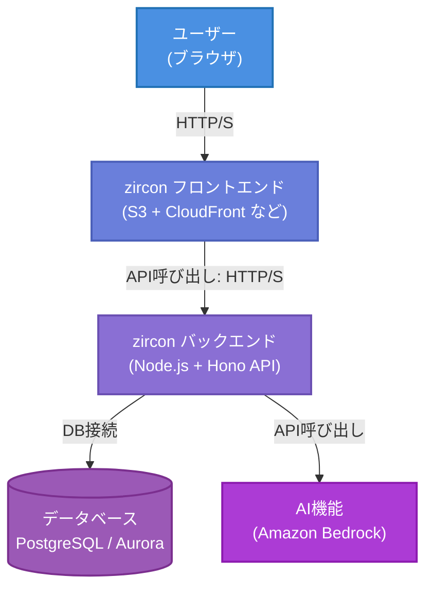

# zircon 要件定義書

## 1. 概要

### 1.1 プロジェクト概要

「zircon」

無限に子タスクを生成できるTODOアプリ。子タスク分解はAIアシストも利用可能。

### 1.2 プロジェクト目的・背景

近年、タスク管理ツールは多く存在するものの、複雑なプロジェクトや大規模なタスク分解が必要な現場では柔軟性に欠けるケースが多く見受けられます。
 「zircon」は、無限に子タスクを生成できるTODOアプリとして、個人の細かいタスク管理から、複数人によるウォーターフォールやアジャイル開発まで、あらゆる規模のプロジェクトに対応できる柔軟性と拡張性を実現することを目的としています。
 また、AIアシスト機能を組み込むことで、タスクの分解や整理を自動化・支援し、ユーザーの負担を軽減する点にも重点を置いています。

### 1.3 システム概要

- **無限に子タスク生成可能なTODOアプリ**
   タスクに対して無制限に子タスクを生成できる機能を搭載し、複雑なプロジェクトのタスク構造も直感的に管理できるように設計されています。
- **AIアシストによる子タスク分解**
   ユーザーが入力したタスク内容をAIが解析し、適切な子タスクへの分解を自動で提案する機能により、タスクの細分化作業を効率化します。

### 1.4 使用イメージ

- **個人でのタスク管理**
   日々の業務や生活の中で発生するタスクを階層的に整理し、効率的に管理するために利用できます。

- 複数人でのウォーターフォール/アジャイル開発での利用

  プロジェクトチーム全体でタスクを共有・分担し、各タスクの進捗や依存関係を明確に管理することが可能です。

  - ウォーターフォール開発では工程ごとのタスク管理に有効です。
  - アジャイル開発ではスプリント単位でのタスク分解や進捗管理に有効です。

### 1.5 ドキュメントの範囲

本ドキュメントは、「zircon」プロジェクトの要件定義書として、システムの概要、機能要件、非機能要件、および運用方針を記載します。具体的には以下の内容をカバーします。

- システムの目的と背景
- 提供する主要機能とその仕様
- ユーザーの利用想定
- システムの構成と設計方針
- セキュリティ、パフォーマンス、可用性などの非機能要件
- 今後の運用・保守方針

本ドキュメントは、開発チーム、プロジェクトマネージャー、およびステークホルダーが共通認識を持ち、システムの設計・実装・運用を適切に進めるための指針として使用されます。

## 2. 用語の定義・略語

### 2.1 用語の定義

| 用語               | 定義                                                         |
| ------------------ | ------------------------------------------------------------ |
| ユーザー           | システムにアクセスできる個人。プロジェクトに所属するとメンバーとなる。 |
| プロジェクト       | タスクを管理するための単位。メンバーが所属し、タスクの作成・管理を行う。 |
| メンバー           | プロジェクトに所属し、タスクの作成・編集・閲覧・ステータス変更ができるユーザー。 |
| プロジェクト管理者 | プロジェクトの管理権限を持ち、メンバーの管理やプロジェクト設定を行うユーザー。 |
| システム管理者     | システム全体を管理し、プロジェクトの作成やプロジェクト管理者の管理を行うユーザー。 |
| グループ           | プロジェクト内でメンバーをまとめる単位。グループ単位でタスクの担当者を設定できる。 |
| タスク             | 作業単位を示す要素。子タスクを持つことができ、各種属性を設定できる。 |
| 子タスク           | タスクに紐づくサブタスク。無制限に作成可能で、AIによる自動分解ができる。 |
| ステータス         | タスクの進捗状況を示す属性。プロジェクトごとにカスタマイズ可能。 |
| タグ               | タスクを分類するための要素。ユーザーが追加するものとシステムが設定するものがある。 |
| コメント           | タスクに対してメンバーが追加できるメッセージ。メンションを含むことができる。 |
| メンション         | コメントや詳細内でユーザーやグループを指定し、通知を行う機能。 |
| 通知               | メンションやタスクのステータス変更時に発生するアラート。UI上で確認可能。 |
| 表形式             | タスクをリスト形式で表示するビュー。                         |
| カンバン形式       | タスクをステータスごとに並べるビュー。                       |
| ツリー形式         | タスクの親子関係を木構造で表示するビュー。                   |
| ガントチャート形式 | タスクの開始日・終了日を視覚的に表示するビュー。             |
| AIアシスト         | タスクの子タスクを自動生成する機能。                         |
| ポイント           | タスクの工数や重要度を示す指標。                             |
| フィルタ           | タスクの検索・絞り込みに使用する機能。                       |
| 集計画面           | タスクの進捗や状況を可視化する画面。ステータス比率やバーンダウンチャートなどが含まれる。 |
| ロール             | ユーザーの権限を定義する概念。メンバー、プロジェクト管理者、システム管理者がある。 |
| アクセス権限       | ユーザーが実行可能な操作範囲を決定するルール。               |

### 2.2 略語

| 略語 | 意味                                                         |
| ---- | ------------------------------------------------------------ |
| AI   | Artificial Intelligence（人工知能）                          |
| UI   | User Interface（ユーザーインターフェース）                   |
| TLS  | Transport Layer Security（通信の暗号化技術）                 |
| SSL  | Secure Sockets Layer（通信の暗号化技術の旧バージョン）       |
| API  | Application Programming Interface（アプリケーション間のインターフェース） |
| DB   | Database（データベース）                                     |
| UX   | User Experience（ユーザーエクスペリエンス）                  |
| RBAC | Role-Based Access Control（ロールベースアクセス制御）        |

## 3. システム全体構成・アーキテクチャ

本章では、「zircon」システムの全体構成と、主要コンポーネントの概要を示します。
本システムは、大きく **フロントエンド（ブラウザ側）** と **バックエンド（サーバ側）** 、そして **データベース** を中心に構成され、AIアシストや通知機能などを組み合わせることで、無限に子タスクを生成可能なタスク管理アプリとして動作します。

### 3.1 システム構成図

以下に、本システムの概略構成図を示します（ローカル開発・AWS本番環境いずれも同様の論理構成）。本番環境では、フロントエンドをS3+CloudFront、バックエンドをLambda(API Gateway経由)、DBをAurora Serverless (PostgreSQL互換) としてサーバレスに運用する形を想定しています。

### 3.2 各コンポーネントの役割と責任分界点

システムを構成する主要な要素について、その機能と境界を示します。

#### 3.2.1 フロントエンド

**役割:**
- ユーザーインターフェース（UI）の提供
- ユーザー入力の受付と検証
- バックエンドAPIとの通信
- データの表示と更新

**責任分界点:**
- クライアントサイドのロジック処理まで
- バックエンドAPIへのリクエスト送信
- 受信したデータの表示と管理

フロントエンドの責任はブラウザ上での表示と操作に関するものに限定され、サーバーサイドのロジックやデータ永続化には関与しません。

#### 3.2.2 バックエンド

**役割:**
- ビジネスロジックの実装
- データの処理と永続化の制御
- 認証・認可の管理
- フロントエンドへのAPIの提供
- 外部サービス（AI、通知システムなど）との連携

**責任分界点:**
- APIエンドポイントの提供
- リクエストの受信とレスポンスの送信
- ビジネスロジックの実行
- データベースとの通信
- 認証・認可の判断

バックエンドはフロントエンドからのリクエストを受け取り、必要な処理を行い、結果を返すまでを担当します。データの永続化やAI機能の呼び出しなど、他のコンポーネントとの連携も行います。

#### 3.2.3 データベース

**役割:**
- データの永続的な保存
- データの整合性の維持
- 効率的なデータ検索と取得の提供

**責任分界点:**
- データの保存と取得
- トランザクション管理
- データの整合性とバックアップ

データベースはデータの保存と取得に関する責任を持ち、アプリケーションロジックには関与しません。バックエンドからの要求に応じてデータを提供または更新します。

#### 3.2.4 AI（子タスク自動生成機能）

**役割:**
- タスク内容の解析
- 適切な子タスクの生成
- 生成結果の提供

**責任分界点:**
- AIモデルの管理と実行
- 入力データの処理と出力の生成
- バックエンドへの結果の返却

AI機能は、バックエンドから提供されたタスク情報を基に子タスクを生成し、その結果をバックエンドに返す責任を持ちます。ユーザーインターフェースやデータの永続化には直接関与しません。

### 3.3 全体の責任分界点

システムを構成する主要な要素間の相互作用と境界を示します。

#### 3.3.1 フロントエンド ⇔ バックエンド

- API呼び出しを介してデータをやり取り
- フロントエンドはユーザー入力の基本的なバリデーションを行い、バックエンドはより詳細なビジネスロジックに基づく検証を実施

#### 3.3.2 バックエンド ⇔ データベース

- ORMを通じてデータの操作を行う
- バックエンドはクエリの最適化とキャッシュ戦略を担当し、データベースは効率的なデータ保存と取得を提供

#### 3.3.3 バックエンド ⇔ AI機能

- API呼び出しを介してデータをやり取り
- バックエンドはAI機能に必要なデータを提供し、生成結果を受け取る
- AI機能は提供されたデータに基づいて処理を行い、結果のみをバックエンドに返す

#### 3.3.4 全体のセキュリティ

- 各コンポーネントは自身の領域内でのセキュリティを確保する責任を持つ
- バックエンドは全体の認証・認可を管理し、他のコンポーネントはバックエンドの判断に従う

## 4. 機能要件

### 4.1 ユーザー・ロール管理

#### 4.1.1 ユーザー登録およびプロジェクト所属管理

1. **ユーザー登録（システム管理者権限）**
   - システム管理者は、システムに新たなユーザーを招待・登録できる。
   - ユーザー登録時には、メールアドレスと初期パスワードを設定する。
   - システム管理者は、必要に応じてユーザーのロール（プロジェクト管理者、メンバー、システム管理者）を付与・変更・削除できる。
2. **プロジェクトへの所属管理（プロジェクト管理者権限）**
   - プロジェクト管理者は、システムに登録済みのユーザーを任意のプロジェクトへ追加（メンバーとして）することができる。
   - プロジェクト管理者は、プロジェクトに所属するメンバーを除外することができる。除外されたメンバーは該当プロジェクトのタスク閲覧・操作権限を失う。
   - 一人のユーザーが複数のプロジェクトに所属することや、複数プロジェクトのプロジェクト管理者になることが可能である。
3. **グループへの追加**
   - プロジェクト管理者は、プロジェクト内でメンバーをグループとしてまとめる機能を利用できる。
   - メンバーは、プロジェクト管理者が作成・編集するグループに所属できる。
   - グループに所属したメンバーは、グループ単位でタスクの担当者として設定可能。

#### 4.1.2 ユーザーロールの定義

本システムにおけるロールは、以下の階層構造を持つ。

1. **ユーザー（全体）**
    システムにアクセスできる最も基本的なロール。ユーザーとして登録されてはじめて、プロジェクトへ参加することが可能。
2. **メンバー（プロジェクト参加者）**
   - プロジェクトに所属し、タスクの作成／編集／閲覧／ステータス変更が行える。
   - コメント投稿やメンション（ユーザー・グループ宛）による通知が可能。
   - グループへの追加が行われた場合、グループとしてのタスク担当も可能。
   - プロジェクト設定やメンバー管理など、プロジェクト管理者以上が行う操作はできない。
3. **プロジェクト管理者（プロジェクト設定・メンバー管理権限）**
   - 該当プロジェクトに関する設定権限を持ち、ステータスの追加／編集／削除などが行える。
   - プロジェクトに所属するメンバーやグループの追加・編集・削除を行える。
   - メンバーと同等にタスクの作成／編集／閲覧／ステータス変更ができるほか、タスクの削除が可能。
   - システムに登録済みのユーザーをプロジェクトへ追加し、メンバーとすることができる。
4. **システム管理者（プロジェクト作成・全体管理権限）**
   - システム全体を管理し、プロジェクト自体の新規作成や、プロジェクト管理者の追加／除外を行える。
   - システム全体のユーザー登録や、システム管理者ロールの追加／削除が可能。
   - システム全体のプロジェクト一覧と各プロジェクトに所属するメンバー／プロジェクト管理者を確認できる。
   - **注意**: システム管理者はプロジェクトの通常作業（タスク作成・編集・閲覧・ステータス変更）を行う権限は**基本的に付与されない**。必要な場合は、個別プロジェクトで「メンバー」「プロジェクト管理者」ロールを兼任する。

#### 4.1.3 アクセス権限・操作制限の設定

1. **各ロールの操作範囲**

   | ロール             | 主な操作例                                                   |
   | ------------------ | ------------------------------------------------------------ |
   | システム管理者     | - プロジェクトの作成／削除- プロジェクト管理者の追加／除外- システムにおけるユーザー招待- システム管理者の追加／削除- (プロジェクト内タスク操作はデフォルト権限なし) |
   | プロジェクト管理者 | - プロジェクトの設定管理（ステータス・入力項目など）- メンバー／グループの追加・編集・削除- タスクの削除- メンバーと同等のタスク操作 (作成／編集／閲覧／ステータス変更) |
   | メンバー           | - タスクの作成／編集／閲覧／ステータス変更- タスクへのコメント投稿・メンション- グループ担当としての作業- (プロジェクト管理者以上の操作は不可) |

2. **プロジェクト設定／タスク管理機能の操作制限**

   - **ステータス管理**: プロジェクト管理者のみが新規ステータスの追加／既存ステータスの編集・削除を行える。
     - 特定メンバー・グループのみが遷移できるステータスルールも、プロジェクト管理者が設定する。
   - **タスク削除**: プロジェクト管理者以上が行える。メンバーはタスクの作成・編集のみで削除権限は持たない。
   - **プロジェクト自体の設定変更**（ステータスの表示順やタスク項目のカスタマイズなど）: プロジェクト管理者以上。
   - **プロジェクトへのメンバー追加／除外**: プロジェクト管理者のみが操作可能。

3. **システム全体の操作制限**

   - プロジェクト作成やプロジェクト管理者の任命は、**システム管理者のみ**が行う。
   - システム管理者は、全プロジェクトの状態（管理者やメンバーの一覧）を参照可能だが、個別タスクの詳細操作は原則行わない。
   - システム管理者ロールに対する追加／削除権限も、既存のシステム管理者だけが実行可能。

4. **ロール間の兼任**

   - 同一ユーザーが、複数プロジェクトで「メンバー」または「プロジェクト管理者」を兼任できる。
   - システム管理者であっても、特定プロジェクトの業務に参加する場合は、該当プロジェクトで「メンバー」もしくは「プロジェクト管理者」を追加付与する必要がある。
   - ロール変更は該当権限を持つ管理者がユーザー情報を編集して行う。

### 4.2 タスク管理機能

本章では、zirconシステムの中心となるタスク管理機能について詳述します。

#### 4.2.1 タスクの作成／編集／閲覧／削除

タスク管理の基本となる操作機能を提供します。

1. **タスク作成機能**
   - プロジェクトに所属するメンバーは新規タスクを作成できる
   - 作成時に4.2.3で定義される属性を設定可能
   - 親タスクの配下に子タスクとして作成することも可能
2. **タスク編集機能**
   - 既存タスクの属性を更新できる
   - 編集権限はプロジェクトに所属するメンバーに付与される
   - 編集履歴を記録し、いつ誰が何を変更したかを追跡可能
3. **タスク閲覧機能**
   - プロジェクトメンバーはプロジェクト内のすべてのタスクを閲覧可能
   - 複数の表示形式（表形式、カンバン形式、ツリー形式、ガントチャート形式）で閲覧できる
   - フィルタリングや検索機能と連携し、必要なタスクのみを表示
4. **タスク削除機能**
   - プロジェクト管理者のみがタスク削除権限を持つ
   - 削除時は確認ダイアログを表示し、誤操作を防止
   - タスクを削除すると、その子タスクも連動して削除される

#### 4.2.2 子タスク（無限階層）の作成・管理

タスクを細分化し、階層構造で管理するための機能を提供します。階層の深さに制限を設けず、必要に応じて無限に子タスクを作成できます。

1. **子タスク作成機能**
   - 任意のタスクに対して子タスクを追加可能
   - 子タスクは親タスクと同様の属性を持ち、独立して管理可能
   - 子タスクにさらに子タスクを作成でき、階層の深さに制限なし
2. **親子関係管理機能**
   - 子タスクの完了状況は親タスクの進捗として集計・表示
   - 親タスクと子タスクの関係性を視覚的に把握できるツリービュー提供
   - ドラッグ＆ドロップによる子タスクの並び替えや階層移動が可能
3. **AIアシストによる子タスク生成**
   - 親タスクの内容を分析し、適切な子タスクを自動生成
   - 生成された子タスク案をユーザーが編集・確認のうえで採用可能
   - 生成された子タスクの一部または全部を選択的に採用できる

#### 4.2.3 タスク属性の設定

タスクには以下の属性を設定できます。これらの属性は検索やフィルタリング、レポート生成にも活用されます。

##### 4.2.3.1 タイトル

- タスクを識別するための主要な名称として利用
- プロジェクト内で重複を許容（同名タスクの存在を許可）
- 最大文字数は100文字を想定
- 必須項目として設定

##### 4.2.3.2 詳細

- タスクの詳細情報を記述するフィールド
- マークダウン記法に対応し、書式付きテキストとして表示
  - 見出し、リスト、テーブル、コードブロック、リンク等をサポート
- 画像の埋め込みやファイル添付機能も提供
- エディタにはプレビュー機能を搭載し、入力中に仕上がりを確認可能
- @メンション機能と連携し、詳細文中でユーザーやグループを参照可能

##### 4.2.3.3 開始日／終了日

- タスクの実施予定期間を設定するフィールド
- 日付形式はYYYY/MM/DD形式で統一（例：2025/04/01）
- カレンダーピッカーUIを提供し、視覚的に日付選択が可能
- 開始日と終了日の前後関係を自動チェック（開始日が終了日より後になることを警告）
- 未設定（空白）も許容し、日付未定のタスクも登録可能
- 親タスクと子タスクの期間の整合性チェック機能（オプション）を提供
  - 子タスクの期間が親タスクの期間を超える場合に警告表示

##### 4.2.3.4 ポイント

- タスクの難易度や工数を数値化するためのフィールド
- 整数値での入力を基本とし、推奨値として1、2、3、5、8、13などを提示
- プロジェクトごとにポイントの意味や基準を設定可能
- タスク集計時に合計ポイント数を算出し、進捗管理に活用
- メンバーごとのポイント消化率をダッシュボードで可視化
- 親タスクの場合は子タスクのポイント合計を自動集計して表示（オプション）

##### 4.2.3.5 担当者設定（個人、グループ、複数指定可能）

- タスクの担当者を指定するフィールド
- 以下の指定方法をサポート：
  - 個人：プロジェクトに所属する特定のメンバーを指定
  - グループ：事前に定義されたグループ単位で指定
  - 複数指定：個人・グループを組み合わせて複数の担当者を設定可能
- 担当者未設定のタスクも作成可能（後で割り当て）
- 担当者変更時には変更通知を自動発信
- 担当者検索機能を提供（名前の一部でサジェスト表示）
- 特定のステータスに遷移する際、担当者の自動変更オプションにも対応

##### 4.2.3.6 ステータス管理

- タスクの進行状態を管理するためのフィールド
- プロジェクト毎のステータス追加／編集／削除
  - プロジェクト管理者がプロジェクトごとに独自のステータスを定義可能
  - ステータスの名称、色、説明、表示順序などを設定可能
  - 初期状態として「未着手」「進行中」「完了」などの基本ステータスを用意
  - 必要に応じてステータスの追加・編集・削除が可能
  - 削除時は該当ステータスのタスクの扱いについて確認・一括変更機能を提供
- 特定メンバー・グループのみが遷移可能なルール設定
  - ステータスごとに、どのロール・メンバー・グループが遷移させられるかのルールを設定可能
  - 例：「レビュー中」から「完了」へは「レビュアー」グループのみが変更可能
  - 権限のないユーザーがステータス変更を試みた場合は警告表示
  - ステータス遷移時には、設定に基づいて通知を関係者に自動送信
  - 遷移履歴を記録し、タスクの進捗経過を追跡可能

##### 4.2.3.7 タグ設定（ユーザー追加・システム設定）

- タスクの分類や検索を容易にするためのラベル機能
- ユーザー追加タグ
  - プロジェクトメンバーが自由にタグを作成・設定可能
  - タグの名称、色をカスタマイズ可能
  - タグの入力時は既存タグをサジェスト表示し、重複を防止
  - 一つのタスクに複数のタグを設定可能
- システム設定タグ
  - システムが自動的に付与する特殊なタグ（例：「期限切れ」「今日期限」）
  - プロジェクト管理者が定義する標準タグ（例：「優先度：高」「種別：バグ」）
  - システムタグは特定条件で自動設定・解除される場合あり
  - 一部のシステムタグはユーザーが手動で解除できないよう制限可能
- タグに基づいた集計・分析機能と連携し、タグごとの進捗状況を可視化

##### 4.2.3.8 その他カスタム項目

- プロジェクト特有のニーズに対応するためのカスタムフィールド機能
- プロジェクト管理者が以下の項目タイプを追加・設定可能
  - テキスト（単行・複数行）
  - 数値（整数・小数）
  - 選択肢（単一選択・複数選択）
  - 日付・時刻
  - チェックボックス
  - ユーザー参照
  - 外部URL
  - ファイル添付
- カスタム項目ごとに名称、説明、入力必須/任意、デフォルト値などを設定
- カスタム項目に基づく検索・ソート・集計も可能
- カスタム項目の表示順序や表示条件（特定の値のときのみ表示など）も設定可能
- インポート/エクスポート機能との連携により、カスタム項目のデータ移行も対応

### 4.3 コメント・メンション・通知機能

#### 4.3.1 タスクへのコメント投稿機能

##### 4.3.1.1 コメント基本機能

- プロジェクトに所属するメンバーは、任意のタスクにコメントを投稿できる
- コメントはタスク詳細画面の専用セクションに時系列で表示される
- コメントには投稿者名、投稿日時、本文が含まれる
- コメント本文はマークダウン形式での記述に対応し、リスト・見出し・コードブロック等の書式を使用可能

##### 4.3.1.2 コメント管理機能

- 投稿者は自身のコメントを編集・削除できる
- プロジェクト管理者はプロジェクト内の全コメントを削除できる
- コメントが編集された場合、編集済みマークと最終編集日時を表示
- コメントの削除は論理削除とし、監査ログに記録を残す

##### 4.3.1.3 添付ファイル機能

- コメントに画像やドキュメントなどのファイルを添付可能
- 添付ファイルは一覧で確認でき、画像は縮小表示される
- サポートするファイル形式：画像(PNG/JPEG/GIF)、文書(PDF/DOCX/XLSX)、その他(ZIP/TXT)
- ファイルサイズ上限は10MBまで

#### 4.3.2 メンション機能

##### 4.3.2.1 ユーザーメンション

- コメント内で「@ユーザー名」形式でユーザーをメンション可能
- メンションされたユーザーには専用の通知が送信される
- メンション入力時、「@」入力後にユーザー名候補がサジェスト表示される
- メンションされたユーザー名はハイライト表示され、クリックするとそのユーザーのプロフィールにアクセス可能

##### 4.3.2.2 グループメンション

- コメント内で「@グループ名」形式でグループ全体をメンション可能
- グループに所属する全メンバーに通知が送信される
- グループメンションも入力時にサジェスト表示される
- メンション時に「@グループ名」は特別な色・スタイルでハイライト表示される

##### 4.3.2.3 メンション通知設定

- ユーザーは自分宛のメンション通知の受信方法をカスタマイズ可能
  - UIでの通知表示
  - メール通知（即時/デイリーダイジェスト/受信しない）
  - モバイルプッシュ通知（拡張機能として）
- グループ管理者はグループ宛メンションの通知デフォルト設定を構成可能

##### 4.3.2.4 メンション範囲と権限

- タスク詳細・コメント・タスク説明文などの自由入力欄でメンション可能
- メンション可能なユーザー/グループはプロジェクトに所属しているものに限定される
- プロジェクト外のユーザーをメンションしようとした場合は警告表示

#### 4.3.3 タスクステータス変更時の通知ルール

##### 4.3.3.1 個人担当の場合

- タスクのステータスが変更されると、そのタスクの担当者に通知が送信される
- ただし、担当者自身がステータスを変更した場合は通知されない
- 通知内容には以下の情報が含まれる：
  - タスクのタイトル
  - 変更前と変更後のステータス
  - 変更を行ったユーザー名
  - 変更日時
  - タスクへの直接リンク
- ステータスごとに通知の重要度を設定可能（例：「完了」への変更は高重要度、「進行中」への変更は中重要度）

##### 4.3.3.2 グループ担当の場合

- グループ内メンバーによる変更
  - グループに所属するメンバーがタスクのステータスを変更した場合：
    - 変更を行ったメンバー以外のグループ所属メンバー全員に通知が送信される
    - 通知内容は個人担当時と同様だが、変更者と通知先がグループメンバーであることが明示される
- グループ外メンバーによる変更
  - グループに所属していないメンバーがタスクのステータスを変更した場合：
    - グループに所属する全メンバーに通知が送信される
    - 通知には「外部メンバーによるステータス変更」であることが明示される

- グループ通知設定
  - グループ単位で通知設定をカスタマイズ可能
    - グループ全体としてのステータス変更通知のオン/オフ
    - 特定のステータス変更のみ通知する設定
    - グループ管理者のみに通知する設定
  - グループメンバーは個人レベルで、グループ単位の通知をオーバーライド（無効化/有効化）できる

##### 4.3.3.3 通知管理機能

- 通知は既読/未読で区別され、既読にマークすることや一括既読化が可能
- 通知フィルター機能により、タイプ別（メンション/ステータス変更/システム通知など）に表示を切り替え可能
- 重要度に応じた視覚的区別（色分けやアイコン表示）により優先度の高い通知を識別しやすくする
- 通知の保持期間を設定可能（デフォルトは30日間、最長90日）
- 通知ごとにクイックアクション（該当タスクへ移動、返信、非表示など）を提供

##### 4.3.3.4 通知配信方法

- システム内通知（UIに表示）：常に有効、リアルタイムで配信
- メール通知：ユーザー設定に応じて以下のオプションから選択可能
  - リアルタイム配信
  - 定期ダイジェスト（1日1回のサマリー）
  - 重要通知のみ
  - 無効
- モバイルプッシュ通知（拡張機能として実装予定）：モバイルアプリ導入時に設定可能

#### 4.3.4 コメント・通知のAPI連携

##### 4.3.4.1 外部ツール連携

- Slack、Microsoft Teams等の主要コミュニケーションツールとの連携機能
- Webhookを利用して、特定の通知を外部システムに転送可能
- メンション通知やステータス変更通知を選択的に外部ツールへ連携設定可能

##### 4.3.4.2 通知イベントのカスタマイズ

- プロジェクト管理者は以下の項目をプロジェクトごとにカスタマイズ可能：
  - 通知をトリガーするイベント（コメント追加、特定ステータスへの変更など）
  - 通知対象者のルール（担当者、メンション先、特定グループなど）
  - 通知テンプレート（タイトル、本文フォーマット）

#### 4.3.5 コンテキスト対応型通知

##### 4.3.5.1 タスク履歴との統合

- ステータス変更通知やメンション通知は、タスクの履歴タイムラインにも記録
- タスク詳細画面では、ステータス変更履歴とコメント履歴が時系列で統合表示される
- 通知発生ポイントを履歴上で視覚的に確認可能（ステータス変更ポイント、コメント追加ポイントなど）

##### 4.3.5.2 通知の優先制御

- 短時間に同一タスクへの複数の変更があった場合、通知をまとめて配信する智能化機能
- 例：複数の小さなステータス変更が連続した場合、最終的な変化のみを通知
- ユーザーの作業コンテキストを考慮し、現在表示中のタスクに関する通知は即時表示、それ以外は通知センターに蓄積

#### 4.3.6 システム通知管理

##### 4.3.6.1 管理者向け通知設定

- プロジェクト管理者向けに、システム全体の通知設定を構成可能
- 特定タイプの通知の一括有効化/無効化
- 優先度設定（高/中/低）の定義
- 未読通知の自動リマインド機能の設定

##### 4.3.6.2 通知ポリシー

- 通知の送信頻度制限（スパム防止）
- 勤務時間外の通知抑制オプション
- プライバシー設定（メンション通知の表示内容レベルなど）
