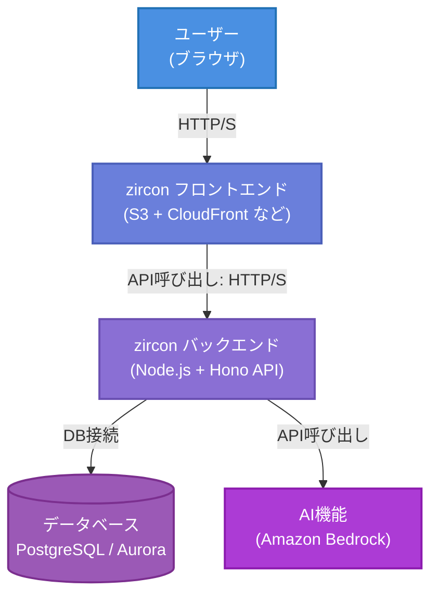

# zircon 要件定義書

## 1. 概要

### 1.1 プロジェクト概要

「zircon」

無限に子タスクを生成できるTODOアプリ。子タスク分解はAIアシストも利用可能。

### 1.2 プロジェクト目的・背景

近年、タスク管理ツールは多く存在するものの、複雑なプロジェクトや大規模なタスク分解が必要な現場では柔軟性に欠けるケースが多く見受けられます。
 「zircon」は、無限に子タスクを生成できるTODOアプリとして、個人の細かいタスク管理から、複数人によるウォーターフォールやアジャイル開発まで、あらゆる規模のプロジェクトに対応できる柔軟性と拡張性を実現することを目的としています。
 また、AIアシスト機能を組み込むことで、タスクの分解や整理を自動化・支援し、ユーザーの負担を軽減する点にも重点を置いています。

### 1.3 システム概要

- **無限に子タスク生成可能なTODOアプリ**
   タスクに対して無制限に子タスクを生成できる機能を搭載し、複雑なプロジェクトのタスク構造も直感的に管理できるように設計されています。
- **AIアシストによる子タスク分解**
   ユーザーが入力したタスク内容をAIが解析し、適切な子タスクへの分解を自動で提案する機能により、タスクの細分化作業を効率化します。

### 1.4 使用イメージ

- **個人でのタスク管理**
   日々の業務や生活の中で発生するタスクを階層的に整理し、効率的に管理するために利用できます。

- 複数人でのウォーターフォール/アジャイル開発での利用

  プロジェクトチーム全体でタスクを共有・分担し、各タスクの進捗や依存関係を明確に管理することが可能です。

  - ウォーターフォール開発では工程ごとのタスク管理に有効です。
  - アジャイル開発ではスプリント単位でのタスク分解や進捗管理に有効です。

### 1.5 ドキュメントの範囲

本ドキュメントは、「zircon」プロジェクトの要件定義書として、システムの概要、機能要件、非機能要件、および運用方針を記載します。具体的には以下の内容をカバーします。

- システムの目的と背景
- 提供する主要機能とその仕様
- ユーザーの利用想定
- システムの構成と設計方針
- セキュリティ、パフォーマンス、可用性などの非機能要件
- 今後の運用・保守方針

本ドキュメントは、開発チーム、プロジェクトマネージャー、およびステークホルダーが共通認識を持ち、システムの設計・実装・運用を適切に進めるための指針として使用されます。

## 2. 用語の定義・略語

### 2.1 用語の定義

| 用語               | 定義                                                         |
| ------------------ | ------------------------------------------------------------ |
| ユーザー           | システムにアクセスできる個人。プロジェクトに所属するとメンバーとなる。 |
| プロジェクト       | タスクを管理するための単位。メンバーが所属し、タスクの作成・管理を行う。 |
| メンバー           | プロジェクトに所属し、タスクの作成・編集・閲覧・ステータス変更ができるユーザー。 |
| プロジェクト管理者 | プロジェクトの管理権限を持ち、メンバーの管理やプロジェクト設定を行うユーザー。 |
| システム管理者     | システム全体を管理し、プロジェクトの作成やプロジェクト管理者の管理を行うユーザー。 |
| グループ           | プロジェクト内でメンバーをまとめる単位。グループ単位でタスクの担当者を設定できる。 |
| タスク             | 作業単位を示す要素。子タスクを持つことができ、各種属性を設定できる。 |
| 子タスク           | タスクに紐づくサブタスク。無制限に作成可能で、AIによる自動分解ができる。 |
| ステータス         | タスクの進捗状況を示す属性。プロジェクトごとにカスタマイズ可能。 |
| タグ               | タスクを分類するための要素。ユーザーが追加するものとシステムが設定するものがある。 |
| コメント           | タスクに対してメンバーが追加できるメッセージ。メンションを含むことができる。 |
| メンション         | コメントや詳細内でユーザーやグループを指定し、通知を行う機能。 |
| 通知               | メンションやタスクのステータス変更時に発生するアラート。UI上で確認可能。 |
| 表形式             | タスクをリスト形式で表示するビュー。                         |
| カンバン形式       | タスクをステータスごとに並べるビュー。                       |
| ツリー形式         | タスクの親子関係を木構造で表示するビュー。                   |
| ガントチャート形式 | タスクの開始日・終了日を視覚的に表示するビュー。             |
| AIアシスト         | タスクの子タスクを自動生成する機能。                         |
| ポイント           | タスクの工数や重要度を示す指標。                             |
| フィルタ           | タスクの検索・絞り込みに使用する機能。                       |
| 集計画面           | タスクの進捗や状況を可視化する画面。ステータス比率やバーンダウンチャートなどが含まれる。 |
| ロール             | ユーザーの権限を定義する概念。メンバー、プロジェクト管理者、システム管理者がある。 |
| アクセス権限       | ユーザーが実行可能な操作範囲を決定するルール。               |

### 2.2 略語

| 略語 | 意味                                                         |
| ---- | ------------------------------------------------------------ |
| AI   | Artificial Intelligence（人工知能）                          |
| UI   | User Interface（ユーザーインターフェース）                   |
| TLS  | Transport Layer Security（通信の暗号化技術）                 |
| SSL  | Secure Sockets Layer（通信の暗号化技術の旧バージョン）       |
| API  | Application Programming Interface（アプリケーション間のインターフェース） |
| DB   | Database（データベース）                                     |
| UX   | User Experience（ユーザーエクスペリエンス）                  |
| RBAC | Role-Based Access Control（ロールベースアクセス制御）        |

## 3. システム全体構成・アーキテクチャ

本章では、「zircon」システムの全体構成と、主要コンポーネントの概要を示します。
本システムは、大きく **フロントエンド（ブラウザ側）** と **バックエンド（サーバ側）** 、そして **データベース** を中心に構成され、AIアシストや通知機能などを組み合わせることで、無限に子タスクを生成可能なタスク管理アプリとして動作します。

### 3.1 システム構成図

以下に、本システムの概略構成図を示します（ローカル開発・AWS本番環境いずれも同様の論理構成）。本番環境では、フロントエンドをS3+CloudFront、バックエンドをLambda(API Gateway経由)、DBをAurora Serverless (PostgreSQL互換) としてサーバレスに運用する形を想定しています。

### 3.2 各コンポーネントの役割と責任分界点

システムを構成する主要な要素について、その機能と境界を示します。

#### 3.2.1 フロントエンド

**役割:**
- ユーザーインターフェース（UI）の提供
- ユーザー入力の受付と検証
- バックエンドAPIとの通信
- データの表示と更新

**責任分界点:**
- クライアントサイドのロジック処理まで
- バックエンドAPIへのリクエスト送信
- 受信したデータの表示と管理

フロントエンドの責任はブラウザ上での表示と操作に関するものに限定され、サーバーサイドのロジックやデータ永続化には関与しません。

#### 3.2.2 バックエンド

**役割:**
- ビジネスロジックの実装
- データの処理と永続化の制御
- 認証・認可の管理
- フロントエンドへのAPIの提供
- 外部サービス（AI、通知システムなど）との連携

**責任分界点:**
- APIエンドポイントの提供
- リクエストの受信とレスポンスの送信
- ビジネスロジックの実行
- データベースとの通信
- 認証・認可の判断

バックエンドはフロントエンドからのリクエストを受け取り、必要な処理を行い、結果を返すまでを担当します。データの永続化やAI機能の呼び出しなど、他のコンポーネントとの連携も行います。

#### 3.2.3 データベース

**役割:**
- データの永続的な保存
- データの整合性の維持
- 効率的なデータ検索と取得の提供

**責任分界点:**
- データの保存と取得
- トランザクション管理
- データの整合性とバックアップ

データベースはデータの保存と取得に関する責任を持ち、アプリケーションロジックには関与しません。バックエンドからの要求に応じてデータを提供または更新します。

#### 3.2.4 AI（子タスク自動生成機能）

**役割:**
- タスク内容の解析
- 適切な子タスクの生成
- 生成結果の提供

**責任分界点:**
- AIモデルの管理と実行
- 入力データの処理と出力の生成
- バックエンドへの結果の返却

AI機能は、バックエンドから提供されたタスク情報を基に子タスクを生成し、その結果をバックエンドに返す責任を持ちます。ユーザーインターフェースやデータの永続化には直接関与しません。

### 3.3 全体の責任分界点

システムを構成する主要な要素間の相互作用と境界を示します。

#### 3.3.1 フロントエンド ⇔ バックエンド

- API呼び出しを介してデータをやり取り
- フロントエンドはユーザー入力の基本的なバリデーションを行い、バックエンドはより詳細なビジネスロジックに基づく検証を実施

#### 3.3.2 バックエンド ⇔ データベース

- ORMを通じてデータの操作を行う
- バックエンドはクエリの最適化とキャッシュ戦略を担当し、データベースは効率的なデータ保存と取得を提供

#### 3.3.3 バックエンド ⇔ AI機能

- API呼び出しを介してデータをやり取り
- バックエンドはAI機能に必要なデータを提供し、生成結果を受け取る
- AI機能は提供されたデータに基づいて処理を行い、結果のみをバックエンドに返す

#### 3.3.4 全体のセキュリティ

- 各コンポーネントは自身の領域内でのセキュリティを確保する責任を持つ
- バックエンドは全体の認証・認可を管理し、他のコンポーネントはバックエンドの判断に従う
