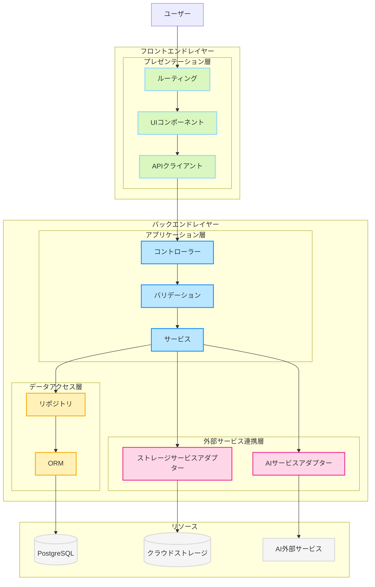
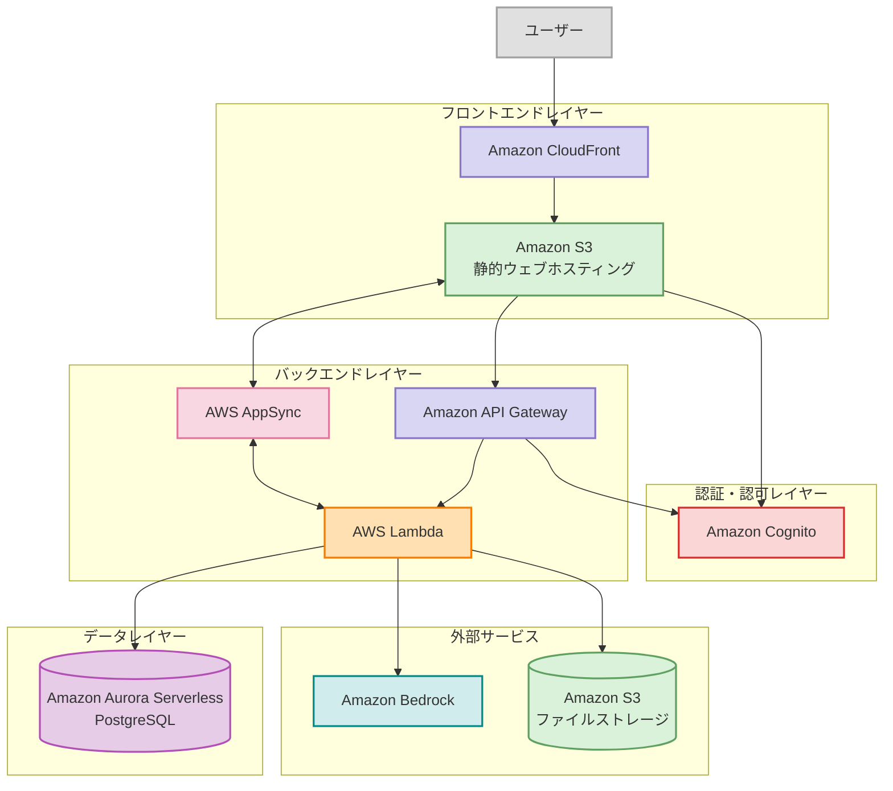

# 1. はじめに

## 1.1. プロジェクトの概要

「zircon」

無限に子タスクを生成できるTODOアプリ。子タスク分解はAIアシストも利用可能。

## 1.2. プロジェクト目的・背景

現在の市場には多くのタスク管理ツールが存在しますが、多くは階層構造に制限があり、AIによるタスク分解機能を持っていません。また、ユーザーは全体計画、日々のタスク管理、詳細な作業分解などのために複数のツールを併用せざるを得ない状況です。

「zircon」は以下の課題を解決することを目的としています。
- 既存のタスク管理ツールにおける階層制限の克服
- 機能の分断による複数ツール乱立の解消
- AIによる知的支援を取り入れた業務効率化の実現
- 大規模組織や複雑なプロジェクトでのタスク管理の簡素化
- チーム内の透明性向上とコラボレーション促進

近年のAI技術、特に自然言語処理の進化により、タスク分解のような知的作業の一部を自動化できるようになったことも、本プロジェクト実現の重要な技術的背景です。

## 1.3. プロジェクト名の由来

「zircon」は地球上で最も古い鉱物の一つとされる宝石であり、多様な色彩、高い硬度、美しい結晶構造を持つことで知られています。本プロジェクトがこの名前を選んだ理由は、以下の5つの象徴的な意味に基づいています。

1. **無限の可能性**：zirconの石言葉である「無限」は、本アプリケーションが持つ無制限に子タスクを生成・分解できる機能を象徴しています。ユーザーが自由に、制限なくタスクを整理・管理できることを表現しています。
2. **生命力と成長**：石言葉の「生命力」は、本アプリケーションのタスクがユーザーの思考に従って自然に成長・展開していく様子を表現しています。AIアシストによるタスクの分解は、ユーザーのアイデアや計画がまるで生命を持って自発的に成長するかのように支援します。
3. **多様性と耐久性**：zirconの多彩な色と高い耐久性は、本アプリケーションが提供する多様な表示形式（表形式、カンバン形式、ツリー形式、ガントチャート形式）や複雑で長期にわたるプロジェクトにも柔軟かつ堅牢に対応する能力を象徴しています。
4. **成功への行動力**：石言葉である「成功」と「行動力」は、本アプリケーションがユーザーの生産性を高め、実際の成果に結びつく行動を促進することを意味しています。タスク管理を通じて明確な目標達成と成功に向かう道筋を提供します。
5. **安らぎと明確さ**：zirconの石言葉「安らぎ」は、本アプリケーションがユーザーに提供する安心感と明確な視覚化による混乱の解消を表現しています。ツリー表示やガントチャートなどでタスク構造や進捗状況を明確化し、ユーザーの心の負担を軽減し、タスク管理の安心感を与えます。

私たちはこのzirconプロジェクトを通じて、複雑なタスク管理をシンプルで美しく、そしてユーザーにとって意味のあるものにし、業務や生活における成功と充実感に貢献することを目指しています。

## 1.4. 本書の目的

本要件定義書の目的は以下の通りです。

- zirconの全体像と各機能の詳細を明確にし、開発・運用・保守の各フェーズで一貫した理解を提供すること
- ユーザー体験とビジネス要件を満たすための機能仕様を定義すること
- システムの技術的品質（拡張性、保守性、データ整合性、スケーラビリティ、パフォーマンスなど）を確保するための設計指針を提供すること
- システムの非機能要件（可用性、信頼性、回復性など）を定義すること
- コンプライアンスとリスク管理（セキュリティ、個人情報保護など）の基盤を提供すること
- AIと人間の協働モデルを含むAIアシスト機能の範囲、制限、評価基準を明確にすること
- 開発の優先順位付けと技術選定の指針を提供すること
- システムの制約条件と前提条件を明確にすること

## 1.5. 対象読者

本要件定義書の対象読者は以下の通りです。

| 対象者             | 役割                                                         |
| ------------------ | ------------------------------------------------------------ |
| 開発チーム         | アーキテクト フロントエンドエンジニア バックエンドエンジニア データベースエンジニア インフラエンジニア セキュリティエンジニア AIエンジニア UIデザイナー テスト担当者 |
| プロジェクト管理者 | プロジェクトマネージャー ステークホルダー                 |
| 運用・保守チーム   | システム管理者 SRE セキュリティ監査担当者 データアナリスト |
| 外部関係者         | API利用開発者 コンプライアンス担当者                      |

# 2. システム概要

## 2.1. システムの目的

「zircon」は、無限階層のタスク管理とAIアシスト機能を提供することで、複雑なプロジェクトを効率的に管理し、組織の生産性を向上させることを目的としています。具体的には以下の目的を持ちます。
- 複雑なタスクを階層的に分解し、管理可能な単位に分割することによる業務効率の向上
- AIアシストによるタスク分解支援で、計画の質と網羅性の向上
- プロジェクト内のコミュニケーション促進と情報共有の円滑化
- 多様な視点（表形式、カンバン形式、ツリー形式、ガントチャート形式）でのタスク管理による作業の透明性向上
- プロジェクトの進捗状況の可視化による意思決定の迅速化

## 2.2. システムの範囲

本システムは、以下の機能範囲を含みます。
- タスク管理システム：無制限の階層構造を持つタスク作成・編集・管理機能
- AIアシスタント機能：タスク分解の自動提案機能
- ユーザー・権限管理：システム管理者、プロジェクト管理者、メンバーの階層的権限構造
- プロジェクト・グループ管理：複数プロジェクトの管理とプロジェクト内グループ機能
- 通知システム：メンション機能、ステータス変更通知機能
- データ可視化・レポーティング機能：進捗状況のグラフ表示、集計情報の提供
- 複数ビュー対応：表形式、カンバン形式、ツリー形式、ガントチャート形式の表示切替
- 検索機能：全文検索、ステータス検索、タグ検索

本システムは主に中小〜大規模組織でのプロジェクト管理を対象としており、複数のプロジェクトを同時進行で管理する必要がある組織（IT企業、コンサルティング会社、マーケティング会社など）での利用を想定しています。

将来的な拡張可能性として、外部システム（カレンダー、メール、チャットツールなど）との連携やAIアシスト機能の拡充を視野に入れていますが、現時点では以下の機能は範囲外とします。
- 請求管理・予算管理機能
- 詳細な時間追跡機能
- 外部システムとの連携機能

## 2.3 システム論理設計

「zircon」は、クライアント-サーバー型の拡張3層構造を採用します。

各要素は以下の役割を持ちます。

| 層                   | 要素                                           | 説明                                                         |
| -------------------- | ---------------------------------------------- | ------------------------------------------------------------ |
| プレゼンテーション層 | ルーティング（Routing）                        | ユーザーからのリクエストを受け取り、適切なUIコンポーネントにリクエストを振り分けます。 |
| プレゼンテーション層 | UIコンポーネント（UI）                         | ユーザーがシステムとやり取りするためのインターフェースを提供します。 |
| プレゼンテーション層 | APIクライアント（APIClient）                   | バックエンドのアプリケーション層へHTTPリクエストを送信し、レスポンスを受け取ります。 |
| アプリケーション層   | コントローラー（Controller）                   | APIクライアントからのリクエストを受け付け、適切な処理ロジックに振り分けます。 |
| アプリケーション層   | バリデーション（Validation）                   | 受信したデータの整合性や妥当性を検証します。                 |
| アプリケーション層   | サービス（Service）                            | ビジネスロジックを実行し、データアクセス層や外部サービス連携層とのやり取りを担います。 |
| データアクセス層     | リポジトリ（Repository）                       | 永続化データのアクセス方法を抽象化し、アプリケーション層にデータ操作手段を提供します。 |
| データアクセス層     | ORM（オブジェクト関係マッパー）                | オブジェクト指向言語のデータモデルとデータベースの間のマッピングを行います。 |
| 外部サービス連携層   | AIサービスアダプター（AIAdapter）              | AI外部サービスとの通信を抽象化し、サービス層へインターフェースを提供します。 |
| 外部サービス連携層   | ストレージサービスアダプター（StorageAdapter） | クラウドストレージとの通信を抽象化し、サービス層へインターフェースを提供します。 |
| リソース             | PostgreSQL（DB）                               | 永続化データを保存するリレーショナルデータベース。           |
| リソース             | クラウドストレージ（CloudStorage）             | 画像やファイルなどの非構造化データを保存するストレージ。     |
| リソース             | AI外部サービス（AIService）                    | システム外部で提供されるAI機能を利用するためのサービス。     |

## 2.4. 全体アーキテクチャ

「zircon」は、コストパフォーマンスを優先し、サーバレスサービスを前提とした以下のアーキテクチャを採用します。

クラウドは、AWSを利用します。

各コンポーネントは以下の役割を持ちます。

| コンポーネント | サービス | 説明 |
|--------------|---------|------|
| フロントエンド配信 | Amazon CloudFront+ Amazon S3 | React + TypeScriptで構築されたSPAをS3にホスティングし、CloudFrontを通じて配信します。 |
| 認証・認可 | Amazon Cognito | ユーザー認証と権限管理を行います。JWTを発行し、APIへのアクセス制御に使用します。 |
| API管理 | Amazon API Gateway | RESTful APIのエンドポイントを提供し、Lambdaへリクエストをルーティングします。 |
| バックエンド処理 | AWS Lambda | Node.js + TypeScript + Honoで実装されたサーバーレス関数群。タスク管理、ユーザー管理、プロジェクト管理などの機能を提供します。 |
| リアルタイム通知 | AWS AppSync | WebSocketベースのリアルタイム通知機能を提供します。タスクのステータス変更やメンションによる通知を実現します。 |
| データベース | Amazon Aurora Serverless PostgreSQL | タスク、ユーザー、プロジェクトなどの構造化データを保存します。Prisma ORMを使用してアクセスします。 |
| ファイルストレージ | Amazon S3 | タスクの添付ファイルなどを保存します。 |
| AI連携 | Amazon Bedrock | タスクの子タスク自動生成機能を提供します。Lambda経由で連携します。 |

# 3. 機能要件

## 3.1. ドメインモデル概要

「zircon」における主要なドメインは以下です。

| ドメイン     | 概要                                                         |
| ------------ | ------------------------------------------------------------ |
| プロジェクト | タスク管理の単位。メンバー、グループ、ステータス設定などを含む。 |
| ユーザー     | システムにアクセスする人。複数のプロジェクトに異なる役割で参加可能。 |
| タスク       | 階層構造を持つ作業項目。様々な属性と子タスクを持つ。         |
| グループ     | プロジェクト内でのユーザーのグループ化。タスク割り当ての単位としても機能。 |
| ステータス   | タスクの状態を表し、プロジェクトごとにカスタマイズ可能。     |
| 通知         | ユーザーへの情報伝達、メンションやステータス変更などをトリガーに生成。 |
| 権限         | 各種操作の実行可否を制御する。特にステータス遷移の権限管理が重要。 |
| 表示形式     | タスクの表示方法をユーザーごとに定義する。ユーザー設定として保存。 |
| 検索・集計   | タスクの検索と集計レポート機能。                             |
| AI支援       | タスク分解のサポート機能。                                   |
| タグ         | タスクを分類するためのラベル。ユーザー定義とシステム定義がある。 |
| カスタム項目 | プロジェクトごとに定義可能なタスクの追加属性。               |
| コメント     | タスクに対するユーザーからのフィードバックや議論。           |

ドメイン間の関係は以下です。

| No   | 関係性                      | 多重度   | 説明                                                         |
| ---- | --------------------------- | -------- | ------------------------------------------------------------ |
| 1    | プロジェクト ↔ ユーザー     | 多対多   | ユーザーは複数のプロジェクトに所属可能 プロジェクトには複数のユーザーが異なるロール（メンバー、プロジェクト管理者）で所属 |
| 2    | プロジェクト ↔ タスク       | 一対多   | プロジェクトには複数のタスクが含まれる タスクは必ず1つのプロジェクトに所属プロジェクトには複数のタスクが含まれる タスクは必ず1つのプロジェクトに所属 |
| 3    | タスク ↔ タスク（自己参照） | 親子関係 | タスクは親タスクを持つことができる（最上位タスクを除く） タスクは複数の子タスクを持つことができる（無制限）タスクは親タスクを持つことができる（最上位タスクを除く） タスクは複数の子タスクを持つことが可能（無制限） |
| 4    | タスク ↔ ユーザー/グループ  | 多対多   | タスクには担当者としてユーザーまたはグループが割り当てられる ユーザー/グループは複数のタスクを担当できるタスクには担当者としてユーザーまたはグループが割り当てられる |
| 5    | プロジェクト ↔ グループ     | 一対多   | プロジェクトには複数のグループを作成可能 グループは1つのプロジェクトに所属プロジェクトに複数のグループを作成可能グループは1つのプロジェクトに所属 |
| 6    | グループ ↔ ユーザー         | 多対多   | グループには複数のユーザーが所属可能 ユーザーは複数のグループに所属可能グループには複数ユーザーが所属可能ユーザーは複数グループに所属可能 |
| 7    | プロジェクト ↔ ステータス   | 一対多   | プロジェクトごとに複数のステータスを定義可能 ステータスは1つのプロジェクトに所属プロジェクトごとに複数のステータスを定義可能ステータスは1つのプロジェクトに所属 |
| 8    | タスク ↔ ステータス         | 多対一   | タスクは常に1つのステータスを持つ 1つのステータスに複数のタスクが存在可能タスクは常に1つのステータスを持つ1つのステータスに複数のタスクが存在可能 |
| 9    | ステータス ↔ 権限           | 一対多   | ステータスの遷移には特定のユーザー/グループに対する権限設定が可能 権限設定はステータスごとに複数存在可能ステータス遷移には特定のユーザー/グループに対する権限設定が可能権限設定はステータスごとに複数可能 |
| 10   | タスク ↔ 通知               | 一対多   | タスクに関するイベント（コメント、ステータス変更等）が通知を生成 1つのタスクから複数の通知が発生可能タスクに関するイベントが通知を生成1つのタスクから複数の通知が発生可能 |
| 11   | 通知 ↔ ユーザー             | 多対多   | 通知は複数のユーザーに送信される可能性がある（グループメンション等） ユーザーは複数の通知を受け取る通知は複数ユーザーに送信可能ユーザーは複数の通知を受け取る |
| 12   | タスク ↔ タグ               | 多対多   | タスクには複数のタグを付与可能 タグは複数のタスクに付与可能タスクには複数タグ付与可能タグは複数タスクに付与可能 |
| 13   | プロジェクト ↔ タグ         | 一対多   | タグはプロジェクトごとに定義される プロジェクトには複数のタグが存在可能タグはプロジェクトごとに定義されるプロジェクトには複数タグが存在可能 |
| 14   | プロジェクト ↔ カスタム項目 | 一対多   | プロジェクトごとに複数のカスタム項目を定義可能 カスタム項目は1つのプロジェクトに所属プロジェクトごとに複数のカスタム項目を定義可能カスタム項目は1つのプロジェクトに所属 |
| 15   | タスク ↔ カスタム項目値     | 多対多   | タスクには複数のカスタム項目に対する値が設定可能 カスタム項目には複数のタスクから値が設定されるタスクには複数のカスタム項目値を設定可能カスタム項目には複数タスクから値が設定される |
| 16   | ユーザー ↔ 表示形式         | 一対多   | ユーザーはタスク表示形式の設定を複数保存可能 表示形式は特定のユーザーに紐づくユーザーは複数のタスク表示形式を保存可能表示形式は特定のユーザーに紐づく |
| 17   | タスク ↔ AI支援             | 一対多   | タスクに対してAI支援による子タスク生成を複数回リクエスト可能 AI支援は特定のタスクに対して行われるタスクに対してAI支援を複数回リクエスト可能AI支援は特定のタスクに対して行われる |
| 18   | タスク ↔ コメント           | 一対多   | タスクには複数のコメントが付けられる コメントは1つのタスクに紐づくタスクには複数のコメントが可能コメントは1つのタスクに紐づく |
| 19   | ユーザー ↔ コメント         | 一対多   | コメントは1人のユーザーによって作成される ユーザーは複数のコメントを作成可能コメントは1人のユーザーが作成ユーザーは複数のコメントを作成可能 |

## 3.2. ユビキタス言語の定義

本章では、本システムにおける主要な用語を整理し、ビジネス側と技術側が共通して理解できる体系を示します。ここで定義する言葉は、要件定義や実装設計を進めるうえでの土台となります。

### 3.2.1. ユーザーと役割

本システムにおける「ユーザー」は、システム全体にアクセス可能な人物を指します。そのうち、特定のプロジェクトに参加したユーザーを「メンバー」と呼び、さらにプロジェクト全体やシステム全体を管理する役割を持つ場合は、以下のように定義されます。

| 用語                      | 説明                                                                                                                                               |
|---------------------------|----------------------------------------------------------------------------------------------------------------------------------------------------|
| ユーザー             | システムにアクセス可能な人物の総称です。ユーザーアカウントを持ち、ログインできる状態を指します。                                                                                  |
| メンバー             | あるプロジェクトに参加しているユーザーです。プロジェクト内のタスク作成・編集・閲覧・ステータス変更などが可能になります。                                                                    |
| プロジェクト管理者      | プロジェクトの各種設定やステータス管理を行えるメンバーです。タスクやステータスのライフサイクルを制御したり、プロジェクト内のグループを作成・編集する権限を持ちます。                                   |
| システム管理者         | システム全体を管理するロールで、プロジェクトの作成やプロジェクト管理者の任命・除外などを行う権限を持ちます。プロジェクトそのものへの操作は限定的ですが、システム設定やユーザーの管理を担います。                                     |

### 3.2.2. タスク関連

タスクの構造や管理方法を共通認識としてまとめるために、以下の用語を定義します。

| 用語                 | 説明                                                                                                                                                                |
|----------------------|---------------------------------------------------------------------------------------------------------------------------------------------------------------------|
| 親タスク/子タスク | タスク同士の明示的な親子関係を指します。機能としてはどちらもタスクです。                       |
| AI提案タスク      | AIが自動生成するタスクのうち、まだメンバー（ユーザー）承認前のものです。有効期限までに承認されない場合は、自動的に削除されます。                                         |
| タスクツリー      | 親タスクと子タスクを階層構造で表現したものです。                                                                     |
| カスタム項目 | プロジェクトごとに設定できるタスクの入力項目です。 |

### 3.2.3. ステータス管理

タスクが持つ状態やその状態遷移を明確化するために、以下の用語を定義します。

| 用語                     | 説明                                                                                                                                                           |
|--------------------------|----------------------------------------------------------------------------------------------------------------------------------------------------------------|
| ステータス | タスクが持つ状態です。 |
| 開始状態 | タスク作成時に設定できるステータスです。 |
| 終了状態 | これ以上の遷移を認めないステータスのことです。ステータス遷移を打ち切る役割を担います。 |
| 遷移ポリシー         | ステータス間の遷移条件や、どの役割をもつメンバーであれば遷移できるかなどを決定するルールです。      |

### 3.2.4. 通知体系

タスクに関する変更があった場合に、誰にどのように通知が行われるかを定義するために、以下の用語を示します。

| 用語                        | 説明                                                                                                                                                                     |
|-----------------------------|--------------------------------------------------------------------------------------------------------------------------------------------------------------------------|
| メンション通知             | コメントやタスク詳細でユーザーやグループを「@」付きで指定した際に、該当ユーザーやグループ全員へ即時通知を行う仕組みです。通常1分以内の遅延で配信され、迅速なコミュニケーションを支援します。                                           |
| ステータス変更通知         | タスクのステータスが変更されたときに、担当者や関連メンバーへ通知を行う仕組みです。グループが担当者の場合は変更者以外の全員に通知し、個人が担当者の場合は当人に通知されます。                                                                |
| エスカレーション通知       | タスクの期限超過や長期間の未更新などを検知し、上位権限者または設定された責任者へ自動で通知を行う仕組みです。リソース不足や期限遵守率の低下などを早期に発見し、プロジェクト健康度を維持します。                                                  |
| 通知ポリシー | 通知の発生条件やチャネルをユーザーまたは管理者がカスタマイズできる仕組みです。通知チャネル（インアプリ/メール/Slackなど）や通知レベル（緊急/高/通常）を組み合わせて定義できます。 |
| 通知レベル | エスカレーション通知における優先度や深刻度を段階的に設定した概念です。例えば「3日間更新のない高優先度タスク」や「複数メンバーがブロック報告したタスク」など、プロジェクト運営上で細かく制御できます。 |
| 通知チャネル設定 | 各ユーザーが受け取る通知の種類や方法を選択できる設定です。`NotificationPreference`エンティティで管理され、不要な通知を抑制することで通知疲れのリスクを軽減します。 |

### 3.2.5. 表示形

タスクをどのように可視化・操作するかを定義するために、以下の用語を示します。

| 用語               | 説明                                                                                                                                                                               |
|--------------------|------------------------------------------------------------------------------------------------------------------------------------------------------------------------------------|
| 表示モード         | タスク一覧をどのように表示するかを決めるモードです。主に「表形式」「カンバン」「ツリー」「ガントチャート」の4種類をサポートし、UI上で切り替えられます。 |
| ビューテンプレート | 特定のフィルタやソート条件を保存するための設定データを指します。同じ表示・検索条件を再利用できます。                                                                                 |

### 3.2.6. 権限管理

タスクやステータスへのアクセス権限、または変更操作をどのように制御し、誰がどの操作を行えるかを定義するために、以下の用語を示します。

| 用語                | 説明                                                                                                                                                                                                       |
|---------------------|------------------------------------------------------------------------------------------------------------------------------------------------------------------------------------------------------------|
| 権限委任         | 長期不在時や特定条件下において、プロジェクト管理者などの権限保持者が一時的に権限を他のユーザーへ委任する機能です。有効期限切れ時には自動で権限が剥奪される仕組みを含みます。                                                                         |
| 代理担当者       | 権限委任が有効になっている間、タスクやステータス承認の操作などを代理で行うユーザーです。ユーザー設定画面で代行期間やスコープを設定することで、プロジェクトの運営を滞りなく継続できるようになります。                                                 |

### 3.2.7. タグ管理

タスクに対する分類や優先度付けなどを行うために用いる「タグ」について、以下の用語を定義します。

| 用語                     | 説明                                                                                                                                                                 |
|--------------------------|----------------------------------------------------------------------------------------------------------------------------------------------------------------------|
| ユーザー定義タグ         | メンバーが自由に作成・編集できるタグを指します。プロジェクトやタスクの運用ルールに合わせて任意の名称で登録でき、柔軟な分類が可能です。                                                                      |
| システムタグ           | システム側で予約されている特別なタグを指します。例として「優先度:高」「期限厳守」などが挙げられ、上書きや削除が制限されています。                                                                          |

### 3.2.8. コメント関連

大規模プロジェクトにおけるコミュニケーションを円滑にするため、コメント機能の用語を定義します。

| 用語                     | 説明                                                                                                                                                        |
|--------------------------|-------------------------------------------------------------------------------------------------------------------------------------------------------------|
| コメントスレッド       | タスクや関連オブジェクトに紐づくコメントを階層構造で表示・管理する仕組みです。特定のコメントに対して返信することで、議論をスレッドとして整理・追跡できます。                                                |
| スレッド解決状態       | コメントスレッドを解決済みとマークすることで、議論が完了したことを明示します。解決後も履歴として参照可能ですが、UI上で折りたたむなどの表示切替が行われる場合があります。                                            |

## 3.3. 主要なユースケースとシナリオ

本章では、以下の4つのペルソナを想定します。

1. zirconのアカウントを管理する情報システム部門: システム管理者
2. 日常的にタスク管理するチームリーダー: プロジェクト管理者
3. 開発をリードするテックリード: メンバー
4. 開発を行うエンジニア: メンバー

各ユースケースでは、どのペルソナがどのような操作を行うかを中心に表形式で示します。表の「注釈」欄では、脚注や特記事項を補足します。

なお、ユースケースにおける役割は、その操作に必要な役割を記載します。例えば、チームリーダーは「プロジェクト管理者」ではありますが、タスク作成には「メンバー」の役割のみで実施可能のため、タスク作成の役割には「メンバー」のみ記載します。

### 3.3.1. プロジェクト作成・メンバー招待

プロジェクト管理者(部門長)が新規プロジェクトを作成し、メンバーを招待するシナリオです。加えて、多要素認証(MFA)設定や初期タスクの作成も含まれます。

| ステップ | 操作内容                               | 説明                                                         | 関与ペルソナ                           | 役割                                           | 注釈                                                         |
| -------- | -------------------------------------- | ------------------------------------------------------------ | -------------------------------------- | ---------------------------------------------- | ------------------------------------------------------------ |
| 1        | プロジェクト新規作成画面を開く         | 情報システム部門がシステムにログインし、メインメニューから「新規プロジェクト」を選択します。 | 情報システム部門                       | システム管理者                                 |                                                              |
| 2        | プロジェクトの基本情報を入力           | プロジェクト名、概要、開始日/終了日などの基本情報を入力します。 | 情報システム部門                       | システム管理者                                 |                                                              |
| 3        | オプションでMFA必須設定を有効にする    | 情報システム部門の判断で、多要素認証をメンバー全員に義務付けるかどうかを設定できます。 | 情報システム部門                       | システム管理者                                 |                                                              |
| 4        | プロジェクト管理者/メンバー招待        | メールアドレスを指定してユーザー招待を行います。未登録ユーザーの場合は、招待メールに登録用URLが含まれます。 | 情報システム部門                       | システム管理者                                 |                                                              |
| 5        | 新規ユーザーがメールからアカウント作成 | メールを受け取ったユーザーは、URLからアカウントを登録し、該当プロジェクトに参加します。 | チームリーダー,テックリード,エンジニア | ユーザー(招待前) → プロジェクト管理者,メンバー | 既存ユーザーの場合は、そのまま参加承諾に進みます。           |
| 6        | 初期タスクを作成                       | 最初のタスク(例:「キックオフミーティング準備」)を作成し、担当者(チームリーダーなど)を設定します。 | チームリーダー,テックリード,エンジニア | メンバー                                       | プロジェクト作成～初期タスク登録までを3分以内に完了することを目標としています。 |

### 3.3.2. タスク作成・編集

日常的にタスクを作成・編集するケースを示します。無限階層のタスク管理によって、大規模プロジェクトでも柔軟なタスク細分化が可能です。

| ステップ | 操作内容                                   | 説明                                                         | 関与ペルソナ                | 役割     | 注釈                                                         |
| -------- | ------------------------------------------ | ------------------------------------------------------------ | --------------------------- | -------- | ------------------------------------------------------------ |
| 1        | 親タスク作成                               | 「親タスク(大きな作業単位)」を作成し、担当者や期間、ポイント等を入力します。 | チームリーダー,テックリード | メンバー | 特定階層のタスク作成権限は、プロジェクトごとに設定できます。特定ユーザーやグループを指定できます。 |
| 2        | 子タスクを追加                             | 必要に応じて子タスクを複数追加し、さらに孫タスクを作成するなど無限階層で細分化が可能です。 | チームリーダー, エンジニア  | メンバー |                                                              |
| 3        | タスクのタイトル・詳細・担当者・期間を編集 | 作成後もタスク情報は自由に編集できます。編集内容は全メンバーにリアルタイムで共有されます。 | チームリーダー, エンジニア  | メンバー | 例: エンジニアが自身の作業内容を細分化して追加・変更するケースなど。 |
| 4        | タスク編集履歴の確認                       | 変更内容はバージョン履歴として残り、誤操作やトレーサビリティを担保します。 | チームリーダー, エンジニア  | メンバー |                                                              |

### 3.3.3. AI支援

タスクの自動分解やサブタスク提案をAIが支援するケースです。タスク分解の時間を大幅に削減し、プロジェクトの初動を効率化します。

| ステップ | 操作内容                           | 説明                                                         | 関与ペルソナ                            | 役割     | 注釈 |
| -------- | ---------------------------------- | ------------------------------------------------------------ | --------------------------------------- | -------- | ---- |
| 1        | 親タスクを作成                     | 新しい大項目のタスク(例:「開発モジュールAの設計」)を登録します。 | チームリーダー, テックリード            | メンバー |      |
| 2        | AI支援ボタンを押す                 | 親タスクを選択し「AI支援」ボタンをクリックすると、関連する子タスクの候補が3案ほど提示されます。 | チームリーダー, テックリード,エンジニア | メンバー |      |
| 3        | 提案された子タスク候補を精査・採用 | 提示内容を確認し、不要なタスクを削除または編集し、必要に応じて再提案を依頼します。 | チームリーダー, テックリード,エンジニア | メンバー |      |
| 4        | タスクに担当者やステータスを設定   | 採用した子タスクをワークフローに組み込むため、担当者やステータスを登録します。 | チームリーダー, テックリード,エンジニア | メンバー |      |

### 3.3.4. ステータス変更

タスクのステータスを変更する際のケースです。承認フローや権限、通知条件が絡むため、特に注意が必要です。

| ステップ | 操作内容                 | 説明                                                         | 関与ペルソナ                            | 役割     | 注釈                                                         |
| -------- | ------------------------ | ------------------------------------------------------------ | --------------------------------------- | -------- | ------------------------------------------------------------ |
| 1        | ステータス変更を実行     | タスク一覧や詳細画面から「作業中→検証待ち」「検証待ち→完了」などのステータス変更を行います。 | チームリーダー, テックリード,エンジニア | メンバー |                                                              |
| 2        | 制限されたステータス遷移 | 「検証待ち→完了」など、一部ステータス遷移は特定のユーザーでないと変更できません。 | チームリーダー                          | メンバー | 遷移ポリシーは、プロジェクトごとに設定できます。特定のユーザーやグループを指定できます。 |
| 3        | ステータス変更後の通知   | ステータス変更後、担当者またはグループメンバーに最終ステータス変更の通知が届きます。 | チームリーダー, テックリード,エンジニア | メンバー | 「グループ内の変更者→変更者以外のグループメンバー」「グループ外の変更者→グループ全員」に通知が送られます。 |

### 3.3.5. 検索・集計

タグやステータス、キーワードなどでタスクを検索し、進捗や各種情報を集計するケースです。大規模データへの対応とパフォーマンス要件が含まれます。

| ステップ | 操作内容       | 説明                                                         | 関与ペルソナ                            | 役割     | 注釈 |
| -------- | -------------- | ------------------------------------------------------------ | --------------------------------------- | -------- | ---- |
| 1        | 検索画面を開く | キーワードやステータス、タグなどを入力し、検索条件を設定します。 | チームリーダー, テックリード,エンジニア | メンバー |      |
| 2        | 検索結果の表示 | 一覧・カンバン・ツリー形式などで結果を可視化し、タスク状況を迅速に把握します。 | チームリーダー, テックリード,エンジニア | メンバー |      |
| 3        | 集計画面で分析 | ステータスごとのタスク数、特定タグに対するステータス推移(バーンダウンチャート)、メンバー別のポイント進捗などをグラフで確認できます。 | チームリーダー, テックリード,エンジニア | メンバー |      |

### 3.3.6. 通知管理

タスクの変更やコメント、メンションに関する通知設定を行うケースです。グループ担当の場合の通知分岐にも対応します。

| ステップ | 操作内容                       | 説明                                                         | 関与ペルソナ                            | 役割     | 注釈                                                         |
| -------- | ------------------------------ | ------------------------------------------------------------ | --------------------------------------- | -------- | ------------------------------------------------------------ |
| 1        | コメント・メンション通知の送信 | タスクのコメントにユーザーやグループをメンションすると、対象先に通知が送られます。 | チームリーダー, テックリード,エンジニア | メンバー |                                                              |
| 2        | ステータス変更時の通知         | 担当者(またはグループ)が設定されたタスクを変更した場合、その担当者や関係者に通知が自動送信されます。 | チームリーダー, テックリード,エンジニア | メンバー |                                                              |
| 3        | グループ担当タスクの通知分岐   | ステータス変更者がグループ内メンバーかどうかで通知先が変わります。 | チームリーダー, テックリード,エンジニア | メンバー | 「グループ内の変更者→変更者以外の同グループメンバー」「グループ外の変更者→グループ全員」に通知。 |
| 4        | 通知一括管理画面での確認       | ユーザーは受信した通知を一覧画面で確認し、既読管理を行います。緊急性の高い通知はメールや外部チャットツールへの連携を検討可能です。 | チームリーダー, テックリード,エンジニア | メンバー |                                                              |

### 3.3.7. プロジェクト管理者専用操作

プロジェクト管理者が行える特別な操作群。権限管理やプロジェクト設定変更など、システム全体に影響する重要な作業を含みます。

| ステップ | 操作内容                 | 説明                                                         | 関与ペルソナ   | 役割               | 注釈                                                         |
| -------- | ------------------------ | ------------------------------------------------------------ | -------------- | ------------------ | ------------------------------------------------------------ |
| 1        | メンバー権限変更         | メンバー一覧からユーザーを選択し、ロール変更（メンバー⇄プロジェクト管理者）を実行 | チームリーダー | プロジェクト管理者 | 変更後即時反映。                                             |
| 2        | カスタムステータス追加   | プロジェクト設定画面で新ステータスを定義し、遷移可能なロール/グループを指定 | チームリーダー | プロジェクト管理者 | 例：「差し戻し」ステータスを作成し、テックリードグループのみ遷移可能に設定 |
| 3        | タスク削除実行           | タスク詳細画面で削除ボタンを押下→2段階確認ダイアログを表示→論理削除実行 | チームリーダー | プロジェクト管理者 | ごみ箱に7日間保持後自動完全削除                              |
| 4        | カスタムフィールド追加   | タスクに独自項目（数値入力/プルダウン/ファイル添付など）を追加 | チームリーダー | プロジェクト管理者 |                                                              |
| 5        | グループ権限ポリシー設定 | 特定グループにのみ許可する操作（例：優先度Highタスクの作成権限）を設定 | チームリーダー | プロジェクト管理者 |                                                              |
| 6        | ごみ箱管理               | 論理削除されたタスクの復元/完全削除操作                      | チームリーダー | プロジェクト管理者 |                                                              |

### 3.3.8. グループの作成と遷移ポリシー設定

このユースケースでは、プロジェクト管理者が新たにグループを作成し、メンバーやロールを割り当てた上で、ステータス変更時の遷移条件をグループ単位で設定する流れを扱います。

| ステップ | 操作内容                           | 説明                                                         | 関与ペルソナ                            | 役割               | 注釈                                                         |
| -------- | ---------------------------------- | ------------------------------------------------------------ | --------------------------------------- | ------------------ | ------------------------------------------------------------ |
| 1        | グループの新規作成画面を開く       | プロジェクト管理者がプロジェクト管理メニューから「グループ管理」を選択し、「新規グループ作成」ボタンを押下します。 | チームリーダー                          | プロジェクト管理者 |                                                              |
| 2        | グループ名・概要を入力             | グループ名や活動目的、運用ポリシーなどを入力します。例：「UIデザイングループ」「インフラ運用グループ」。 | チームリーダー                          | プロジェクト管理者 | グループ名は重複可とするか否かはプロジェクト設定に依存します。運用ルール上、略称やコードなどを併記することでメンバーが混乱しにくくなります。 |
| 3        | メンバーをグループに追加           | ユーザー一覧から該当メンバーを選択し、グループに所属させます。複数名を一括で追加できます。 | チームリーダー                          | プロジェクト管理者 | 例：「UIデザイングループ」にUIデザイナー数名を所属させ、かつタスク編集が可能なロールを付与するなど。グループ内ロールはプロジェクト管理者のみが設定可能です。 |
| 4        | 遷移ポリシーのベース設定           | プロジェクト内のステータス一覧(例:「作業中」「検証待ち」「完了」など)を確認し、それぞれのステータスからどのステータスへ遷移可能か、その際に必要なロールやグループの権限を整理します。 | チームリーダー                          | プロジェクト管理者 | 「遷移ポリシー」は、ステータスA→Bの変更を誰が実施できるか、あるいは特定の承認が必要かなどを網羅的に定義する仕組みです。 |
| 5        | グループ単位の遷移ポリシー詳細設定 | 作成したグループに対して、各ステータス遷移の可否を細かく設定します。 | チームリーダー                          | プロジェクト管理者 | 例:「UIデザイングループは『デザイン作業中→デザインレビュー』のステータス変更を可能とし、その他のステータスへの変更は不可」など。 |
| 6        | ポリシー保存                       | 設定した遷移ポリシーを保存します。                           | チームリーダー                          | プロジェクト管理者 |                                                              |
| 7        | 運用開始                           | グループと遷移ポリシーの設定が完了したら、実運用を開始し、タスクのステータス変更において自動的に設定が適用されます。 | チームリーダー, テックリード,エンジニア | メンバー           | 以後、新たに作成されたタスクも含め、該当プロジェクト内ではグループ単位の遷移条件が常に参照されます。 |
| 8        | 運用開始後の見直し                 | 運用を継続する中で、実運用に即したステータス追加や削除、グループメンバーの入退などが発生した場合、随時遷移ポリシーを更新します。 | チームリーダー                          | プロジェクト管理者 |                                                              |

## 3.4. コア機能

タスクを中心としたプロジェクト運用に必要となる基本的な操作や管理機能を定義します。

### 3.4.1. タスク

本章では、タスクの作成、AIによるタスク作成提案、編集、削除、ステータス変更といった一連の流れを定義します。

#### 3.4.1.1. タスク作成

タスクを追加する際の入力項目と要件を示します。

##### (1) 入力項目

| 項目名       | 概要                                                         | 入力要件                                                     | 必須/任意 |
| ------------ | ------------------------------------------------------------ | ------------------------------------------------------------ | --------- |
| タイトル     | タスク名を入力します。重複可とします。                       | 1文字以上50文字以内。文字種は全角・半角を問わない。タイトルは他のタスクと重複してもよい。 | 必須      |
| 詳細         | タスクの説明をマークダウン形式で入力できます。               | 0文字以上10,000文字以内。マークダウン構文に対応。            | 任意      |
| 親タスク     | 親タスクを指定します。あるタスクの子タスクとしてタスクを作成する場合、自動的に設定されます。 | 親タスクは1つまで設定可能。                                  | 任意      |
| 開始日       | タスク開始日を入力します。                                   | "YYYY/MM/DD"形式。将来日付・過去日付も可。 タイムゾーンはプロジェクトごとに設定できる。 | 任意      |
| 終了日       | タスク期限日を入力します。                                   | "YYYY/MM/DD"形式。開始日と同一か、より新しい日付のみ設定できる。 タイムゾーンはプロジェクトごとに設定できる。 | 任意      |
| ポイント     | タスクの工数や重要度を示します。                             | 0以上の整数で入力。上限値はプロジェクト管理者が設定した閾値以内。 | 任意      |
| ステータス   | タスクの状態を示します。                                     | プロジェクト管理者が設定したステータス名から選択。           | 必須      |
| 担当者       | このタスクに割り当てられるメンバーまたはグループを指定します。 | メンバー、または作成済みのグループから選択。複数設定可。     | 任意      |
| タグ         | タスクに付与するタグを入力します。                           | プロジェクト管理者が設定したユーザー定義タグから選択。複数設定可能。 | 任意      |
| カスタム項目 | プロジェクトごとに設定できる任意の項目です。                 | プロジェクトごとに設定された入力要件に従います。             | 任意      |

##### (2) 入力処理フロー

1. メンバーはタスク作成画面を開き、上記の入力項目を入力する。
2. フォーム送信時、システムは入力フォーマット（文字数や日付形式など）、権限を検証する。
3. 検証エラーがある場合、エラー内容をメンバーに表示する。
4. 正常に登録が完了した場合、監査ログに誰がいつタスクを作成したかを記録する。

##### (3) 要件記述

| 条件                                             | 主体     | 活動                                                         | 制約                                                         |
| ------------------------------------------------ | -------- | ------------------------------------------------------------ | ------------------------------------------------------------ |
| 新規にタスクを作成したい場合                     | メンバー | 入力フォームから入力項目に従い登録する。                     | 入力要件を満たしていなければ登録不可。監査ログに登録内容を記録し、改ざんができないように管理する。 |
| 入力項目に不備がある状態で登録処理が行われた場合 | システム | フォーム検証でエラーを返却し、UIでメンバーにフィードバックを表示する。 | 不備を解消しない限り登録不可。                               |
| タスクの作成権限がない場合                       | システム | UI上でエラーを表示し、作成を拒否する                         | 権限がない場合登録不可。                                     |
| タスクの登録に失敗した場合                       | システム | DB操作等に失敗した場合、エラー内容をメンバーに通知する。     | 登録ができなかった場合、すべてロールバックする               |

#### 3.4.1.2. タスクの編集

単一のタスクを編集する際の入力項目と要件を示します。

##### (1) 編集項目

編集時に変更可能な項目は、タスク作成時の入力項目と同一です。

##### (2) 編集処理フロー

1. ユーザーはタスク編集画面を開き、変更内容を入力する。
2. フォーム送信時、システムは入力フォーマット（文字数や日付形式など）、権限を検証する。
3. 検証エラーがある場合、エラー内容をユーザーに表示する。
4. 正常に更新が完了した場合、監査ログに誰がいつ・どの項目を変更したかを記録する。

##### (3) 要件記述

| 条件                                             | 主体     | 活動                                                         | 制約                                                         |
| ------------------------------------------------ | -------- | ------------------------------------------------------------ | ------------------------------------------------------------ |
| タスクを編集したい場合                           | メンバー | 編集フォームから入力項目を更新し、フォームを送信する         | 入力要件を満たしていなければ登録不可。更新内容は監査ログに記録され、改ざんができないように管理する。 |
| 入力項目に不備がある状態で編集処理が行われた場合 | システム | フォーム検証でエラーを返却し、UIでユーザーにフィードバックを表示する。 | 不備を解消しない限り更新不可。                               |
| タスクの編集権限がない場合                       | システム | UI上でエラーを表示し、編集を拒否する                         | 権限がない場合更新不可。                                     |
| タスクの更新に失敗した場合                       | システム | DB操作等に失敗した場合、エラー内容をユーザーに通知する。     | 更新ができなかった場合、すべてロールバックする               |

#### 3.4.1.3. タスクの削除

タスクの削除に関する操作および要件について定義します。タスクの削除は論理削除方式とします。誤操作や履歴保持の観点から、物理削除は行いません。

##### (1) 論理削除の概要

削除操作を行ったタスクは、システム内部で「削除済み」フラグが設定され、通常の一覧表示・検索結果には表示されなくなります。削除済みタスクは監査証跡の対象とされ、必要に応じて復元が可能です。

| 項目             | 内容                                                         |
| ---------------- | ------------------------------------------------------------ |
| 削除方法         | 論理削除（削除済みフラグの付与）                             |
| 表示制御         | 通常のタスク一覧・検索には表示しない（復元・管理画面等を除く） |
| 削除対象範囲     | 対象のタスクおよび全ての子タスク                             |
| 復元の可否       | プロジェクト管理者は復元可能（一定期間内）                   |
| 監査ログへの記録 | 誰が、いつ、どのタスクを削除したかを記録                     |

##### (2) 削除処理フロー

1. メンバーまたはプロジェクト管理者がタスクの削除操作を実行する。
2. システムは対象タスクとその子タスクに削除フラグを設定する。
3. UI上で該当タスクは表示されなくなる。
4. 操作の詳細を監査ログに記録する。
5. プロジェクト管理者は削除済みタスク一覧から復元を行うことができる。

##### (3) 要件記述

| 条件                                         | 主体               | 活動                                   | 制約                                                         |
| -------------------------------------------- | ------------------ | -------------------------------------- | ------------------------------------------------------------ |
| タスクを削除したい場合                       | メンバー           | タスクの削除操作を実行する             | メンバーは自分が担当するタスクのみ削除可能。削除対象は論理削除され、復元可能。 |
| タスクの削除権限がない場合                   | システム           | UI上でエラーを表示し、削除を拒否する   | 権限がない場合、削除操作不可。                               |
| タスクの削除に成功した場合                   | システム           | 削除フラグを設定し、UIから非表示にする | タスクおよび子タスクが非表示になる。                         |
| タスクの削除に失敗した場合（DB等の不具合）   | システム           | エラーを返却し、ユーザーに通知する     | ロールバック処理を行い、タスク状態を変更しない。             |
| 削除済みタスクを復元したい場合（一定期間内） | プロジェクト管理者 | 管理画面より復元操作を行う             | 論理削除から60日以内のタスクに限り復元可能。                 |

#### 3.4.1.4. カスタム項目の作成

カスタム項目を新規に追加する際の入力項目と処理フロー、要件を示します。

##### (1) 概要

プロジェクト管理者は、プロジェクト設定画面などから新しいカスタム項目を追加できます。追加したカスタム項目は、タスクの作成や編集時に入力できるようになります。データ型の定義や入力必須/任意などの制約を適切に設定し、プロジェクト固有の業務要件に対応させることを目的とします。

##### (2) 入力項目

| 項目名     | 概要                                                         | 入力要件                                                     | 必須/任意 |
| ---------- | ------------------------------------------------------------ | ------------------------------------------------------------ | --------- |
| 項目名     | カスタム項目の識別名称です。                                 | 1文字以上20文字以内。全角・半角問わず使用可能。既存項目名との重複は不可。 | 必須      |
| 項目タイプ | カスタム項目のデータ型を指定します。                         | プリセット型から選択。                                       | 必須      |
| 初期値     | 項目の初期表示値を設定します。                               | 項目タイプに応じた形式で入力。                               | 任意      |
| 必須入力   | 当該項目が入力必須かどうかを指定します。                     | チェックボックスで設定。入力がない場合、任意とします。       | 任意      |
| 入力制約   | 型ごとの制約条件（最大文字数、範囲、選択肢の数など）を定義します。 | 項目タイプに応じて条件を記述。                               | 任意      |

##### (3) 入力処理フロー

1. プロジェクト管理者は、設定画面からカスタム項目の追加画面を開く。
2. 画面上のフォームに、上表の入力項目を指定して送信する。
3. システムは入力フォーマットや権限を検証する。
4. 正常に登録が完了した場合、監査ログに誰がいつカスタム項目を作成したかを記録する。
5. 検証エラーがある場合、エラーメッセージを表示して再入力を促す。

##### (4) 要件記述

| 条件                                                     | 主体               | 活動                                                         | 制約                                                         |
| -------------------------------------------------------- | ------------------ | ------------------------------------------------------------ | ------------------------------------------------------------ |
| 特定の業務要件に応じて新しいカスタム項目を追加したい場合 | プロジェクト管理者 | プロジェクト設定画面で、型制約付きのカスタムフィールドを「作成」する | 定義したカスタム項目は監査ログに記録され、変更履歴を追跡可能とする。ABACモデルにより作成権限を制御する |
| ユーザーが誤った形式でデータを入力した場合               | システム           | 入力バリデーションを実行し、エラーを通知する                 | バリデーション失敗時は内容を通知し、再入力を促す。エラー内容は監査ログに記録する |
| カスタム項目の作成に失敗した場合                         | システム           | DB操作やシステム不具合などのエラー内容をプロジェクト管理者に通知する | 登録ができなかった場合、すべてロールバックし、項目は追加されない |
| 特定項目の入力を倫理的・ガバナンス上強制したい場合       | システム管理者     | 「shall be mandatory」などの入力ポリシーを設定する           | ポリシーはシステム管理者のみが設定・変更可能。違反時は登録不可とし、エラーを記録 |

##### (5) プリセット型

カスタム項目に設定可能な「プリセット型」は、用途に応じて正確かつ一貫性のある入力を行うために用意されたデータ型です。作成時にも、以下の型を選択して定義します。

| プリセット型         | 入力形式の概要                           | 設定可能な制約項目                                           |
| -------------------- | ---------------------------------------- | ------------------------------------------------------------ |
| 文字列               | テキストボックスで任意の文字列を入力可能 | 最大文字数、最小文字数、入力形式（正規表現）、初期値、改行可否 |
| 数値                 | 数値（整数または小数）を入力             | 最小値、最大値、小数許可、単位表示、初期値                   |
| 日付                 | カレンダーUIを用いた日付選択             | 選択可能範囲（開始日・終了日）、未来/過去の入力制限、初期値  |
| 選択肢（単一）       | プルダウンメニューで選択                 | 選択肢のリスト（固定または動的）、初期選択値、選択肢の並び順 |
| 選択肢（複数）       | チェックボックスで複数選択可能           | 選択肢のリスト、最大選択数、初期値、並び順                   |
| 真偽値               | トグルスイッチ                           | 初期状態（オン/オフ）、ラベル文言のカスタマイズ              |
| マークダウンテキスト | マークダウン形式でのリッチテキスト入力   | 最大文字数、初期値、プレビュー表示有無                       |
| ユーザー選択         | プロジェクトに所属するメンバーを選択可能 | 単一/複数選択、初期選択状態、選択対象のフィルタリング        |

#### 3.4.1.5. カスタム項目の更新

既存のカスタム項目を修正する際の要件を示します。ここでは項目名や項目タイプを変更したり、入力制約を追加・変更する場合を扱います。

##### (1) 概要

プロジェクト管理者は、既存のカスタム項目の定義を変更できます。すでにタスクで使用されている場合は、値の整合性を保つための考慮が必要です。

##### (2) 更新処理フロー

1. プロジェクト管理者は、設定画面などから既存のカスタム項目を選択して編集画面を開く。
2. 画面上で変更内容を入力して送信する。
3. システムは入力フォーマットや権限を検証し、必要に応じて既存のタスクデータとの整合性を確認する。
4. 正常に更新が完了した場合、監査ログに誰がいつどの項目を更新したかを記録する。
5. 検証エラーがある場合、エラーメッセージを表示して再入力を促す。

##### (3) 要件記述

| 条件                                                   | 主体               | 活動                                                         | 制約                                                         |
| ------------------------------------------------------ | ------------------ | ------------------------------------------------------------ | ------------------------------------------------------------ |
| カスタム項目を修正したい場合                           | プロジェクト管理者 | プロジェクト設定画面で、既存のカスタムフィールドを「更新」する | 変更内容は監査ログに記録され、改ざんができないように管理する。 |
| 入力項目に不備がある状態で更新処理が行われた場合       | システム           | 入力バリデーションを実行し、エラーを返却する                 | 不備を解消しない限り更新不可                                 |
| すでにタスクで使用中の値との整合性を保つ必要がある場合 | システム           | データ型変更など矛盾が生じる際は、警告または変換を行う       | データロスが発生する変更は原則禁止とし、管理者承認のもとでのみ特例対応する |
| カスタム項目の更新に失敗した場合（DB等の不具合）       | システム           | エラーを返却し、プロジェクト管理者に通知する                 | 更新ができなかった場合、すべてロールバックし、変更前の状態を保持する |

#### 3.4.1.6. カスタム項目の論理削除

誤操作や設定履歴を保持するため、カスタム項目の削除は論理削除方式とします。論理削除されたカスタム項目は、新規タスクの入力項目としては表示されなくなりますが、過去データの監査には利用できます。

##### (1) 概要

論理削除が行われたカスタム項目は、システム内部で「削除済み」フラグを設定し、通常のプロジェクト設定画面やタスク入力画面には表示されません。ただし、既存タスクに入力済みのデータは監査証跡として保持され、必要に応じて参照できるようにします。

| 項目             | 内容                                                         |
| ---------------- | ------------------------------------------------------------ |
| 削除方法         | 論理削除（削除済みフラグの付与）                             |
| 表示制御         | 通常の設定画面やタスク入力フォームには表示しない（復元画面などを除く） |
| 削除対象範囲     | 選択したカスタム項目の定義全体。ただし既存タスクの入力値は監査用に保持 |
| 復元の可否       | プロジェクト管理者は削除済み一覧から復元可能                 |
| 監査ログへの記録 | 誰が、いつ、どのカスタム項目を削除したかを記録               |

##### (2) 削除処理フロー

1. プロジェクト管理者が、設定画面などから対象のカスタム項目に対し削除操作を実行する。
2. システムは当該カスタム項目に削除フラグを設定し、新規タスク入力や検索などのUI表示対象から除外する。
3. 既存タスクにおける入力済みデータは保持し、監査ログに誰がいつ削除操作を行ったかを記録する。
4. プロジェクト管理者は削除済み項目一覧から復元操作を行うことで、一定期間内であれば元に戻せる。

##### (3) 要件記述

| 条件                                           | 主体               | 活動                                               | 制約                                                         |
| ---------------------------------------------- | ------------------ | -------------------------------------------------- | ------------------------------------------------------------ |
| カスタム項目を削除したい場合                   | プロジェクト管理者 | 設定画面などから削除操作を実行する                 | プロジェクト管理者のみ削除可能。削除対象は論理削除され、必要に応じて復元が可能 |
| カスタム項目の削除権限がない場合               | システム           | UI上でエラーを表示し、削除を拒否する               | 権限がない場合、削除操作不可                                 |
| カスタム項目の削除に成功した場合               | システム           | 削除フラグを設定し、入力フォーム等から非表示にする | 過去のタスクに入力された値は監査証跡として保持し、ロールバックや追跡が可能 |
| カスタム項目の削除に失敗した場合（DB不具合等） | システム           | エラーを返却し、プロジェクト管理者に通知する       | ロールバック処理を行い、項目状態を変更しない                 |
| 削除済みカスタム項目を復元したい場合           | プロジェクト管理者 | 削除済み一覧から復元操作を行う                     | 復元時も監査ログを記録し、変更履歴を追跡                     |

### 3.4.2. AI支援

本章では、AIを活用したタスク分解提案機能をはじめ、メンバーが行った修正内容からの学習（フィードバック連携機構）、倫理的ガバナンス、コンテキストに応じた提案適応（コンテキスト適応機能）、および過去の提案管理（提案履歴管理）について定義します。AIが生成するタスク構造の品質向上と、ユーザーの意図を正しく反映するための仕組みを総合的にカバーします。

#### 3.4.2.1. タスク分解提案機能

##### (1) 概要

メンバーが入力した自然言語ベースの要件や目標を解析し、AIが階層構造を持ったタスクツリーを自動生成する機能です。タスクの階層深度や粒度は可変であり、ユーザーが深度を指定することで大まかな分解から細分化されたタスク群まで幅広く対応します。

##### (2) 提案処理フロー

1. メンバーがタスク分解を希望する親タスクの詳細情報（目的、期間、必要リソースなど）を自然言語または定義された入力項目にて入力します。
2. システムは入力されたテキストをAIエンジンに送信し、解析結果として子タスクの候補リストと推奨階層を受け取ります。
3. ユーザーは提案された子タスクの内容を確認し、必要に応じて修正や再提案をリクエストします。
4. 修正結果が最終的に確定すると、新たなタスク群として登録されます。

##### (3) 要件記述

| 条件                                         | 主体     | 活動                                                         | 制約                                                         |
| -------------------------------------------- | -------- | ------------------------------------------------------------ | ------------------------------------------------------------ |
| AIによるタスク分解を行いたい場合             | メンバー | 親タスクの情報を自然言語で入力し、タスク分解の提案をリクエストする。 | 親タスクが存在しない場合は分解対象として選択不可。AI処理はプロジェクト管理者が定める制約（階層深度など）を考慮すること。 |
| 提案された子タスクに修正が必要と判断した場合 | メンバー | 提案内容を確認し、不要なタスクの除去や名称変更などの修正を行う。 | 修正内容は監査ログに記録し、再学習のためのデータとして利用する。 |
| 大幅に修正された提案が再度必要な場合         | システム | メンバーの再リクエストを受けてAIに再提案を行い、新しい子タスク候補を提示する。 | 再提案が一定回数を超える場合、レート制限をかけることができる。 |
| タスク生成が確定した場合                     | システム | メンバーが承認した子タスク群をDBに登録し、ツリー状の関係を更新する。 | DB登録時にすべての子タスクに一貫したステータスと階層連番を付与する。 |

#### 3.4.2.2. フィードバック連携機構

##### (1) 概要

ユーザーがAI提案したタスクを修正・追記した履歴を収集し、AIがそれを学習する仕組みです。修正が多く発生するタスクパターンは今後の提案から除外したり、類似の利用ケースでは修正内容をあらかじめ考慮して提案の精度を高めます。

##### (2) フィードバック反映フロー

1. ユーザーが提案タスクを修正・再構成した場合、その内容がシステムに記録されます。
2. システムは記録された修正内容をAIエンジンに送信し、学習用データとして蓄積します。
3. 次回以降のタスク分解提案時、学習した修正傾向を反映したタスク構造を優先的に提示します。

##### (3) 要件記述

| 条件                                                           | 主体   | 活動                                                                                                                                   | 制約                                                                                                     |
| ------------------------------------------------------------ | ------ | -------------------------------------------------------------------------------------------------------------------------------------- | -------------------------------------------------------------------------------------------------------- |
| ユーザーがAI提案されたタスクを手動で修正した場合               | システム | 修正内容を監査ログや学習用データとして記録し、AIエンジンに転送する。                                                                    | 個人情報や機密情報が含まれないように匿名化処理を行う。                                                   |
| 修正が多数回に及ぶタスク構造が再度提案された場合               | システム | 過去の修正データを参照し、該当タスクパターンを提案リストから除外または低優先度とする。                                                   | 修正履歴の閾値や学習方針はプロジェクト管理者、またはシステム管理者のポリシー設定に従う。                   |
| ユーザーが修正履歴に基づく提案を再確認したい場合               | メンバー | 過去の修正例を参照し、新しいタスク分解をリクエストする。                                                                                | 修正履歴はプロジェクト内のメンバーのみ参照可能。                                                         |
| フィードバック連携機構に不具合が生じた場合                     | システム | エラーを通知し、提案プロセスを停止またはロールバックする。                                                                              | 不具合が解消するまでAI提案を中断するか、通常のタスク作成フローに切り替える。                             |

#### 3.4.2.3. 倫理的ガバナンス

##### (1) 概要

AI機能を利用する際に、利用者のプライバシーや機密性を保護しつつ、過度な監視や不当なバイアスを生まないように運用するための要件です。特にタスク分解に使用されるテキストデータやユーザー修正内容が個人情報を含む場合、適切な匿名化と取り扱い基準を順守する必要があります。

##### (2) 要件記述

| 条件                                                                        | 主体     | 活動                                                                                          | 制約                                                                                                   |
| ------------------------------------------------------------------------- | -------- | ----------------------------------------------------------------------------------------------- | ------------------------------------------------------------------------------------------------------ |
| AIの学習用データに個人情報や機密情報が含まれている可能性がある場合           | システム | 指定されたルールに従って情報を匿名化し、許可されたデータのみAIエンジンに送信する。             | 匿名化基準や情報保護ポリシーはGDPR、CCPAなど関連法令を満たさなくてはならない。                         |
| 倫理的懸念がある機能変更（例：特定のユーザー属性をターゲットとした提案など） | プロジェクト管理者 システム管理者 | 提案内容のレビューを行い、必要に応じてAI機能の調整や一時停止を決定する。                             | 倫理審査が完了するまではリリース不可とする。                                                           |
| ユーザーからAI機能に関するクレームや問い合わせがあった場合                  | システム | 監査ログと提案履歴を参照し、クレーム内容を精査したうえで回答し、改善策を提示する。             | クレームの対応結果は一定期間（プロジェクト管理者が定める期間）保持し、後日検証できるようにする。       |

###### 3.4.2.3.1. データ匿名化基準

データ匿名化基準では、入力されたテキストや修正ログに含まれる個人名・プロジェクト機密にあたる情報を自動抽出し、ハッシュ化または伏字処理を行うルールを定義します。GDPRやCCPAなどの法規制に準拠し、識別可能性を極限まで下げる方法を適用します。

#### 3.4.2.4. コンテキスト適応機能

##### (1) 概要

親タスクのメタデータ（期限、担当者の人数、優先度など）を参照し、AIが生成する子タスクの内容や粒度を自動的に調整する機能です。例えば、期限が非常に近い場合はより細分化したタスク群を提案し、優先度が低い場合は大まかな構造のみ提案するなどの適応制御を行います。

##### (2) 要件記述

| 条件                                                          | 主体   | 活動                                                                                             | 制約                                                                                 |
| ----------------------------------------------------------- | ------ | ------------------------------------------------------------------------------------------------ | ------------------------------------------------------------------------------------ |
| 親タスクに期限が近い場合                                     | システム | AIが細分化された子タスクを優先して提案し、迅速な対応が可能なタスク設計をサポートする。             | 提案の粒度はプロジェクト管理者が許容する最大階層深度以内に収めること。               |
| 親タスクの優先度が低い場合                                   | システム | 大まかなタスク構造のみ提示し、必要に応じてユーザーが詳細化をリクエストできるようにする。           | 必要以上に細分化すると作業コストが増大するため、ユーザーの再リクエストに応じて細分化を進める。 |
| 親タスクに関連するドキュメントやコメント情報が豊富に存在する場合 | システム | 追加のメタデータ解析を行い、内容を子タスクに反映する。                                           | 公開範囲が制限されたドキュメントはAI提案の学習データとして利用しない。               |

#### 3.4.2.5. エージェントの作成

##### (1) 概要
エージェントの作成とは、AIモデルの種類や推論パラメータ、利用ポリシーなどを設定し、新しいエージェントをシステムに登録する行為を指します。タスク分解などのAI機能は、このエージェントを介して実行されます。

##### (2) 入力項目

| 項目名       | 概要                                                 | 入力要件                                                                                             | 必須/任意 |
| ------------ | ---------------------------------------------------- | ------------------------------------------------------------------------------------------------------ | --------- |
| エージェント名 | エージェントを識別するための名称                     | 1文字以上50文字以内。重複可。                                                                          | 必須      |
| モデル種別    | ベースとするAIモデルの種類                           | 利用可能なモデルリストから選択（例：特定LLMのバージョンなど）。                                        | 必須      |
| 推論パラメータ | AI推論実行時の各種パラメータ（温度、Max Tokens 等）   | プロジェクトポリシーやシステム管理者が設定する制約に従う。                                             | 任意      |
| 利用ポリシー  | エージェントの利用権限や利用対象を示す情報           | 誰がどの状況で利用可能かを表す。プロジェクト管理者またはシステム管理者が設定。                         | 任意      |
| メタ情報      | 当エージェントに関する説明、注意点、バージョン履歴等 | テキスト形式で入力。1000文字以内。                                                                    | 任意      |

##### (3) フロー
1. プロジェクト管理者またはシステム管理者が、エージェント作成画面を開く。
2. 上記の入力項目を指定し、登録処理を実行する。
3. システムはエージェントIDを発行し、DBに保存するとともに監査ログを記録する。
4. 正常に登録が完了すると、新規に作成したエージェントが利用可能となる。

##### (4) 要件記述

| 条件                                                      | 主体                         | 活動                                                                                     | 制約                                                                                           |
| --------------------------------------------------------- | ---------------------------- | ---------------------------------------------------------------------------------------- | ---------------------------------------------------------------------------------------------- |
| 新規にエージェントを作成したい場合                        | プロジェクト管理者 システム管理者 | エージェント作成画面で入力項目を設定し、登録を実行する。                                   | エージェントID は一意。入力項目が不足や不正の場合はエラーを返す。                               |
| 登録処理が正常に完了した場合                              | システム                     | 新規エージェントをDBに保存し、監査ログに作成日時/作成者を記録する。                       | 監査ログは改ざん防止のためにロックされる。                                                     |
| エージェントを作成する権限がない場合                      | システム                     | UI 上でエラーを表示し、登録を拒否する。                                                   | 権限がないユーザーによるエージェント作成は実行不可。                                           |
| 作成したエージェントをすぐに利用したい場合                | メンバー                     | 作成後、エージェントが使用可能な状態になっていれば推論リクエストを行う。                   | 利用権限の有無をチェックし、許可されたユーザーのみ利用できる。                                   |

#### 3.4.2.6. エージェントの更新

##### (1) 概要
エージェントの更新とは、既存のエージェントに対してモデル種別や推論パラメータ、利用ポリシーなどの設定を変更する行為を指します。これにより、AIの推論結果や利用範囲を動的に調整できます。

##### (2) 入力項目

| 項目名       | 概要                                                      | 入力要件                                                            | 必須/任意 |
| ------------ | --------------------------------------------------------- | ------------------------------------------------------------------- | --------- |
| エージェントID | 更新対象となるエージェントを特定するための識別子          | 既存のエージェントIDを指定。                                        | 必須      |
| エージェント名 | エージェントの名称（変更可）                             | 1文字以上50文字以内。重複可。                                       | 任意      |
| モデル種別    | 変更後に採用するAIモデルの種類                            | 利用可能なモデルリストから選択。                                    | 任意      |
| 推論パラメータ | AI推論のパラメータ（温度、Max Tokens 等）                | プロジェクトポリシーやシステム管理者が設定する制約に従う。           | 任意      |
| 利用ポリシー  | エージェントの利用権限や利用対象の更新内容                | 誰がどの状況で利用可能かを表す。                                    | 任意      |
| メタ情報      | 当エージェントに関する追加説明、バージョン更新履歴等       | テキスト形式で入力。変更内容を分かりやすく記載。                   | 任意      |

##### (3) フロー
1. プロジェクト管理者またはシステム管理者が、更新対象のエージェントIDを指定し、変更内容を入力する。
2. 登録処理を実行すると、システムはエージェント情報を上書き保存し、更新履歴を監査ログに記録する。
3. 正常に処理が完了すると、変更内容が即時または次回のAI推論時に反映される。

##### (4) 要件記述

| 条件                                                     | 主体                         | 活動                                                                                      | 制約                                                                                             |
| -------------------------------------------------------- | ---------------------------- | ----------------------------------------------------------------------------------------- | ------------------------------------------------------------------------------------------------ |
| 既存のエージェント設定を変更したい場合                   | プロジェクト管理者 システム管理者 | 対象エージェントIDを指定し、変更事項を入力・登録する。                                      | 変更内容は監査ログに記録し、いつ誰がどのように変更したか追跡可能とする。                         |
| 更新処理が正常に完了した場合                             | システム                     | DBにエージェント情報を上書きし、更新日時と更新者を監査ログに記録する。                      | 更新後の設定が推論処理に影響を与える場合、利用者に通知する等の措置を取る。                       |
| 権限のないユーザーがエージェント更新を試みた場合         | システム                     | エラーを表示して更新を拒否する。                                                            | エージェント更新はプロジェクト管理者またはシステム管理者に限定される。                           |
| 大きく異なるモデル種別に変更した場合                     | メンバー                     | 新設定でのAI推論結果が以前と異なる可能性を理解し、必要に応じて再学習や検証を行う。          | モデルバージョン管理と連携し、変更履歴を追えるようにする。                                       |

#### 3.4.2.7. エージェントの利用

##### (1) 概要
エージェントの利用とは、ユーザーが実際にエージェントを指定してタスク分解や提案などのAI推論を実行する行為を指します。利用時には、あらかじめ作成・更新されているエージェントの設定に基づいて推論処理が行われます。

##### (2) フロー
1. メンバーが、タスク分解やAI提案などを行う画面でエージェントを選択する。
2. エージェントに紐づくモデルやパラメータを参照し、システムはAI推論を実行する。
3. 結果が返却されたら、ユーザーはタスク生成や提案内容の編集などを行う。

##### (3) 要件記述

| 条件                                                        | 主体   | 活動                                                                          | 制約                                                                               |
| ----------------------------------------------------------- | ------ | ----------------------------------------------------------------------------- | ------------------------------------------------------------------------------------ |
| エージェントを使ってAI推論を実行したい場合                  | メンバー | 利用可能なエージェントの一覧から選択し、タスク分解や提案をリクエストする。     | プロジェクト管理者またはシステム管理者が付与した利用権限を持たないエージェントは指定不可。 |
| 推論結果を受け取った後、タスクを確定または修正したい場合    | メンバー | 提案内容を確認し、必要に応じてタスク名や階層を修正、または再提案をリクエスト。 | 提案内容と実際の登録内容が乖離する場合でも、修正後のデータを監査ログに記録する。        |
| 推論処理に失敗した場合                                      | システム | エラーを通知し、推論結果を返却しない。                                         | 外部AIサービスやネットワーク問題など、多段階で要因を特定し、障害時はログに記録する。     |

#### 3.4.2.8. エージェントの物理削除

##### (1) 概要
エージェントの物理削除とは、不要になったエージェントをシステム上から完全に削除し、関連する学習データや設定情報を破棄する行為を指します。物理削除後はエージェントの復元が不可能となります。

##### (2) フロー
1. プロジェクト管理者またはシステム管理者が、削除対象のエージェントIDを指定し、物理削除を実行する。
2. システムは関連する設定情報や学習データを含め、エージェントを完全に抹消する。
3. 監査ログには「物理削除が行われた事実と日時、担当者」を記録する。

##### (3) 要件記述

| 条件                                                        | 主体                         | 活動                                                                                           | 制約                                                                                   |
| ----------------------------------------------------------- | ---------------------------- | ---------------------------------------------------------------------------------------------- | -------------------------------------------------------------------------------------- |
| 不要となったエージェントを物理削除したい場合                | プロジェクト管理者 システム管理者 | エージェントの物理削除機能を実行し、DBやストレージから関連データを完全に除去する。               | 一度削除されたエージェントは復元不可。ログとバックアップがあれば削除前状態を参照できる場合がある。 |
| エージェント削除に依存する機能がある場合                    | システム                     | 削除前に依存関係をチェックし、影響範囲を管理者に警告する。                                     | 依存機能（例：自動タスク分解ジョブ）を停止または切り替える必要がある。                   |
| 削除実行後にエージェントを利用しようとした場合              | メンバー                     | システムは「エージェント不存在エラー」を表示し、利用を拒否する。                                 | 削除実行前に利用者に周知し、混乱を防ぐ。                                                 |

#### 3.4.2.9. プロンプトの履歴管理

##### (1) 概要
プロンプトの履歴管理とは、ユーザーがエージェントへ送信したプロンプト（自然言語リクエストやパラメータ設定など）を記録し、必要に応じて検索・整理・分析を行う機能です。プロジェクト内での過去やり取りを参照することで、同様のタスク分解やAI提案を再利用できます。

##### (2) 入力項目

| 項目名            | 概要                                                | 入力要件                                                                          | 必須/任意 |
| ----------------- | --------------------------------------------------- | --------------------------------------------------------------------------------- | --------- |
| プロンプト内容     | エージェントに送信された自然言語またはパラメータ情報 | 匿名化基準に沿い、個人情報や機密情報を含む場合はマスキング処理を施す。            | 必須      |
| 送信日時          | プロンプトが送信された日時                          | システムによる自動登録。                                                          | 必須      |
| 送信ユーザーID     | 誰が送信したかを識別する情報                        | ログインユーザーIDを自動的に紐づける。                                            | 必須      |
| エージェントID     | どのエージェントに対して送信されたかを示す           | 既存のエージェントIDを紐づける。                                                  | 必須      |
| AI推論結果の概要   | 推論結果の要約やステータス                          | 必要に応じて要約・メタ情報を保存する。                                            | 任意      |
| 分類タグ          | プロンプト履歴を整理するための任意タグ               | ユーザーまたは管理者が付与したタグを複数設定可能。                                | 任意      |

##### (3) フロー
1. メンバーがエージェントに対しプロンプトを送信すると、システムは入力項目を含む履歴情報をDBに記録する。
2. 必要に応じて匿名化処理を実施し、個人情報や機密情報をマスキングしたうえで保管する。
3. メンバーや管理者は、履歴照会画面や検索機能を通じて、過去のプロンプトを参照したり分析を行う。

##### (4) 要件記述

| 条件                                                           | 主体                           | 活動                                                                                              | 制約                                                                                                  |
| -------------------------------------------------------------- | ------------------------------ | ------------------------------------------------------------------------------------------------- | ----------------------------------------------------------------------------------------------------- |
| ユーザーがエージェントにプロンプトを送信した場合               | システム                       | 送信内容・送信日時・送信者・エージェントIDなどを履歴としてDBに保存する。                           | 個人情報や機密情報は「3.4.2.3.1 データ匿名化基準」に従ってマスキングまたは削除処理を行う。             |
| 過去のプロンプトを検索・参照したい場合                         | メンバー プロジェクト管理者 | 履歴画面または検索機能を利用し、日時・ユーザーID・キーワードなどでフィルタし、該当履歴を確認する。 | プロジェクト内メンバーのみ閲覧可能。他プロジェクトからのアクセスはプロジェクト管理者が許可した場合に限る。 |
| 不要になった履歴を削除したい場合                               | プロジェクト管理者 システム管理者 | 指定した履歴を削除し、監査ログに誰がいつ何を削除したかを記録する。                                 | 監査上必要なデータは一定期間保持（例：1年間）し、完全削除は期間経過後。                                |

#### 3.4.2.10. プロンプトの履歴呼び出し

##### (1) 概要
プロンプトの履歴呼び出しとは、過去に送信したプロンプトを再利用してAI推論を行う機能です。同じ条件やパラメータで改めて推論することで、類似タスクの作成や比較検証を容易に行えます。

##### (2) フロー
1. 履歴管理画面などで、再呼び出ししたいプロンプトを選択する。
2. システムは当該プロンプト内容とエージェントIDを取得し、AI推論を再度実行する。
3. 推論結果をユーザーに返却するとともに、新たな履歴として保存する（必要に応じて内容を変更可）。

##### (3) 要件記述

| 条件                                                         | 主体                           | 活動                                                                                   | 制約                                                                                                          |
| ------------------------------------------------------------ | ------------------------------ | -------------------------------------------------------------------------------------- | ------------------------------------------------------------------------------------------------------------- |
| 過去のプロンプトを再度呼び出して同じ条件でAI推論を実行したい場合 | メンバー プロジェクト管理者 | 履歴一覧から対象プロンプトを選択し、再呼び出し機能を実行する。                          | エージェント構成が変更されていると、過去と結果が異なる可能性がある。推論結果は新しい履歴として再度保存される。 |
| 再呼び出しで得られた結果を新規タスクや提案に適用したい場合   | メンバー                       | タスク生成や提案確定の画面でAI出力を確認し、内容を修正またはそのまま登録する。          | 再呼び出しで導かれた結果も、通常のAI提案フローと同様に修正履歴や監査ログを記録する。                           |
| 過去のプロンプト呼び出しが不適切と判断された場合             | システム                       | エラーまたは警告を返却し、再呼び出しをキャンセルする。                                  | 不適切な内容（個人情報漏えい等）の履歴が残っていた場合、再呼び出し禁止などの措置を検討する。                   |

### 3.4.3. マルチビュー操作

タスクの可視化と操作性を向上させるため、複数の表示形式を提供します。ここでは表形式表示、カンバン表示、ツリー構造可視化、ガントチャート連携をそれぞれ定義します。

#### 3.4.3.1. 表形式表示

##### (1) 概要
表形式表示は、タスクを行や列に並べて一括管理する際に利用します。ソートやフィルタ機能、列の表示切り替えなどを行いやすく、ステータスや担当者など多角的に一覧で確認できる利点があります。

##### (2) 基本操作
- ソート機能: タスク名やステータス、担当者などの列をクリックして昇順・降順に並べ替えます。
- フィルタ機能: ステータスやタグなどでタスクを絞り込みます。
- 列表示設定: 必要に応じて列の表示/非表示を切り替えます。
- ページネーション: タスクが多い場合、ページ分割して表示し、パフォーマンスと視認性を確保します。

##### (3) 要件記述

| 条件                                           | 主体     | 活動                                                                                 | 制約                                                                                                            |
| ---------------------------------------------- | -------- | ------------------------------------------------------------------------------------ | --------------------------------------------------------------------------------------------------------------- |
| タスクを一覧で確認したい場合                   | メンバー | 表形式でタスクを読み込み、ソートやフィルタなどの操作を行う。                         | 1画面に表示するタスク数が多すぎる場合はページネーションを適用する。                                             |
| 特定の列のみ表示したい場合                     | メンバー | UI上で必要な列のみ選択して表示する。                                                 | 権限がない項目は列の表示対象に含めない。                                                                         |
| ステータスや担当者などでタスクを絞り込みたい場合 | メンバー | 表示されているフィルタUIを利用してステータス、担当者、タグなどを選択する。           | フィルタを多重にかける場合のクエリ負荷に配慮する。                                                               |
| ソート機能を利用してタスクを並べ替えたい場合     | メンバー | 列ヘッダをクリックし、昇順・降順を切り替える。                                       | 大量データをソートする場合、パフォーマンスが低下しないようにインデックスを最適化し、UIインジケータで進行を表示する。 |

#### 3.4.3.2. カンバン表示

##### (1) 概要
カンバン表示は、タスクをステータスごとのカラムに配置して可視化します。ドラッグ＆ドロップ操作でステータス変更を行い、直感的にタスクの進捗を把握できる利点があります。

##### (2) 基本操作
- ドラッグ＆ドロップ: タスクを別のカラムに移動することでステータスを変更します。
- カラム追加/編集: プロジェクト管理者が定義したステータスに従い、カラム表示を調整します。
- 絞り込み: 表形式同様、担当者やタグなどでカンバン上のタスクを絞り込みます。

##### (3) 要件記述

| 条件                                               | 主体     | 活動                                                                                 | 制約                                                                                                                   |
| -------------------------------------------------- | -------- | ------------------------------------------------------------------------------------ | ---------------------------------------------------------------------------------------------------------------------- |
| カンバンを利用してタスクの進捗を視覚的に管理したい場合 | メンバー | ステータスごとに区切られたカラム上でタスクを確認し、ドラッグ＆ドロップで移動する。   | ステータス変更に権限が必要な場合はドラッグ＆ドロップ操作を許可しない。                                                |
| ドラッグ＆ドロップでステータスを変更したい場合       | メンバー | タスクを別カラムへ移動し、ステータスを更新する。                                     | 大量のタスクがある場合でも操作が遅延しないよう、非同期処理で更新を行い、UIインジケータで進捗を表示する。               |
| 特定のカラムのみを表示/非表示にしたい場合           | メンバー | 表示設定からステータスの選択を調整する。                                             | カンバンのレイアウトが崩れないよう、最低限1つ以上のステータスカラムは必須とする。                                      |
| 担当者やタグでタスクを絞り込みたい場合               | メンバー | フィルタ機能を利用してカラム内のタスク表示を限定する。                               | カンバン表示時のパフォーマンスに影響しないよう、リアルタイムでのフィルタ適用を行うインデックス構造を用いる。           |

#### 3.4.3.3. ツリー構造可視化

##### (1) 概要
ツリー構造可視化は、親子タスクの階層関係を直感的に把握するための表示形式です。深い階層まである場合でも、折りたたみや展開機能によってツリー全体を管理しやすくします。

##### (2) 基本操作
- 階層表示: 親子関係をインデントや階層線で表現します。
- 折りたたみ/展開: 必要に応じて子タスク群を折りたたみ、表示を整理します。
- 選択状態維持: 展開状態を保持することで、次回閲覧時にも同じ階層構造を再現します。

##### (3) 要件記述

| 条件                                                             | 主体     | 活動                                                                                                       | 制約                                                                                                               |
| ---------------------------------------------------------------- | -------- | ---------------------------------------------------------------------------------------------------------- | ------------------------------------------------------------------------------------------------------------------ |
| 親タスクと子タスクの階層をまとめて確認したい場合                 | メンバー | ツリー構造表示を使い、親子関係を視覚的に把握する。                                                         | 大量の子タスクがある場合は表示パフォーマンスに配慮し、必要に応じてバーチャルスクロールや非同期読み込みを用いる。   |
| 子タスクの階層を折りたたんで表示を簡素化したい場合               | メンバー | 各階層ノードをクリックまたはUI上のボタンで折りたたみ/展開を切り替える。                                     | 折りたたみ状態はユーザー別に保存する。                                                                             |
| タスクの深い階層構造を探しやすくしたい場合                       | メンバー | 検索機能と組み合わせて、該当タスクやその親子階層だけ展開する。                                             | 部分的な階層表示を実現するため、バックエンド側で親子関係を動的に取得できるAPIを用意する。                           |
| 親子タスクの関係変更（親タスクの付け替えなど）を行いたい場合     | メンバー | タスク編集画面やドラッグ＆ドロップで親タスクを再設定し、ツリー表示を更新する。                               | 親タスクの付け替えによって循環参照が起きないように、バックエンドでバリデーションを行う。                             |

#### 3.4.3.4. ガントチャート連携

##### (1) 概要
ガントチャート連携は、タスクの開始日・終了日と依存関係を可視化し、プロジェクト全体のスケジュールを管理するための表示形式です。期間軸での調整やメンバーのリソース状況の把握に役立ちます。

##### (2) 基本操作
- タイムライン表示: タスクごとのバーを表示し、期間の長さで作業量やスケジュールを把握します。
- 依存関係管理: 特定のタスクが他のタスク完了後に着手可能な場合などの関連を線で表現します。
- スケジュール調整: バーをドラッグして開始日・終了日を変更し、リアルタイムにスケジュールを更新します。

##### (3) 要件記述

| 条件                                                  | 主体     | 活動                                                                      | 制約                                                                                                           |
| ----------------------------------------------------- | -------- | ------------------------------------------------------------------------- | -------------------------------------------------------------------------------------------------------------- |
| タスクのスケジュールを時系列で把握したい場合          | メンバー | ガントチャートを利用して開始日・終了日を視覚的に確認する。                 | 担当プロジェクトのタスクのみ表示し、アクセス権限がないタスクはマスクする。                                    |
| タスク同士の依存関係を明確にしたい場合                | メンバー | 依存タスクを設定し、ガントチャート上で線による関連付けを可視化する。       | 循環依存が発生しないように、設定時にバリデーションを行う。                                                    |
| スケジュールを調整して、開始日や終了日を変更したい場合 | メンバー | ガントチャート上のタスクバーをドラッグ操作し、リアルタイムに日付を更新する。 | 変更時にプロジェクト全体の整合性を確認し、更新内容を監査ログに記録する。                                      |
| 複数のタスク期間を重ねてリソース状況を確認したい場合  | メンバー | ガントチャートの同一タイムライン上で複数タスクを比較し、担当者や負荷を把握する。 | リアルタイム表示のパフォーマンスを確保するために、非同期ロードとUIインジケータを併用する。                    |

## 3.5. 認証認可

zirconでは、ユーザーがシステムにアクセスするための認証および認可機構を提供します。本章では、AWS Cognitoを利用した認証基盤と、アクセス制御の基本的な流れを定義します。

### 3.5.1. 認証基盤

本システムではAWS Cognitoを認証基盤として採用し、OAuth2.0に準拠したプロトコルおよびJWT (Json Web Token) を用いてセキュアなセッション管理を実現します。

#### 3.5.1.1. ユーザー認証方式（OAuth2.0/JWT）

##### (1) 認証フロー
ユーザーがログイン画面で認証情報を入力すると、AWS Cognitoがそれを受け取り、OAuth2.0フローに基づくアクセストークンおよびIDトークン（JWT形式）を発行します。クライアント側は発行されたトークンを用いてAPIを呼び出し、認証済みリソースへのアクセスを行います。

##### (2) トークン発行とクレーム
- 発行されるトークンにはユーザーID、グループ情報、トークン有効期限などのクレームが含まれます。
- トークンは署名付きのJWT形式で、改ざん検知を可能とします。
- トークンの有効期限が切れた場合、リフレッシュトークンを使用して更新を行うことができます。

##### (3) 要件記述

条件 | 主体 | 活動 | 制約
--- | --- | --- | ---
ユーザーがログインする場合 | メンバー | ログイン画面にID/パスワードを入力し、Cognitoへ認証要求を送信する | ID/パスワードが一致しない場合ログイン不可。ログイン時にAWS Cognitoを介しJWTを取得する
トークンの有効期限が切れた場合 | システム | 自動でリフレッシュトークンを用いて再度トークンを取得する | リフレッシュトークンも期限切れの場合、再ログインが必要
トークンが改ざんされている場合 | システム | 検証に失敗し、アクセスを拒否する | トークン署名を常に検証し、改ざん検知を行う

#### 3.5.1.2. セッション管理ポリシー

##### (1) セッションクッキーまたはローカルストレージ活用方針
- アクセストークンはブラウザ上ではセッションクッキーまたはセキュア属性付きクッキーを利用します。
- フロントエンドによってはローカルストレージを用いる場合がありますが、XSS対策を強化する必要があります。
- セッションタイムアウトや期限切れを考慮し、一定時間操作がない場合はログアウト処理を行います。

##### (2) トークン更新の流れ
- アクセストークンの期限切れが近づいた場合、バックグラウンドでリフレッシュトークンを用いた再認証を実行できます。
- リフレッシュトークンの有効期限が切れた場合、再度ログイン手続きが必要です。

##### (3) 要件記述

条件 | 主体 | 活動 | 制約
--- | --- | --- | ---
一定時間操作がない場合 | システム | 自動ログアウト処理を実行し、トークンを無効化する | タイムアウト時間はシステム管理者またはプロジェクト管理者が設定可能
トークンがローカルストレージに保存されている場合 | メンバー | XSS対策やセキュア設定を行った上で使用する | 適切なHTTPヘッダやCSP設定を施さない場合、セキュリティリスクが高まる
トークンのリフレッシュを行う場合 | システム | リフレッシュトークンの有効期限内であることを検証し、新しいアクセストークンを発行する | 有効期限外の場合、再ログインが必須

#### 3.5.1.3. 多要素認証拡張枠

##### (1) 多要素認証の概要
- AWS Cognitoの機能を活用し、SMSやTOTP（Time-based One-Time Password）などを用いた多要素認証を導入できます。
- 初回ログイン時やリスクの高い操作（プロジェクト設定変更など）で多要素認証を強制する運用が可能です。

##### (2) 多要素認証の設定
- メンバーが自身のアカウント設定画面で多要素認証を有効化できます。
- メンバーのスマートフォンに専用アプリ（例: Google Authenticator）を導入し、TOTPによるワンタイムコードを生成します。
- システム管理者は特定のプロジェクトやユーザーに対し、多要素認証の必須化ポリシーを設定できます。

##### (3) 要件記述

条件 | 主体 | 活動 | 制約
--- | --- | --- | ---
多要素認証を有効化しているユーザーがログインする場合 | メンバー | パスワード認証後にSMSコードまたはTOTPを入力する | 多要素認証コードが不一致の場合、ログイン不可
特定プロジェクトで多要素認証を必須化している場合 | システム管理者/プロジェクト管理者 | メンバーに多要素認証のオンボーディングを促し、設定が完了するまで対象プロジェクトへのアクセスを制限する | 必須化ポリシー設定を解除しない限り、多要素認証を無効にできない
多要素認証中にコードの入力制限回数を超えた場合 | システム | 追加入力を拒否し、アカウントロックまたは再ログインを要求する | 入力ミス回数は最大試行回数を超過できない

### 3.5.2. アクセス制御
認可の仕組みは、大まかな操作範囲を管理するロールベースアクセス制御(RBAC)と、プロジェクトごとの特殊要件を反映できるポリシーベース拡張機能(ABAC)の組み合わせで実現します。

#### 3.5.2.1. ロールベースアクセス制御

「zircon」では、プロジェクトごとに「メンバー」「プロジェクト管理者」といったロールを設定し、ロール単位で大まかな権限を割り当てます。また、システム全体を管理する「システム管理者」ロールも別途定義します。

##### (1) 概要
- メンバー: タスク作成、編集、閲覧、ステータス変更など通常の作業が可能です。プロジェクト管理操作（メンバー招待、プロジェクト設定変更など）は行えません。
- プロジェクト管理者: 当該プロジェクト内のタスクや設定を包括的に操作できます。メンバー招待や権限変更、子タスクのAI支援利用の可否設定などを行えます。
- システム管理者: 全プロジェクトを横断して管理でき、新規プロジェクト作成やプロジェクト管理者の任命・除外などを実行できます。プロジェクトの詳細なタスク操作権限は原則持ちません(必要に応じてプロジェクトにメンバーとして追加する運用を想定)。

##### (2) ロールの付与と継承
- ロールはプロジェクトごとに付与されます。プロジェクトAで「メンバー」ロールを持つユーザーが、プロジェクトBでは「プロジェクト管理者」ロールを持つこともできます。
- 「プロジェクト管理者」ロールは「メンバー」ロールの上位概念として扱い、継承関係を設定することで両者の権限をまとめて管理しやすくします。
- 「システム管理者」ロールはグローバルな権限として別枠で管理し、プロジェクトごとに付与・剥奪する概念とは独立します。

##### (3) 要件記述

| 条件                                                                                                                                         | 主体               | 活動                                                                                   | 制約                                                                                                               |
| -------------------------------------------------------------------------------------------------------------------------------------------- | ------------------ | -------------------------------------------------------------------------------------- | ------------------------------------------------------------------------------------------------------------------ |
| プロジェクト内でタスクを操作したい場合                                                                                                       | メンバー           | タスクの作成、編集、閲覧、ステータス変更などの基本操作を行います。                     | メンバー権限は当該プロジェクト内に限定されます。                                                                   |
| プロジェクトの設定変更やメンバー招待など、より上位の操作を行いたい場合                                                                       | プロジェクト管理者 | プロジェクト全タスク操作や招待管理、ステータスの追加・変更などを実施します。           | プロジェクト管理者権限を持つロールが当該プロジェクトに設定されている場合に限ります。                               |
| 全プロジェクトにわたって管理操作を行いたい場合                                                                                                | システム管理者     | 新規プロジェクトの作成・削除、プロジェクト管理者ロールの任命や除外などを実行します。   | システム管理者は全プロジェクトに対する操作権を持ちます。ただし、タスク操作の権限は原則付与されない運用とします。 |
| ユーザーのロールを変更する、または新たにロールを付与してプロジェクト内の権限を更新したい場合                                                 | プロジェクト管理者 | 「メンバー → プロジェクト管理者」などのロール付与を行います。                         | システム管理者はプロジェクト管理者より上位にあり、プロジェクト管理者の追加・除外を行う際はシステム管理者権限が必要です。 |

#### 3.5.2.2. ポリシーベース拡張機能

RBACに加え、Cedarポリシー言語を利用した条件付きルールを導入し、プロジェクトやタスクごとの属性や状況に応じたきめ細かな制御を可能にします。

##### (1) 概要
- Cedarポリシーを利用すると、「特定のプロジェクトではAI支援機能をメンバーでも利用可」「別のプロジェクトでは管理者のみ可」など、プロジェクト属性「ai_assistance_enabled」に基づく条件付き許可を設定できます。
- ステータス変更フローや担当者グループに対する通知条件なども、ポリシー記述で柔軟に制御可能です。

##### (2) ポリシー運用
- ポリシーはAWSのVerified Permissionsサービスなどに集中的に保管し、プロジェクト作成や権限変更のタイミングでポリシーを生成・更新します。
- プロジェクト管理者がGUIから「AI支援を利用可」に設定した場合、Cedarポリシーに自動反映されます。

##### (3) 要件記述

| 条件                                                                                                                                                                                   | 主体               | 活動                                                                     | 制約                                                                                                                            |
| -------------------------------------------------------------------------------------------------------------------------------------------------------------------------------------- | ------------------ | ------------------------------------------------------------------------ | --------------------------------------------------------------------------------------------------------------------------------- |
| プロジェクトでAI支援機能をメンバーに解放したい場合                                                                                                                                     | プロジェクト管理者 | システム設定画面から「AI支援利用可」のフラグを有効化します。             | フラグが有効化されたプロジェクトに限り、メンバーでもタスクの子課題生成などAI機能が利用できます。デフォルトは無効化です。         |
| 特定のAI機能(例: 大規模子タスクの一括生成)を管理者だけに制限したい場合                                                                                                                 | プロジェクト管理者 | Cedarポリシーを更新し、当該アクションをプロジェクト管理者ロールのみに許可します。 | ポリシーは自動的にVerified Permissions(またはCedarストア)に登録され、即時に反映されます。                                       |
| プロジェクトごとに別の承認フローが必要なステータス遷移(重要ステータス変更には管理者の承認が必要など)を設定したい場合                                                                    | システム管理者     | 必要に応じてCedarの条件付きポリシー(forbidやpermitのwhen句など)を編集します。 | ステータスごとに「allowed_principals」や「required_approvers」などの属性を定義し、ポリシー評価時に参照します。                     |
| ポリシー適用範囲や条件式に誤りがあった場合                                                                                                                                             | システム           | ポリシー評価によって不整合が検知され、想定外の許可または拒否が起こり得ます。 | ポリシーをテスト環境で検証してから本番適用し、監査ログを定期的に確認する運用を推奨します。                                       |

#### 3.5.2.3. リソース粒度のアクセス制御

タスクやプロジェクトといったリソース単位で権限を付与・制限する仕組みを設けます。タスク階層構造の親子関係や担当者グループ設定などを考慮し、個別の粒度でコントロールします。

##### (1) 概要
- タスクごとに担当者(グループ含む)や公開範囲を設定できます。Cedarポリシーでは「リソースのparentがProject::X」または「Task::X」などの属性を条件にしてアクセスを制御します。
- 親タスクに許可された操作を子タスクにも継承するかどうかはポリシー条件で定義します。通常は親→子で操作権限を引き継ぎますが、一部例外も設けられます。

##### (2) 担当者とグループ
- タスクに割り当てる担当者が個人ではなくグループの場合、グループメンバー全員が編集・ステータス変更権を共有します。
- 担当者がグループのときに外部ユーザーがステータスを変更した場合、Cedarポリシーの条件式で「グループ外からのステータス変更」時に通知を行うなどが設定可能です。

##### (3) 要件記述

| 条件                                                                                                                                                                 | 主体               | 活動                                                                                                       | 制約                                                                                                                                                        |
| -------------------------------------------------------------------------------------------------------------------------------------------------------------------- | ------------------ | ---------------------------------------------------------------------------------------------------------- | ----------------------------------------------------------------------------------------------------------------------------------------------------------- |
| 子タスクの編集権限を親タスクの担当者だけに制限したい場合                                                                                                              | プロジェクト管理者 | 親タスクと子タスクの関係をポリシーで参照し、「親の担当者が子にもアクセスできる」条件式を追加します。         | 親と子のタスクをまたぐ同時変更が必要な場合など、業務フローによっては過度な制限となる可能性があるため、要件に応じた設計が必要です。                          |
| タスクの担当者がグループの場合に、そのメンバーだけがステータスを変更できるようにしたい場合                                                                            | プロジェクト管理者 | Cedarポリシーで「principal in resource.assigned_group.members」を許可条件とするルールを定義します。         | タスク担当グループが変更された際、ポリシー評価に用いられるエンティティ情報も自動的に更新する必要があります。                                                |
| タスクの担当者以外のメンバーがステータスを変更したときに、担当者(グループ含む)全員へ通知したい場合                                                                    | システム           | ステータス変更時のhook処理で「changeStatusイベント」を捕捉し、通知ロジックを実行します。                   | Cedarポリシー自体は「許可/拒否」を判定する仕組みであり、通知などの追加処理はアプリケーションロジック側でフックを実装します。                                |
| 親子関係が深いタスク階層で、一部の子タスクだけ別のグループに担当を変えたい場合                                                                                        | メンバー           | 当該子タスクの編集画面から担当者グループを変更します。                                                     | 親タスクの担当グループとは一致しない設定も可能ですが、その場合の管理や通知が煩雑になるため、業務フローに合わせた運用ルールをプロジェクト管理者が定義します。 |

#### 3.5.2.4. 特殊操作権限

ステータス遷移の承認フローや大規模タスクのAI自動生成など、通常操作とは異なる特別な権限を扱います。

##### (1) ステータス遷移の承認フロー
- 重要なステータス(例: 「完了」や「検証済み」)に遷移する際、プロジェクト管理者または指定メンバーの承認を要する場合があります。
- Cedarポリシーでは最終的な「ChangeStatus」アクションの可否を管理し、必要な承認プロセス自体はアプリケーション側(ビジネスロジック層)で実装します。

##### (2) AI支援の利用制限
- プロジェクトごとに「AI支援機能をメンバーが使用可/不可」の設定を行います。メンバーがAIによる子タスク分解機能を実行するには当該フラグが有効になっている必要があります。
- 大規模な自動タスク生成などリソース消費が大きい機能については、管理者限定とするか、特定グループだけに許可するといった運用が可能です。

##### (3) 要件記述

| 条件                                                                                                                                        | 主体               | 活動                                                                                    | 制約                                                                                                                                           |
| ------------------------------------------------------------------------------------------------------------------------------------------- | ------------------ | --------------------------------------------------------------------------------------- | ---------------------------------------------------------------------------------------------------------------------------------------------- |
| 重要ステータスへの遷移に管理者承認が必要なプロジェクト運用をしたい場合                                                                      | プロジェクト管理者 | ステータス設定画面で「このステータスには承認が必要」の属性を付与します。                | Cedarポリシーでは「承認済みでない限りforbid(…Action::ChangeStatus…)」のルールを登録します。アプリケーション側は承認ワークフローを実装します。 |
| 特定のステータス(例: 「アーカイブ」)は担当者のみ自由に切り替えできるが、他のステータス(例: 「検証中」)はプロジェクト管理者しか変更できないようにしたい場合 | プロジェクト管理者 | ステータスごとに「allowed_principals」属性を設定し、Cedarポリシー条件式に反映します。    | ステータス管理画面からの設定値をポリシーストアに即時反映させるため、ポリシー生成ロジックとUIの整合性を保つ必要があります。                     |
| 大量の子タスクをAIで自動生成する機能を管理者限定にしたい場合                                                                                  | システム管理者     | 該当アクション(例: "UseAIAssistanceMassive")をプロジェクト管理者ロールにのみ許可します。 | プロジェクト管理者の判断でメンバーにも権限を与えられるようにするなら、メンバー向けグループポリシーを別途追加します。                            |
| AI支援機能のフラグが無効なプロジェクトでメンバーが子タスク生成機能を実行しようとした場合                                                      | システム           | Cedarポリシー評価で「resource.ai_assistance_enabled == false」の条件により拒否します。  | フラグの管理はプロジェクト設定画面から行い、デフォルトは無効化とします。                                                                        |

### 3.5.3. 監査とコンプライアンス

権限の変更履歴やポリシーの更新経緯を管理し、各種コンプライアンス要件を満たすようにします。

#### (1) ポリシー変更履歴の追跡

- Cedarポリシーの追加・修正・削除時に、誰がいつ変更したかを履歴として残します。
- 監査ログには変更前後の差分を記録し、必要に応じてロールバックできるようにします。

#### (2) リアルタイム権限シミュレーション
- ポリシー更新前に「あるユーザーがあるプロジェクトでタスクを作成できるか」などの権限をシミュレーションできます。
- 誤ったポリシー設定で業務が停止することを防ぐため、テスト環境での演習を推奨します。

#### (3) 要件記述

| 条件                                                                                                                    | 主体               | 活動                                                                                           | 制約                                                                                                         |
| ----------------------------------------------------------------------------------------------------------------------- | ------------------ | ------------------------------------------------------------------------------------------------ | ------------------------------------------------------------------------------------------------------------ |
| プロジェクト管理者がポリシーを編集し、メンバーの操作権限を拡張または制限した場合                                                                             | プロジェクト管理者 | 管理画面やコマンドを通じてポリシー更新を行います。                                               | 更新内容は監査ログに自動で記録されます。誤設定による影響範囲が大きい場合、シミュレーション実行を推奨します。 |
| システム管理者が新しいプロジェクトを作成し、初期ポリシー(メンバー・管理者ロールの許可など)を登録する場合                                                     | システム管理者     | ポリシーストアへの静的ポリシー追加と、プロジェクト用ロールエンティティの登録を一括で行います。   | 設定ミスやデータ不整合が起きた場合、プロジェクト運用開始前に検知するための事前テストを必須とします。         |
| 大規模な組織監査で「誰がどのプロジェクトでどのタスクを操作できるか」を一覧化したい場合                                                                        | システム           | Cedarポリシーおよびロール/グループの関係を一括取得し、可視化レポートを生成します。               | プロジェクト数やポリシー数が多い場合、処理時間やレポート生成に負荷がかかる可能性があるため、最適化を検討します。 |
| コンプライアンス監査時に「特定ステータス変更時には管理者承認が必要」のルールが適切に運用されているかを検証したい場合                                          | システム管理者     | ポリシーログ、監査ログ、実際の操作履歴を突合し、不要なステータス変更が発生していないかを確認します。 | 定期的な監査計画を策定し、リスクが高いプロジェクトから優先的に実施することを推奨します。                       |

## 3.6. コメントスレッド管理

コメントはタスクに対するコミュニケーションの要となる機能です。以下では、コメント作成・編集・削除などの基本操作から、階層表示や編集履歴、通知連携、アクセス制御、検索・アーカイブまで、一連のコメント管理機能について定義します。

### 3.6.1. コメント基本操作

#### (1) 機能概要

コメント基本操作では、ユーザーがタスクに対してコメントを作成・編集・削除するための機能を提供します。マークダウン形式の編集に対応し、メンション機能やAIによる入力支援を行う拡張も考慮します。

#### (2) 処理フロー

1. ユーザーがタスク画面上で新規コメントの入力フィールドを開く。
2. コメント本文をマークダウン形式で入力する。
3. 必要に応じてメンション（ユーザー・グループ）を追加する。
4. システムは投稿前に入力チェック（文字数・禁止ワードなど）とユーザー権限を確認する。
5. 問題がなければコメントが保存され、画面に表示される。
6. 編集・削除時も、同様に権限と入力チェックを行う。

#### (3) 要件記述

| 条件                                                                   | 主体   | 活動                                                                 | 制約                                                                                                     |
| ---------------------------------------------------------------------- | ------ | -------------------------------------------------------------------- | -------------------------------------------------------------------------------------------------------- |
| 新規コメントを投稿したい場合                                           | ユーザー | タスク詳細画面からマークダウン形式のコメントを入力し、投稿する。       | 入力文字数の上限はシステム管理者が定義する。マークダウン記法のパース処理に失敗した場合はエラーを返す。     |
| コメントを編集したい場合                                               | ユーザー | 既存コメントを選択し、内容を修正して再投稿する。                       | 原則としてコメント投稿者自身とプロジェクト管理者のみが編集できる。編集時に監査ログを記録する。             |
| コメントを削除したい場合                                               | ユーザー | 既存コメントを選択し、削除操作を行う。                                 | コメント投稿者自身かプロジェクト管理者のみが削除可能。関連するスレッド構造の整合性を保ちつつ削除を行う。   |
| コメントでユーザーやグループをメンションしたい場合                     | ユーザー | メンション機能を使用して対象ユーザー名かグループ名を入力する。         | 指定されたユーザー・グループが同一プロジェクトに属していない場合はエラーを返す。                         |
| コメントの投稿・編集・削除に失敗した場合                               | システム | エラー内容をユーザーに通知し、DB操作はロールバックする。               | 失敗理由を明示し、再試行が可能な場合はUIを通じて再入力を促す。                                           |

### 3.6.2. スレッド構造管理

#### (1) 機能概要

コメントは親子関係を持つことでスレッドを形成します。無限階層を許容しつつ、データベースやUIでのパフォーマンス低下を回避する技術的アプローチを検討します。

#### (2) 処理フロー

1. ユーザーが特定のコメントに対して「返信」操作を行うと、新規コメントが当該コメントの子コメントとして作成される。
2. システムはコメントIDや親コメントIDを基にスレッド階層を管理する。
3. スレッドの表示や取得時に、パフォーマンス要件を満たすデータ取得手法（ツリー構造や再帰的クエリなど）を利用する。
4. 深い階層でも操作性を維持するため、UI側で折り畳みやリミット表示の仕組みを実装する。

#### (3) 要件記述

| 条件                                                                                 | 主体     | 活動                                                                                 | 制約                                                                                                           |
| ------------------------------------------------------------------------------------ | -------- | ------------------------------------------------------------------------------------ | -------------------------------------------------------------------------------------------------------------- |
| 既存コメントへの返信コメントを投稿したい場合                                         | ユーザー | 親コメントを選択し、返信内容を入力して投稿する。                                     | 親コメントが削除済みの場合は新規投稿を拒否するか、別スレッドとして扱う。                                       |
| 大量のコメントがあるスレッドを表示したい場合                                         | システム | 再帰的取得または階層データ管理用のクエリを実行し、UI側で階層構造を描画する。         | データ量が閾値を超える場合はサーバーサイド/クライアントサイドのページネーションや折り畳み表示を行う。         |
| スレッド階層を無制限に深くしても性能を保ちたい場合                                   | システム | 木構造・グラフ構造など適切なデータモデリングを行い、必要に応じてインデックスを付与する。 | DB負荷を監視し、必要に応じて階層深度に制限をかける設定をプロジェクト管理者が行えるようにする。               |
| 親コメントが削除された場合                                                           | システム | 子コメントの参照整合性を維持するための仕組み（仮削除や表示上のグレーアウト）を行う。 | 子コメントまで一括削除するか単独で残すかはプロジェクトのポリシー設定に従う。                                   |

### 3.6.3. 通知連携機能

#### (1) 機能概要

コメント投稿や返信、メンションが行われた際に、該当するユーザーやグループに自動通知を行います。既存の通知システムと連携し、リアルタイム通知やバッチ通知の両方をサポートします。

#### (2) 処理フロー

1. ユーザーがコメントを投稿/返信した際、対象タスクの参加者やメンションされたユーザー・グループを特定する。
2. システムが通知エンジンにイベントを送信する。
3. 通知エンジンは該当ユーザーに対してUI通知やメール通知などを行う。
4. ユーザーは通知一覧画面やメールなどでコメントの内容を確認する。

#### (3) 要件記述

| 条件                                                                           | 主体     | 活動                                                                 | 制約                                                                                                                               |
| ------------------------------------------------------------------------------ | -------- | -------------------------------------------------------------------- | ---------------------------------------------------------------------------------------------------------------------------------- |
| コメントが新規投稿された場合                                                   | システム | 当該タスクの参加者に対してリアルタイム通知を行う。                   | 通知設定がOFFになっているユーザーには通知を送らない。通知内容にはコメント抜粋と投稿者情報を含める。                                 |
| メンションが行われた場合                                                       | システム | メンション対象ユーザー・グループに対して優先度の高い通知を行う。     | グループメンションの場合、グループに属するメンバー全員へ通知する。ただし通知を行ったユーザー自身は除外できる設定を設ける。         |
| 通知を閲覧した後、ユーザーが既読扱いとしたい場合                               | ユーザー | 通知一覧画面で既読操作を行う。                                       | 既読操作は通知別に個別設定可能とする。既読ステータスはユーザーごとに保存する。                                                   |
| タスクの担当者がグループである場合、ステータス変更など他のイベント通知とも整合性を保ちたい場合 | システム | 既存の通知体系と統合し、一貫したルールでグループメンバー全員に通知。 | 通知ルールの詳細は3.5. 通知機能要件（別章想定）に準拠する。                                                                         |

### 3.6.4. 編集履歴管理

#### (1) 機能概要

コメントに対してバージョン管理を行い、いつ誰がどのように編集したのかを履歴として参照できます。差分比較機能の提供や、同時編集によるコンフリクトを最小化する仕組みを検討します。

#### (2) 処理フロー

1. ユーザーがコメントを編集して保存すると、旧バージョンの内容が履歴として記録される。
2. システムはバージョン番号やタイムスタンプ、編集者情報を管理テーブルに保存する。
3. ユーザーは閲覧画面から任意のバージョンを参照し、差分を確認できる。
4. コンフリクト発生時は、最新版と編集中バージョンの差分をユーザーに提示し、手動でマージを行う。

#### (3) 要件記述

| 条件                                                                    | 主体     | 活動                                                                | 制約                                                                                              |
| ----------------------------------------------------------------------- | -------- | ------------------------------------------------------------------- | ------------------------------------------------------------------------------------------------- |
| コメントを編集した際に、過去バージョンを参照できるようにしたい場合      | システム | 編集前のコメント内容をバージョン管理用テーブルに保存しておく。      | バージョンの保存上限はプロジェクト管理者が設定できる。古いバージョンを自動アーカイブする機能を提供する。 |
| 過去バージョンと現在のコメントの差分を確認したい場合                    | ユーザー | 履歴画面で差分表示ボタンをクリックし、変更点を比較表示する。         | 差分アルゴリズムはマークダウンに対応したハイライト表示を行う。                                     |
| 同時に複数ユーザーが同一コメントを編集していた場合                      | システム | コミット時に最新バージョンと差分を比較し、競合をユーザーに通知する。 | ユーザーは差分をマージまたは再投稿する必要がある。                                                 |

### 3.6.5. スレッド可視化インターフェース

#### (1) 機能概要

ユーザーがコメントスレッドを容易に把握できるよう、ツリービューやフラットビューの切り替え、折り畳み表示、ハイライト表示、ソートオプション（新着順/古い順）などのUI機能を提供します。

#### (2) 処理フロー

1. ユーザーはタスク詳細画面を開き、コメントスレッドを任意の表示モードで閲覧する。
2. デフォルトではツリービューが表示され、深い階層は折り畳まれた状態で提供される。
3. ユーザーの操作に応じて、フラット表示への切り替えやソート順変更、ハイライト機能を適用する。
4. システムは表示モードや折り畳みの状態をユーザー設定として保存し、次回以降も同様の表示を再現する。

#### (3) 要件記述

| 条件                                                                 | 主体   | 活動                                                                             | 制約                                                                                   |
| -------------------------------------------------------------------- | ------ | -------------------------------------------------------------------------------- | -------------------------------------------------------------------------------------- |
| コメントスレッドをツリー状で直感的に表示したい場合                   | ユーザー | ツリービューを選択し、階層構造を可視化して閲覧する。                             | 初期ロード時に深い階層は折り畳む。ユーザー操作で展開時には再帰的に子コメントをロード。 |
| スレッドを一括で時系列順に並べ替えて確認したい場合                   | ユーザー | フラットビューに切り替え、新着順/古い順などソートオプションを選択する。          | フラット表示でも返信元コメントへのリンクを確認できるUI要素を設ける。                   |
| コメントが非常に多い場合                                             | システム | パフォーマンスを考慮し、仮想リスト表示などで表示負荷を軽減する。                 | 大量データでも応答速度を一定以上に保つため、バックエンド側でページネーションを行う。   |
| ユーザーごとに表示設定を保存し、次回訪問時に反映させたい場合         | システム | ユーザーの設定（ツリービュー/フラットビュー、折り畳み状態など）をDBに保存する。 | 設定はプロジェクト単位でも保持できるようにする。                                       |

### 3.6.6. アクセス制御

#### (1) 機能概要

コメントに対する閲覧権限や編集権限は、既存RBAC/ABACモデルを拡張して管理します。コメントは同一プロジェクト内のメンバーのみ閲覧可能とし、必要に応じてコメント単位の可視性ルールを設定します。

#### (2) 処理フロー

1. コメントにアクセスしようとするユーザーの所属プロジェクトと役割を確認する。
2. システムはコメントのプロジェクトIDと紐づく権限を参照し、閲覧権限や編集権限を判定する。
3. 許可されている場合のみ操作可能とし、不許可の場合はエラーを返却する。
4. コメント単位の可視性ルールがある場合は、それらを優先して追加チェックを行う。

#### (3) 要件記述

| 条件                                                                 | 主体   | 活動                                                                              | 制約                                                                                                                     |
| -------------------------------------------------------------------- | ------ | --------------------------------------------------------------------------------- | ------------------------------------------------------------------------------------------------------------------------ |
| 同一プロジェクトのメンバーのみコメントを閲覧できるようにしたい場合   | システム | コメントのプロジェクトIDとユーザーの所属プロジェクトを突合し、権限を確認する。     | 該当プロジェクトに所属していないユーザーからのアクセスは拒否し、エラーを返す。                                         |
| コメント投稿者以外がコメントを編集/削除できる条件を定義したい場合    | システム | プロジェクト管理者権限や特定のロールが編集権限を持つようにRBACを拡張する。         | アクセスルールの変更は監査ログに記録し、いつ誰が変更したかを追跡可能にする。                                           |
| コメントに機密情報が含まれる場合                                     | システム | コメント単位で可視範囲を制限するABACルールを設定し、機密度合いに応じて閲覧権限を制御する。 | コメントが機密設定されると、通常メンバーは閲覧不可となり、特別に許可されたロールのみ閲覧・編集が可能。                 |

### 3.6.7. 検索とアーカイブ

#### (1) 機能概要

コメント内容やメンション情報などに基づいた全文検索機能を提供し、スレッド単位でのアーカイブやタグ管理を可能とします。将来的にはAIによるコメント要約や関連タスクの推薦などの機能拡張を検討します。

#### (2) 処理フロー

1. ユーザーがコメント検索画面を開き、キーワードやメンション情報などの検索条件を入力する。
2. システムは全文検索エンジンやDBインデックスを用いてコメントを検索し、スレッドを特定する。
3. ユーザーは検索結果から必要なコメントスレッドを参照し、任意にアーカイブを指示できる。
4. アーカイブされたコメントスレッドは通常表示から除外されるが、必要に応じて再表示も可能とする。

#### (3) 要件記述

| 条件                                                                               | 主体   | 活動                                                                         | 制約                                                                                                       |
| ---------------------------------------------------------------------------------- | ------ | ---------------------------------------------------------------------------- | ---------------------------------------------------------------------------------------------------------- |
| コメント本文やメンション対象で横断的に検索を行いたい場合                           | ユーザー | 検索画面で条件を入力し、検索結果リストから目的のコメントを閲覧する。         | 検索精度向上のために全文検索エンジンを利用。検索結果表示にはページネーションを適用。                       |
| スレッドごとにアーカイブを実行し、通常表示から除外したい場合                       | ユーザー | 検索結果やタスク詳細画面などからスレッドを選択し、アーカイブ操作を行う。     | アーカイブされたコメントはDB上でフラグ管理し、表示・検索の際はデフォルトで除外する。                       |
| アーカイブしたコメントを再度参照・復元したい場合                                   | システム | ユーザーの操作に応じ、アーカイブフラグを解除し、通常のコメントとして再表示する。 | アーカイブ解除履歴も監査ログに記録し、元の階層構造を維持する。                                             |
| AIによるコメント要約や関連タスクのレコメンドを将来的に追加したい場合               | システム | コメントのテキストを解析し、要約や関連タスクを自動提案できる拡張ポイントを設計する。 | 監査証跡としてAIバージョンを追跡可能にし、ユーザーが結果を承認・修正できるUIを提供する。                   |
