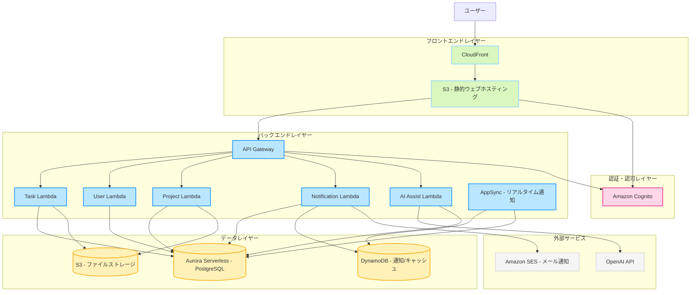

要件定義書の「2.4 全体アーキテクチャ」の作成について、プロダクトオーナー、テックリード、インフラエンジニアの3つの役割で議論を行います。

<interaction>
プロダクトオーナー: 皆さん、今日はプロジェクト「zircon」の要件定義書の「2.4 全体アーキテクチャ」について議論したいと思います。すでに論理設計は完了していますが、実際のインフラ構成やデプロイメントアーキテクチャについて決める必要があります。コストパフォーマンスを優先し、サーバレスサービスを前提とするという指針がありますが、具体的にどのようなアーキテクチャが適切でしょうか？

テックリード: そうですね。論理設計を見ると、フロントエンド、バックエンド、データベース、外部サービス連携という構成になっています。サーバレスを前提とするなら、フロントエンドはCDN経由で静的ファイルを配信し、バックエンドはFaaS（Function as a Service）を使うのが良いでしょう。具体的には、フロントエンドはCloudflare PagesやAWS Amplifyなどで、バックエンドはAWS LambdaやCloud Functionsなどが考えられます。

インフラエンジニア: テックリードの意見に賛成です。サーバレスアーキテクチャを採用することで、使用した分だけ課金される形になり、コストパフォーマンスも向上します。ただ、時間課金されるサービスは避けるという指針があるので、常時稼働するEC2やCloud Runのようなサービスは避けるべきでしょう。データベースについては、PostgreSQLを使用するとのことですが、サーバレス対応のAurora ServerlessやCloud SQL for PostgreSQLの自動スケーリングオプションなどが考えられます。

プロダクトオーナー: サーバレスで構築するのは良いと思います。ただ、無限に子タスクを生成できるTODOアプリという特性上、データ構造が複雑になりそうです。また、AIアシストによる子タスク分解機能もあります。これらの機能を考慮したアーキテクチャにする必要がありますね。

テックリード: その点については、データモデルの設計が重要になります。無限に子タスクを生成できる構造は、再帰的な関係を持つデータモデルで表現できます。また、AIアシスト機能については、OpenAIのGPTなどの外部APIを利用することになるでしょう。これらのAPIコールはバックエンドのFaaSから行い、結果をクライアントに返す形になります。

インフラエンジニア: AIサービスとの連携については、コールド状態からの起動時間も考慮する必要があります。FaaSは初回起動時に時間がかかることがあるので、AIアシスト機能の応答性に影響する可能性があります。また、無限に子タスクを生成できる構造は、データベースのクエリパフォーマンスにも影響します。適切なインデックス設計や、場合によってはNoSQLの併用も検討すべきかもしれません。

プロダクトオーナー: 応答性は確かに重要ですね。ユーザー体験を損なわないようにしたいです。また、要件にはタスクの表示方法として表形式、カンバン形式、ツリー形式、ガントチャート形式があります。特にツリー形式での表示は、無限に子タスクが生成される構造を考えると、フロントエンドの実装も工夫が必要そうです。

テックリード: その通りです。特にツリー形式の表示は、データ量が多くなると描画パフォーマンスが問題になる可能性があります。フロントエンドでは仮想化技術を使って必要な部分だけを描画するような最適化が必要でしょう。また、バックエンドAPIも階層構造を効率的に取得できるようにする必要があります。例えば、最初は第一階層だけを取得し、展開時に子階層を動的に取得するような設計が考えられます。

インフラエンジニア: その場合、APIのレスポンス速度が重要になります。CDNのキャッシュ戦略や、場合によってはエッジコンピューティングの活用も検討すべきでしょう。また、データベースのパフォーマンスを考えると、階層構造の表現方法として「隣接リスト」や「入れ子集合」、「経路列挙」などのモデルがありますが、無限に子タスクを生成できる構造を考えると、「隣接リスト」モデルが適しているかもしれません。

プロダクトオーナー: 技術的な詳細はお二人にお任せしますが、ユーザー体験を最優先に考えたいです。特に集計画面での各種グラフ表示や、通知機能なども要件に含まれています。これらの機能も含めたアーキテクチャを考える必要がありますね。

テックリード: 集計機能については、データの集計処理をどこで行うかが重要です。リアルタイム性が求められるなら、バックエンドのFaaSで処理するか、フロントエンドでデータを受け取って集計する方法が考えられます。通知機能については、WebSocketやServer-Sent Eventsなどのリアルタイム通信技術が必要になりますが、サーバレス環境では実装が難しい場合があります。代替案として、ポーリングやPush通知の活用も検討すべきでしょう。

インフラエンジニア: 通知機能については、AWS AppSyncやFirebase Realtime Databaseなどのマネージドサービスを活用するのが良いと思います。これらはサーバレスで、リアルタイム通信をサポートしています。また、集計処理については、データ量が多い場合は専用のデータウェアハウスやBIツールの活用も検討すべきかもしれません。ただし、コストとのバランスを考える必要があります。

プロダクトオーナー: なるほど。では、全体アーキテクチャとしては、フロントエンドはCDN経由で配信し、バックエンドはFaaSを使用、データベースはサーバレス対応のPostgreSQLを使用するという方向性で良いでしょうか？また、AIアシスト機能や通知機能については、適切なマネージドサービスを活用するということですね。

テックリード: はい、その方向性で良いと思います。具体的なサービスとしては、AWS環境であれば、フロントエンドはCloudFront + S3、バックエンドはAPI Gateway + Lambda、データベースはAurora Serverlessという構成が考えられます。AIアシスト機能はLambdaからOpenAI APIを呼び出し、通知機能はAppSyncを使用するという形です。

インフラエンジニア: AWS環境を前提とするなら、その構成で問題ないと思います。ただ、ローカル開発環境との整合性も考慮する必要があります。要件には「ローカル開発では、docker composeで完結する」とありますので、本番環境と開発環境の差異を最小限に抑える工夫が必要です。例えば、LocalStackなどのAWSエミュレータを活用するのも一案です。

プロダクトオーナー: 開発環境と本番環境の整合性は重要ですね。開発者の生産性にも影響します。では、具体的なアーキテクチャ図を作成して、要件定義書に記載しましょう。フロントエンド、バックエンド、データベース、外部サービスの関係性が明確になるようにしたいです。

テックリード: そうですね。mermaid記法で図を作成するのが良いでしょう。論理設計の図と対応させつつ、実際のクラウドサービスとの対応関係を示す図にします。また、データの流れや主要なAPIエンドポイントも示すと理解しやすいと思います。

インフラエンジニア: 賛成です。また、セキュリティ面も考慮して、認証・認可の仕組みや、APIのアクセス制御についても図に含めると良いでしょう。プロジェクト管理者やシステム管理者など、異なる権限を持つユーザーが存在するので、その点も明確にする必要があります。

プロダクトオーナー: セキュリティは確かに重要ですね。ユーザー認証には、AWS Cognitoや Firebase Authenticationなどのマネージドサービスを使うのが良いでしょうか？

テックリード: はい、それらのサービスを使うのが良いと思います。認証・認可の仕組みを自前で実装するのは避け、セキュリティの専門家によって設計・実装されたマネージドサービスを活用するべきです。また、APIのアクセス制御については、JWT（JSON Web Token）を使用して、ユーザーの権限情報をトークンに埋め込む方式が一般的です。

インフラエンジニア: その通りです。また、データの暗号化やバックアップ戦略についても考慮する必要があります。特に個人情報を含むデータは適切に保護する必要があります。AWS環境であれば、KMSを使用した暗号化や、自動バックアップの設定が可能です。

プロダクトオーナー: セキュリティとデータ保護は非常に重要ですね。では、これらの点を考慮した全体アーキテクチャ図を作成しましょう。最終的には、開発チームが理解しやすく、また将来の拡張性も考慮したアーキテクチャにしたいです。

テックリード: 了解しました。では、AWS環境を前提とした全体アーキテクチャ図を作成します。フロントエンド、バックエンド、データベース、外部サービスの関係性を明確にし、セキュリティ面も考慮したものにします。また、将来の拡張性も考慮して、モジュール化された構成にします。

インフラエンジニア: 素晴らしいです。また、コストパフォーマンスを優先するという指針も忘れずに、必要最小限のリソースで最大の効果を得られるような構成にしましょう。サーバレスアーキテクチャを採用することで、使用した分だけ課金される形になり、コスト効率も向上します。

プロダクトオーナー: では、これらの議論を踏まえて、「2.4 全体アーキテクチャ」の内容をまとめましょう。AWS環境を前提としたサーバレスアーキテクチャ、セキュリティ面の考慮、開発環境と本番環境の整合性、そして将来の拡張性を考慮した内容にします。
</interaction>

<conclusion>
## 2.4 全体アーキテクチャ

プロジェクト「zircon」は、コストパフォーマンスを優先し、サーバレスサービスを前提とした以下のアーキテクチャを採用します。

### 2.4.1 物理アーキテクチャ概要

### 2.4.2 コンポーネント説明

| コンポーネント | サービス | 説明 |
|--------------|---------|------|
| フロントエンド配信 | CloudFront + S3 | React + TypeScriptで構築されたSPAをS3にホスティングし、CloudFrontを通じて配信します。 |
| 認証・認可 | Amazon Cognito | ユーザー認証と権限管理を行います。JWTを発行し、APIへのアクセス制御に使用します。 |
| API管理 | API Gateway | RESTful APIのエンドポイントを提供し、Lambdaへリクエストをルーティングします。 |
| バックエンド処理 | AWS Lambda | Node.js + TypeScript + Honoで実装されたサーバーレス関数群。タスク管理、ユーザー管理、プロジェクト管理などの機能を提供します。 |
| リアルタイム通知 | AppSync | WebSocketベースのリアルタイム通知機能を提供します。タスクのステータス変更やメンションによる通知を実現します。 |
| データベース | Aurora Serverless (PostgreSQL) | タスク、ユーザー、プロジェクトなどの構造化データを保存します。Prisma ORMを使用してアクセスします。 |
| キャッシュ/通知ストア | DynamoDB | 通知データやセッション情報など、高速アクセスが必要なデータを保存します。 |
| ファイルストレージ | S3 | タスクの添付ファイルなどを保存します。 |
| AI連携 | OpenAI API | タスクの子タスク自動生成機能を提供します。Lambda経由で連携します。 |
| メール通知 | Amazon SES | システム通知をメールで送信します。 |

### 2.4.3 データフロー

1. **ユーザー認証フロー**
   - ユーザーはフロントエンドからCognitoで認証を行い、JWTを取得
   - JWTを使用してAPI Gatewayへのリクエストを認証

2. **タスク管理フロー**
   - フロントエンドからAPI Gateway経由でLambdaにリクエスト
   - Lambdaは権限チェック後、Prisma ORMを使用してAurora Serverlessにアクセス
   - タスクデータをフロントエンドに返却

3. **AI子タスク生成フロー**
   - ユーザーがタスク詳細からAI子タスク生成をリクエスト
   - AIAssistLambdaがOpenAI APIを呼び出し
   - 生成された子タスク候補をフロントエンドに返却
   - ユーザーが確認後、保存をリクエストするとデータベースに保存

4. **通知フロー**
   - タスクのステータス変更やメンションが発生
   - NotificationLambdaが通知データをDynamoDBに保存
   - AppSyncを通じて対象ユーザーにリアルタイム通知
   - 必要に応じてSESでメール通知も送信

### 2.4.4 開発環境との整合性

ローカル開発環境はdocker-composeで構築し、以下のコンポーネントを含みます：

- PostgreSQL（Aurora Serverlessの代替）
- LocalStack（AWS サービスのエミュレーション）
- Node.js開発サーバー（フロントエンド・バックエンド）

開発環境と本番環境の差異を最小限に抑えるため、環境変数による設定切り替えと、Infrastructure as Codeによるインフラ定義を採用します。

### 2.4.5 セキュリティ考慮事項

- すべての通信はHTTPS/TLSで暗号化
- 認証・認可はCognitoとJWTベースで実装
- データベースの機密情報は保存時に暗号化
- Lambda関数は最小権限の原則に基づいたIAMロールを使用
- API Gatewayにはレート制限を設定し、DoS攻撃を緩和

### 2.4.6 拡張性と将来対応

- マイクロサービスアーキテクチャにより、個別の機能を独立してスケール可能
- サーバレスアーキテクチャにより、負荷に応じた自動スケーリングを実現
- 新機能追加時は、新しいLambda関数とAPIエンドポイントを追加するだけで対応可能
- 将来的なマルチリージョン展開にも対応可能な設計
</conclusion>
